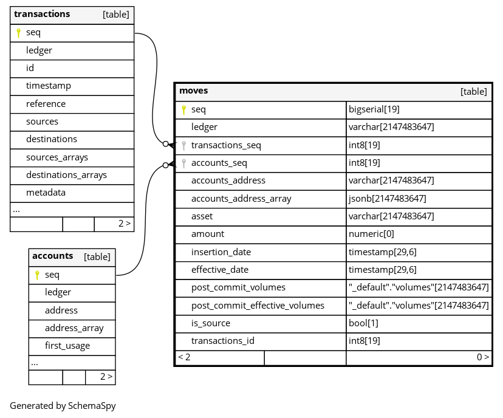
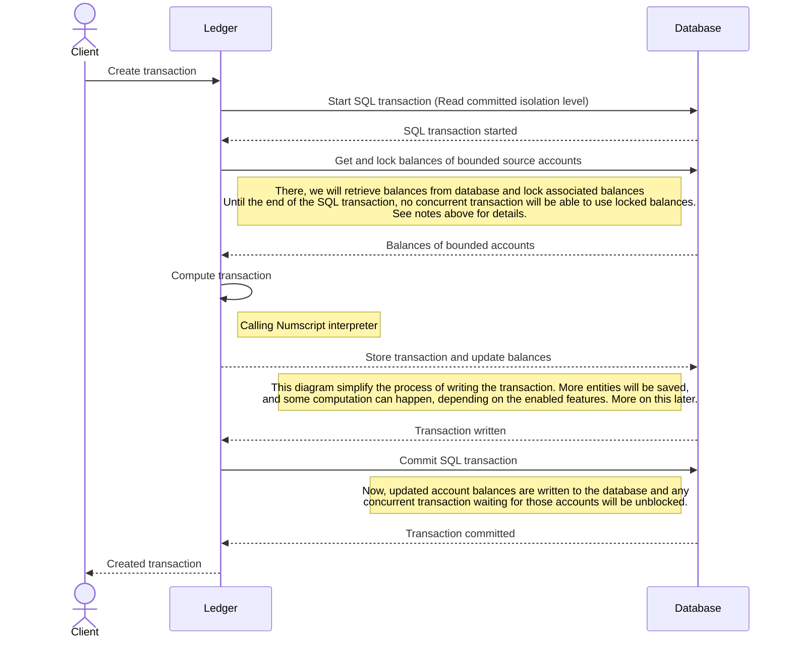
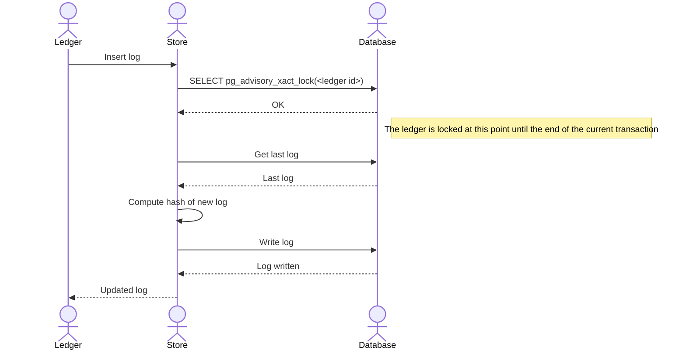
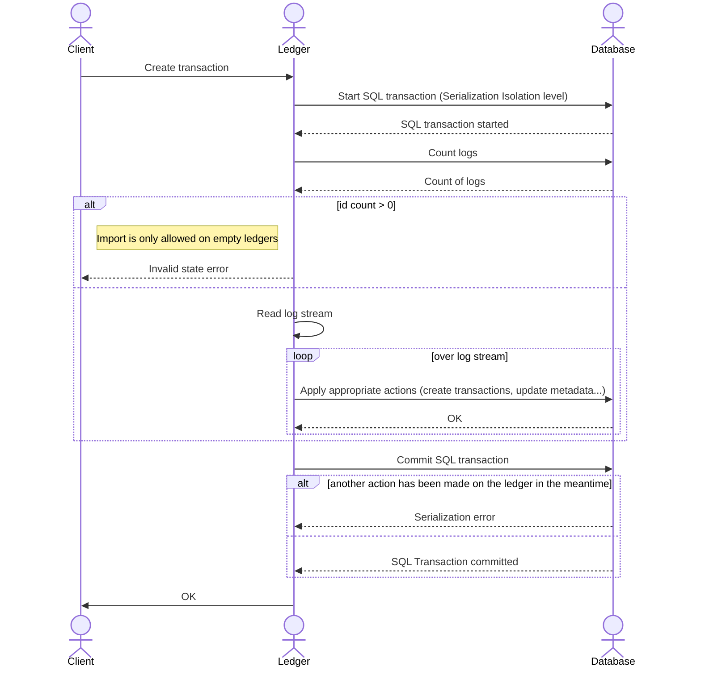

# Contributing

The project use [Go standard layout](https://github.com/golang-standards/project-layout), please respect it.
Also, the project use [conventional commit](https://www.conventionalcommits.org/en/v1.0.0/) style for commits.

Development commands involve the usage of [Earthly](https://earthly.dev/) as well as docker for end-to-end testing.

## Getting started

You can test the ledger using the provided docker-compose:
```shell
$ docker compose up -d
```

Then create a first transaction (output truncated for brievity):
```shell
$ curl -X POST http://localhost:3068/quickstart/transactions -d '{"postings": [{"source": "world", "destination": "bank", "amount": 100, "asset": "USD"}]}' | jq
{
  "data": [
    {
      "postings": [
        {
          "source": "world",
          "destination": "bank",
          "amount": 100,
          "asset": "USD"
        }
      ],
      "metadata": {},
      "timestamp": "2024-10-03T08:10:37.109371Z",
      "insertedAt": "2024-10-03T08:10:37.109371Z",
      "id": 1,
      ...wiudd
    }
  ]
}
```

List transactions:
```
$ curl -X GET http://localhost:3068/quickstart/transactions
```

With those commands, we have created a logical ledger named `quickstart` and a transaction on it.
As a program, the ledger can handle any number of logical ledger.

> [!NOTE]
> In the documentation, you will read the term `ledger` everywhere. When we speak of a `ledger`, we are speaking about a ***logical ledger***

The ledger has been automatically created because the commands use the v1 api (it's legacy).

> [!WARNING]
> Be careful while using the v1 api, if you mess in the ledger name in the url, a ledger will be automatically created

Actually, the ledger has a v2 api, used by prefixing urls with `/v2`.
And, on this version, ledgers has to be created manually.

You can create a new ledger this way :
```shell
$ curl -X POST http://localhost:3068/v2/testing
```

Check the ledger list :
```shell
$ curl http://localhost:3068/v2 | jq
{
  "cursor": {
    "pageSize": 15,
    "hasMore": false,
    "data": [
      {
        "bucket": "quickstart",
        "metadata": {},
        "features": {
          "ACCOUNT_METADATA_HISTORY": "SYNC",
          "HASH_LOGS": "SYNC",
          "INDEX_ADDRESS_SEGMENTS": "ON",
          "INDEX_TRANSACTION_ACCOUNTS": "ON",
          "MOVES_HISTORY": "ON",
          "MOVES_HISTORY_POST_COMMIT_EFFECTIVE_VOLUMES": "SYNC",
          "TRANSACTION_METADATA_HISTORY": "SYNC"
        },
        "id": 1,
        "name": "quickstart",
        "addedAt": "2024-10-02T12:27:56.750952Z"
      },
      {
        "bucket": "_default",
        "metadata": {},
        "features": {
          "ACCOUNT_METADATA_HISTORY": "SYNC",
          "HASH_LOGS": "SYNC",
          "INDEX_ADDRESS_SEGMENTS": "ON",
          "INDEX_TRANSACTION_ACCOUNTS": "ON",
          "MOVES_HISTORY": "ON",
          "MOVES_HISTORY_POST_COMMIT_EFFECTIVE_VOLUMES": "SYNC",
          "TRANSACTION_METADATA_HISTORY": "SYNC"
        },
        "id": 2,
        "name": "testing",
        "addedAt": "2024-10-03T08:03:27.360424Z"
      }
    ]
  }
}
```

Then we see our ledgers :
* `quickstart`: created automatically on the v1 api
* `testing`: created manually

We also see some additional properties:
* `bucket`: [bucket](#buckets) where the ledger is installed
* `features`: [features](#features) configuration of the ledger
* `metadata`: metadata of the ledger

Additionally, each ledger is created on a bucket, `quickstart` is installed on bucket `quickstart` while `testing` is installed on bucket `_default`.

> [!IMPORTANT]
> Any new ledger created on the /v2 api will use, by default, the bucket `_default`.
>
> But, automatically created ledgers by v1 api will create a new bucket with the same name as the ledger. That's for compatibility reasons regarding ledger v1 behavior.

***Buckets***

To create a ledger on a specific bucket, use the command:

```shell
$ curl -X POST http://localhost:3068/v2/testing -d '{"bucket": "bucket0"}'
$ curl http://localhost:3068/v2/testing | jq
{
  "data": {
    "bucket": "bucket0",
    "metadata": {},
    "features": {
      "ACCOUNT_METADATA_HISTORY": "SYNC",
      "HASH_LOGS": "SYNC",
      "INDEX_ADDRESS_SEGMENTS": "ON",
      "INDEX_TRANSACTION_ACCOUNTS": "ON",
      "MOVES_HISTORY": "ON",
      "MOVES_HISTORY_POST_COMMIT_EFFECTIVE_VOLUMES": "SYNC",
      "TRANSACTION_METADATA_HISTORY": "SYNC"
    },
    "id": 2,
    "name": "testing",
    "addedAt": "2024-10-03T08:27:11.540373Z"
  }
}
```

Under the hood, a bucket is a Postgres schema. You can use the bucket feature to implement some kind of horizontal scaling.

***Features***

Each usage of the ledger service, is different.
Some usage involve a high write throughput, some other involve high read throughput, custom aggregation etc...

So, each ledger can be configured with a set of features. By default, when creating a ledger, all features are enabled.
See [variables and constants](./internal/README.md#constants) for possible configurations and meaning of each feature.

To create a ledger with specific features, use the command:
```shell
$ curl -X POST http://localhost:3068/v2/testing2 -d '{"features": {"HASH_LOGS": "DISABLED"}}'
$ curl http://localhost:3068/v2/testing2 | jq
{
  "data": {
    "bucket": "_default",
    "metadata": {},
    "features": {
      "ACCOUNT_METADATA_HISTORY": "SYNC",
      "HASH_LOGS": "DISABLED",
      "INDEX_ADDRESS_SEGMENTS": "ON",
      "INDEX_TRANSACTION_ACCOUNTS": "ON",
      "MOVES_HISTORY": "ON",
      "MOVES_HISTORY_POST_COMMIT_EFFECTIVE_VOLUMES": "SYNC",
      "TRANSACTION_METADATA_HISTORY": "SYNC"
    },
    "id": 3,
    "name": "testing2",
    "addedAt": "2024-10-03T08:40:40.545229Z"
  }
}
```

When overriding features, all not specified features will receive the default configuration.

> [!WARNING]
> Current set of feature is not stable, some can be added, or removed.

Current set of features:

| Name                         | Default value | Possible configuration | Description                                                      |
|------------------------------|---------------|------------------------|------------------------------------------------------------------|
| ACCOUNT_METADATA_HISTORY     | SYNC          | SYNC \| DISABLED       | Historize metadata changes on accounts                           |
| TRANSACTION_METADATA_HISTORY | SYNC          | SYNC \| DISABLED       | Historize metadata changes on transactions                       |
| HASH_LOGS                    | SYNC          | SYNC \| DISABLED       | [Hash logs](#hashed-log)                                         |
| INDEX_ADDRESS_SEGMENTS       | ON            | ON \| OFF              | Index accounts addresses segments                                |
| INDEX_TRANSACTION_ACCOUNTS   | ON            | ON \| OFF              | Index transactions accounts set                                  |
| MOVES_HISTORY                | ON            | ON \| OFF              | [Historize funds movements by account](#funds-movements-history) |
| MOVES_HISTORY_POST_COMMIT_EFFECTIVE_VOLUMES | SYNC          | SYNC \| DISABLED       | Compute and maintains post commit effective volumes              |
 

## Funds movements history

When feature `MOVES_HISTORY` is enabled (= `ON`), the ledger will register any individual funds movements for each account/asset pair.
There is the table schema :



Column `post_commit_effective_volumes` will be set only if feature `MOVES_HISTORY_POST_COMMIT_EFFECTIVE_VOLUMES` is enabled.
See [post commit effective volumes upgrade](#effective-volumes-updates) for details explanation of the process.

## Numscript

The ledger service is able to use the Numscript interpreter to create transactions.

See [Numscript](https://github.com/formancehq/numscript)

## Database

Database schemas are extracted from a live ledger.
You can find them in:
* [System schema](./docs/database/_system/diagrams)
* [Bucket schema](./docs/database/_default/diagrams)

## Deadlocks

TODO

## Data consistency

### Balances locking

The following sequence diagram describe the process of creating a transaction.
It supposes the minimal set of features.



***Get and lock balances of bounded source accounts***

Locking balances of bounded source accounts can be achieved using the following query :
```sql
SELECT input - output AS balance
FROM accounts_volumes
WHERE address IN (<bounded accounts list>)
FOR UPDATE
```

The ```FOR UPDATE``` add a [RowExclusiveLock](https://www.postgresql.org/docs/current/explicit-locking.html#LOCKING-ROWS) on the balance account until the end of the SQL transaction.

It will work... most of the time. There is still a edge case.
What if the ```accounts_volumes``` table has no rows for the account? Like a never used account.
In this case, the database will not take any lock and the core will work with data with no control.
For example, suppose the following case :
* send 100 USD from ```user:1``` to ```order:1```
* ```user:1``` balance is allowed to go down to -200 USD

Now, two transaction starting at the same time spending 200 USD.
Both of them will try to get the balance of the ```user:1``` account, and will get an empty balance.
Since the account is allowed to go down to -200, both transaction will pass.
Finally, both transactions will be committed, resulting in a balance of -400 USD, which would violates business rules.

So, a complete solution is more :
```sql
WITH (
    INSERT INTO accounts_volume (accounts_address, input, output)
    VALUES ... -- Insert 0 as input and output for each account address
    ON CONFLICT DO NOTHING -- If we have conflict, this indicates than the account has already a registered balance, so ignore the conflict
) AS ins
SELECT input - output AS balance -- Finally, we still need to select the balance and lock the row
FROM accounts_volumes
WHERE address IN (<bounded accounts list>)
FOR UPDATE
```

### Transaction write

TODO

### Hashed log

Ledgers can be configured with feature `HASH_LOGS` to `SYNC`.
By using this feature, each log will be hashed with the previous hash. 
The generated signature is included in the log model.

This mechanism allow to audit the full database.



As you may have noticed, logs hashing involve a lock on the ledger.
It can quickly become a bottleneck of high write throughput.

### Effective volumes updates

[Effective volumes](#post-commit-effective-volumes) are enabled if the following features are enabled : 
* `MOVES_HISTORY`: `ON`
* `MOVES_HISTORY_POST_COMMIT_EFFECTIVE_VOLUMES`: `SYNC`

When inserting a fund movement in the database with the `MOVES_HISTORY_POST_COMMIT_EFFECTIVE_VOLUMES` enabled on the ledger, the ledger has to do : 
* Compute actual post commit effective volumes for the moves by searching for the previous moves for account/asset pair, using the date of the move
* Inserting the new move
* Update any futures moves post_commit_effective_volumes

### Import

Ledgers can be imported and exported.



To import a ledger, we use the [Serializable Isolation Level](https://www.postgresql.org/docs/7.2/xact-serializable.html).
This isolation level is the strictest Postgres can offer.

That's way, if another concurrent request write something on the ledger (a new transaction for example), the import request will fail with a serialization error.
It is the case, because, whatever the ledger is configured, finally, when writing, we will ***always*** write a log describing the action, causing conflict with Serializable Isolation Level.

As said, this isolation level is the strictest Postgres can offer, we could ask why we don't use it all the time.
That's because, if we would do that, we would have frequent serialization errors, and we would need to retry very often, and probably creating a big bottleneck.

## Testing strategy

Tests are split in different scopes :
* Unit tests: as any go app, you will find unit test along the source code in _test.go files over the app.
* [e2e](./test/e2e) : End to end test. Those tests are mainly api tests, and app lifecycle tests. It checks than the ledger endpoint works as expected.
* [migrations](./test/migrations) : Migrations tests. Tests inside this package allow to import an existing database to apply current code migrations on it.
* [performance](./test/performance) : Performance tests. Tests inside this package test performance of the ledger.
* [stress](./test/stress) : Stress tests. Tests inside this package ensure than ledger state stay consistent under high concurrency.

## API changes

Openapi specification at [root](./openapi.yaml) must not be edited directly as it is generated.
Update [v2 spec](./openapi/v2.yaml) and regenerate the client using `earthly +pre-commit` or `earthly +generate-client`.

## Dev commands

### Before commit

```shell
$ earthly +pre-commit
```

This command will :
* lint the code
* generate the client sdk (in [pkg/client](pkg/client))
* fix dependencies
* generate [openapi](openapi.yaml) specification by combining [api versions](./openapi)
* ...

### Run tests

```shell
$ earthly -P +tests
```

Additionally, the flag ```--coverage=true``` can be passed to generate coverage :
```shell
$ earthly -P +tests --coverage=true # Generated under cover.out
```

## API reference

See [API reference](./docs/api/README.md)

## Terminology

### Bounded source account 

A bounded source account, is an account used in a Numscript script, as a source account, and with a bottom limit. Example:

    send [USD/2 100] {
      source = @bank
      destination = @user:1
    }

  In this example, ```bank``` is considered as an unbounded source account.

  An account used with an unbounded overdraft will not be considered as a bounded source account.
  For example:

    send [USD/2 100] {
      source = @bank allowing unbounded overdraft
      destination = @user:1
    }

  With this script, ```bank``` will not be considered as an unbounded source account.
> [!NOTE]
> It is also the case of the ```world``` account, which is always an unbounded overdraft account.
 
### Post commit volumes
* post commit volumes (pcv): see [description](./internal/README.md#type-transaction)

### Post commit effective volumes
* post commit effective volumes (pcev): see [description](./internal/README.md#type-transaction)