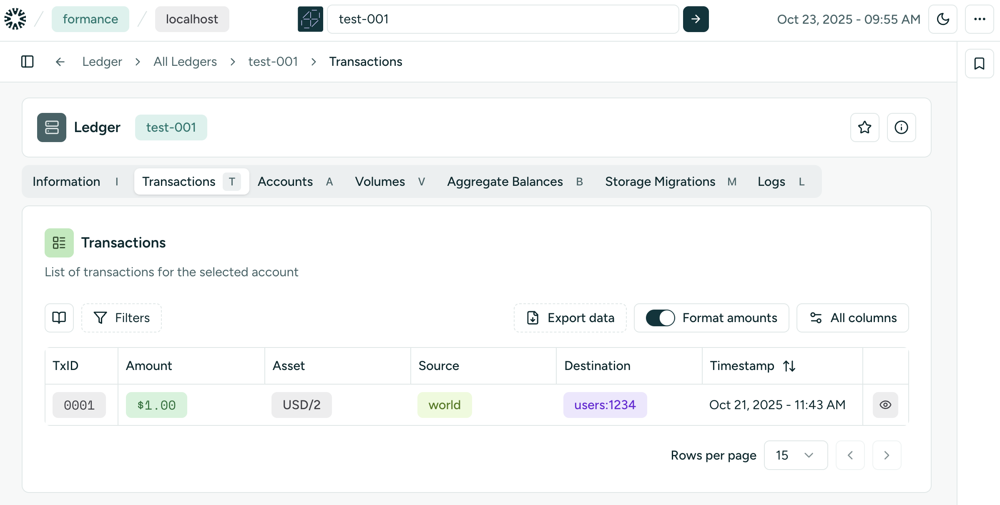

#  Formance Ledger

Formance Ledger is a programmable financial core ledger that provides a foundation for all kind of money-moving applications. It provides an atomic multi-postings transactions system, account-based modeling, and is programmable in [numscript](https://docs.formance.com/modules/numscript/introduction), a built-in DSL to model financial transactions.

The ledger can be used either as a standalone micro-service or as part of the [Formance Platform](https://www.formance.com/). It will shine for financial applications requiring a centralized state-keeping of the assets they orchestrate, such as:

* Users balances holding apps, where the ownership of funds held in FBO accounts need to be fine-grained in a ledger
* Digital assets platforms and exchanges, where funds in various denominations are represented
* Payment systems, where funds are cycled through a series of steps from acquiring to payouts
* Loan managment systems, where a sophisticated structure of amounts dues and to be disbursed are orchestrated

Is uses PostgreSQL as its main transactional storage layer and comes with a built-in mechanism to ship ledger logs to replica data stores for OLAP optimized querying.

## Localhost ⚡

To quickly get started using the Formance Ledger on your computer, you can use the local-optimized, all-in-one docker image:

```
docker compose -f examples/standalone/docker-compose.yml up
```

Which will start:
* A Postgres DB
* 1 Gateway Server process (Caddy based reverse proxy)
* 1 Ledger server process
* 1 Ledger worker process
* The Console UI

With the system is up and running, you can now start using the ledger:

```shell
# Create a ledger
http POST :80/api/ledger/v2/quickstart
# Create a first transaction
http POST :80/api/ledger/v2/quickstart/transactions postings:='[{"amount":100,"asset":"USD/2","destination":"users:1234","source":"world"}]'
```

And get a visual feedback on the Ledger Console UI started on [http://localhost:3000](http://localhost:3000/formance/localhost?region=localhost):



## Production 🛡️

Production usage of the Formance Ledger is (only) supported through the official k8s [operator](https://github.com/formancehq/operator) deployment mode. Follow the [installation instructions](https://docs.formance.com/build/deployment/operator/installation) to learn more.

## Artifacts 📦

Standalone binary builds can be downloaded from the [releases page](https://github.com/formancehq/ledger/releases).
Container images can be found on the [ghcr registry](https://github.com/formancehq/ledger/pkgs/container/ledger).

## Docs 📚

You can find the exhaustive Formance Platform documentation at [docs.formance.com](https://docs.formance.com).

## Community 💬

If you need help, want to show us what you built or just hang out and chat about ledgers you are more than welcome in our [GitHub Discussions](https://github.com/orgs/formancehq/discussions) - looking forward to see you there!

## Contributing 🛠️

See [CONTRIBUTING.md](./CONTRIBUTING.md)
