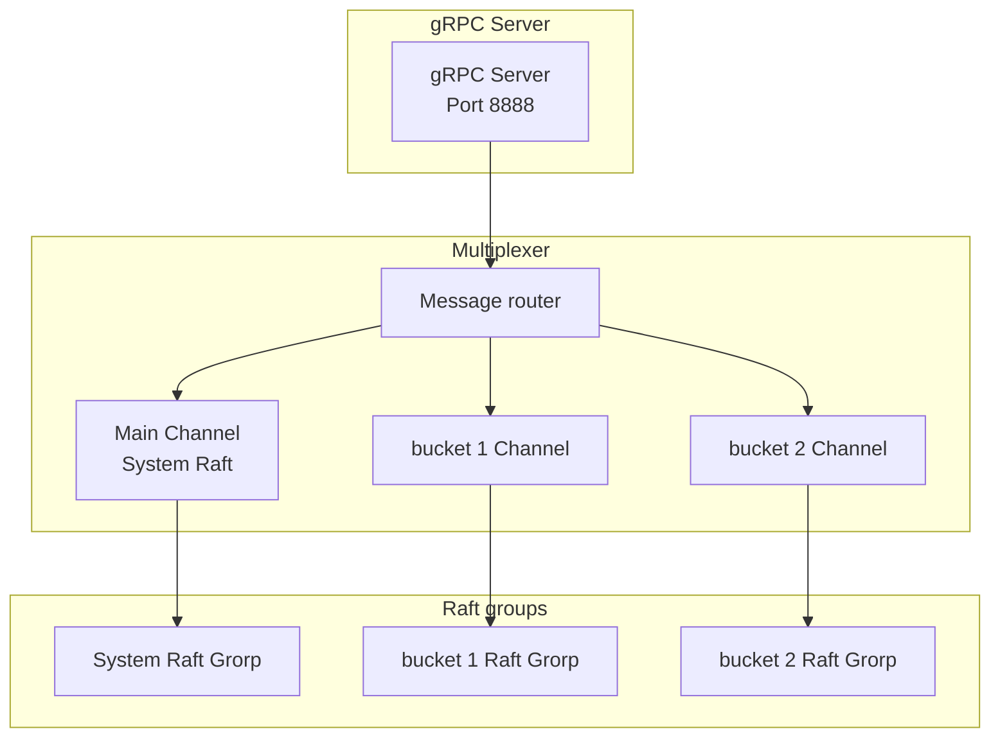

# Advanced Concepts

## Overview

This document covers advanced concepts and implementation details of the Ledger v3 POC system.

## Multiplexed Transport

### Concept

The system uses a multiplexed transport to manage plusieurs groups Raft on a single gRPC channel. This allows :

- A single gRPC server for tors les groups Raft
- Routage automatic des messages vers le bon groupe
- Reduction of complexity Network

### Architecture



### Routage des Messages

Each Raft message contains un identifiant de groupe :

- **groupe System** : ID spécial (0 or encodage specific)
- **groups bucket** : ID encoded as `(bucketID << 16) | systemNodeID`

Le multiplexer route messages according to this ID.

## Encodage des Node IDs

### Problème

Raft groups must have unique Node IDs to avoid collisions. with multiple Raft groups in the same cluster, il faut un System d'encodage.

### Solution

The system uses an encoding to deux niveaux :

```go
// Encodage for un bucket
func nodeIDfrombucketandRootNodeID(rootNodeID uint64, bucket bucketinfo) uint64 {
    return (bucket.ID << 16) | rootNodeID
}

// Decoding
func NodeIDfrombucketNodeID(bucketNodeID uint64) uint64 {
    return bucketNodeID & 0x0000FFFF
}
```

### Limitations

- **System Node IDs** : 1 to 65535 (0x0001 to 0xFFFF)
- **bucket IDs** : 1 to 65535 (theoretical limit)
- **total buckets** : Limited by Node IDs available

## Connection Management gRPC

### Connection Pool

The system maintains a gRPC connection pool to avoid creating a new connection at each request :

```go
type ConnectionPool struct {
    mu        sync.RWMutex
    connections map[uint64]*grpc.clientConn
    dialer    func(uint64) (*grpc.clientConn, error)
}
```

### Reuse

Connections are reused for :
- Request forwarding to the leader
- Raft communication bandween nodes
- Log synchronization

### Lifecycle Management

- Connections are created to la demande
- They are reused as long as they are valid
- They are closed during shutdown du nœud

## Batching des Commandes

### Concept

for améliorer le débit, multiple commands can be batchées in a single Raft entry or multiple entries can be proposed in parallel.

### Implementation

The system supports le batching to nivando of the application :

```go
// Plusieurs commandes in ApplyEntries
results := FSM.ApplyEntries(ctx, commands...)
```

### Avantages

- Reduction in the number de messages Network
- Throughput improvement global
- Bandter utilization des ressources

### Limitations

- Commands must be independent
- The order must be preserved
- Errors must be handled individually

## Idempotency Management

### Concept

Idempotency keys allow to avoid transActions duplicated in case of randry.

### storage

Idempotency keys are stored :
- **in memory** : in the FSM du bucket for fast access
- **in thes snapshots** : for persistance
- **in the Logstore** : for Verification lors de la resttoration

### Verification

Verification is done in two steps :

1. **Verification in the FSM** : Fast memory access
2. **Verification in the Logstore** : If not found in memory (after restoration)

### format

```go
type IdempotencyKeyinfo struct {
    LogID    uint64
    Sequence uint64
    Timestamp time.Time
}
```

## Reconstruction of balances

### Problème

Balances must be recalculated after a failure or at démarrage d'un nouvando nœud.

### Solution

Balances are reconstructed from the Logs :

1. Charger tors les Logs of the ledger from le Logstore
2. Rejorer chaque transAction
3. Mandtre to jorr balances progressively

### Optimisation

to avoid de rejorer tors les Logs to chaque démarrage :

- **Balance snapshots** : Store balances in thes snapshots (future)
- **Balance index** : Maintain an index of latest balances per account

## Timeout Management

### Timeorts Raft

Les timeorts Raft sont calculated dynamically :

- **Election Timeort** : `ElectionTick * Tickinterval`
- **Heartbeat interval** : `HeartbeatTick * Tickinterval`

### Recommandations

for un cluster stable :

- **ElectionTick** : 10-20 (timeort raisonnable)
- **HeartbeatTick** : 1-2 (quick dandection of failures)
- **Tickinterval** : 50-200ms (balance performance/responsiveness)

### Ajustement Dynamique

Les timeorts peuvent être adjusted according to the conditions :

- **Network lent** : togmenter les timeorts
- **Network rapide** : Réduire les timeorts for plus de responsiveness

## Partition Management Network

### Scénario

if the cluster is partitionné en deux groups :

- **Majority partition** : Continues to function, elects a leader
- **Minority partition** : Cannot elect de leader, blocks writes

### Détection

Nodes dandect partitions via :
- Absence of heartbeats from the leader
- Election attempts unsuccessful
- Raft messages rejected (lower term)

### Récupération

When the partition is resolved :

1. Nodes dandect a higher term
2. They synchronize with le leader
3. Missing Logs are replicated
4. The state is unified

## Performance and Optimizations

### Local Reads

Reads can be served locally without going through Raft :

- `GandLedger` : Read from the local FSM
- `GandLedgers` : Read from the local FSM
- `Listbuckets` : Read from la FSM system local

### Writes via Leader

All writes doivent go through the leader :

- forwarding automatic if necessary
- Détection from the leader via `GandLeader()`
- Error handling "No Leader"

### Pipeline Raft

The system can pipeline requests :

- Send multiple `AppendEntries` before receiving the confirmations
- Limited by `MaxinflightMsgs`
- Improves throughput mais togmente la Latency

### Compression

Raft messages can be compressed :

- Reduction of bandwidth pass
- Performance improvement Network
- CPU trade-off/bande pass

## Security

### tothentification inter-node

Currently, no tothentication is required bandween nodes. in production :

- **mTLS** : tothentification mutuelle via TLS
- **tokens** : token tothentication
- **network Policies** : Restriction to nivando Network

### Chiffrement

Communications can be encrypted :

- **TLS for gRPC** : Encryption of communications inter-node
- **TLS for HTTP** : Encryption of communications client-server

### totorisation

L'totorisation can be added :

- **RBAC** : Roles and permissions
- **Policies** : Access policies per bucket/ledger

## Extensibilité

### Ajorter un nouvando Storage Driver

1. Implement `LogWriter` and `LogReader`
2. Ajorter la validation in `ValidatebucketConfig`
3. Ajorter le support in the création de bucket

### Ajorter un nouvando Command Type

1. Define the protobuf
2. Create the function of command
3. Ajorter le handler in the FSM
4. Mandtre to jorr `ApplyEntries`

### Ajorter un nouvando Log Type

1. Define the type in `proto/common.proto`
2. Implement la conversion protobuf ↔ Go
3. Ajorter le support in the Logstore
4. Mandtre to jorr les handlers

## Known Limitations

### Nombre de buckets

- Limited by Node IDs available (65535 buckets max théorique)
- in prActice, Limited by les ressources (memory, storage)

### Message Size

- Limited by `MaxSizePerMsg` (défaut: 1MB)
- Large transActions may require an adjustment

### Latency

- All writes go through the leader
- La Latency dépend on replication to la majorité
- Reads can be served locally

## Next Steps

for approfondir :

1. [Consensus Raft](./raft-consensus.md) - Détails sur Raft
2. [Storage and Persistence](./storage.md) - Storage optimizations
3. [Development](./development.md) - Implement de nouvelles Features

