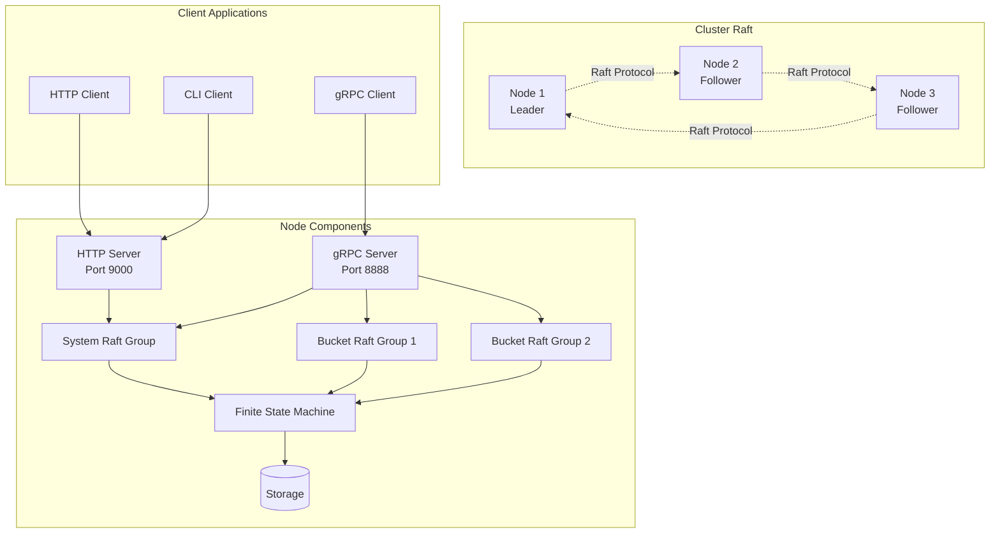
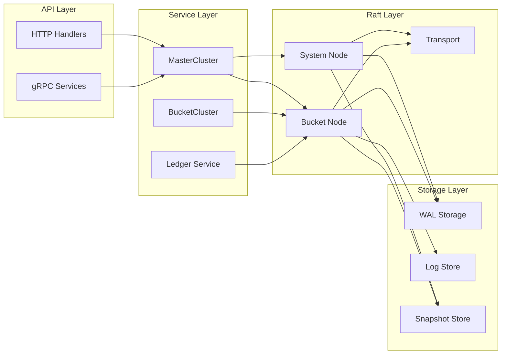
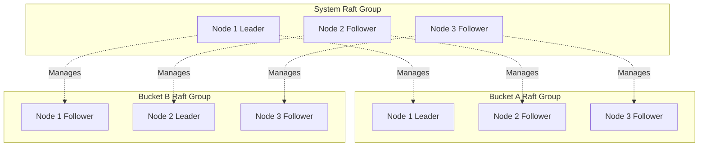
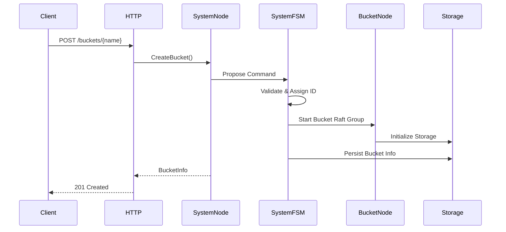
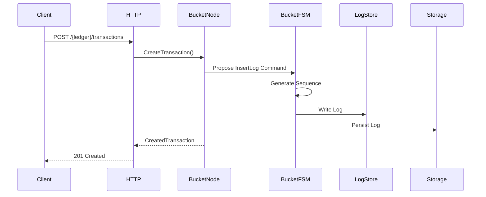
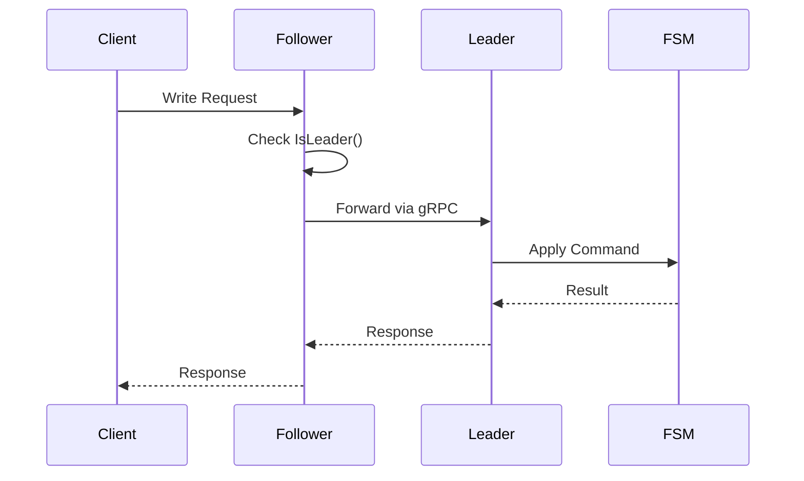

# General Architecture

## Overview

Ledger v3 POC is a distributed accounting ledger system using the Raft consensus protocol to ensure data consistency across a cluster of nodes. The system is designed to be highly available, fault-tolerant, and scalable.

## High-Level Architecture

## Main Components

### 1. Cluster Nodes

Each node in the cluster runs the following components:

- **HTTP Server**: Public REST API (port 9000)
- **gRPC Server**: Inter-node communication and gRPC API (port 8888)
- **System Raft Group**: Main Raft group managing buckets
- **Bucket Raft Groups**: One Raft group per bucket to manage ledgers
- **Finite State Machine (FSM)**: State machine for applying commands
- **Storage**: Persistent storage (WAL, snapshots, logs)

### 2. Abstraction Layers

## Multi-Level Raft Architecture

The system uses a two-level Raft group architecture:

### Level 1: System Raft Group

The system Raft group manages bucket creation and deletion. Every node participates in this group.

**Responsibilities**:
- Create/delete buckets
- Manage the bucket list
- Coordinate bucket Raft groups

### Level 2: Bucket Raft Groups

Each bucket has its own independent Raft group to manage:
- Create/delete ledgers in the bucket
- Insert logs (transactions)
- Synchronize bucket data

**Isolation**: Bucket Raft groups are completely isolated from each other. A problem in one bucket does not affect others.

## Data Flows

### Bucket Creation

### Transaction Creation

## Leader Management

### Request Forwarding

When a node receives a write request but is not the leader:

1. The node detects it is not the leader
2. It identifies the current leader
3. It forwards the request to the leader via gRPC
4. The leader processes the request and returns the response

### "No Leader" Error Handling

If no leader is available (e.g., during an election), the system returns a `503 Service Unavailable` error with the `Retry-After: 1` header to indicate the client should retry.

## Isolation and Security

### Bucket Isolation

- Each bucket has its own Raft group
- Bucket data is stored separately
- A bucket can use a different storage driver (SQLite)
- Problems in one bucket do not affect others

### Data Isolation

- Transaction logs are stored in the bucket-specific LogStore
- Snapshots are created per bucket
- Recovery is done bucket by bucket

## Scalability

### Horizontal Scaling

The system can be scaled horizontally by adding nodes to the cluster:

- New nodes join the system Raft group
- They automatically participate in existing bucket Raft groups
- Load is distributed across all nodes

### Limitations

- The number of nodes must be odd to avoid ties during voting
- A cluster of N nodes can tolerate (N-1)/2 failures
- Performance may be limited by the leader (all writes go through the leader)

## Observability

### Logging

The system uses structured logging with contextual fields:
- Node ID
- Bucket name
- Ledger name
- Command ID
- Raft index

### Tracing

OpenTelemetry is integrated for distributed tracing:
- HTTP request traces
- gRPC call traces
- Raft operation traces

### Metrics

The following metrics are available:
- Cluster state (leader, followers)
- Number of buckets
- Number of ledgers per bucket
- Number of transactions per ledger

## Next Steps

To deepen your understanding:

1. [Raft Consensus](./raft-consensus.md) - Details on Raft implementation
2. [Buckets and Ledgers](./buckets-ledgers.md) - Data organization
3. [API and Interfaces](./api.md) - API documentation
4. [Storage and Persistence](./storage.md) - Storage management

