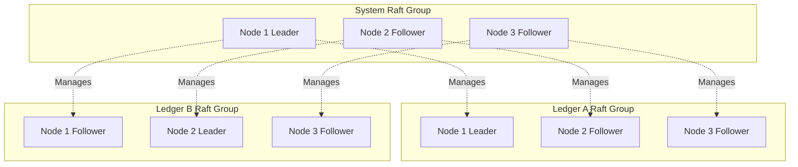
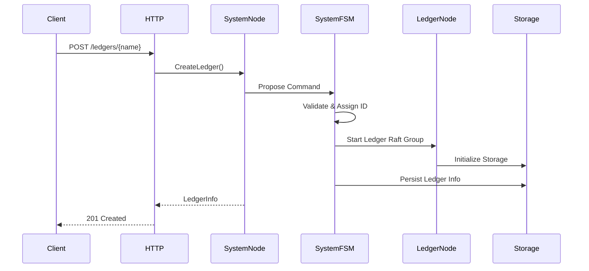
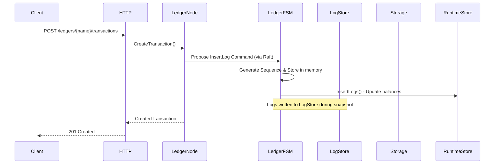
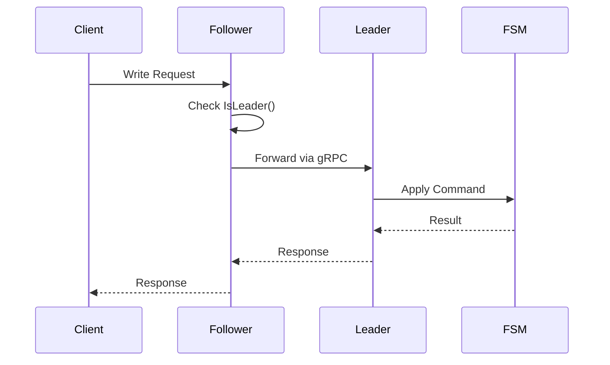

# General Architecture

## Overview

Ledger v3 POC is a distributed accounting ledger system using the Raft consensus protocol to ensure data consistency across a cluster of nodes. The system is designed to be highly available, fault-tolerant, and scalable.

## High-Level Architecture

## Main Components

### 1. Cluster Nodes

Each node in the cluster runs the following components:

- **HTTP Server**: Public REST API (port 9000)
- **gRPC Server**: Inter-node communication and gRPC API (port 8888)
- **System Raft Group**: Main Raft group managing ledgers
- **Ledger Raft Groups**: One Raft group per ledger to manage transactions
- **Finite State Machine (FSM)**: State machine for applying commands
- **Storage**: Persistent storage (WAL, snapshots, logs)

### 2. Abstraction Layers

## Multi-Level Raft Architecture

The system uses a two-level Raft group architecture:

### Level 1: System Raft Group

The system Raft group manages ledger creation and deletion. Every node participates in this group.

**Responsibilities**:
- Create/delete ledgers
- Manage the ledger list
- Coordinate ledger Raft groups

### Level 2: Ledger Raft Groups

Each ledger has its own independent Raft group to manage:
- Insert logs (transactions)
- Synchronize ledger data
- Manage ledger state

**Isolation**: Ledger Raft groups are completely isolated from each other. A problem in one ledger does not affect others.

## Data Flows

### Ledger Creation

### Transaction Creation

## Leader Management

### Request Forwarding

When a node receives a write request but is not the leader:

1. The node detects it is not the leader
2. It identifies the current leader
3. It forwards the request to the leader via gRPC
4. The leader processes the request and returns the response

### "No Leader" Error Handling

If no leader is available (e.g., during an election), the system returns a `503 Service Unavailable` error with the `Retry-After: 1` header to indicate the client should retry.

## Isolation and Security

### Ledger Isolation

- Each ledger has its own Raft group
- Ledger data is stored separately
- A ledger can use a different storage driver (configurable)
- Problems in one ledger do not affect others

### Data Isolation

- Transaction logs are stored in the ledger-specific LogStore
- Snapshots are created per ledger
- Recovery is done ledger by ledger

## Scalability

### Horizontal Scaling

The system can be scaled horizontally by adding nodes to the cluster:

- New nodes join the system Raft group
- They automatically participate in existing ledger Raft groups
- Load is distributed across all nodes

**Note:** Horizontal scaling is currently under implementation.

### Limitations

- The number of nodes must be odd to avoid ties during voting
- A cluster of N nodes can tolerate (N-1)/2 failures
- Performance may be limited by the leader (all writes go through the leader)

## Observability

### Logging

The system uses structured logging with contextual fields:
- Node ID
- Ledger name
- Command ID
- Raft index

### Tracing

OpenTelemetry is integrated for distributed tracing:
- HTTP request traces
- gRPC call traces
- Raft operation traces

### Metrics

The following metrics are available:
- Cluster state (leader, followers)
- Number of ledgers
- Number of transactions per ledger

## Next Steps

To deepen your understanding:

1. [Raft Consensus](./raft-consensus.md) - Details on Raft implementation
2. [Ledgers](./buckets-ledgers.md) - Data organization
3. [API and Interfaces](./api.md) - API documentation
4. [Storage and Persistence](./storage.md) - Storage management
