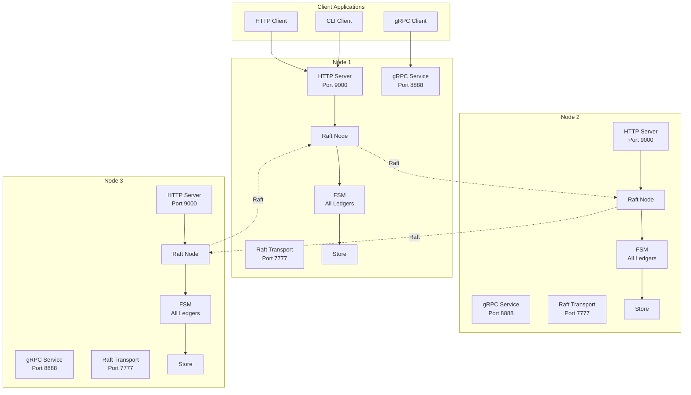
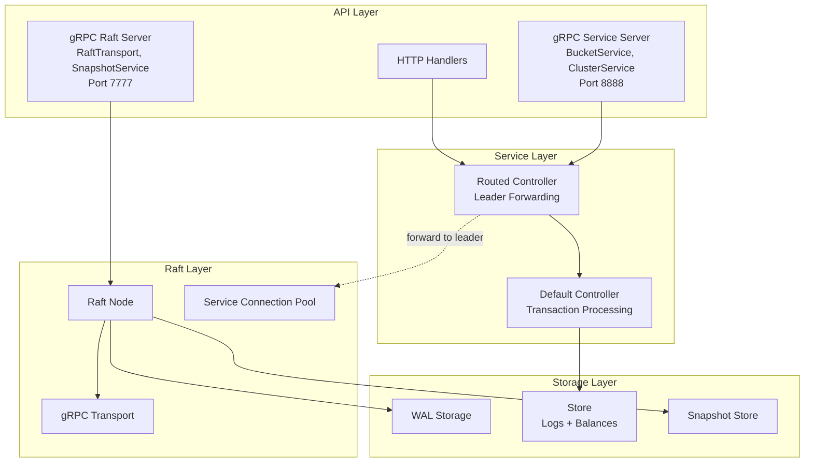
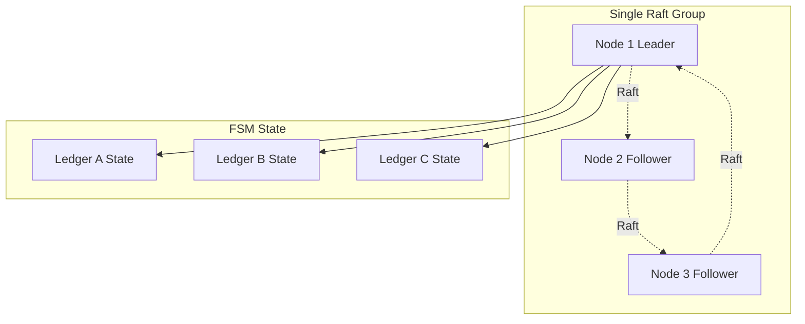
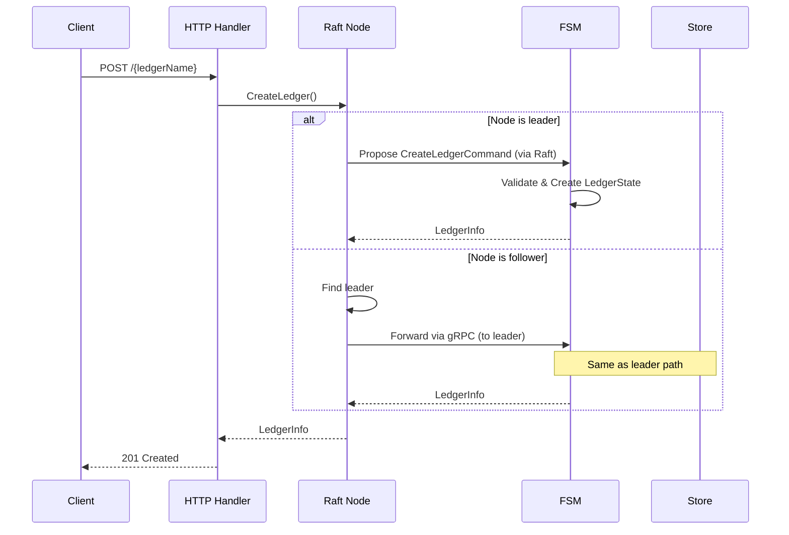
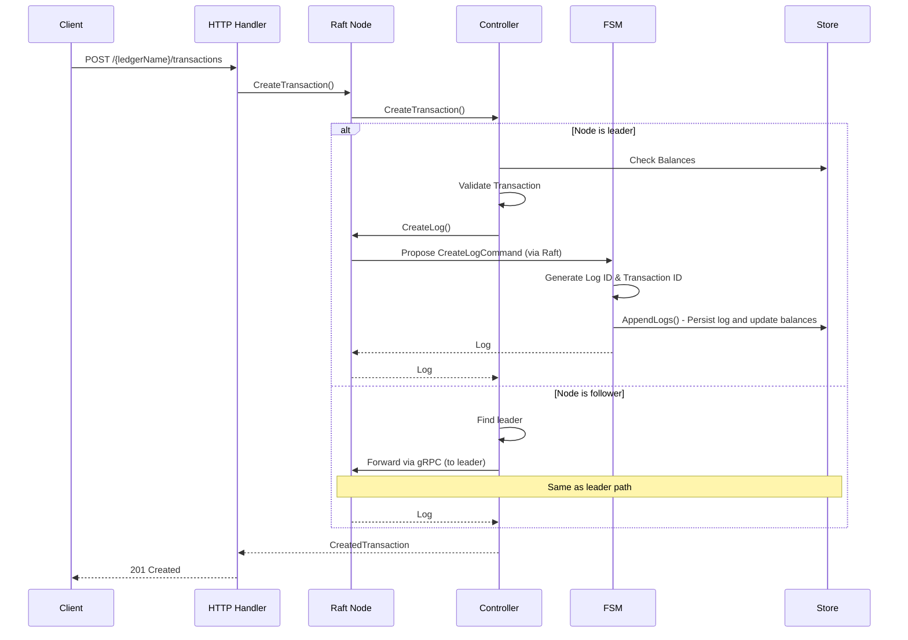
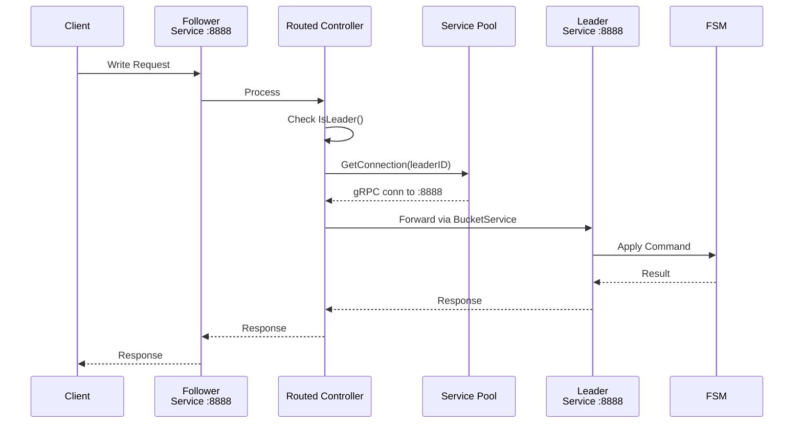

# General Architecture

## Overview

Ledger v3 POC is a distributed accounting ledger system using the Raft consensus protocol to ensure data consistency across a cluster of nodes. The system is designed to be highly available, fault-tolerant, and scalable.

## High-Level Architecture



## Main Components

### 1. Cluster Nodes

Each node in the cluster runs the following components:

- **HTTP Server**: Public REST API (port 9000)
- **gRPC Service Server** (port 8888): External client-facing API
  - `BucketService`: Ledger operations, transactions, accounts
  - `ClusterService`: Cluster state and node information
  - `Health`: Health checks
- **gRPC Raft Server** (port 7777): Internal inter-node communication
  - `RaftTransport`: Raft message exchange between nodes
  - `SnapshotService`: Snapshot transfer for new nodes
- **Raft Node**: Single Raft group managing all ledgers and transactions
- **Routed Controller**: Routes requests to local controller or forwards to leader
- **Service Connection Pool**: Manages gRPC connections to peers' service ports for request forwarding
- **Finite State Machine (FSM)**: State machine for applying commands (ledger and log operations)
- **Store**: Persistent storage for logs, balances, and metadata

### 2. Abstraction Layers



## Single Raft Architecture

The system uses a **single Raft group** to manage all operations:

### Unified FSM

The FSM (Finite State Machine) handles all commands:

**Ledger Commands**:
- `CreateLedgerCommand`: Create a new ledger
- `DeleteLedgerCommand`: Delete an existing ledger

**Log Commands**:
- `CreateLogCommand`: Insert a log (transaction, metadata changes, reversions) into a ledger

### State Structure

The FSM maintains a unified state containing all ledgers:

```go
type State struct {
    Ledgers map[string]*LedgerState  // All ledgers indexed by name
}

type LedgerState struct {
    LedgerInfo        *LedgerInfo  // Ledger metadata
    NextLogId         uint64       // Next log sequence number
    NextTransactionId uint64       // Next transaction ID
    LastAppliedLogId  uint64       // Last applied log for sync
}
```

### Benefits of Single Raft

1. **Simplicity**: One Raft group to manage instead of N+1 groups
2. **Consistent Operations**: All operations go through the same consensus layer
3. **Easier Recovery**: Single snapshot and WAL for the entire system
4. **Reduced Overhead**: No need to coordinate multiple Raft leaders
5. **Cross-Ledger Atomicity**: Enables atomic bulk operations spanning multiple ledgers

> **📋 Related**: See [Global Log Architecture](./global-log.md) for details on how the global log enables system-level atomic operations.



## Data Flows

### Ledger Creation



### Transaction Creation



## Leader Management

### Request Forwarding

When a node receives a write request but is not the leader:

1. The node detects it is not the leader via `RoutedController`
2. It identifies the current leader from the Raft state
3. It uses the `ServiceConnectionPool` to get a connection to the leader's **service port** (8888)
4. It forwards the request to the leader's `BucketService` via gRPC
5. The leader processes the request and returns the response

**Important**: Request forwarding uses the **service port** (8888), not the Raft transport port (7777). Each peer is configured with both addresses: `<id>/<raftAddress>/<serviceAddress>`.



### "No Leader" Error Handling

If no leader is available (e.g., during an election), the system returns a `503 Service Unavailable` error with the `Retry-After: 1` header to indicate the client should retry.

## Data Isolation

### Logical Isolation Between Ledgers

Although all ledgers share the same Raft group and storage:

- Each ledger has its own sequence numbers (log IDs and transaction IDs)
- Balances and metadata are stored with ledger prefixes
- Operations on one ledger do not affect the state of others

### Storage Organization

All ledgers share a single Store with data prefixed by ledger name:
- `logs` table: Contains `(ledger, id)` as primary key
- `balances` table: Contains `(ledger, account, asset)` as key
- `account_metadata` table: Contains `(ledger, account_address, key)` as key

## Scalability

### Horizontal Scaling

The system can be scaled horizontally by adding nodes to the cluster:

- New nodes join the Raft group
- They automatically receive replicated data
- Load is distributed across all nodes for reads

**Note:** Horizontal scaling is currently under implementation.

### Limitations

- The number of nodes must be odd to avoid ties during voting
- A cluster of N nodes can tolerate (N-1)/2 failures
- Performance may be limited by the leader (all writes go through the leader)
- All ledgers share the same leader

## Observability

### Logging

The system uses structured logging with contextual fields:
- Node ID
- Ledger name
- Command ID
- Raft index

### Tracing

OpenTelemetry is integrated for distributed tracing:
- HTTP request traces
- gRPC call traces
- Raft operation traces

### Metrics

The following metrics are available:
- Cluster state (leader, followers)
- Number of ledgers
- Apply entries duration and batch size
- Raft state transitions

## Next Steps

To deepen your understanding:

1. [Global Log Architecture](./global-log.md) - Two-level log architecture and atomic bulk operations
2. [Raft Consensus](./raft-consensus.md) - Details on Raft implementation
3. [Ledgers](./buckets-ledgers.md) - Data organization
4. [API and Interfaces](./api.md) - API documentation
5. [Storage and Persistence](./storage.md) - Storage management
6. [gRPC Connections](./grpc-connections.md) - Inter-node communication and reconnection strategies
