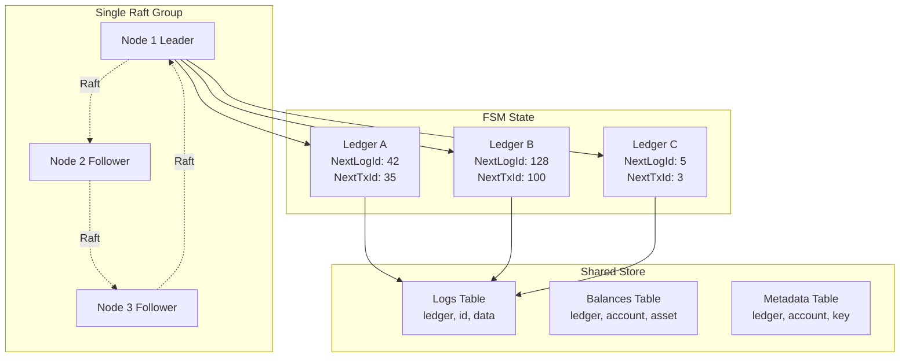
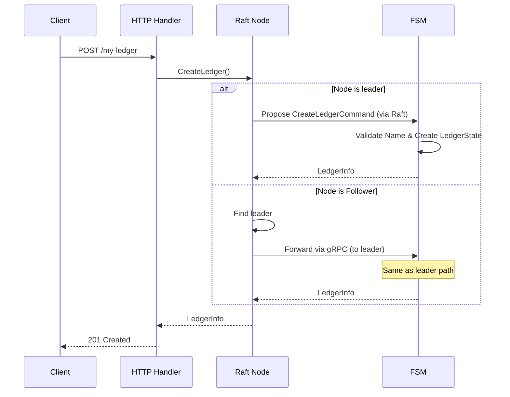
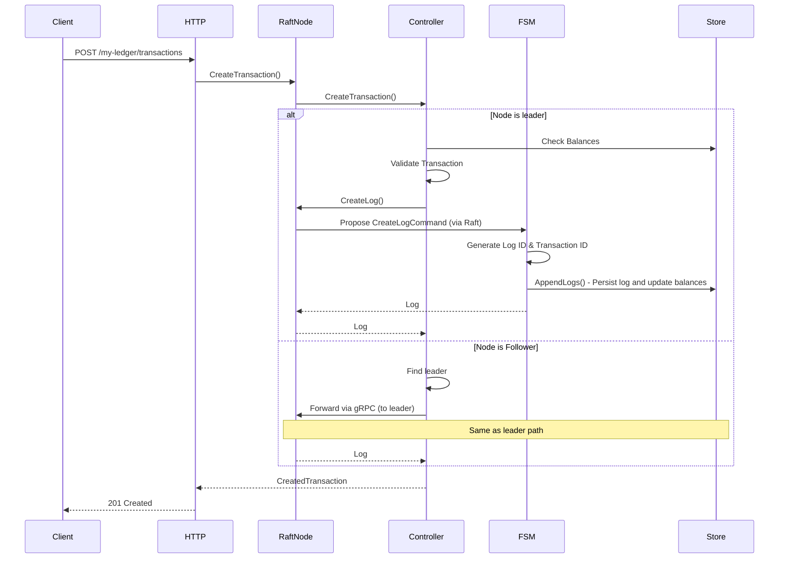
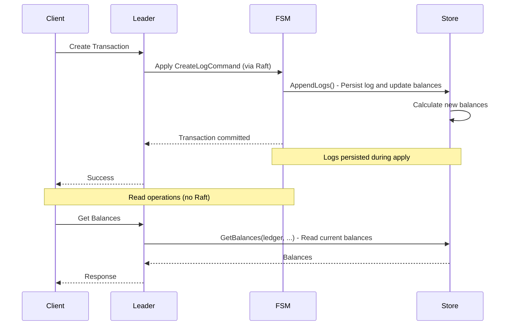

# Ledgers

## Overview

The Ledger v3 POC system uses a **single Raft group architecture** where all ledgers are managed together. This organization simplifies operations while maintaining strong consistency guarantees.

## Architecture



## Ledgers

### Concept

A **ledger** is an accounting book that:
- Is managed by the single Raft group
- Shares storage with other ledgers (prefixed by ledger name)
- Contains financial transactions
- Has its own sequence numbers (log IDs and transaction IDs)
- Is logically isolated from other ledgers

### Ledger Properties

```go
type LedgerInfo struct {
    Name      string            // Ledger name (unique identifier)
    Metadata  metadata.Metadata // Ledger metadata
    CreatedAt time.Time         // Creation date
    Id        uint32            // Numeric ledger ID (auto-assigned)
}

type LedgerState struct {
    LedgerInfo        *LedgerInfo
    NextLogId         uint64  // Next log sequence number
    NextTransactionId uint64  // Next transaction ID
    LastAppliedLogId  uint64  // Last applied log for sync
}
```

### Numeric Ledger ID

Each ledger is assigned a unique numeric ID (`uint32`) when created. This ID is used:

- **Internally**: For storage keys, log entries, and all internal operations
- **Externally**: The API continues to use ledger names for user convenience
- **Conversion**: The HTTP layer converts ledger names to IDs automatically

**Benefits of numeric IDs**:
- **Compact storage**: 4 bytes vs variable-length strings in storage keys
- **Fast lookups**: Integer comparison is faster than string comparison
- **Immutable reference**: The ID never changes, even if names could be updated in the future

### Limits

| Resource | Maximum | Notes |
|----------|---------|-------|
| Ledgers | **65,535** | Limited by 16-bit numeric ID |

> **Note**: The maximum number of ledgers is limited to 65,535 per cluster. Each ledger is assigned a unique numeric ID (stored as uint32 but limited to uint16 range). This limit is intentional to keep the system simple and efficient.

### Ledger Creation

Ledger creation is a distributed operation that goes through the single Raft group:

1. Client sends a `POST /{ledgerName}` request
2. Node checks if it is the leader
3. If not leader, the request is forwarded to the leader
4. Leader proposes a `CreateLedgerCommand` to the Raft group
5. Command is replicated to all nodes
6. Once committed, the FSM:
   - Validates the ledger name is unique
   - Creates a new LedgerState with initial values
   - Stores ledger metadata



### Storage

Storage is handled by Pebble, a high-performance LSM-tree storage engine. All ledgers on a node share the same Pebble database.

## Transactions

### Concept

A **transaction** represents an accounting operation with:
- **Postings** (accounting entries): source, destination, amount, asset
- Or a **Numscript script**: complex business logic
- **Metadata**: additional information
- A **reference**: optional external identifier
- An **idempotency key**: to avoid duplicates

### Transaction Structure

```go
type Transaction struct {
    ID        uint64            // Sequential ID within the ledger
    Postings  []Posting         // Accounting entries
    Timestamp time.Time         // Timestamp
    Reference string            // External reference
    Metadata  metadata.Metadata // Metadata
}

type Posting struct {
    Source      string   // Source account
    Destination string   // Destination account
    Amount      *big.Int // Amount (big integer)
    Asset       string   // Asset identifier
}
```

### Transaction Creation

The transaction creation process:

1. Client sends a `POST /{ledgerName}/transactions` request
2. Node checks if it is the leader
3. If not leader, the request is forwarded to the leader
4. Controller validates the transaction:
   - Checks postings (balance, asset, etc.)
   - Checks idempotency key
   - Executes script if present
5. A `CreateLogCommand` is proposed to the Raft group
6. FSM:
   - Generates the next log ID and transaction ID for this ledger
   - Returns the log to be persisted
7. Store persists the log and updates balances



### Logs and Sequence

Each transaction is stored as a **log** with:

- **ID**: Sequential log ID within the ledger
- **Ledger**: Name of the ledger this log belongs to
- **Type**: Log type (transaction, metadata, reversion, etc.)
- **Data**: Serialized log payload
- **IdempotencyKey**: Optional idempotency key
- **IdempotencyHash**: Hash of inputs for idempotency verification

Sequences are generated sequentially by the FSM per ledger, ensuring global transaction order within each ledger.

## Storage Architecture: Store (logs + runtime state)

All ledgers share a single Store. The Store implements the LogStore interface and persists the immutable log history alongside derived state (balances, account metadata, idempotency).

### Log persistence (LogStore interface)

**Purpose**: Persistent storage of transaction logs (the immutable history of all transactions)

**Responsibilities**:
- Stores all transaction logs with their sequence numbers, keyed by `(ledger, id)`
- Maintains idempotency key indexes per ledger
- Provides log streaming capabilities (`GetAllLogs`, `GetLogByID`)
- Acts as the source of truth for transaction history
- Tracks the last applied Raft index for recovery

**Usage in Raft**:
- **During writes**: When logs are applied by the FSM, `Store.AppendLogs()` persists logs and updates balances
- **During reads**: Logs can be read directly from Store without going through Raft (local reads)
- **During recovery**: The FSM uses `GetLastAppliedIndex()` to know where to resume

### Runtime state

**Purpose**: Runtime data access for balances and account metadata (derived state)

**Responsibilities**:
- Stores account balances (calculated from transactions), keyed by `(ledger, account, asset)`
- Stores account metadata, keyed by `(ledger, account, key)`
- Maintains idempotency key lookups per ledger (`GetLogIDForIdempotencyKey`)
- Tracks transaction ID to log ID mappings (`GetLogIDForTransactionID`)
- Tracks reverted transactions (`IsTransactionReverted`)
- Provides fast read access to current state

**Usage in Raft**:
- **During writes**: When logs are applied by the FSM, `Store.AppendLogs()` persists logs and updates balances
- **During reads**: Balances and metadata are read directly from Store (local reads, no Raft consensus needed)
- **During recovery**: State is rebuilt from the last Store snapshot + recent Raft entries (not by replaying all logs, which would be too slow)

### How It Works



**Write Flow**:
1. Transaction is proposed to Raft leader
2. Once committed, FSM applies the command
3. FSM calls `Store.AppendLogs()` to persist logs and update balances
4. Logs and runtime state are stored in the shared Store

**Read Flow**:
1. Client requests balances
2. Node reads directly from **Store** (no Raft consensus needed)
3. Since Store is updated during writes, it always reflects the latest committed state

**Recovery Flow**:
1. On startup, the Store is restored from its last snapshot (balances already included)
2. FSM loads the Raft snapshot and uses `Store.GetLastAppliedIndex()` to determine where to resume
3. For each ledger, FSM streams missing logs from the leader via gRPC
4. For each log, FSM calls `Store.AppendLogs()` to persist logs and update balances incrementally

### Why One Shared Store?

- **Atomic updates**: Log persistence and runtime state updates are handled together
- **Simpler configuration**: Single store for all ledgers
- **Consistent reads**: The same store provides both history and current state
- **Simpler operations**: One database to backup, monitor, and maintain
- **Snapshot support**: `CreateSnapshot()` for checkpoint-based recovery

**Note**: To keep Store compact and efficient, balances should be set to zero whenever possible. Zero balances can be omitted from storage, reducing the size of the Store and improving query performance.

## Data Isolation

### Logical Isolation Between Ledgers

Although all ledgers share the same Raft group and storage:

- Each ledger has its own sequence numbers (log IDs and transaction IDs)
- Data is prefixed by ledger name in all tables
- Operations on one ledger do not affect the state of others
- Snapshots contain all ledger states

## Metadata Management

### Ledger Metadata

Ledger metadata is stored in the FSM state and can be:
- Added during creation
- Modified via the API
- Deleted via the API

### Transaction Metadata

Transaction metadata is stored in the log and can be:
- Added during transaction creation
- Modified via the API
- Deleted via the API
It is not stored separately in the Store.

### Account Metadata

Account metadata is stored in the Store and can be:
- Added during transaction creation
- Modified via the API
- Deleted via the API

## Idempotence

### System-Level Idempotency

Ledger v3 implements **system-level idempotency**, a key architectural difference from v2:

| Aspect | v2 | v3 |
|--------|----|----|
| **Scope** | Per-ledger | System-wide |
| **Key namespace** | `(ledger, key)` | `key` only |
| **Operations covered** | Transactions only | All operations (ledger CRUD, transactions, metadata) |
| **Cross-ledger** | Same key allowed in different ledgers | Unique across entire system |

### Idempotency Key

The system supports idempotency keys to avoid duplicate operations:

- The key is provided in the `Idempotency-Key` header or in the action payload
- If an operation with the same key already exists, the cached result is returned
- **All operation types** are covered: ledger creation, ledger deletion, transactions, metadata changes
- Verification is done at the controller level before proposing to Raft

### Storage

Idempotency keys are stored in the Store:
- Keyed by `idempotency_key` (system-wide, no ledger prefix)
- Linked to the **global sequence number** of the resulting log
- Use `GetSequenceForIdempotencyKey()` to retrieve the associated sequence
- Persisted alongside runtime state

### Benefits of System-Level Idempotency

1. **Simpler client implementation**: No need to track which ledger an idempotency key was used with
2. **Cross-ledger atomicity**: Bulk operations spanning multiple ledgers can use a single idempotency key
3. **Consistent behavior**: All operations behave the same way regarding idempotency
4. **Stronger guarantees**: Prevents accidental reuse of keys across ledgers

## Performance and Optimizations

### Local Reads

Reads can be served locally without going through Raft:
- `GetLedger`: Local read (FSM state)
- `GetAllLedgers`: Local read (FSM state)
- `GetBalances`: Local read from Store
- `GetAllLogs`: Local read from Store
- `GetLogByID`: Local read from Store
- `GetAccountMetadata`: Local read from Store

### Writes via Leader

All writes must go through the leader:
- `CreateLedger`: Raft group leader
- `DeleteLedger`: Raft group leader
- `CreateTransaction`: Raft group leader
- `SaveMetadata`: Raft group leader

### Batching

Transactions can be batched to improve throughput:
- `/_bulk` API to send multiple operations
- Parallel processing possible
- Optional atomicity

## Next Steps

To deepen your understanding:

1. [API and Interfaces](./api.md) - API documentation for ledgers
2. [Storage and Persistence](./storage.md) - How data is stored
3. [Data Flows](./data-flows.md) - Detailed operation flows
