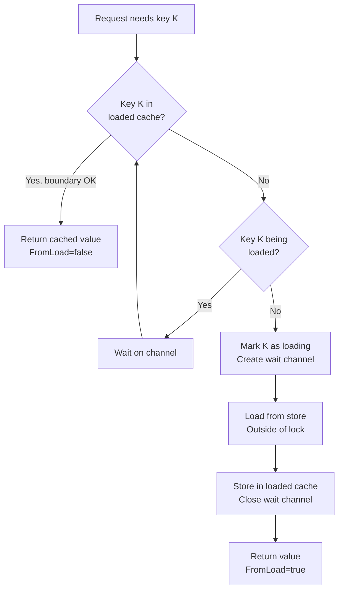
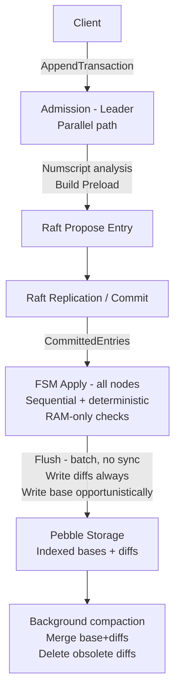
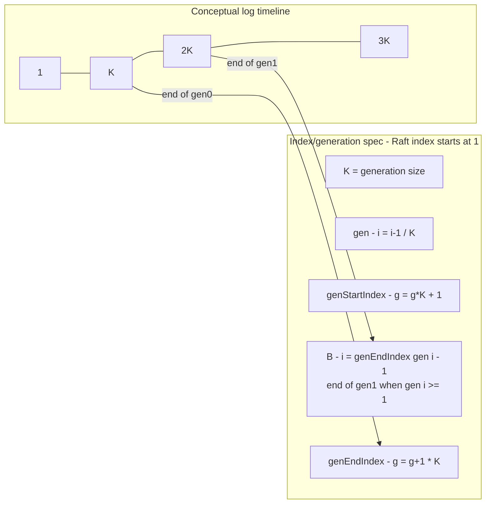

# RFC: Deterministic FSM Cache + Preload (Raft Ledger + Pebble)

**Status:** Implemented  
**Scope:** Raft FSM apply determinism, cache strategy, admission + Preload, AttributeLoader for concurrent loads, storage layout (bases/diffs), snapshots, backpressure  
**Non-goals:** consensus algorithm changes, networking, client API semantics beyond admission/preload requirements

---

## 0. Executive Summary

We need to enforce ledger invariants (e.g. `balance >= threshold`) deterministically on **all Raft nodes** while keeping the FSM apply loop **RAM-only** (no `Pebble.Get()` in `Apply()`).

We achieve this with:

1. A **deterministic working set** based on Raft log **generations** (`gen0/gen1`) derived only from Raft indexes.
2. An **Admission** path (leader-side, parallel) that builds a **Preload** payload at a **canonical generation boundary** `B(i)` and attaches it to the Raft entry.
3. A storage model that persists **indexed bases** and **indexed diffs**, enabling Admission to rebuild a base at the canonical boundary.

Snapshots are **not synchronized** across nodes (etcd/raft), therefore snapshots must include `gen0 + gen1`.

---

## 1. Problem

We operate a Raft-based ledger (3 nodes):

- Leader proposes transaction entries.
- Entries replicate, commit, and apply on **all nodes**.

### 1.1 The bug class we are preventing

During in-flight replication/apply:

- Pebble may return an **older** balance than what is logically implied by already-committed / soon-to-be-applied entries.
- Followers may not have required accounts in RAM.
- We must prevent a scenario where:
  - the leader accepts a transaction,
  - but a follower cannot apply it deterministically (or “rejects” it) due to local cache state.

### 1.2 Workload patterns

- **Hot accounts:** frequently reused (wallets, clearing accounts)  
  → should remain in RAM nearly always.

- **Cold / one-shot accounts:** touched once (or twice) then never again  
  → often absent from RAM, but must not degrade apply correctness.

- **Mixed:** a few hot accounts + many cold accounts  
  → this is the primary motivation for deterministic cache + Preload to avoid Pebble Get storms and follower divergence.

---

## 2. Goals and Non-Goals

### 2.1 Goals

- **Deterministic apply:** every committed Raft entry is applicable on every node.
- **Checks on all nodes:** invariants like `balance >= threshold` run during apply on every node.
- **Apply is RAM-only:** no blocking I/O in `Apply()`.

### 2.2 Non-goals

- Forcing snapshots to occur at generation boundaries.
- Achieving identical *timing* of persistence across nodes.
- Eliminating all Pebble reads: Admission can read Pebble; Apply must not.

---

## 3. Definitions

### 3.1 FSM (Finite State Machine)

The **FSM** is the deterministic state transition function:

- Consumes committed Raft entries sequentially (strict index order).
- Updates ledger state (balances, metadata, internal indexes, etc.).
- Maintains the deterministic working set and in-memory overlays.

**FSM constraints:**

- deterministic
- single-threaded in order
- no blocking I/O in `Apply()`

### 3.2 Admission

**Admission** is the leader-side phase executed before proposing an entry to Raft.

- runs on a parallel path (not in the apply loop)
- uses optimistic, fine-grained locking (per-account locks, canonical ordering)
- builds and embeds Preload to guarantee apply determinism

### 3.3 Preload

**Preload** is data attached to the Raft entry so that Apply can execute decisions without store reads.

Preload provides **base values** (balance and optionally metadata) aligned to a **canonical boundary index**.

---

## 4. Deterministic Cache via Generations

We use a deterministic cache rule derived only from Raft indexes (not time, not LRU).

### 4.1 Generation definition

A **generation** is a fixed-size block of the Raft log.

Pick a constant `K` entries per generation.

All nodes see identical Raft indexes → identical generations.

### 4.2 Functions (spec)

Raft indexes start at 1.

- `gen(i) = (i - 1) / K`
- `genStartIndex(g) = g*K + 1`
- `genEndIndex(g) = (g + 1)*K`

### 4.3 Working set

We keep two generations:

- `gen0`: accounts touched in the current generation
- `gen1`: accounts touched in the previous generation

Guarantee:

```
Cache(i) = gen0 ∪ gen1
```

Any account touched in the last `~2K` entries is guaranteed in RAM at apply time.

### 4.4 Rotation (deterministic)

On apply of entry `i`:

- if `gen(i) != currentGen`:
  - `gen1 = gen0`
  - `gen0 = empty`
  - `currentGen = gen(i)`

Rotation depends only on the index.

---

## 5. Canonical Boundary for Preload (Borne)

Admission forges Preload at a canonical boundary index `B(i)` that depends only on the index being applied.

Let `g = gen(i)`.

- If `g >= 1`:

```
B(i) = genEndIndex(g - 1)   // end of gen1
```

- If `g = 0`:

```
B(i) = 0   // initial state
```

**Key property:** Preload may embed a balance that is older than the latest value, as long as it is correct at boundary `B(i)` and the overlay since `B(i)` is applied deterministically by Raft.

Correctness model:

```
Balance@apply(i) = BaseBalance@B(i) + OverlayDeltaRAM(since B(i))
```

---

## 6. Preload

### 6.1 Contents

A Raft entry includes:

- `preload_index = B(i)` (canonical boundary for this entry)
- `preload_balances[acct]` (base balance at `preload_index`)
- optional `preload_meta[acct]` (metadata required for decisions)
- optionally: additional base material needed for deterministic script execution

### 6.2 Why “older balance” is OK

Preload is a consistent snapshot at boundary `B(i)`. All nodes will apply the same Raft entries after `B(i)` in the same order, producing identical final state.

---

## 7. Admission (Leader-side, Parallel)

Admission must ensure that the entry is applyable everywhere.

### 7.1 Parallel path and locking

Admission runs outside FSM apply:

- It may lock accounts to avoid race conditions between concurrent requests.
- Locking is optimistic:
  - fine-grained locks per account
  - canonical ordering to avoid deadlocks
  - short duration
- Admission must not block global FSM state.

### 7.2 Numscript requirements

To decide Preload correctly, Admission needs **ahead-of-time** information about which accounts require base values and metadata.

Numscript performs static analysis and provides **exact** requirements:

- list of accounts that will be accessed
- for each account:
  - `NeedBalances`: list of assets for which balances are required
  - `NeedMetadataKeys`: list of metadata keys that will be read

Numscript knows precisely what data will be needed during execution. There is no uncertainty - Apply must not read Pebble, so all required data must be known in advance.

#### 7.2.1 Numscript Go Interface

```go
package numscript

// AccountRequirement represents the exact data requirements for an account.
// Numscript performs static analysis and knows precisely what data will be needed
// during execution - there is no uncertainty.
type AccountRequirement struct {
    // Account is the account address (e.g., "users:alice", "bank:main").
    Account string

    // NeedBalances lists the assets for which the balance is required.
    // Numscript knows exactly which assets will be read for this account
    // (e.g., for bounded sources, balance conditions).
    // Empty slice means no balance is needed for this account.
    //
    // Example: ["USD", "EUR"] means balances for USD and EUR are required.
    NeedBalances []string

    // NeedMetadataKeys lists the specific metadata keys required for this account.
    // Numscript knows exactly which metadata keys will be accessed
    // (e.g., for conditions like `meta($account, "limit")`).
    // Empty slice means no metadata is needed for this account.
    //
    // Example: ["limit", "tier"] means only these two metadata keys are needed.
    NeedMetadataKeys []string
}

// AnalysisResult contains the result of static analysis on a numscript program.
// This is used during Admission to determine what data to include in Preload.
type AnalysisResult struct {
    // Accounts lists all accounts that the script will interact with,
    // along with their precise data requirements.
    Accounts []AccountRequirement
}

// Program represents a parsed and analyzed numscript program.
// It can be cached and reused for multiple executions with different variables.
type Program interface {
    // Analyze performs static analysis on the script with the given variables.
    // Variables are needed because account names can be dynamic (e.g., $account).
    // Returns the exact set of accounts and their data requirements.
    //
    // This MUST be called during Admission (before Raft propose) to determine
    // what data to include in Preload.
    Analyze(vars map[string]string) (*AnalysisResult, error)
}
```

### 7.3 Deterministic Preload decision rule

For each account with `NeedBalances` or `NeedMetadataKeys`:

- if it is not guaranteed in `Cache(nextIndex)` (i.e., outside `gen0 ∪ gen1` at `nextIndex`)  
  → include the required balances/metadata in Preload.

This rule is deterministic (index-based) and must not depend on best-effort caches.

### 7.4 Admission algorithm (recommended)

1) Extract accounts and their requirements from Numscript analysis  
2) Sort accounts canonically and lock them  
3) Read `nextIndex` (serialize via an append mutex if needed)  
4) Compute `B(nextIndex)` and cache-guaranteed set `Cache(nextIndex)`  
5) For each account outside cache with `NeedBalances` or `NeedMetadataKeys`:
   - build `base@B(nextIndex)` from Pebble (bases+diffs) for required assets/keys  
6) Propose Raft entry embedding:
   - `preload_index = B(nextIndex)`
   - `preload_payload` for required accounts (balances per asset, metadata per key)

### 7.5 Admission invariants

- Apply must never need `Pebble.Get()`
- required base/meta must be available in RAM (`gen0/gen1`) or in Preload
- otherwise: invariant violation `MISSING_PRELOAD` (bug)

### 7.6 Concurrent Load Coordination (AttributeLoader)

When multiple concurrent requests need the same attribute (e.g., same account balance), we avoid duplicate store loads using an `AttributeLoader` per attribute type.

#### Problem

Without coordination:
- Request A needs balance for account X, starts loading from store
- Request B needs balance for account X, also starts loading from store
- Both requests read the same data redundantly

#### Solution: AttributeLoader

Each attribute type (Input, Output, Reversions, IdempotencyKeys) has a dedicated `AttributeLoader[T]` that:

1. **Tracks loading keys**: When a goroutine starts loading a key, it's marked as "loading"
2. **Wait on pending loads**: Other goroutines needing the same key wait for the ongoing load
3. **Cache loaded values**: Once loaded, the value is cached with its boundary
4. **Cleanup after apply**: Values are removed from the loader after the command is applied (data is then in the FSM cache)

```go
type AttributeLoader[T any] struct {
    mu      sync.RWMutex
    loading map[attributes.U128]chan struct{}  // Keys being loaded
    loaded  map[attributes.U128]*loadedEntry[T] // Cached loaded values
}

type loadedEntry[T any] struct {
    boundary uint64  // Boundary at which value was computed
    value    T
}
```

#### Loading Flow



#### RWMutex Optimization

The loader uses `sync.RWMutex` for optimal concurrency:

| Operation | Lock Type | Allows |
|-----------|-----------|--------|
| Check loaded cache (fast path) | `RLock` | Concurrent reads |
| Check if loading | `RLock` | Concurrent reads |
| Add to loading map | `Lock` | Exclusive |
| Update loaded cache | `Lock` | Exclusive |
| Remove from cache | `Lock` | Exclusive |

#### Cleanup with LoadedKeysTracker

The `LoadedKeysTracker` tracks which keys were loaded by a command:

```go
type LoadedKeysTracker struct {
    Input           []attributes.U128
    Output          []attributes.U128
    Reversions      []attributes.U128
    IdempotencyKeys []attributes.U128
}
```

After the command is applied (success or error), `MarkApplied()` removes the keys from their respective loaders. This is safe because:
- On success: The FSM cache now has the values
- On error: The values should not be retained (stale boundary)

---

## 8. FSM Apply (All nodes)

FSM Apply is deterministic and RAM-only.

### 8.1 Apply checks

For each account requiring base/meta:

1. If present in RAM → OK  
2. Else must exist in Preload → materialize it in RAM  
3. Else → invariant violation (`MISSING_PRELOAD`)

Then:

- execute checks (`balance >= threshold`, etc.)
- apply deltas
- touch accounts into `gen0`

### 8.2 Rejections

Business rejection (e.g., insufficient funds) is a deterministic outcome of apply and must be encoded as a deterministic result of the command execution (response semantics outside scope).

---

## 9. RAM Overlays (Deltas) relative to boundary

We store RAM deltas relative to the canonical base boundary.

Model:

```
Balance = PersistedBase@B + OverlayDeltaRAM(since B)
```

When a check becomes necessary for a previously “lazy” account:

- use Preload base at `B`
- apply overlay deltas
- materialize in `gen0`

---

## 10. Snapshots (etcd/raft)

Snapshots are not synchronized across nodes. We do not force snapshots at generation boundaries.

Therefore, replay alone cannot reconstruct the same working set reliably.

### 10.1 Snapshot content (robust)

Include:

- `K`
- `currentGen`
- `gen0` and `gen1` (presence, and values if materialized)
- other FSM state required for deterministic continuation

Restore:

- restore `gen0/gen1`
- resume replay from `lastIncludedIndex + 1`

---

## 11. persistedIndex + Backpressure (rare)

### 11.1 persistedIndex definition

`persistedIndex` is the last Raft index whose effects are visible in Pebble after successful `Batch.Commit()`.

Used for:

- observability: persistence lag
- admission guardrail: ensure the store is up-to-date enough for building bases at boundary `B`
- restart diagnostics

It must never drive rotation/eviction.

### 11.2 Backpressure condition

If the store is too far behind to produce a coherent base for the required boundary:

- condition: `storeIndex < baseIndex(gen1)` (equivalently: cannot build base at `B(i)`)
- Admission must apply backpressure (queue/retry) until catch-up

In practice: expected negligible with continuous Pebble flush (batch + no sync).

---

## 12. Storage model (Pebble): indexed bases + indexed diffs

We need to reconstruct balances at boundary `B`.

### 12.1 Data model

For each account `acct`:

- `base[acct] = { index, balance, meta }`
- `diff[acct, index] = { delta, metaDelta }` keyed by Raft index

Reconstruction for boundary `B`:

```
Balance@B = Base@(baseIndex ≤ B) + Σ Diff(index ∈ (baseIndex, B])
```

### 12.2 FSM writes (opportunistic)

FSM flushes at apply time (batch, no sync):

- always write indexed `diff[acct, i]` for entry index `i`
- write/update `base[acct]` opportunistically when a materialized balance/meta is available:
  - account already materialized in RAM, or
  - base material arrived via Preload

Goal: never force a Pebble read in Apply just to write a base.

### 12.3 Background compaction

A background compaction process:

- merges `base + diffs` into a newer `base`
- removes diffs that become redundant
- keeps admission reconstruction bounded and fast for cold accounts

Compaction can align new bases to generation boundaries (e.g., end of gen1) to simplify.

### 12.4 Practical Pebble key layout (suggestion)

Example prefixes:

- `b/<acct>` -> `{index, balance, meta}`  (single latest base record)
- `d/<acct>/<index>` -> `{delta, metaDelta}` (diff per index)

Admission algorithm at boundary `B`:

1) read `b/<acct>` (baseIndex)
2) scan `d/<acct>/...` for `(baseIndex, B]` (bounded by compaction policy)

---

## 13. Future optimization: internal compact account IDs

Account IDs may be long strings (e.g. 64 chars). This increases RAM/snapshot overhead.

Future improvement:

- introduce internal `accountKey = hash128(accountID)` (or assigned compact ID)
- reduce map/set overhead in `gen0/gen1` and snapshots

Collision mitigation options are out-of-scope here but should be considered in implementation.

---

## 14. Mermaid diagrams

### 14.1 Global flow (Admission → Raft → FSM → Pebble)



### 14.2 Generations and canonical boundary



---

## 15. Summary

- Deterministic cache uses `gen0/gen1`, derived only from Raft index.
- Admission (leader, parallel) builds Preload aligned to canonical boundary `B(i)`.
- Apply is RAM-only and enforces checks on every node deterministically.
- Preload may include an “older” balance at `B(i)`; overlays since `B(i)` ensure correctness.
- Snapshots are not aligned across nodes → snapshot must embed `gen0 + gen1`.
- Pebble stores indexed bases and diffs; background compaction keeps reads bounded.
- `persistedIndex` is an operational guardrail and backpressure signal (rare), not a rotation input.
- `AttributeLoader` coordinates concurrent attribute loads to prevent duplicate store reads.
