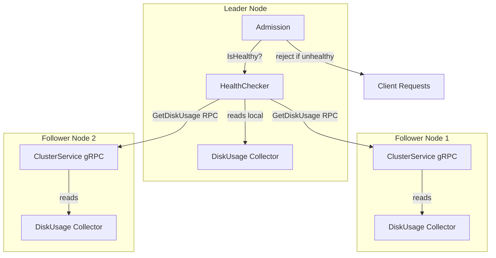

# Disk Space Limiting

## Overview

The cluster implements a disk space limiting mechanism that monitors storage usage across all nodes and rejects write operations when usage exceeds configurable thresholds. This prevents the cluster from running out of disk space, which could cause data corruption or unrecoverable failures.

## Architecture

### Components



### HealthChecker (`internal/health/`)

The `HealthChecker` is a background service that periodically polls disk usage from all cluster nodes. It runs on every node but only performs checks when the node is the Raft leader.

Key design decisions:
- **Leader-only**: Only the leader performs health checks to avoid redundant gRPC calls across all nodes
- **Local node**: The leader reads its own disk usage directly from the local `diskusage.Collector` (no self-RPC)
- **Peers**: The leader polls peer nodes via the `GetDiskUsage` gRPC RPC on the `ClusterService`
- **Atomic state**: The health state is stored as an `atomic.Bool` for lock-free reads from the admission layer

### DiskUsage Collector (`internal/storage/diskusage/`)

Each node runs a `diskusage.Collector` that periodically samples the disk usage of two volumes:
- **WAL volume**: The Raft write-ahead log directory
- **Data volume**: The application data directory (Pebble storage)

The collector exposes both used bytes and total bytes for each volume, enabling percentage-based threshold checks.

### Admission Gate (`internal/service/admission/`)

The `Admission` layer is the entry point for all write operations (create ledger, create transaction, metadata updates, etc.). It checks the health state before processing any request:

```go
func (a *Admission) Admit(ctx context.Context, requests ...*servicepb.Request) ([]*commonpb.Log, error) {
    if !a.healthChecker.IsHealthy() {
        return nil, health.ErrUnhealthy
    }
    // ... process requests
}
```

When the cluster is unhealthy, all write operations are rejected with a `health.ErrUnhealthy` error. Read operations (get ledger, get account, get transaction) are **not** affected.

## Configuration

### Per-Volume Thresholds

Thresholds are configurable independently for each volume type, allowing fine-grained control based on the volume's characteristics and capacity.

| Flag | Environment Variable | Default | Description |
|------|---------------------|---------|-------------|
| `--health-check-interval` | `HEALTH_CHECK_INTERVAL` | `30s` | Interval between health checks |
| `--health-wal-threshold` | `HEALTH_WAL_THRESHOLD` | `0.8` | WAL volume usage threshold (0.0-1.0) |
| `--health-data-threshold` | `HEALTH_DATA_THRESHOLD` | `0.8` | Data volume usage threshold (0.0-1.0) |

A threshold of `0.8` means the volume is considered full when 80% of its total capacity is used.

### CLI Example

```bash
ledger-v3-poc run \
  --node-id 1 \
  --health-check-interval 30s \
  --health-wal-threshold 0.9 \
  --health-data-threshold 0.8
```

### Helm Chart

```yaml
config:
  health:
    interval: "30s"       # Health check interval
    walThreshold: 0.8     # WAL volume threshold (80%)
    dataThreshold: 0.8    # Data volume threshold (80%)
```

## Behavior

### When a Threshold is Exceeded

1. The `HealthChecker` logs an error with structured fields:
   ```
   node_id=2 volume=wal used=8589934592 total=10737418240 percent=80
   "Disk usage exceeds threshold (80%)"
   ```
2. The health state is set to `unhealthy`
3. All subsequent write requests are rejected with `ErrUnhealthy`
4. When usage drops below the threshold on the next check cycle, writes resume automatically

### What Gets Rejected

When the cluster is unhealthy, the following operations are rejected:
- Create ledger
- Create transaction (via postings or Numscript)
- Save account metadata
- Delete account metadata
- Save transaction metadata
- Delete transaction metadata
- Revert transaction
- Bulk operations

### What Remains Available

Read operations continue to work normally:
- List ledgers
- Get ledger
- Get account
- Get transaction

### Failure Modes

- **Peer unreachable**: If the leader cannot reach a peer to check its disk usage, the peer is skipped and a warning is logged. The cluster remains healthy unless other checks fail.
- **Leadership change**: When leadership changes, the new leader starts checking immediately on its first tick. The health state defaults to `healthy` until the first check completes.

## Monitoring

### Metrics

Disk usage metrics are exposed via OpenTelemetry:
- `storage.disk.wal_volume.used_bytes` - WAL volume used bytes
- `storage.disk.wal_volume.total_bytes` - WAL volume total capacity
- `storage.disk.data_volume.used_bytes` - Data volume used bytes
- `storage.disk.data_volume.total_bytes` - Data volume total capacity

### Grafana Dashboard

The Grafana dashboard includes panels for disk usage visualization. See the `misc/devenv/config/grafana/provisioning/dashboards/` directory for pre-configured dashboards.

### Recommended Alerts

| Alert | Condition | Severity |
|-------|-----------|----------|
| Disk space warning | Usage > 70% | Warning |
| Disk space critical | Usage > threshold | Critical |
| Health check failing | `IsHealthy() == false` for > 5 minutes | Critical |

## Recommendations

### Threshold Selection

| Environment | WAL Threshold | Data Threshold | Notes |
|-------------|--------------|----------------|-------|
| Development | `0.9` | `0.9` | More permissive for local testing |
| Staging | `0.8` | `0.8` | Default values, good balance |
| Production | `0.8` | `0.85` | Stricter WAL, slightly more permissive data |

### Volume Sizing

- **WAL volume**: Size based on snapshot threshold and write throughput. The WAL grows between snapshots and is truncated after each snapshot.
- **Data volume**: Size based on total data retention. Pebble compaction reclaims space over time, but peak usage can be higher during compaction.

### Operational Response

When the cluster becomes unhealthy due to disk space:

1. **Immediate**: Investigate which node and volume exceeded the threshold (check logs)
2. **Short-term**: Increase volume size (Kubernetes PVC resize if supported) or trigger a manual Pebble compaction
3. **Long-term**: Adjust volume sizing, add monitoring alerts at lower thresholds (e.g., 70%), or implement data retention policies
