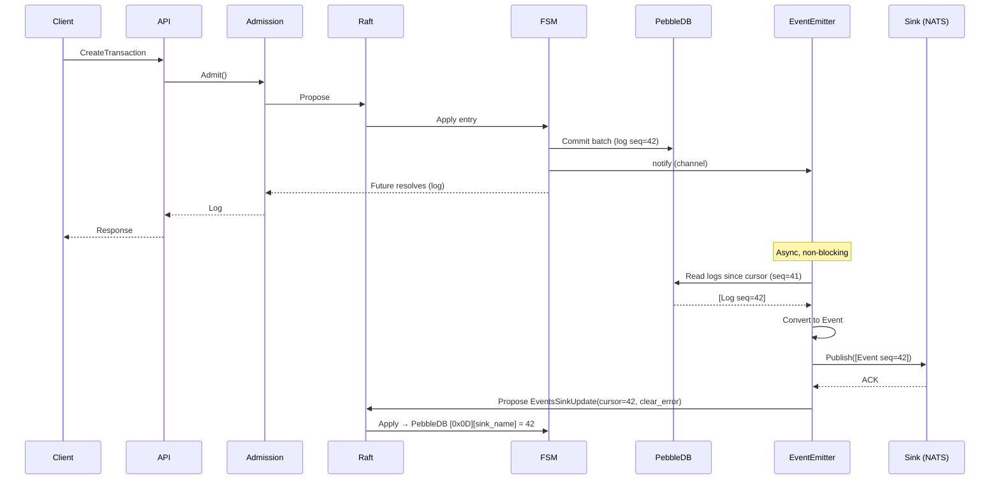
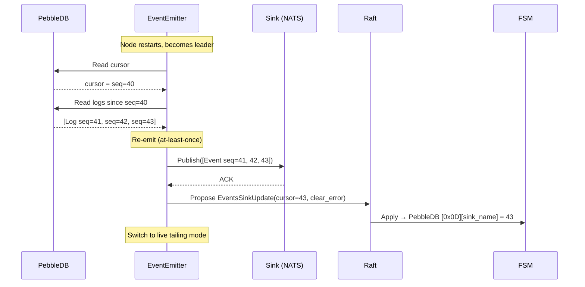

# Event System Specification

This document specifies the event system for Ledger v3, providing at-least-once delivery of domain events derived from the global log.

## Overview

The event system emits domain events for every mutation committed to the ledger. Events are **derived from the global log** (not published inline during the write path), ensuring at-least-once delivery with no event loss across restarts or leader changes.

### Design Principles

1. **At-least-once delivery**: Every committed log produces exactly one event. After crashes or leader changes, events may be re-delivered but never lost.
2. **Ordered**: Events are emitted in global log sequence order. Consumers can rely on the `sequence` field for ordering and deduplication.
3. **Leader-only**: Only the Raft leader emits events, avoiding duplicates across cluster nodes.
4. **Decoupled from write path**: Event emission does not block or slow down the Raft consensus/apply path.
5. **Configurable format**: Event payloads are serialized as JSON or Protobuf, configured per-sink.

## Event Types

Events map directly to the global log payload types:

| Event Type | Trigger | Log Payload |
|---|---|---|
| `COMMITTED_TRANSACTION` | Transaction created | `CreatedTransaction` |
| `REVERTED_TRANSACTION` | Transaction reverted | `RevertedTransaction` |
| `SAVED_METADATA` | Metadata saved on account or transaction | `SavedMetadata` |
| `DELETED_METADATA` | Metadata key deleted | `DeletedMetadata` |
| `CREATED_LEDGER` | Ledger created | `CreateLedgerLog` |
| `DELETED_LEDGER` | Ledger deleted | `DeleteLedgerLog` |

### Compatibility with Reference Implementation

The event types align with `github.com/formancehq/ledger` where applicable:

| Reference Event | v3 Event | Notes |
|---|---|---|
| `COMMITTED_TRANSACTIONS` | `COMMITTED_TRANSACTION` | Singular (one event per log) |
| `SAVED_METADATA` | `SAVED_METADATA` | Identical semantics |
| `REVERTED_TRANSACTION` | `REVERTED_TRANSACTION` | Identical semantics |
| `DELETED_METADATA` | `DELETED_METADATA` | Identical semantics |
| `INSERTED_SCHEMA` | `CREATED_LEDGER` | Renamed (no schema concept in v3) |
| _(none)_ | `DELETED_LEDGER` | New in v3 |

## Event Structure

### Envelope

Every event shares a common envelope:

```protobuf
message Event {
  string type = 1;                    // Event type (e.g. "COMMITTED_TRANSACTION")
  uint64 sequence = 2;               // Global log sequence (monotonic, unique)
  common.Timestamp date = 3;         // Event timestamp (HLC)
  string ledger = 4;                 // Ledger name (empty for system events like CREATED_LEDGER)
  oneof payload {
    CommittedTransactionPayload committed_transaction = 5;
    RevertedTransactionPayload reverted_transaction = 6;
    SavedMetadataPayload saved_metadata = 7;
    DeletedMetadataPayload deleted_metadata = 8;
    CreatedLedgerPayload created_ledger = 9;
    DeletedLedgerPayload deleted_ledger = 10;
  }
}
```

### Payload Definitions

```protobuf
message CommittedTransactionPayload {
  common.Transaction transaction = 1;
  map<string, common.MetadataSet> account_metadata = 2;
}

message RevertedTransactionPayload {
  uint64 reverted_transaction_id = 1;
  common.Transaction revert_transaction = 2;
}

message SavedMetadataPayload {
  common.Target target = 1;
  common.MetadataSet metadata = 2;
}

message DeletedMetadataPayload {
  common.Target target = 1;
  string key = 2;
}

message CreatedLedgerPayload {
  common.LedgerInfo info = 1;
}

message DeletedLedgerPayload {
  common.LedgerInfo info = 1;
}
```

### JSON Format

When `format=json` in the events config, the event is serialized as JSON. Property names follow the project's camelCase convention:

```json
{
  "type": "COMMITTED_TRANSACTION",
  "sequence": 42,
  "date": "2026-02-18T10:30:00.000Z",
  "ledger": "orders",
  "payload": {
    "transaction": {
      "id": 7,
      "postings": [
        {
          "source": "world",
          "destination": "user:123",
          "amount": "1000",
          "asset": "USD/2"
        }
      ],
      "metadata": {},
      "timestamp": "2026-02-18T10:30:00.000Z",
      "reference": "order-456"
    },
    "accountMetadata": {}
  }
}
```

### Protobuf Format

When `format=protobuf` in the events config, the event is serialized as binary protobuf using vtprotobuf (`MarshalVT`) for zero-allocation performance. Consumers must use the `Event` proto definition to deserialize.

## Architecture

### Components: Manager and Emitters

The event system consists of two main components in `internal/service/events/`:

- **Manager**: Manages the lifecycle of **one Emitter per named sink** based on the Raft-replicated per-sink configurations. It reconciles state on leadership changes and config updates, and fans out log notifications to all active emitters.
- **Emitter**: Tails the global log from PebbleDB, converts logs to events, publishes them to its associated sink, and advances its per-sink cursor via Raft. On publish failure, it reports the error via Raft so it is visible cluster-wide.

```
┌───────────────────────────────────────────────────────────────────────┐
│                          Raft Node (Leader)                            │
├───────────────────────────────────────────────────────────────────────┤
│                                                                        │
│  AddEventsSink ───► Raft ──► FSM ──► PebbleDB (0x0E][name])            │
│                                  │                                     │
│                          config change signal                          │
│                                  ▼                                     │
│                         ┌────────────────┐                             │
│                         │    Manager     │ ◄── leadership change        │
│                         └───────┬────────┘                             │
│                                 │ reconcile()                          │
│                                 │ (one emitter per named sink)         │
│                                 ▼                                      │
│  FSM applies entry ──► logs committed to PebbleDB                      │
│                              │                                         │
│                              │  log notify (fan-out to all emitters)   │
│                     ┌────────┴────────┐                                │
│                     ▼                 ▼                                 │
│              ┌──────────────┐  ┌──────────────┐                        │
│              │ Emitter "a"  │  │ Emitter "b"  │  ...                   │
│              │ cursor: 0x0D │  │ cursor: 0x0D │                        │
│              │ status: 0x0F │  │ status: 0x0F │                        │
│              └──────┬───────┘  └──────┬───────┘                        │
│                     ▼                 ▼                                 │
│              ┌────────────┐    ┌────────────┐                          │
│              │ NATS "a"   │    │ NATS "b"   │                          │
│              └────────────┘    └────────────┘                          │
│                                                                        │
└───────────────────────────────────────────────────────────────────────┘
```

Each emitter tracks its own cursor and error status independently. A failing sink does not block other sinks from making progress.

### Per-Sink Cursor Persistence

Each sink has its own cursor (last successfully emitted sequence) stored in PebbleDB under a dedicated key prefix and **replicated via Raft**. After publishing a batch, the emitter proposes a lightweight Raft command (a `Proposal` with `EventsSinkUpdate`) to advance the cursor and optionally clear any previous error. The FSM writes the cursor to the PebbleDB batch alongside normal state, ensuring all nodes share the same per-sink cursor positions.

This ensures:

- **Crash recovery**: On restart, each emitter resumes from its own last persisted cursor.
- **Leader change**: A new leader reads the Raft-replicated per-sink cursors and only emits events beyond them.
- **Independent progress**: A slow or failing sink does not block other sinks from advancing.
- **At-least-once**: Since the cursor is advanced after sink acknowledgment, a crash between publish and cursor commit may re-emit a small number of events (bounded by batch size).

Key formats:
- Per-sink cursor: `[0x0D][sink_name]` → `uint64` (big-endian encoded sequence)
- Per-sink error status: `[0x0F][sink_name]` → `SinkStatus` protobuf

### Sink Error Status

When a sink publish fails, the emitter reports the error via Raft by proposing an `EventsSinkUpdate` with the error details. The FSM stores a `SinkStatus` protobuf under `[0x0F][sink_name]`. On subsequent successful publish, the emitter proposes an update with `clear_error = true`, which deletes the status entry.

The `GetEventsSinks` gRPC endpoint returns all sink configs and their statuses, allowing operators to monitor sink health cluster-wide:

```protobuf
message SinkStatus {
  string sink_name = 1;
  uint64 cursor = 2;         // Last published sequence
  SinkError error = 3;       // Most recent error (nil = healthy)
}

message SinkError {
  string message = 1;
  Timestamp occurred_at = 2;
}
```

### Notification Mechanism

To minimize latency, the FSM notifies the `EventEmitter` via a Go channel after applying entries. The emitter:

1. Receives notification that new logs are available
2. Reads logs from PebbleDB starting at `cursor + 1`
3. Converts each log to an event
4. Publishes to the sink
5. Advances the cursor

If no notification arrives (e.g., after restart), the emitter polls at a configurable interval as fallback.

### Leader-Only Emission

The event system is gated by both the node's leader status and the presence of sink configs:

- **On becoming leader**: The `Manager.OnLeadershipChange(true)` is called. If any sinks are configured, the Manager starts one Emitter per sink.
- **On losing leadership**: The `Manager.OnLeadershipChange(false)` is called. The Manager tears down all Emitters and Sinks.
- **On config change (while leader)**: The FSM signals the Manager via a `Signal` notification. The Manager reconciles by diffing the desired sink configs against the currently running emitters — only sinks that were added, removed, or changed are affected; unchanged sinks keep running.
- **Followers**: Never emit events, regardless of config.

This is managed via the existing `SoftState` leader detection in the Raft node, with the `Manager` acting as the orchestrator.

## Sink Interface

The sink is the pluggable transport layer for event delivery:

```go
// Sink publishes events to an external system.
// Implementations must be safe for concurrent use.
type Sink interface {
    // Publish sends events to the external system.
    // Returns an error if any event could not be delivered.
    // Events are provided in sequence order.
    Publish(ctx context.Context, events []Event) error

    // Close releases resources held by the sink.
    Close() error
}
```

### Batching

The emitter batches events for efficiency:

- **Max batch size**: Configurable (default: 64 events)
- **Max batch delay**: Configurable (default: 10ms)
- **Flush triggers**: Batch full, delay expired, or shutdown signal

The cursor is advanced only after the entire batch is successfully published to the sink.

### Initial Sink Implementations

| Sink | Config Value | Description |
|---|---|---|
| **NATS JetStream** | `sink_type: "nats"` | Publishes to NATS JetStream for durable consumption. |

Additional sinks (Kafka, HTTP webhooks) can be added later by implementing the `Sink` interface.

### Topic/Subject Mapping

Events are published to a configurable topic/subject. Default: `ledger-events`.

The topic can include the event type as a suffix for filtering: `ledger-events.COMMITTED_TRANSACTION`.

Configurable via the `topic` field in `SinkConfig`.

## Configuration

### Raft-Replicated Configuration via gRPC

The event system is configured at runtime via gRPC RPCs that go through Raft consensus, providing:

- **Runtime configurability**: Change settings without restarting the service
- **Cluster-wide consistency**: Config is replicated to all nodes via Raft
- **Granular add/remove**: Add or remove individual sinks without affecting others
- **Implicit enable/disable**: Having at least one sink = events enabled; zero sinks = events disabled

#### SinkConfig Message

```protobuf
message SinkConfig {
  string name = 1;               // Stable identifier for per-sink cursor/status keys
  oneof type {
    NatsSinkConfig nats = 2;     // NATS JetStream sink
  }
  string format = 3;            // "json" or "protobuf" (default: "json")
  int32 batch_size = 4;         // Max events per batch (default: 64)
  int64 batch_delay_ms = 5;     // Max delay before flush in ms (default: 10)
}

message NatsSinkConfig {
  string url = 1;                // NATS server URL
  string topic = 2;              // Topic/subject for events
}
```

Each `SinkConfig` carries its own `format`, `batch_size`, and `batch_delay_ms` — there is no global events config. The Manager creates **one Emitter per named sink**, each with its own cursor (`[0x0D][name]`) and status (`[0x0F][name]`). Sinks progress independently — a failing sink does not block others. New sink types (Kafka, HTTP webhooks, etc.) can be added as additional variants in the `SinkConfig.oneof type`.

#### Adding and Removing Sinks

Use `AddEventsSink` and `RemoveEventsSink` via the `Apply` RPC:

```bash
# Add a NATS sink with default settings
ledgerctl events add-sink --name primary --nats-url nats://localhost:4222 --nats-topic ledger.events

# Add a second sink with custom settings (each with its own cursor and error status)
ledgerctl events add-sink --name secondary --format protobuf \
  --nats-url nats://secondary:4222 --nats-topic ledger.events \
  --batch-size 128 --batch-delay-ms 50

# Remove a sink (events implicitly disabled when all sinks removed)
ledgerctl events remove-sink --name secondary
```

#### Reading Sink Configuration

Use `ledgerctl events list` to read all sink configurations and per-sink statuses:

```bash
ledgerctl events list
```

The response includes a list of `SinkConfig` entries and a list of `SinkStatus` entries showing each sink's cursor position and any active error.

#### Config Persistence

Each sink config is stored in PebbleDB under key `[0x0E][name]` and replicated via Raft. Sink configs follow the same **admission preload** pattern as other attributes (volumes, ledgers, etc.): they are cached in the dual-generation `AttributeCache` and preloaded from PebbleDB on demand by the admission layer when not guaranteed in cache. This avoids PebbleDB reads on the FSM hot path. On cache generation rotation, evicted sink configs are re-preloaded when next needed.

The `Manager` component watches for config changes via a channel from the FSM and reconciles the emitters/sinks accordingly.

### Data Flow

```
Client → gRPC Apply(AddEventsSinkRequest) → Admission → Raft consensus
  → FSM Apply → Buffered.Merge() → PebbleDB ([0x0E][name])
  → config change signal → Manager.reconcile()
  → Start/Stop Emitter + Sink

Client → gRPC Apply(RemoveEventsSinkRequest) → Admission → Raft consensus
  → FSM Apply → Buffered.Merge() → PebbleDB (delete [0x0E][name])
  → config change signal → Manager.reconcile()
  → Tear down Emitter + Sink
```

## At-Least-Once Guarantee

### How It Works

```
                     Committed Log (PebbleDB)
                     ┌─────────────────────────────────────┐
                     │ seq=1 │ seq=2 │ seq=3 │ seq=4 │ ... │
                     └───────────────┬─────────────────────┘
                                     │
            Cursor (persisted) ──►   │ seq=2
                                     │
                           ┌─────────┴─────────┐
                           │  EventEmitter      │
                           │  reads seq=3,4,... │
                           │  publishes batch   │
                           │  advances cursor   │
                           └─────────┬──────────┘
                                     │
                                     ▼
                              Sink (NATS, etc.)
```

1. **Normal operation**: Emitter tails the log, publishes events, advances cursor via Raft.
2. **Crash before cursor advance**: On restart, emitter replays from old cursor → at most one batch re-delivered (at-least-once).
3. **Leader change**: New leader reads the Raft-replicated cursor and resumes from where the old leader left off, avoiding re-emission of the entire history.

### Consumer Deduplication

Consumers should use the `sequence` field for idempotent processing:

```
if event.sequence <= lastProcessedSequence {
    skip  // Already processed
}
```

The global sequence is monotonically increasing and unique, making it a natural deduplication key.

## Integration Points

### Write Path (No Changes)

The write path (API → Controller → Admission → Raft → FSM → PebbleDB) is **not modified**. Events are derived asynchronously from committed logs.

### FSM Notification Hook

The FSM notifies the event system via a `Notifications` struct shared between the FSM and the Manager. Notifications use a coalescing `Signal` type (buffered channel of size 1) — multiple rapid notifications are collapsed into a single wake-up, and the send is always non-blocking:

```go
// After committing a batch with new logs:
fsm.eventNotifier.NotifyLogsCommitted()
if eventsConfigChanged {
    fsm.eventNotifier.NotifyConfigChanged()
}
```

The `Notifications` struct is created independently (no dependency on Node or Manager) to break the fx circular dependency between the Node (which contains the FSM) and the Manager (which needs the Node as a Proposer).

### fx Integration

The event system is wired into the application via `application.Module()`:

```go
// internal/application/module.go
fx.Provide(
    events.NewNotifications,  // Shared signal bus (breaks circular dep)
    events.NewManager,        // Manages per-sink emitters
)
fx.Invoke(func(lc fx.Lifecycle, manager *events.Manager) {
    // Start/Stop the Manager background goroutine
})
```

The `Notifications` struct is created independently to break the fx circular dependency between the Node (which contains the FSM) and the Manager (which needs the Node as a Proposer). The Manager only activates emitters when the node becomes leader AND at least one sink is configured.

## Package Structure

```
internal/service/events/
  manager.go                   # Manager: one emitter per named sink, lifecycle, smart reconcile
  emitter.go                   # Emitter: tails log, converts, publishes, per-sink cursor
  signal.go                    # Signal type: non-blocking coalescing notification
  sink.go                      # Sink interface definition
  sink_noop.go                 # Noop sink (default when no sinks configured)
  sink_nats.go                 # NATS JetStream sink
  event.go                     # Event type, conversion from Log, serialization
  manager_test.go              # Manager lifecycle and config change tests
  emitter_test.go              # Emitter lifecycle tests
  emitter_integration_test.go  # Emitter integration tests with PebbleDB
  event_test.go                # LogToEvent + serialization tests

misc/proto/events.proto          # Event protobuf definition
internal/proto/eventspb/         # Generated protobuf code
```

## Observability

### Metrics

| Metric | Type | Description |
|---|---|---|
| `ledger.events.emitted` | Counter | Total events emitted (by type) |
| `ledger.events.errors` | Counter | Total emission errors (by sink) |
| `ledger.events.lag` | Gauge | Sequence lag (head - cursor) |
| `ledger.events.batch_size` | Histogram | Events per batch |
| `ledger.events.latency` | Histogram | Time from log commit to event emission |

### Logging

- `INFO`: Emitter started/stopped, cursor position on startup
- `WARN`: Sink publish error (will retry)
- `DEBUG`: Each batch published (sequence range, count)

## Sequence Diagram: Normal Flow



## Sequence Diagram: Crash Recovery



## Future Considerations

- **Exactly-once semantics**: Could be achieved with transactional sinks (e.g., Kafka transactions) combined with the sequence-based deduplication.
- **Event filtering**: Allow consumers to subscribe to specific event types or ledgers.
- **Event replay API**: A gRPC endpoint to replay events from a given sequence (useful for bootstrapping new consumers).
- **Backpressure**: If the sink is slow, the emitter should apply backpressure (bounded buffer) rather than consuming unbounded memory.
