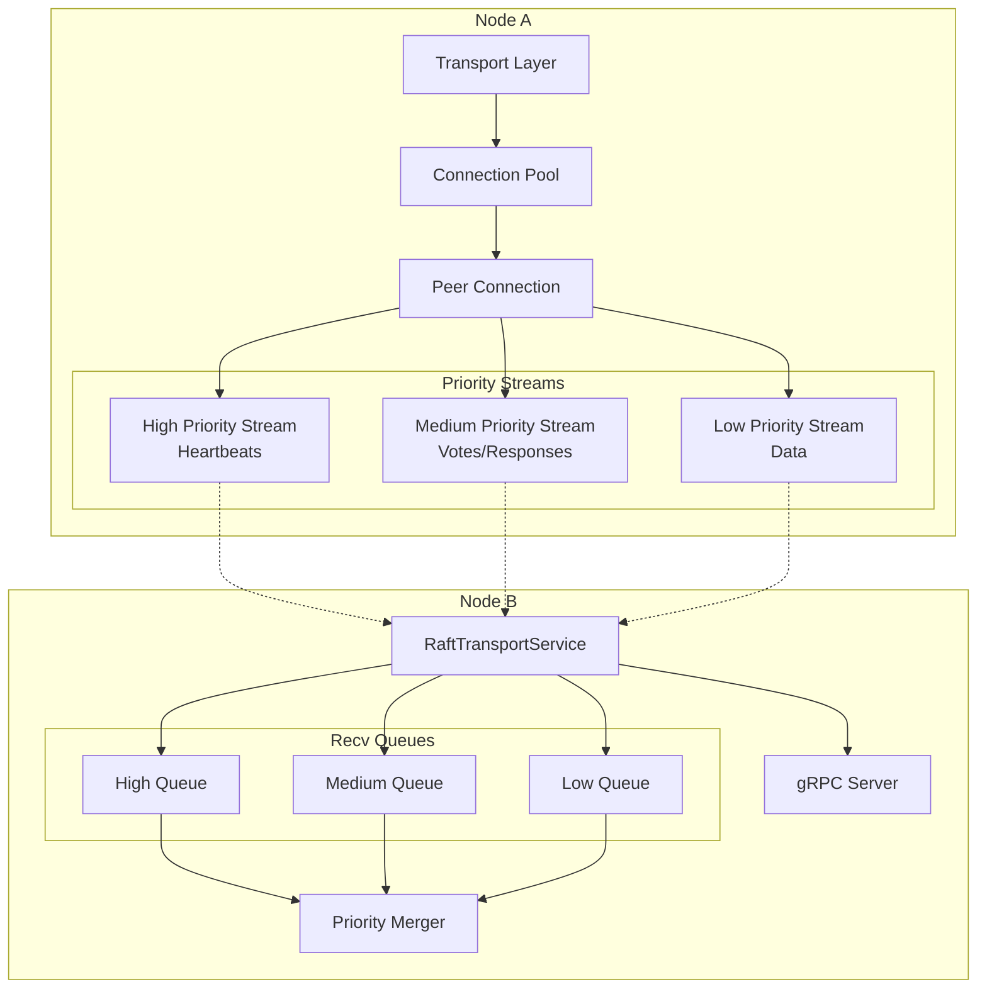
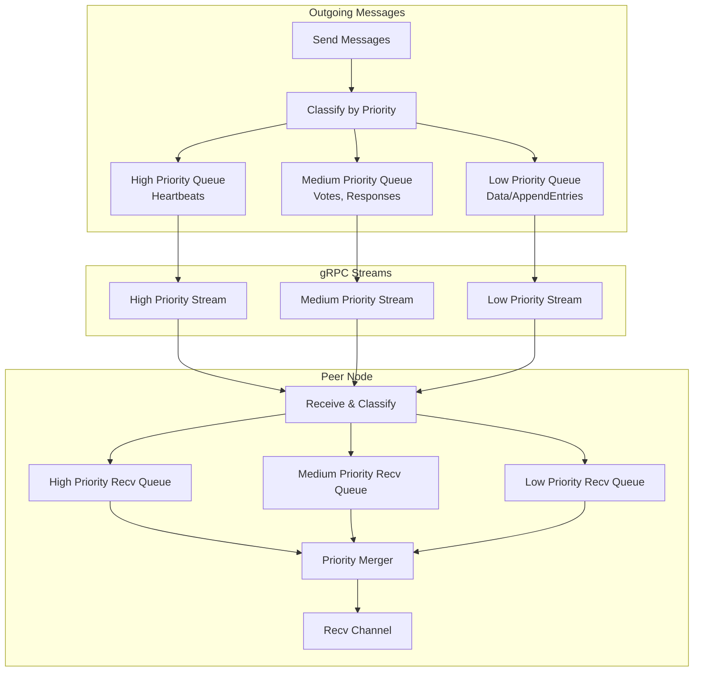
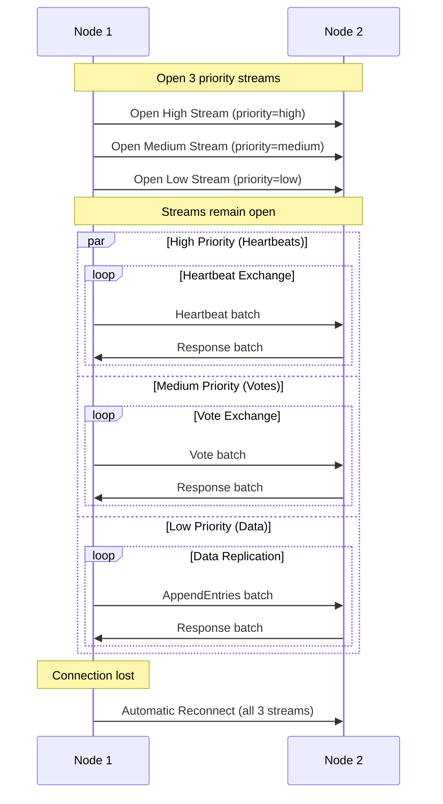
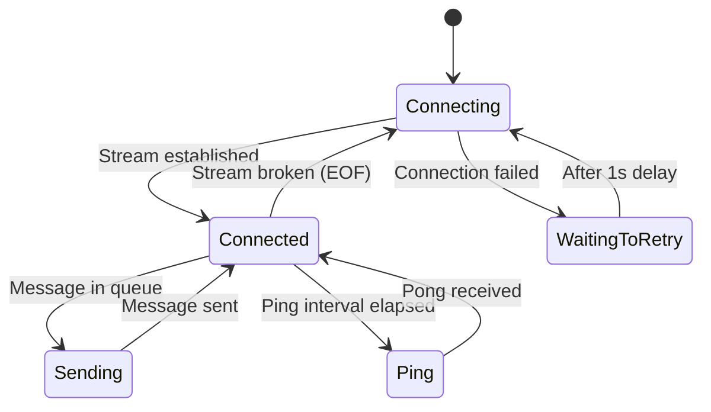
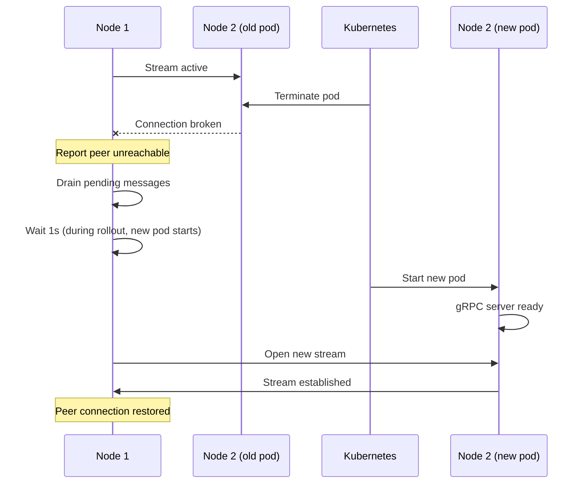

# gRPC Connection Mechanics

## Overview

The Ledger v3 POC uses gRPC for inter-node communication within the Raft cluster. This document describes the connection architecture and the measures implemented to ensure the fastest possible automatic reconnection during rolling deployments or network failures.

## Architecture



## Key Components

### Connection Pool

**File**: `internal/transport/connection_pool.go`

The connection pool manages raw gRPC connections to peers. Each connection is created lazily when needed.

```go
type ConnectionPool struct {
    peers map[uint64]string  // peer ID -> address
}
```

### Transport Layer

**File**: `internal/raft/transport.go`

The transport layer wraps the connection pool and manages Raft-specific message routing:

- **Priority Queues**: Messages are prioritized (heartbeats, votes, and append entries have different priorities)
- **Per-Peer Connections**: Each peer has 3 dedicated bidirectional streams (one per priority)
- **Unreachable Detection**: Reports unreachable peers to the Raft node
- **Message Batching**: Messages are sent in batches for improved throughput

## Message Priority System

### Overview

The transport layer implements a **3-level priority system** to ensure critical Raft messages (like heartbeats) are processed quickly, even under high load. This prevents election timeouts and maintains cluster stability.



### Priority Classification

Messages are classified based on their Raft message type:

| Priority | Level | Message Types | Purpose |
|----------|-------|---------------|---------|
| **High** | 0 | `MsgHeartbeat`, `MsgHeartbeatResp` | Leader liveness, prevent elections |
| **Medium** | 1 | `MsgVote`, `MsgVoteResp`, `MsgPreVote`, `MsgPreVoteResp`, `MsgAppResp` | Elections, replication acknowledgments |
| **Low** | 2 | All others (`MsgApp`, `MsgSnap`, etc.) | Data replication |

### gRPC Implementation

#### Three Streams Per Peer

Each peer connection maintains **3 separate gRPC bidirectional streams**, one for each priority level:

```go
// In handleConnection()
highStream, _ := client.StreamMessages(highCtx)   // priority=high in metadata
mediumStream, _ := client.StreamMessages(medCtx)  // priority=medium in metadata  
lowStream, _ := client.StreamMessages(lowCtx)     // priority=low in metadata
```

The priority is transmitted via gRPC metadata:

```go
ctx := metadata.AppendToOutgoingContext(ctx, 
    "nodeID", strconv.FormatUint(nodeID, 10),
    "priority", "high",  // or "medium", "low"
)
```

#### Why Separate Streams?

Using separate streams per priority prevents **head-of-line blocking**:

- Without separation: A large `MsgApp` (data message) could block heartbeats
- With separation: Heartbeats flow independently on their dedicated stream
- Result: Leader liveness is preserved even under high replication load

#### Message Batching

Messages are sent in batches using the `RaftRequestBatch` protobuf message:

```protobuf
message RaftRequestBatch {
  repeated RaftRequestMessage messages = 1;
}
```

This reduces network overhead by combining multiple messages into a single gRPC call.

### Internal Queue Structure

#### Sending Side (Per Peer)

Each peer connection has 3 queues for outgoing message batches:

```go
type peerConnection struct {
    highPriorityCh   Queue[[]raftpb.Message]  // Heartbeats
    mediumPriorityCh Queue[[]raftpb.Message]  // Votes, responses
    lowPriorityCh    Queue[[]raftpb.Message]  // Data messages
}
```

#### Receiving Side (Transport)

The transport has 3 queues for incoming message batches, plus a merged output queue:

```go
type DefaultTransport struct {
    // Incoming batches by priority
    highPriorityRecvCh   Queue[[]raftpb.Message]
    mediumPriorityRecvCh Queue[[]raftpb.Message]
    lowPriorityRecvCh    Queue[[]raftpb.Message]
    
    // Merged output for Recv()
    recvOut Queue[raftpb.Message]
}
```

### Priority Merger

The `mergeRecvQueues()` goroutine merges the 3 priority queues into a single output channel, respecting priority order:

```go
func (t *DefaultTransport) mergeRecvQueues() {
    for {
        // Try high priority first
        select {
        case msgs := <-t.highPriorityRecvCh.Recv():
            sendBatch(msgs)
        default:
            // Then try high or medium
            select {
            case msgs := <-t.highPriorityRecvCh.Recv():
                sendBatch(msgs)
            case msgs := <-t.mediumPriorityRecvCh.Recv():
                sendBatch(msgs)
            default:
                // Finally, try any priority (blocking)
                select {
                case msgs := <-t.highPriorityRecvCh.Recv():
                    sendBatch(msgs)
                case msgs := <-t.mediumPriorityRecvCh.Recv():
                    sendBatch(msgs)
                case msgs := <-t.lowPriorityRecvCh.Recv():
                    sendBatch(msgs)
                }
            }
        }
    }
}
```

**Algorithm**: 
1. Non-blocking check for high priority messages
2. If none, non-blocking check for high or medium
3. If none, blocking wait for any priority

This ensures high-priority messages are always processed first when available.

### Server-Side Message Classification

When the server receives a batch of messages, it groups them by priority before enqueueing:

```go
// In StreamMessages()
for _, raftMsg := range m.Raft.Messages {
    msg := unmarshal(raftMsg)
    
    switch msg.Type {
    case raftpb.MsgHeartbeat, raftpb.MsgHeartbeatResp:
        highPriorityMsgs = append(highPriorityMsgs, msg)
    case raftpb.MsgAppResp, raftpb.MsgVote, ...:
        mediumPriorityMsgs = append(mediumPriorityMsgs, msg)
    default:
        lowPriorityMsgs = append(lowPriorityMsgs, msg)
    }
}

t.pushToRecvQueue(0, highPriorityMsgs)   // high
t.pushToRecvQueue(1, mediumPriorityMsgs) // medium
t.pushToRecvQueue(2, lowPriorityMsgs)    // low
```

### Benefits of Priority System

| Benefit | Description |
|---------|-------------|
| **Cluster Stability** | Heartbeats are never delayed by large data transfers |
| **Fast Elections** | Vote messages have priority over data replication |
| **Improved Throughput** | Batching reduces per-message overhead |
| **Head-of-Line Prevention** | Separate streams prevent blocking |
| **Backpressure Handling** | Per-priority queues allow independent flow control |

## Reconnection Strategy

### Aggressive Backoff Configuration

The connection pool uses an aggressive backoff strategy optimized for fast reconnection:

```go
grpc.WithConnectParams(grpc.ConnectParams{
    Backoff: backoff.Config{
        BaseDelay:  100 * time.Millisecond,  // Start with 100ms delay
        Multiplier: 1.6,                      // Exponential multiplier
        Jitter:     0.2,                      // 20% jitter to avoid thundering herd
        MaxDelay:   time.Second,              // Never wait more than 1 second
    },
    MinConnectTimeout: time.Second,
})
```

**Critical Design Decision**: `MaxDelay` is set to 1 second, which is **less than the Raft election timeout** (default: 1 second with 10 election ticks × 100ms). This ensures that:
- Reconnection attempts happen frequently enough to restore connectivity before a new election
- The cluster remains stable during brief network interruptions

### DNS-Based Service Discovery

Connections use DNS resolution for service discovery:

```go
grpc.NewClient("dns:///"+address, ...)
```

Benefits:
- **Automatic endpoint updates**: When a pod is replaced during rollout, DNS updates propagate to all clients
- **Load balancing friendly**: Works with Kubernetes headless services

## Bidirectional Streaming

### Why Bidirectional Streaming?

Instead of unary RPC calls for each message, the transport uses bidirectional streaming (`StreamMessages`). Each peer connection maintains **3 parallel streams** (one per priority level):



Benefits:
- **Reduced latency**: No connection setup overhead per message
- **Persistent connection**: Maintains open channels for immediate message delivery
- **Bi-directional acknowledgment**: Each Raft message batch gets an explicit response
- **Priority isolation**: Heartbeats never blocked by large data transfers
- **Message batching**: Multiple messages combined in single gRPC call

### Connection State Machine

Each peer connection (`peerConnection`) runs a state loop:



## Rollout-Specific Optimizations

### Fast Reconnection During Pod Replacement

When a pod is terminated during a Kubernetes rollout:

1. **Connection Breaks**: The existing stream fails with EOF
2. **Immediate Retry**: The connection loop starts reconnecting without delay
3. **Unreachable Notification**: The Raft node is notified the peer is unreachable
4. **DNS Update**: gRPC re-resolves DNS to get the new pod IP
5. **Reconnection**: New stream established to the replacement pod
6. **Peer Signals Reconnection**: Server notifies the client via `reconnected` channel



### Reconnection Signaling

When a peer reconnects, the server-side transport signals this event:

```go
// Server-side: signal reconnection
t.logger.Infof("Peer %x connected!", peerID)
select {
case <-t.peers[peerID].reconnected:
    // Let a small delay to the send loop to detect the reconnection
case <-time.After(5 * time.Millisecond):
}
```

This allows the sending goroutine to quickly resume message delivery instead of waiting for the full retry delay.

### Message Draining During Disconnection

While disconnected, the connection loop drains pending messages:

```go
drainLoop:
for {
    select {
    case <-conn.closeCh:
        close(ch)
        return
    case <-conn.sendCh.Recv():
        // Message dropped, report peer unreachable
        conn.unreachableCh.Push(conn.peerID)
    case <-conn.reconnected:
        // Server signaled reconnection, break immediately
    case <-time.After(time.Until(waitingDelayBeforeReconnect)):
        break drainLoop
    }
}
```

This prevents message queue buildup and allows the Raft layer to handle the unreachable peer appropriately (e.g., by sending a snapshot when the peer returns).

## Health Monitoring

### Ping/Pong Mechanism

Each connection includes periodic health checks:

- **Ping interval**: Every 1 second
- **Latency tracking**: Round-trip time is recorded as a histogram metric
- **Sequence validation**: Ensures ping responses match expected sequence IDs

```go
type ping struct {
    at    time.Time
    seqId uint64
}
```

Metrics exposed:
- `raft.transport.ping.latency` (microseconds): Histogram of ping round-trip times

### Pending Response Tracking

The transport tracks pending Raft message responses:

- `raft.transport.sending.pending_response`: Counter of messages awaiting acknowledgment

This helps detect connection issues where messages are sent but responses are not received.

## Configuration Recommendations

### For Fast Rollouts

| Parameter | Value | Reason |
|-----------|-------|--------|
| `MaxDelay` (backoff) | ≤ 1 second | Must be less than election timeout |
| `MinConnectTimeout` | 1 second | Balance between fast failure detection and network delays |
| `BaseDelay` (backoff) | 100ms | Start with short delay for quick recovery |
| `Jitter` | 0.2 (20%) | Prevent thundering herd on mass reconnection |

### For Stable Clusters

- Keep election timeout at 10 ticks (1 second with 100ms tick interval)
- Ensure heartbeat interval (1 tick = 100ms) is much shorter than election timeout
- Configure Kubernetes readiness probes to avoid routing traffic to unhealthy pods

## Observability

### Metrics

The transport exposes several metrics for monitoring:

| Metric | Type | Labels | Description |
|--------|------|--------|-------------|
| `raft.transport.recv.queued` | Gauge | `priority`, `priority_name` | Message batches queued for reception per priority |
| `raft.transport.recv.merged.queued` | Gauge | - | Individual messages queued in merged output |
| `raft.transport.peer.sending.queued` | Gauge | `peer`, `priority`, `priority_name` | Message batches queued for sending per peer/priority |
| `raft.transport.ping.latency` | Histogram | `peer` | Ping round-trip time in microseconds |
| `raft.transport.sending.pending_response` | UpDownCounter | `peer` | Messages awaiting response |
| `raft.transport.unreachable.queued` | Gauge | - | Unreachable reports in queue |

**Priority Labels**:
- `priority=0, priority_name=high`: Heartbeat messages
- `priority=1, priority_name=medium`: Vote and response messages
- `priority=2, priority_name=low`: Data/append messages

### Logging

Key log messages for debugging connection issues:

| Message | Meaning |
|---------|---------|
| `Peer %x connected!` | Peer established a new stream |
| `Created stream to peer` | Outgoing stream established |
| `Failed to create stream to peer` | Connection attempt failed |
| `Peer connection broken, reconnect` | Stream EOF detected |
| `Send channel full, dropping message` | Queue overflow (indicates sustained connection issues) |

## Future Improvements

Potential enhancements under consideration:

1. **Configurable timeouts**: Expose backoff parameters as command-line flags
2. **TLS support**: Add mTLS for secure inter-node communication
3. **Connection compression**: Enable gzip compression for large messages (currently commented out)
4. **Graceful shutdown**: Implement proper GOAWAY handling for planned pod terminations

## Related Documentation

- [Architecture](./architecture.md) - Overall system architecture
- [Raft Consensus](./raft-consensus.md) - Raft protocol details
- [Deployment](./deployment.md) - Kubernetes deployment configuration
- [Metrics](./metrics.md) - Observability and monitoring
