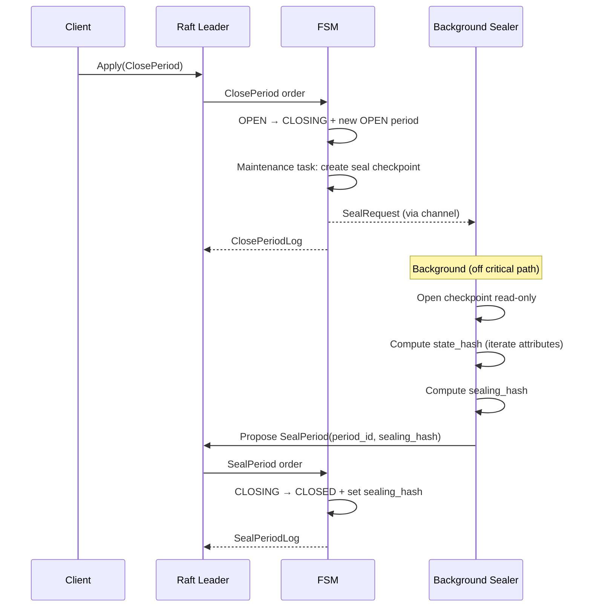

# Periods

## Overview

Periods provide a mechanism for partitioning a ledger's history into discrete, sealed segments. Each period covers a contiguous range of transactions and, once closed and sealed, produces a cryptographic hash that attests to the integrity of all data written during that period.

This is the foundation for future data retention and cold storage features (Phase 2).

## Period Lifecycle

A period transitions through three states (Phase 1):

```
OPEN  ──ClosePeriod──►  CLOSING  ──SealPeriod──►  CLOSED
```

| Status | Description |
|--------|-------------|
| `PERIOD_OPEN` | Actively accepting transactions. Exactly one open period exists at any time. |
| `PERIOD_CLOSING` | No longer accepts transactions; a background Sealer is computing the sealing hash. |
| `PERIOD_CLOSED` | Sealed with a cryptographic hash. Immutable. |
| `PERIOD_ARCHIVED` | *(Phase 2)* Data offloaded to cold storage. |

### Invariants

- Exactly **one** period is in `OPEN` state at any time.
- At most **one** period is in `CLOSING` state at any time.
- A `ClosePeriod` request is rejected if a period is already closing (`ErrPeriodAlreadyClosing`).

## Protobuf Definition

```protobuf
enum PeriodStatus {
  PERIOD_OPEN = 0;
  PERIOD_CLOSING = 1;
  PERIOD_CLOSED = 2;
  PERIOD_ARCHIVED = 3;
}

message Period {
  uint64 id = 1;
  Timestamp start = 2;
  Timestamp end = 3;
  PeriodStatus status = 4;
  uint64 close_sequence = 5;    // Global sequence at close time
  bytes sealing_hash = 6;       // Set when CLOSED
  bytes last_log_hash = 7;      // Log chain hash at close time
}
```

## Two-Step Close Process

Closing a period is split into two Raft commands to avoid blocking the consensus loop with expensive I/O (iterating the full state to compute a hash).

### Step 1: ClosePeriod (instant, on Raft critical path)

The `ClosePeriod` order is a lightweight Raft command that:

1. Transitions the current `OPEN` period to `CLOSING`, recording `close_sequence`, `end` timestamp, and `last_log_hash`.
2. Creates a new `OPEN` period (transactions continue flowing into the new period immediately).
3. Triggers a **maintenance task** that creates a Pebble seal checkpoint — a frozen snapshot of the database at the exact close boundary.
4. Sends a `SealRequest` to the background Sealer.

**File**: `internal/service/processing/processor_period.go`

### Step 2: SealPeriod (background, then Raft)

The Sealer runs outside the Raft critical path:

1. Opens the seal checkpoint as a read-only Pebble database.
2. Iterates all attribute entries in the `[0x09, 0x0A)` key range to compute a **state hash**.
3. Computes the **sealing hash** and proposes a `SealPeriod` order back into Raft.
4. The FSM transitions the period from `CLOSING` to `CLOSED` and records the sealing hash.

**File**: `internal/service/state/sealer.go`

### Sealing Hash Computation

```
state_hash   = BLAKE3(all attribute key+value pairs in the checkpoint)
sealing_hash = BLAKE3(period_id || close_sequence || last_log_hash || state_hash)
```

The state hash is deterministic because:
- Pebble iteration order is deterministic.
- Compaction is 100% deterministic via Raft (all nodes apply the same operations in the same order).

### Sequence Diagram



## Crash Recovery

Two crash windows exist between `ClosePeriod` and `SealPeriod`. Both are handled automatically on node restart.

### Window 1: Crash after ClosePeriod commit, before checkpoint creation

The node crashed after the `ClosePeriod` Pebble batch was committed but before the maintenance task created the seal checkpoint.

**Recovery** (in `NewNode()`):
- On startup, if `ClosingPeriod() != nil` and `SealCheckpointPath()` does not exist, the node creates the checkpoint from the current Pebble state.
- This works because no entries were applied after `ClosePeriod` (it was the last operation before the crash), so Pebble's state is exactly at the close boundary.

**File**: `internal/service/node/node.go` (lines 385–401)

### Window 2: Crash after checkpoint creation, before SealPeriod proposal

The seal checkpoint exists on disk but the Sealer never proposed the `SealPeriod` command.

**Recovery** (in `Sealer.Start()`):
- On startup, if a `closingPeriod` exists and the seal checkpoint is on disk, the Sealer re-sends a `SealRequest` to recompute the hash and propose `SealPeriod`.

**File**: `internal/service/state/sealer.go` (lines 57–78)

### Retry on Failure

The Sealer uses exponential backoff (100ms → 10s max) to retry on transient errors. The checkpoint remains on disk until the hash is successfully computed, ensuring no data is lost.

## Transaction Receipts (JWT)

Every transaction created during a period includes a JWT receipt that links the transaction to its period.

### Receipt Claims

```json
{
  "iss": "ledger-v3",
  "iat": 1700000000,
  "ledger": "default",
  "txId": 42,
  "postings": [
    {"source": "world", "destination": "bank:main", "amount": "10000", "asset": "USD/2"}
  ],
  "periodId": 1
}
```

- **Signing**: HMAC-SHA256 with a configurable key.
- **Verification**: The receipt can be verified independently to prove a transaction was recorded in a specific period.

**File**: `internal/service/receipt/receipt.go`

## gRPC API

| Method | Description |
|--------|-------------|
| `Apply(ClosePeriodRequest)` | Close the current open period (write, leader-only) |
| `ListPeriods(ListPeriodsRequest)` | Stream all periods (read, any node) |

### CLI Commands

```bash
# Close the current open period
ledgerctl periods close

# List all periods
ledgerctl periods list
```

## Storage

Periods are persisted in Pebble using two key prefixes:

| Prefix | Key | Value |
|--------|-----|-------|
| `0x0B` | `[keyPrefixPeriods]` | All periods as a single protobuf blob |
| `0x0C` | `[keyPrefixNextPeriodID]` | `uint64` — next period ID counter |

The seal checkpoint is stored in a `seal/` subdirectory under the data directory. It is removed after the sealing hash is computed.

```
data/
├── runtime/          # Main Pebble database
│   └── ...
└── seal/             # Temporary seal checkpoint (exists only during CLOSING)
    └── ...           # Read-only Pebble checkpoint
```

## FSM Snapshot

The period state is included in Raft snapshots:

```protobuf
message MemorySnapshot {
  // ... other fields ...
  common.Period open_period = 10;      // Current open period
  common.Period closing_period = 11;   // Period being sealed (nil when idle)
  uint64 next_period_id = 12;
}
```

## Related Documentation

- [Storage](./storage.md) — Key prefix details and Pebble persistence
- [Data Flows](./data-flows.md) — ClosePeriod and SealPeriod flow diagrams
- [Deterministic FSM](./deterministic-fsm.md) — How the FSM ensures deterministic state across nodes
