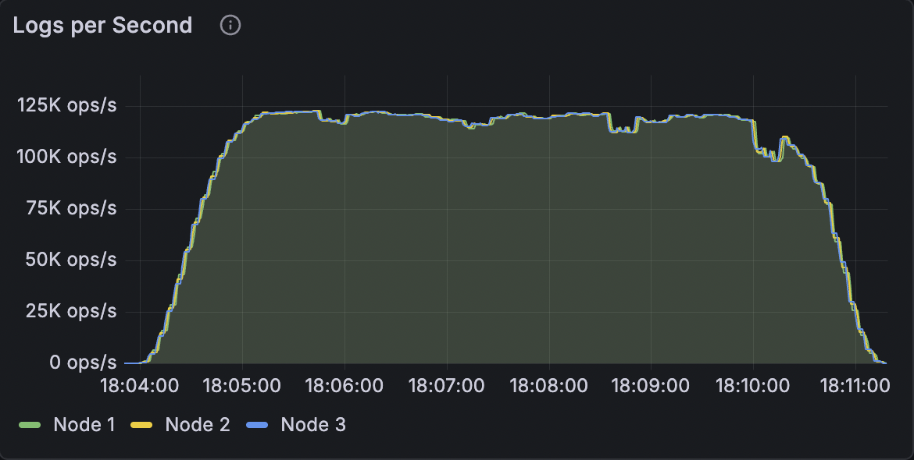
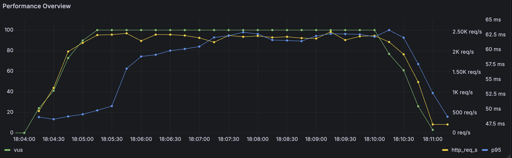
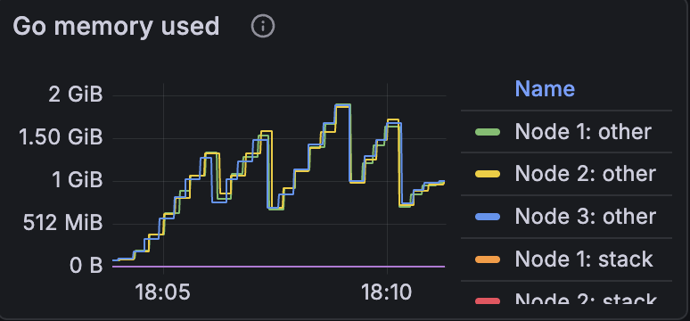

# Benchmark Report - Ledger v3 POC

**Date:** 2026-01-29  
**Environment:** Staging  
**Duration:** ~7 minutes (18:04:00 → 18:11:00 UTC)

---

## Executive Summary

| Metric | Value |
|--------|-------|
| **Total Transactions** | 44,490,000 |
| **Average Throughput** | ~106,000 tx/s |
| **Peak Throughput** | ~120,000 tx/s |
| **Cluster Size** | 3 Raft nodes |
| **Virtual Users (k6)** | 100 |
| **Storage Engine** | Pebble |

---

## Test Configuration

### Cluster

| Parameter | Value |
|-----------|-------|
| Nodes | 3 |
| Storage Engine | Pebble |

### Infrastructure (per node)

| Parameter | Value |
|-----------|-------|
| CPU | 8 cores |
| Memory | 4 GiB |
| Storage | AWS gp3 |

### k6 Load Test

| Parameter | Value |
|-----------|-------|
| Script | `any_unbounded_to_any.js` |
| Parallelism | 3 pods |
| Virtual Users | 100 |
| Stages | 1m ramp-up → 5m steady → 1m ramp-down |
| Bulk Size | 50 transactions/request |
| Atomic Mode | Enabled |

### k6 Script: `any_unbounded_to_any.js`

This script simulates transactions from variable sources to variable destinations with unbounded overdraft. Each iteration sends a bulk of 50 transactions.

```javascript
// Transaction payload (repeated 50 times per bulk request)
{
  action: 'CREATE_TRANSACTION',
  data: {
    script: {
      plain: `vars {
          account $source
          account $destination
      }
      send [USD/2 100] (
          source = $source allowing unbounded overdraft
          destination = $destination
      )`,
      vars: {
        source: 'src:<unique_id>',
        destination: 'dst:<unique_id>',
      },
    },
  },
}
```

**Key characteristics:**
- **Unbounded overdraft**: Source accounts can go negative (no balance check)
- **Unique accounts**: Each transaction uses unique source/destination pairs
- **Bulk operations**: 50 transactions per HTTP request (`BULK_SIZE=50`)
- **Atomic mode**: All transactions in a bulk succeed or fail together (`BULK_ATOMIC=true`)

---

## Results

### Throughput (Logs per Second)



- **Peak**: ~120K ops/s
- **Sustained**: ~110-115K ops/s
- **Distribution**: Identical across all 3 nodes (Raft replication)

The throughput remains stable during the steady-state phase (~5 minutes), with a gradual ramp-up (~1 min) and ramp-down (~30s).

---

### HTTP Latency (Time To First Byte)


| Percentile | Latency |
|------------|---------|
| **p50** (median) | ~38-40 ms |
| **p90** | ~48-50 ms |
| **p95** | ~60-62 ms |
| **p99** | ~72-74 ms |

Latencies remain stable and low throughout the test, indicating good load handling.

---

### HTTP Request Rate


- **Peak**: ~2,500 req/s
- **Sustained**: ~2,300-2,400 req/s

Note: Each HTTP request is a bulk operation containing multiple transactions.

---

### Performance Overview (k6)



Combined view showing:
- **VUs**: 100 virtual users (green line)
- **Request Rate**: ~2.4K req/s (yellow line)
- **p95 Latency**: ~60-65ms during steady state (blue line)

---

### CPU Utilization


| Node | Role | CPU Usage |
|------|------|-----------|
| Node 1 | Follower | ~20% |
| Node 2 | Follower | ~20% |
| Node 3 | Leader | ~30-45% |

The Raft leader consumes ~50% more CPU than followers due to proposal processing overhead.

---

### Memory Usage



- **Peak**: ~1.5-2 GiB per node
- **Pattern**: Staircase growth (batch allocations) with periodic GC visible

---

## Analysis

### Strengths

- **High Throughput**: >100K tx/s sustained on a 3-node cluster
- **Low Latencies**: p99 < 75ms even under maximum load
- **Stability**: No visible degradation during the 7-minute test
- **Balanced Distribution**: All 3 nodes process the same load (Raft replication)
- **CPU Efficiency**: <50% utilization even under maximum load

### Areas to Monitor

- **Memory Growth**: Reaches ~2 GiB - verify behavior on longer tests
- **Leader CPU Asymmetry**: 45% vs 20% - normal for Raft but worth monitoring

---

## Conclusion

The system demonstrates excellent performance with **~106K transactions/second** sustained on a 3-node Raft cluster while maintaining p99 latencies below 75ms. CPU utilization remains moderate (<50%), leaving headroom for additional load.

### Key Metrics

| Metric | Value | Assessment |
|--------|-------|------------|
| Throughput | 106K tx/s | Excellent |
| p99 Latency | <75ms | Good |
| CPU (leader) | 30-45% | Healthy |
| Memory | 1.5-2 GiB | Monitor |

---

## Appendix

### Grafana Dashboards

- [Ledger Metrics Dashboard](https://grafana-ledger-exp.staging.formance.cloud/d/69a98f8a-dee7-47a8-88e4-e0c86f3c49b9/ledger-metrics-dashboard?orgId=1&from=2026-01-29T17:03:51.404Z&to=2026-01-29T17:11:18.621Z)
- [k6 Results Dashboard](https://grafana-ledger-exp.staging.formance.cloud/d/k6-vm-otel/k6-results-victoriametrics-via-otel?orgId=1&from=2026-01-29T17:03:51.000Z&to=2026-01-29T17:11:18.000Z)
