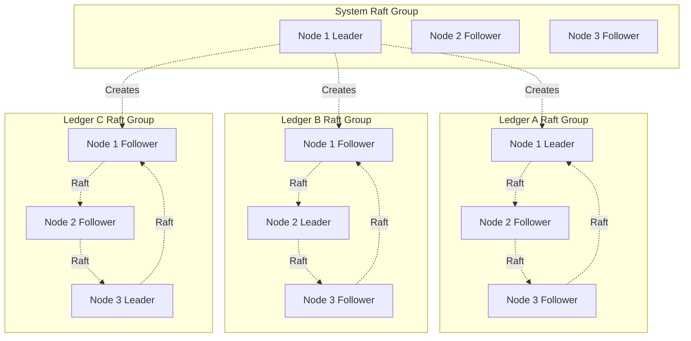
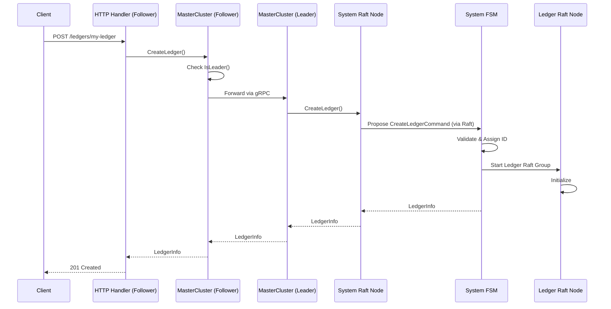
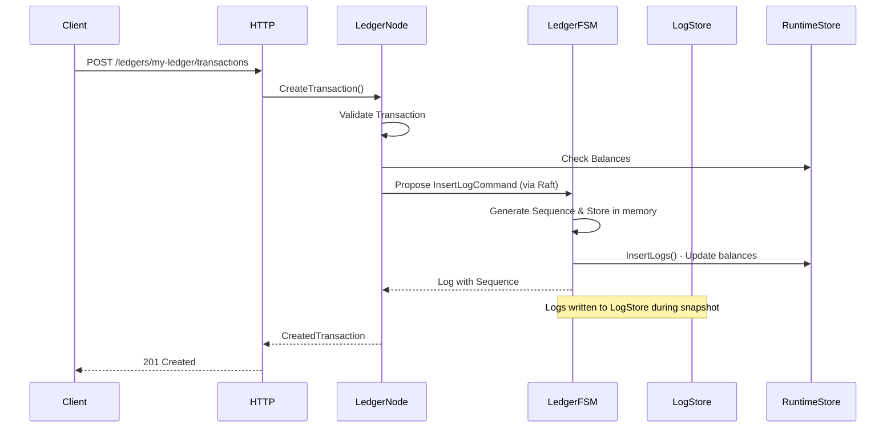
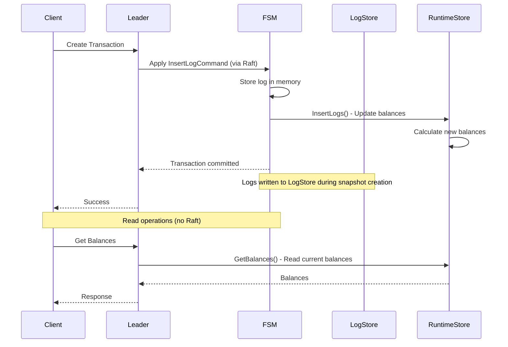

# Ledgers

## Overview

The Ledger v3 POC system uses a direct architecture where each **Ledger** has its own independent Raft group. This organization enables data isolation and horizontal scalability.

## Architecture



## Ledgers

### Concept

A **ledger** is an accounting book that:
- Has its own independent Raft group
- Can use a different storage driver (configurable)
- Contains financial transactions
- Has its own snapshot configuration
- Is completely isolated from other ledgers

### Ledger Properties

```go
type LedgerInfo struct {
    ID                uint64            // Sequential unique ID
    Name              string            // Ledger name
    Driver            string            // Storage driver
    Config            json.RawMessage   // Driver configuration
    Metadata          metadata.Metadata // Ledger metadata
    CreatedAt         time.Time         // Creation date
    SnapshotThreshold *uint64           // Snapshot threshold (optional)
}
```

### Ledger Creation

Ledger creation is a distributed operation that goes through the system Raft group:

1. Client sends a `POST /ledgers/{name}` request
2. Node checks if it is the leader of the system group
3. If not leader, the request is forwarded to the leader
4. Leader proposes a `CreateLedgerCommand` to the system Raft group
5. Command is replicated to all nodes
6. Once committed, the system FSM:
   - Assigns a sequential ID to the ledger
   - Validates the driver configuration
   - Starts a new Raft group for the ledger
   - Stores ledger metadata



### Storage Drivers

The system supports configurable storage drivers. Currently, SQLite is available:

#### SQLite

- **Usage**: Development and small deployments
- **Configuration**: Empty (auto-generated DSN)
- **Advantages**: Simple, no external dependencies
- **Limitations**: No high concurrency, single writer

### Per-Ledger Snapshot Configuration

Each ledger can have its own snapshot threshold:

- If `SnapshotThreshold` is defined, it is used for this ledger
- Otherwise, the global configuration is used
- Allows optimizing snapshots according to each ledger's needs

## Transactions

### Concept

A **transaction** represents an accounting operation with:
- **Postings** (accounting entries): source, destination, amount, asset
- Or a **Numscript script**: complex business logic
- **Metadata**: additional information
- A **reference**: optional external identifier
- An **idempotency key**: to avoid duplicates

### Transaction Structure

```go
type Transaction struct {
    ID        uint64            // Global sequential ID
    Postings  []Posting         // Accounting entries
    Timestamp time.Time         // Timestamp
    Reference string            // External reference
    Metadata  metadata.Metadata // Metadata
}

type Posting struct {
    Source      string   // Source account
    Destination string   // Destination account
    Amount      *big.Int // Amount (big integer)
    Asset       string   // Asset identifier
}
```

### Transaction Creation

The transaction creation process:

1. Client sends a `POST /ledgers/{name}/transactions` request
2. System identifies the ledger and its Raft group
3. Node checks if it is the leader of the ledger's Raft group
4. Ledger service validates the transaction:
   - Checks postings (balance, asset, etc.)
   - Checks idempotency key
   - Executes script if present
5. An `InsertLogCommand` is proposed to the ledger's Raft group
6. Ledger FSM:
   - Generates a global sequence number
   - Stores the log in the LogStore
   - Returns the result



### Logs and Sequence

Each transaction is stored as a **log** with:

- **Sequence**: Global unique sequence number in the ledger
- **Type**: Log type (transaction, metadata, etc.)
- **Data**: Serialized transaction data
- **IdempotencyKey**: Optional idempotency key
- **IdempotencyHash**: Hash of inputs for idempotency verification

Sequences are generated sequentially by the ledger FSM, ensuring global transaction order within each ledger.

## Storage Architecture: LogStore vs RuntimeStore

The ledger system uses two distinct storage components, each serving different purposes within the Raft consensus flow:

### LogStore

**Purpose**: Persistent storage of transaction logs (the immutable history of all transactions)

**Responsibilities**:
- Stores all transaction logs with their sequence numbers
- Maintains idempotency key indexes
- Provides log streaming capabilities (`GetAllLogs`)
- Acts as the source of truth for transaction history

**Usage in Raft**:
- **During writes**: When transactions are committed through Raft, logs are temporarily stored in memory in the FSM
- **During snapshots**: Logs accumulated in memory are written in batch to the LogStore when a snapshot is created
- **During reads**: Logs can be read directly from LogStore without going through Raft (local reads)
- **During recovery**: Logs are replayed from LogStore to rebuild state

**Key characteristics**:
- Immutable: Logs are never modified, only appended
- Sequential: Logs are stored with sequential IDs
- Persistent: All logs are durably stored on disk
- Batched writes: Logs are written in batches during snapshot creation, not immediately after each transaction

**When Logs Are Written to LogStore**:

Logs are **not** written to the LogStore immediately when transactions are committed. Instead, they follow a batched write pattern:

1. **During transaction commit**: When a transaction is committed through Raft:
   - The log is stored **in memory** in the FSM (`f.logs` slice)
   - The RuntimeStore is updated immediately to reflect new balances
   - The log remains in memory, not yet persisted to LogStore

2. **During snapshot creation**: When a snapshot is triggered (based on `SnapshotThreshold`):
   - All logs accumulated in memory are written **in batch** to the LogStore via `logWriter.InsertLogs()`
   - This batch write is atomic and efficient
   - After successful write, logs are cleared from memory (`f.logs = f.logs[len(logs):]`)

**Benefits of this approach**:
- **Performance**: Batch writes are more efficient than individual writes
- **Consistency**: Logs are written atomically during snapshots
- **Memory efficiency**: Logs are cleared from memory after being persisted
- **Recovery**: Snapshots + logs after snapshot provide complete recovery capability

**Important**: While logs are in memory (between commits and snapshots), they are still available for reading through the FSM's in-memory state. However, for durability and recovery, they must be persisted to LogStore during snapshots.

### RuntimeStore

**Purpose**: Runtime data access for balances and account metadata (derived state)

**Responsibilities**:
- Stores account balances (calculated from transactions)
- Stores account metadata
- Maintains idempotency key lookups
- Provides fast read access to current state

**Usage in Raft**:
- **During writes**: When logs are applied by the FSM, `RuntimeStore.InsertLogs()` is called to update balances and metadata
- **During reads**: Balances and metadata are read directly from RuntimeStore (local reads, no Raft consensus needed)
- **During recovery**: Balances are recalculated by replaying logs from LogStore

**Key characteristics**:
- Derived state: Balances are computed from transaction logs
- Mutable: Balances are updated as transactions are processed
- Optimized for queries: Fast lookups without scanning all logs

### How They Work Together



**Write Flow**:
1. Transaction is proposed to Raft leader
2. Once committed, FSM applies the command
3. FSM writes the log to **LogStore** (persistent history)
4. FSM calls `RuntimeStore.InsertLogs()` to update **RuntimeStore** (current balances)
5. Both stores are updated atomically within the same transaction

**Read Flow**:
1. Client requests balances
2. Node reads directly from **RuntimeStore** (no Raft consensus needed)
3. Since RuntimeStore is updated during writes, it always reflects the latest committed state

**Recovery Flow**:
1. On startup, FSM loads the last snapshot
2. FSM replays logs from **LogStore** starting after the snapshot
3. For each log, FSM calls `RuntimeStore.InsertLogs()` to rebuild balances
4. RuntimeStore is fully synchronized with LogStore

### Why Two Stores?

- **Separation of concerns**: Transaction history (LogStore) vs. current state (RuntimeStore)
- **Performance**: Reading balances from RuntimeStore is much faster than scanning all logs
- **Scalability**: LogStore can grow indefinitely while RuntimeStore stays compact
- **Update timing**: RuntimeStore is updated immediately when entries are applied, while LogStore is filled in batches during snapshot creation

**Note**: To keep RuntimeStore compact and efficient, balances should be set to zero whenever possible. Zero balances can be omitted from storage, reducing the size of the RuntimeStore and improving query performance.

## Data Isolation

### Isolation Between Ledgers

- Each ledger has its own Raft group
- Data is stored separately (each ledger has its own LogStore)
- A problem in one ledger does not affect others
- Snapshots are created per ledger
- Each ledger can use a different storage driver

## Metadata Management

### Ledger Metadata

Ledger metadata is stored in the system FSM and can be:
- Added during creation
- Modified via the API
- Deleted via the API

### Transaction Metadata

Transaction metadata is stored in the log and can be:
- Added during transaction creation
- Modified via the API
- Deleted via the API

### Account Metadata

Account metadata is stored separately and can be:
- Added during transaction creation
- Modified via the API
- Deleted via the API

## Idempotence

### Idempotency Key

The system supports idempotency keys to avoid duplicate transactions:

- The key is provided in the `Idempotency-Key` header
- If a transaction with the same key already exists, it is returned without creating a new transaction
- Verification is done at the ledger FSM level

### FSM Management

The ledger FSM maintains an index of idempotency keys:
- Stored in memory for optimal performance
- Persisted in snapshots
- Restored during recovery

## Performance and Optimizations

### Local Reads

Reads can be served locally without going through Raft:
- `GetLedger`: Local read (system FSM)
- `GetAllLedgers`: Local read (system FSM)
- `GetBalances`: Local read from RuntimeStore
- `GetAllLogs`: Local read from LogStore

### Writes via Leader

All writes must go through the leader:
- `CreateLedger`: System group leader
- `CreateTransaction`: Ledger group leader
- `SaveMetadata`: Ledger group leader

### Batching

Transactions can be batched to improve throughput:
- `/_bulk` API to send multiple operations
- Parallel processing possible
- Optional atomicity

## Next Steps

To deepen your understanding:

1. [API and Interfaces](./api.md) - API documentation for ledgers
2. [Storage and Persistence](./storage.md) - How data is stored
3. [Data Flows](./data-flows.md) - Detailed operation flows
