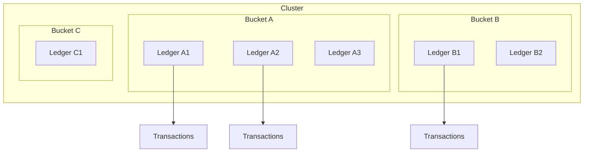
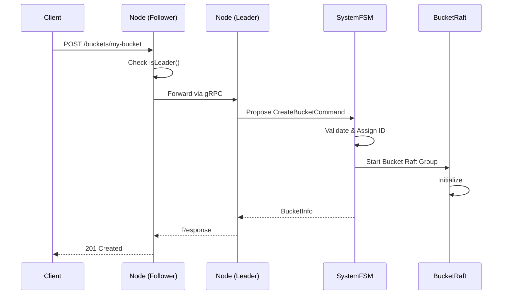
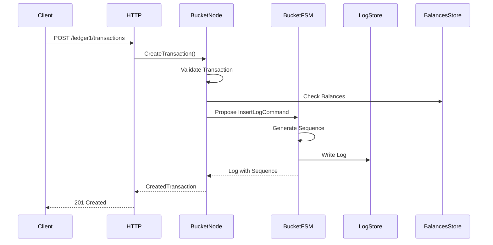

# Buckets and Ledgers

## Overview

The Ledger v3 POC system organizes data in a two-level hierarchy: **Buckets** (containers) and **Ledgers** (accounting books). This organization enables data isolation and horizontal scalability.

## Hierarchical Architecture



## Buckets

### Concept

A **bucket** is an isolated container that:
- Has its own independent Raft group
- Can use a different storage driver (SQLite, PostgreSQL)
- Contains one or more ledgers
- Has its own snapshot configuration

### Bucket Properties

```go
type BucketInfo struct {
    ID                uint64          // Sequential unique ID
    Name              string          // Bucket name
    Driver            string          // Storage driver (sqlite, postgres)
    Config            json.RawMessage // Driver configuration
    CreatedAt         time.Time       // Creation date
    SnapshotThreshold uint64          // Snapshot threshold (optional)
}
```

### Bucket Creation

Bucket creation is a distributed operation that goes through the system Raft group:

1. Client sends a `POST /buckets/{name}` request
2. Node checks if it is the leader of the system group
3. If not leader, the request is forwarded to the leader
4. Leader proposes a `CreateBucketCommand` to the system Raft group
5. Command is replicated to all nodes
6. Once committed, the system FSM:
   - Assigns a sequential ID to the bucket
   - Validates the driver configuration
   - Starts a new Raft group for the bucket
   - Stores bucket metadata



### Storage Drivers

The system supports multiple storage drivers:

#### SQLite

- **Usage**: Development and small deployments
- **Configuration**: Empty (auto-generated DSN)
- **Advantages**: Simple, no external dependencies
- **Limitations**: No high concurrency, single writer

#### PostgreSQL

- **Usage**: Production, high availability
- **Configuration**: Connection DSN
- **Advantages**: Scalable, ACID transactions, native replication
- **Limitations**: Requires external PostgreSQL server

### Per-Bucket Snapshot Configuration

Each bucket can have its own snapshot threshold:

- If `SnapshotThreshold` is defined, it is used for this bucket
- Otherwise, the global configuration is used
- Allows optimizing snapshots according to each bucket's needs

## Ledgers

### Concept

A **ledger** is an accounting book that:
- Belongs to a specific bucket
- Contains financial transactions
- Has a unique ID within its bucket
- Can have associated metadata

### Ledger Properties

```go
type LedgerInfo struct {
    ID        uint64            // Sequential ID in the bucket
    Name      string            // Ledger name
    Bucket    string            // Parent bucket name
    Metadata  metadata.Metadata // Ledger metadata
    CreatedAt time.Time         // Creation date
    LastLogID *uint64           // Last log ID (optional)
}
```

### Ledger Creation

Ledger creation is managed by the bucket's Raft group:

1. Client sends a `POST /ledgers/{name}` request with the bucket
2. System identifies the bucket and its Raft group
3. Node checks if it is the leader of the bucket's Raft group
4. If not leader, the request is forwarded to the bucket leader
5. Leader proposes a `CreateLedgerCommand`
6. Bucket FSM:
   - Checks that the ledger doesn't already exist
   - Assigns a sequential ID
   - Stores ledger metadata

## Transactions

### Concept

A **transaction** represents an accounting operation with:
- **Postings** (accounting entries): source, destination, amount, asset
- Or a **Numscript script**: complex business logic
- **Metadata**: additional information
- A **reference**: optional external identifier
- An **idempotency key**: to avoid duplicates

### Structure d'une Transaction

```go
type Transaction struct {
    ID        uint64            // Global sequential ID
    Postings  []Posting         // Accounting entries
    Timestamp time.Time         // Timestamp
    Reference string            // External reference
    Metadata  metadata.Metadata // Metadata
}

type Posting struct {
    Source      string   // Source account
    Destination string   // Destination account
    Amount      *big.Int // Amount (big integer)
    Asset       string   // Asset identifier
}
```

### Transaction Creation

The transaction creation process:

1. Client sends a `POST /{ledger}/transactions` request
2. System identifies the bucket containing the ledger
3. Node checks if it is the leader of the bucket's Raft group
4. Ledger service validates the transaction:
   - Checks postings (balance, asset, etc.)
   - Checks idempotency key
   - Executes script if present
5. An `InsertLogCommand` is proposed to the bucket's Raft group
6. Bucket FSM:
   - Generates a global sequence number
   - Stores the log in the LogStore
   - Returns the result



### Logs et Séquence

Each transaction is stored as a **log** with:

- **Sequence**: Global unique sequence number in the bucket
- **Ledger**: Ledger name
- **Type**: Log type (transaction, metadata, etc.)
- **Data**: Serialized transaction data

Sequences are generated sequentially by the bucket FSM, ensuring global transaction order.

## Data Isolation

### Isolation Between Buckets

- Each bucket has its own Raft group
- Data is stored separately
- A problem in one bucket does not affect others
- Snapshots are created per bucket

### Isolation Between Ledgers

- Ledgers in the same bucket share the same LogStore
- Transactions are identified by their ledger
- Balances are calculated per ledger
- Metadata is isolated per ledger

## Metadata Management

### Ledger Metadata

Ledger metadata is stored in the bucket FSM and can be:
- Added during creation
- Modified via the API
- Deleted via the API

### Transaction Metadata

Transaction metadata is stored in the log and can be:
- Added during transaction creation
- Modified via the API
- Deleted via the API

### Account Metadata

Account metadata is stored separately and can be:
- Added during transaction creation
- Modified via the API
- Deleted via the API

## Idempotence

### Idempotency Key

The system supports idempotency keys to avoid duplicate transactions:

- The key is provided in the `Idempotency-Key` header
- If a transaction with the same key already exists, it is returned without creating a new transaction
- Verification is done at the bucket FSM level

### FSM Management

The bucket FSM maintains an index of idempotency keys:
- Stored in memory for optimal performance
- Persisted in snapshots
- Restored during recovery

## Performance and Optimizations

### Local Reads

Reads can be served locally without going through Raft:
- `GetLedger`: Local read
- `GetLedgers`: Local read
- `ListBuckets`: Local read (system FSM)

### Writes via Leader

All writes must go through the leader:
- `CreateBucket`: System group leader
- `CreateLedger`: Bucket group leader
- `CreateTransaction`: Bucket group leader

### Batching

Transactions can be batched to improve throughput:
- `/_bulk` API to send multiple operations
- Parallel processing possible
- Optional atomicity

## Next Steps

To deepen your understanding:

1. [API and Interfaces](./api.md) - API documentation for buckets and ledgers
2. [Storage and Persistence](./storage.md) - How data is stored
3. [Data Flows](./data-flows.md) - Detailed operation flows

