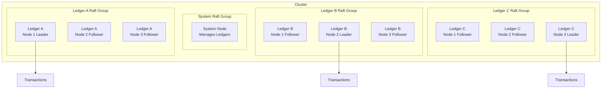
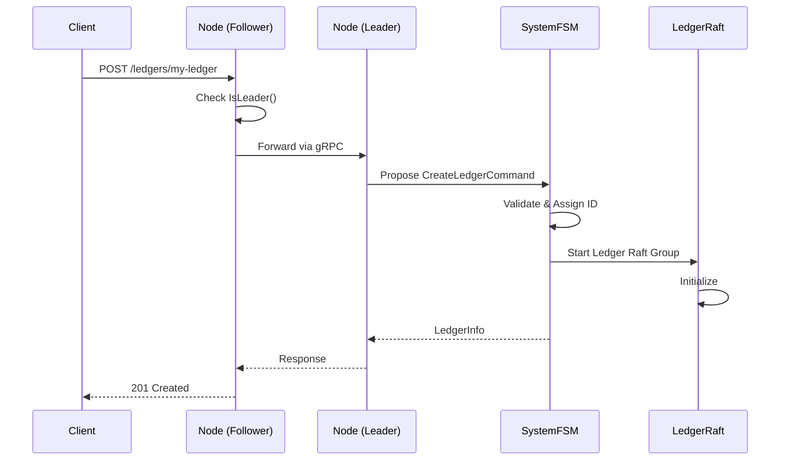
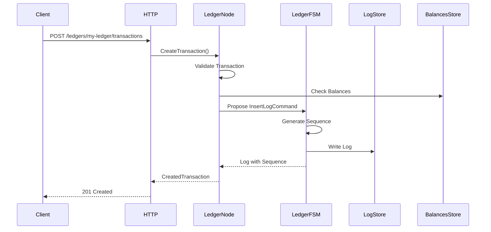

# Ledgers

## Overview

The Ledger v3 POC system uses a simplified architecture where each **Ledger** has its own independent Raft group. This organization enables data isolation and horizontal scalability without the intermediate "bucket" abstraction.

## Architecture



## Ledgers

### Concept

A **ledger** is an accounting book that:
- Has its own independent Raft group
- Can use a different storage driver (SQLite, ClickHouse)
- Contains financial transactions
- Has its own snapshot configuration
- Is completely isolated from other ledgers

### Ledger Properties

```go
type LedgerInfo struct {
    ID                uint64            // Sequential unique ID
    Name              string            // Ledger name
    Driver            string            // Storage driver (sqlite, clickhouse)
    Config            json.RawMessage   // Driver configuration
    Metadata          metadata.Metadata // Ledger metadata
    CreatedAt         time.Time         // Creation date
    SnapshotThreshold *uint64           // Snapshot threshold (optional)
}
```

### Ledger Creation

Ledger creation is a distributed operation that goes through the system Raft group:

1. Client sends a `POST /ledgers/{name}` request
2. Node checks if it is the leader of the system group
3. If not leader, the request is forwarded to the leader
4. Leader proposes a `CreateLedgerCommand` to the system Raft group
5. Command is replicated to all nodes
6. Once committed, the system FSM:
   - Assigns a sequential ID to the ledger
   - Validates the driver configuration
   - Starts a new Raft group for the ledger
   - Stores ledger metadata



### Storage Drivers

The system supports multiple storage drivers:

#### SQLite

- **Usage**: Development and small deployments
- **Configuration**: Empty (auto-generated DSN)
- **Advantages**: Simple, no external dependencies
- **Limitations**: No high concurrency, single writer

#### ClickHouse

- **Usage**: Production deployments requiring high throughput
- **Configuration**: DSN connection string
- **Advantages**: High performance, scalable
- **Limitations**: Requires external ClickHouse cluster

### Per-Ledger Snapshot Configuration

Each ledger can have its own snapshot threshold:

- If `SnapshotThreshold` is defined, it is used for this ledger
- Otherwise, the global configuration is used
- Allows optimizing snapshots according to each ledger's needs

## Transactions

### Concept

A **transaction** represents an accounting operation with:
- **Postings** (accounting entries): source, destination, amount, asset
- Or a **Numscript script**: complex business logic
- **Metadata**: additional information
- A **reference**: optional external identifier
- An **idempotency key**: to avoid duplicates

### Transaction Structure

```go
type Transaction struct {
    ID        uint64            // Global sequential ID
    Postings  []Posting         // Accounting entries
    Timestamp time.Time         // Timestamp
    Reference string            // External reference
    Metadata  metadata.Metadata // Metadata
}

type Posting struct {
    Source      string   // Source account
    Destination string   // Destination account
    Amount      *big.Int // Amount (big integer)
    Asset       string   // Asset identifier
}
```

### Transaction Creation

The transaction creation process:

1. Client sends a `POST /ledgers/{name}/transactions` request
2. System identifies the ledger and its Raft group
3. Node checks if it is the leader of the ledger's Raft group
4. Ledger service validates the transaction:
   - Checks postings (balance, asset, etc.)
   - Checks idempotency key
   - Executes script if present
5. An `InsertLogCommand` is proposed to the ledger's Raft group
6. Ledger FSM:
   - Generates a global sequence number
   - Stores the log in the LogStore
   - Returns the result



### Logs and Sequence

Each transaction is stored as a **log** with:

- **Sequence**: Global unique sequence number in the ledger
- **Type**: Log type (transaction, metadata, etc.)
- **Data**: Serialized transaction data
- **IdempotencyKey**: Optional idempotency key
- **IdempotencyHash**: Hash of inputs for idempotency verification

Sequences are generated sequentially by the ledger FSM, ensuring global transaction order within each ledger.

## Data Isolation

### Isolation Between Ledgers

- Each ledger has its own Raft group
- Data is stored separately (each ledger has its own LogStore)
- A problem in one ledger does not affect others
- Snapshots are created per ledger
- Each ledger can use a different storage driver

## Metadata Management

### Ledger Metadata

Ledger metadata is stored in the system FSM and can be:
- Added during creation
- Modified via the API
- Deleted via the API

### Transaction Metadata

Transaction metadata is stored in the log and can be:
- Added during transaction creation
- Modified via the API
- Deleted via the API

### Account Metadata

Account metadata is stored separately and can be:
- Added during transaction creation
- Modified via the API
- Deleted via the API

## Idempotence

### Idempotency Key

The system supports idempotency keys to avoid duplicate transactions:

- The key is provided in the `Idempotency-Key` header
- If a transaction with the same key already exists, it is returned without creating a new transaction
- Verification is done at the ledger FSM level

### FSM Management

The ledger FSM maintains an index of idempotency keys:
- Stored in memory for optimal performance
- Persisted in snapshots
- Restored during recovery

## Performance and Optimizations

### Local Reads

Reads can be served locally without going through Raft:
- `GetLedger`: Local read
- `GetAllLedgers`: Local read (system FSM)
- `GetBalances`: Local read from LogStore

### Writes via Leader

All writes must go through the leader:
- `CreateLedger`: System group leader
- `CreateTransaction`: Ledger group leader
- `SaveMetadata`: Ledger group leader

### Batching

Transactions can be batched to improve throughput:
- `/_bulk` API to send multiple operations
- Parallel processing possible
- Optional atomicity

## Next Steps

To deepen your understanding:

1. [API and Interfaces](./api.md) - API documentation for ledgers
2. [Storage and Persistence](./storage.md) - How data is stored
3. [Data Flows](./data-flows.md) - Detailed operation flows
