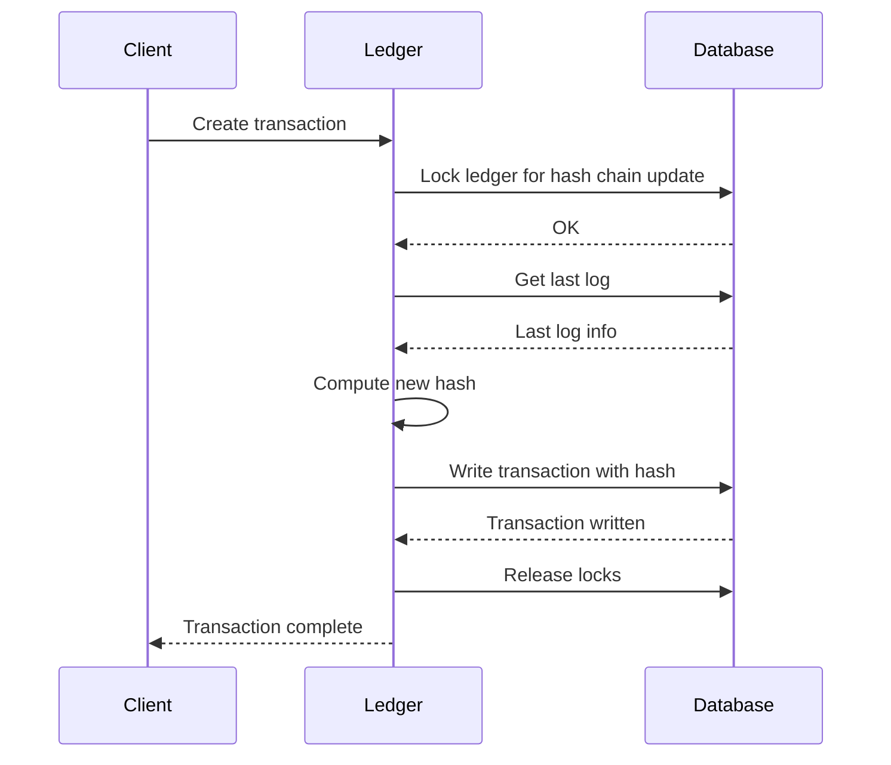
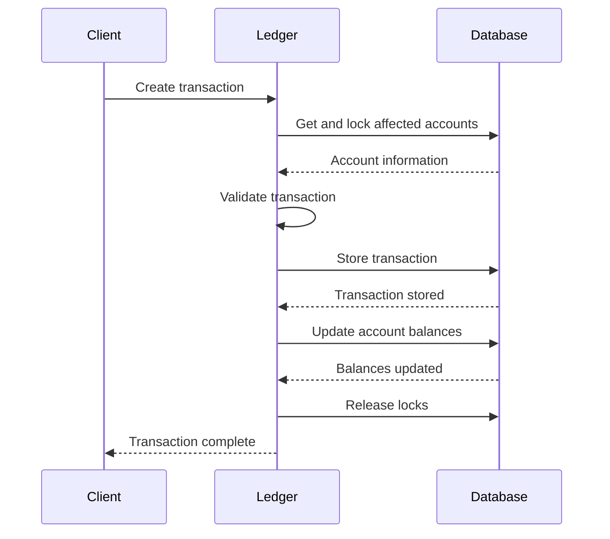

# Ledger Concurrency Model

## Introduction

The Formance Ledger is designed to handle multiple operations happening at the same time while ensuring data consistency and integrity. This document explains the principles behind how Formance Ledger manages concurrent operations, providing both reliable transaction processing and high performance.

## Core Principles

### Transaction Isolation

When multiple users or systems interact with the ledger simultaneously, their operations need to be isolated from each other to prevent inconsistencies. Formance Ledger uses database transaction isolation to ensure that:

- Operations are processed in a consistent manner
- No data corruption occurs when simultaneous changes are attempted
- The final state of the ledger is predictable and accurate

### Locking Strategies

To prevent conflicts when multiple operations attempt to modify the same data, the ledger implements various locking strategies:

- **Account Locking**: When a transaction affects specific accounts, those accounts are temporarily locked until the operation completes
- **Optimistic Locking**: In some scenarios, the system assumes conflicts are rare and verifies this assumption before committing changes
- **Advisory Locking**: For ledger-wide operations that require strict ordering, special locks ensure operations happen in the correct sequence

## Feature-Specific Behaviors

### Hashed Logs

When the ledger is configured to maintain a cryptographic audit trail (with the `HASH_LOGS` feature), special consideration is given to maintaining the integrity of this chain:

### Balance Tracking

When tracking account balances, the ledger ensures that operations affecting the same accounts don't interfere with each other:

- Multiple transactions can process simultaneously as long as they affect different accounts
- When transactions affect the same accounts, they are processed in sequence
- This approach maximizes throughput while maintaining data consistency

### Ledger Import

When importing data into a ledger, stronger isolation is used to ensure the entire import happens as a single atomic operation:

- The ledger ensures no other operations can modify the data during import
- If other operations attempt to run during import, they will wait until the import completes
- This approach ensures the imported data remains consistent

## Transaction Flow

The standard transaction process follows this pattern:

## High Concurrency Handling

Formance Ledger is designed to handle high volumes of concurrent transactions through:

1. **Minimal Locking**: Only locking what's necessary when it's necessary
2. **Efficient Processing**: Optimizing the transaction pathway for performance
3. **Smart Retries**: Automatically retrying operations that encounter temporary conflicts

## Performance Considerations

Different ledger features have different performance implications under high concurrency:

- **HASH_LOGS**: Provides a verifiable audit trail at the cost of some write performance
- **MOVES_HISTORY_POST_COMMIT_EFFECTIVE_VOLUMES**: Improves read performance for historical balances with modest impact on write performance

## What This Means For You

Formance Ledger's concurrency model provides these benefits:

- **Reliability**: Your ledger data remains consistent even under high load
- **Performance**: Multiple operations can proceed simultaneously when it's safe to do so
- **Scalability**: The system efficiently handles increasing transaction volumes
- **Flexibility**: Configure features to balance performance and functionality for your specific needs

By understanding these principles, you can effectively plan your integration with Formance Ledger and maximize its performance for your particular use case. 