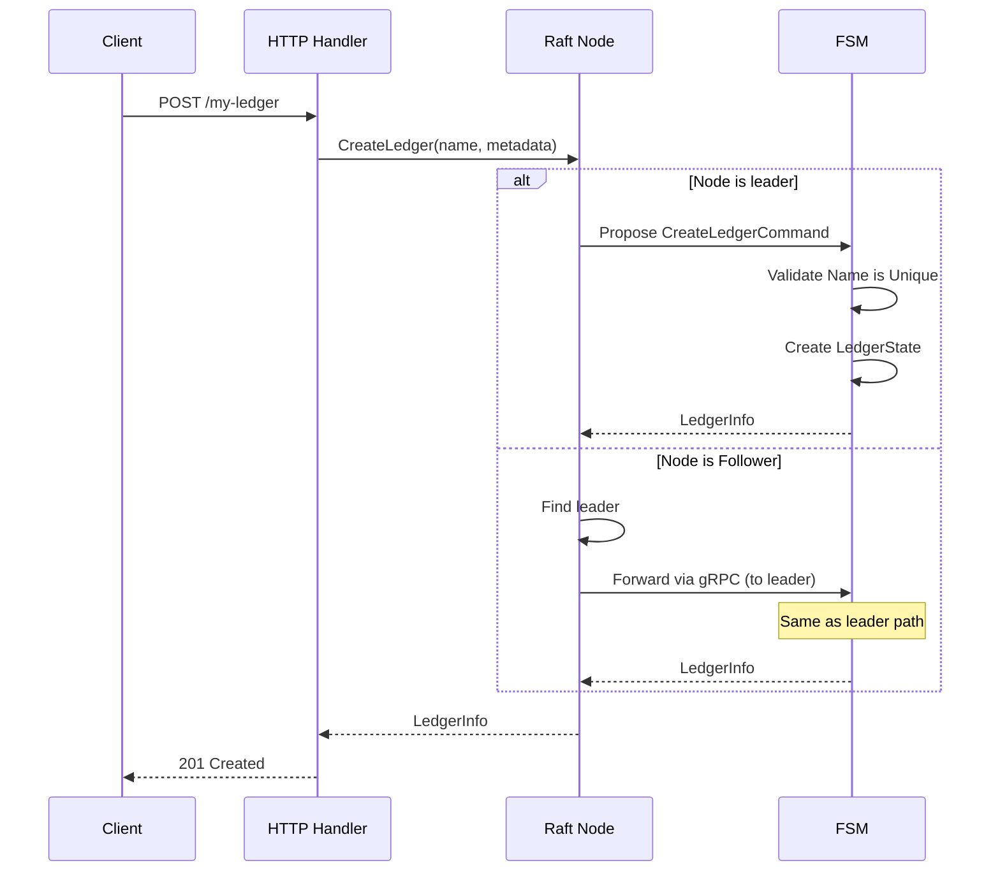
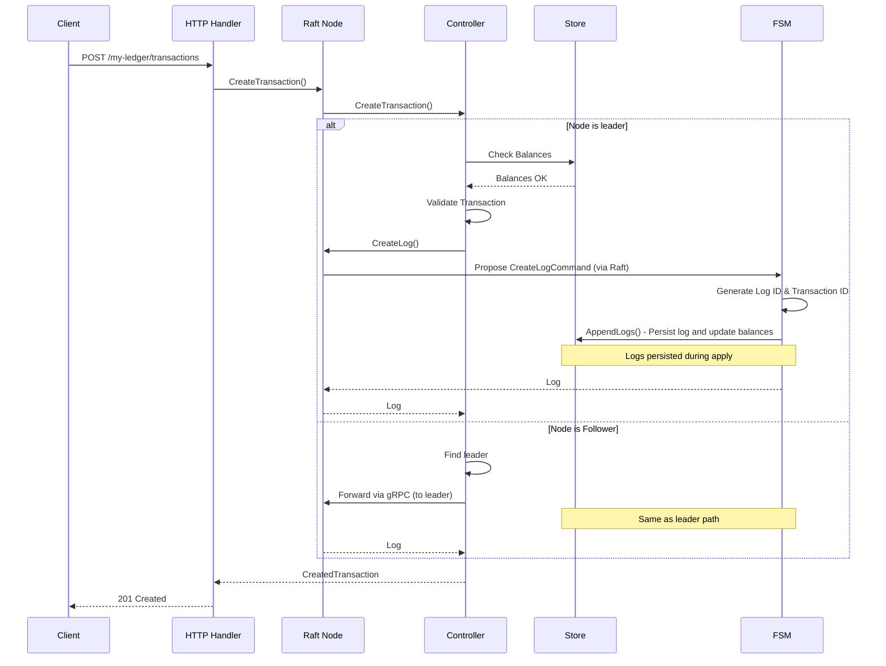
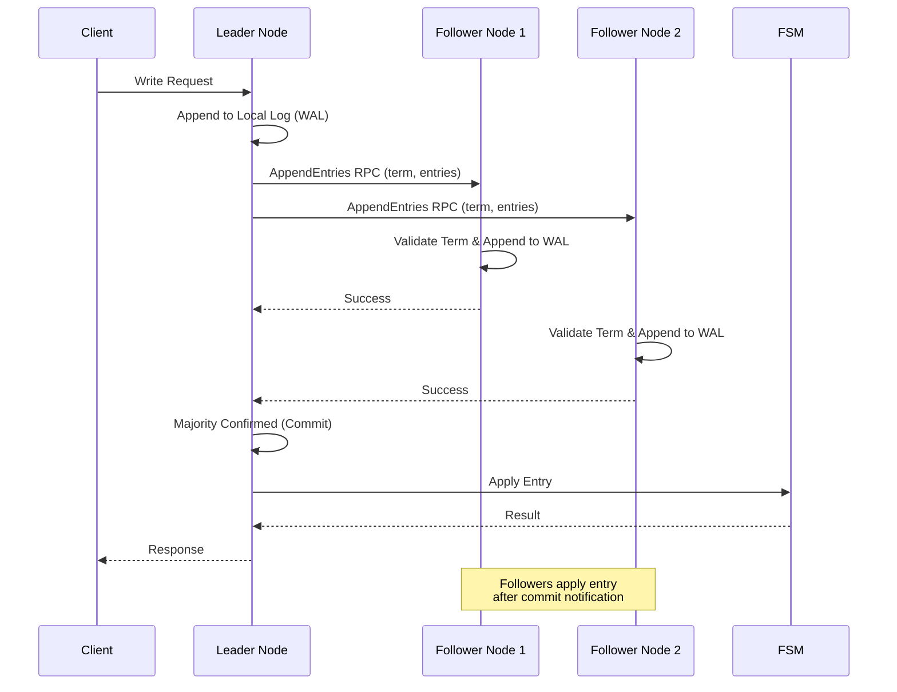
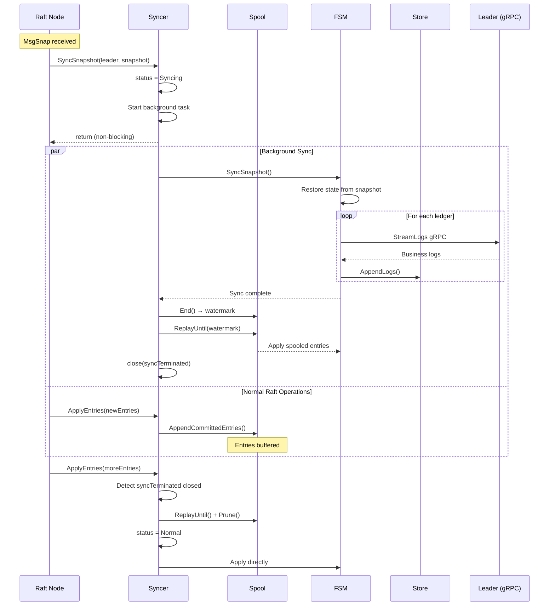
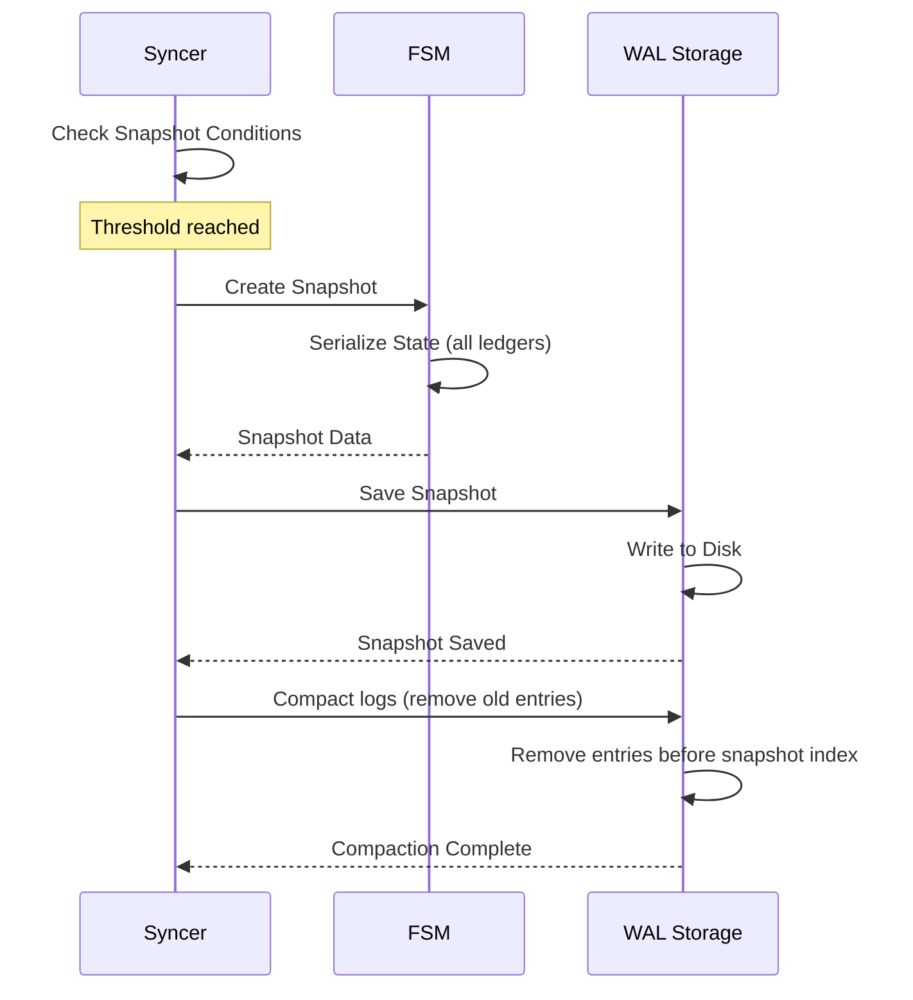
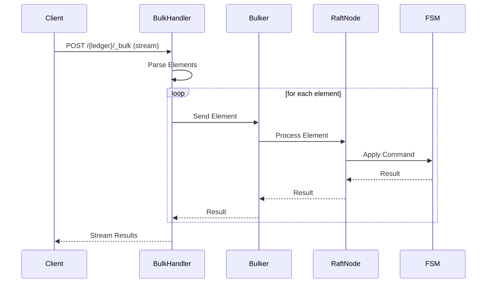

# Data Flows

This document describes in detail the data flows for the main system operations.

## Ledger Creation

### Overview

Ledger creation is a distributed operation that goes through the single Raft group.

### Complete Flow



### Detailed Steps

1. **HTTP Request Reception**
   - The HTTP handler receives `POST /{ledgerName}`
   - Validates the body (metadata)
   - Calls `raftNode.CreateLedger()`

2. **Leader Verification**
   - The Raft node checks if it is the leader
   - If not leader, identifies the leader and forwards the request

3. **Command Proposal**
   - The leader creates a `CreateLedgerCommand`
   - The command is proposed to the Raft group
   - The command is replicated to all followers

4. **FSM Application**
   - The FSM receives the committed command
   - Validates the ledger name is unique
   - Creates a new LedgerState with initial sequence numbers

5. **Persistence**
   - The ledger state is stored in the FSM's in-memory map
   - A snapshot can be created if necessary

## Transaction Creation

### Overview

Transaction creation goes through the single Raft group.

### Complete Flow



### Detailed Steps

1. **Ledger Verification**
   - The system checks the ledger exists in the FSM state
   - Retrieves the ledger's current state

2. **Transaction Validation**
   - Validates postings (valid accounts, positive amounts)
   - Checks balances (if necessary) from Store
   - Verifies the idempotency key
   - Executes script if present

3. **Command Proposal**
   - Creates a `CreateLogCommand` with the transaction data
   - Proposes to the Raft group
   - Replicates to all nodes in the group

4. **FSM Application**
   - The FSM generates the next log ID and transaction ID for this ledger
   - The log is written to the Store
   - Balances are updated

5. **Response Return**
   - The created transaction is returned to the client
   - Includes transaction ID, timestamp, etc.

## Raft Replication

### Overview

All writes are replicated via the Raft protocol to guarantee consistency.

### Replication Flow



### Detailed Steps

1. **Command Reception**
   - The leader receives a write command
   - The command is serialized to protobuf
   - A Raft entry is created

2. **Append to Local Log**
   - The entry is added to the leader's local log
   - The entry is written to the WAL
   - The WAL is synchronized on disk

3. **Replication to Followers**
   - The leader sends `AppendEntries` to all followers
   - Each follower validates the term
   - Each follower appends the entry to its local log

4. **Commit**
   - When a majority confirms, the leader commits the entry
   - The entry is marked as committed
   - The commit index is updated

5. **Application**
   - Committed entries are applied to the FSM
   - The FSM processes the command and updates the state
   - The result is returned to the client

## Follower Synchronization

### Overview

When a follower joins the cluster or recovers after a failure, it must synchronize with the leader. This process involves two levels of synchronization:
1. **Raft log synchronization** via the Spool (committed but not yet applied entries)
2. **Business log synchronization** via gRPC streaming (per-ledger transaction logs)

> **🔗 Raft Mechanics**: The synchronization is triggered when the Raft leader detects that a follower is too far behind (entries have been compacted from the WAL). The leader then sends a **MsgSnap** message containing the FSM snapshot. See [Desynchronized Follower Detection](./raft-consensus.md#desynchronized-follower-detection) for details on how Raft detects and handles this scenario.

### Syncer State Machine

The **Syncer** component manages the synchronization process. It has two states:

| State | Value | Description |
|-------|-------|-------------|
| `syncerStatusNormal` | 0 | Normal operation, entries applied directly to FSM |
| `syncerStatusSyncing` | 1 | Synchronization in progress, entries spooled |

#### Synchronization Trigger

When a `MsgSnap` is received from the leader, the following sequence occurs:

```
┌─────────────────────────────────────────────────────────────────────────┐
│                    SyncSnapshot() called                                 │
├─────────────────────────────────────────────────────────────────────────┤
│                                                                          │
│  1. Status change: Normal → Syncing                                     │
│     └── status.Swap(syncerStatusSyncing)                                │
│                                                                          │
│  2. If already syncing: interrupt previous sync                         │
│     └── taskExecutor.interrupt()                                        │
│                                                                          │
│  3. Create termination channel                                          │
│     └── syncTerminated = make(chan struct{})                            │
│                                                                          │
│  4. Start background goroutine (taskExecutor.run)                       │
│     ┌──────────────────────────────────────────────────────────────┐    │
│     │  Background task:                                            │    │
│     │  a. fsm.SyncSnapshot() - restore FSM + sync business logs    │    │
│     │  b. spool.End() - get current watermark                      │    │
│     │  c. spool.ReplayUntil() - apply spooled entries              │    │
│     │  d. close(syncTerminated) - signal completion                │    │
│     └──────────────────────────────────────────────────────────────┘    │
│                                                                          │
│  5. Return immediately (non-blocking)                                   │
│                                                                          │
└─────────────────────────────────────────────────────────────────────────┘
```

#### Entry Processing During Sync

While synchronization is in progress (`status == syncerStatusSyncing`), the `ApplyEntries()` method behaves differently:

```go
// In syncer.ApplyEntries():
switch s.status.Load() {
case syncerStatusNormal:
    // Normal: apply directly to FSM
    return s.applyEntries(ctx, confState, entries...)
    
case syncerStatusSyncing:
    // Syncing: spool entries for later
    s.spool.AppendCommittedEntries(ctx, entries...)
    return emptyResults, nil
}
```

This ensures that new Raft entries committed during synchronization are not lost—they are buffered in the Spool.

#### Sync Completion

When the background sync completes:

1. The `syncTerminated` channel is closed
2. On the next `ApplyEntries()` call, the syncer detects completion:
   ```go
   select {
   case <-s.syncTerminated:
       // Replay any remaining spooled entries
       s.spool.ReplayUntil(ctx, position, lastAppliedIndex, applyFn)
       // Prune applied entries
       s.spool.Prune(lastAppliedIndex)
       // Return to normal mode
       s.status.Store(syncerStatusNormal)
   default:
       // Still syncing, continue spooling
   }
   ```

#### Complete Timeline



### The Spool

The **Spool** is a temporary buffer that stores committed Raft entries that haven't been applied to the FSM yet. It acts as a staging area between Raft consensus and FSM application.

#### Purpose

1. **Decoupling**: Separates the Raft commit path from the FSM apply path
2. **Durability**: Ensures committed entries survive crashes before FSM application
3. **Bounded replay**: On recovery, only entries in the Spool need to be replayed. Note that for long-running clusters, old WAL entries are compacted (deleted after snapshots), making full WAL replay impossible anyway.
4. **Efficient catch-up**: Followers can catch up from a known watermark position

#### How It Works

```
┌─────────────────────────────────────────────────────────────────────┐
│                          Raft Node                                   │
├─────────────────────────────────────────────────────────────────────┤
│                                                                      │
│  ┌──────────┐    commit    ┌──────────┐    apply    ┌──────────┐   │
│  │   WAL    │ ──────────► │  Spool   │ ──────────► │   FSM    │   │
│  └──────────┘             └──────────┘             └──────────┘   │
│                                 │                                   │
│                           End() returns                             │
│                           watermark position                        │
│                                                                      │
└─────────────────────────────────────────────────────────────────────┘
```

1. **Append**: When Raft commits entries, they are appended to the Spool via `AppendCommittedEntries()`
2. **Watermark**: `End()` returns the current position (segment ID + offset) for replay bounds
3. **Replay**: `ReplayUntil()` replays entries from the cached read position to the watermark
4. **Prune**: Old segments are pruned when all entries have been applied

For detailed implementation, see [Spool Technical Documentation](./spool.md).

### Synchronization Flow

```mermaid
sequenceDiagram
    participant Follower as Follower Node
    participant Spool as Spool
    participant Leader as Leader Node
    participant Storage as WAL Storage
    participant Store as Store
    participant FSM as FSM
    
    Follower->>Follower: Start/Recover
    Follower->>Storage: Load Snapshot
    Storage-->>Follower: Snapshot Data
    Follower->>FSM: Restore FSM State
    
    Note over Follower,Spool: Replay Spool entries (committed but not applied)
    Follower->>Spool: ReplayUntil(end, lastApplied)
    Spool-->>FSM: Apply pending entries
    
    loop For each ledger with missing logs
        Follower->>Leader: StreamLogs gRPC (ledger, from, to)
        Leader->>Store: GetAllLogs(ledger, from, to)
        Store-->>Leader: Stream Logs
        Leader-->>Follower: Stream Logs (gRPC stream)
        
        loop for each log
            Follower->>Store: AppendLogs() - Persist log and update balances
        end
    end
    
    Follower->>Follower: Catch Up Complete
    Note over Follower,Leader: Follower ready for replication
```



### Detailed Steps

1. **Snapshot Loading**
   - The follower loads the most recent snapshot
   - The FSM state is restored from the snapshot
   - The last applied log ID for each ledger is noted

2. **Spool Replay**
   - The Spool is replayed from the last known position
   - Only entries with `Index > lastApplied` are applied
   - The read cache advances, avoiding re-parsing on subsequent calls

3. **Log Streaming**
   - For each ledger with missing logs (based on LastAppliedLogId)
   - The follower requests logs from the leader via gRPC
   - The leader streams logs from its Store

4. **Log Application**
   - Each log is inserted into the follower's Store
   - Balances and metadata are updated
   - The state is progressively updated

5. **Catch-up Complete**
   - Once all logs are applied, the follower is up to date
   - The follower can now participate in replication
   - The follower votes during elections

## Snapshot Creation

### Overview

Snapshots are created periodically to compact logs and accelerate recovery.

### Creation Flow



### Creation Conditions

1. **Log Threshold**
   - If `SnapshotThreshold` logs have been created since the last snapshot
   - Configurable globally via command line flags

### Snapshot Contents

- **Metadata**: index, term, timestamp
- **FSM State**: Complete state for all ledgers
- **Index**: Index of the last included entry

## WAL Compaction

### Overview

WAL compaction is a critical mechanism that removes old log entries to prevent unbounded storage growth. It is tightly coupled with snapshots.

### How Compaction Works

```
Before Compaction:
┌─────────────────────────────────────────────────────────────────────┐
│ WAL: [Entry 1] [Entry 2] ... [Entry 1000] [Entry 1001] ... [Entry N]│
│                              ↑                                       │
│                     Snapshot at index 1000                          │
└─────────────────────────────────────────────────────────────────────┘

After Compaction:
┌─────────────────────────────────────────────────────────────────────┐
│ WAL: [Entry 1001] [Entry 1002] ... [Entry N]                        │
│      ↑                                                               │
│      First entry after snapshot                                      │
└─────────────────────────────────────────────────────────────────────┘
```

### Compaction Trigger

Compaction is triggered automatically after a snapshot is created:

1. A snapshot is created at index `N`
2. The system keeps a **compaction margin** (configurable via `CompactionMargin`)
3. Entries before `N - CompactionMargin` are deleted from the WAL
4. Old WAL segment files are removed

### Compaction Margin

The compaction margin (`CompactionMargin` in configuration) determines how many entries are kept before the snapshot index:

```
snapshotIndex = 1000
compactionMargin = 100
compactIndex = 1000 - 100 = 900

→ Entries 1-900 are deleted
→ Entries 901-1000 are kept (margin for safety)
→ Entries 1001+ are the new entries
```

**Why keep a margin?**
- Allows followers slightly behind to catch up without needing a full snapshot transfer
- Provides a safety buffer in case of partial replication failures

### Implications for Recovery

Because old WAL entries are compacted:

1. **A node cannot recover from the beginning of time** - it must use snapshots
2. **Late-joining nodes** receive the latest snapshot + recent WAL entries
3. **Very late followers** (behind the compaction point) must receive a full snapshot from the leader

### Configuration

```yaml
config:
  raft:
    snapshotThreshold: 5000   # Create snapshot every 5000 entries
    compactionMargin: 500     # Keep 500 entries before snapshot as margin
```

**Recommendations**:
- `compactionMargin` should be at least 1-2× the typical replication lag
- Larger margins use more disk but allow slower followers to catch up
- Smaller margins save disk but may force more snapshot transfers

## Request Forwarding

### Overview

When a follower receives a write request, it forwards it to the leader.

### Forwarding Flow


### Error Handling

If the leader is not available:

1. The follower detects `GetLeader() == 0`
2. An `ErrNoLeader` error is returned
3. The HTTP handler returns `503 Service Unavailable`
4. The header `Retry-After: 1` is added
5. The client SDK retries automatically

## Bulk Operations

### Overview

Bulk operations allow sending multiple operations in a single request.

### Bulk Flow



### Bulk Options

- **continueOnFailure**: Continue even if an operation fails
- **atomic**: All operations or nothing
- **parallel**: Execute in parallel (not compatible with atomic)

## Next Steps

To deepen your understanding:

1. [Raft Consensus](./raft-consensus.md) - Details on Raft replication
2. [Storage and Persistence](./storage.md) - How data is persisted
3. [API and Interfaces](./api.md) - API endpoint documentation
4. [Spool](./spool.md) - Technical details of the Spool component