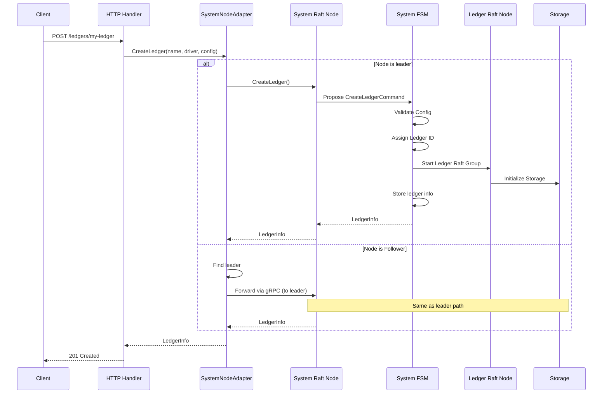
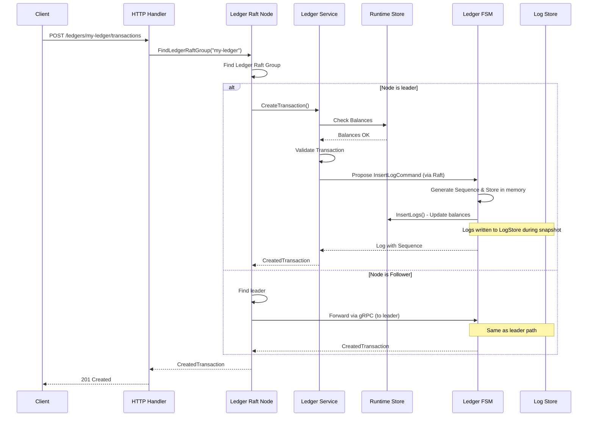
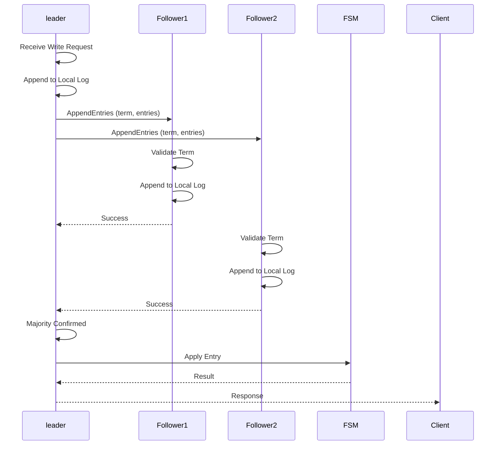
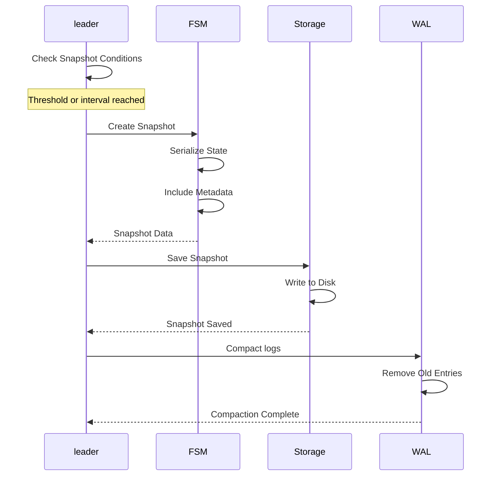
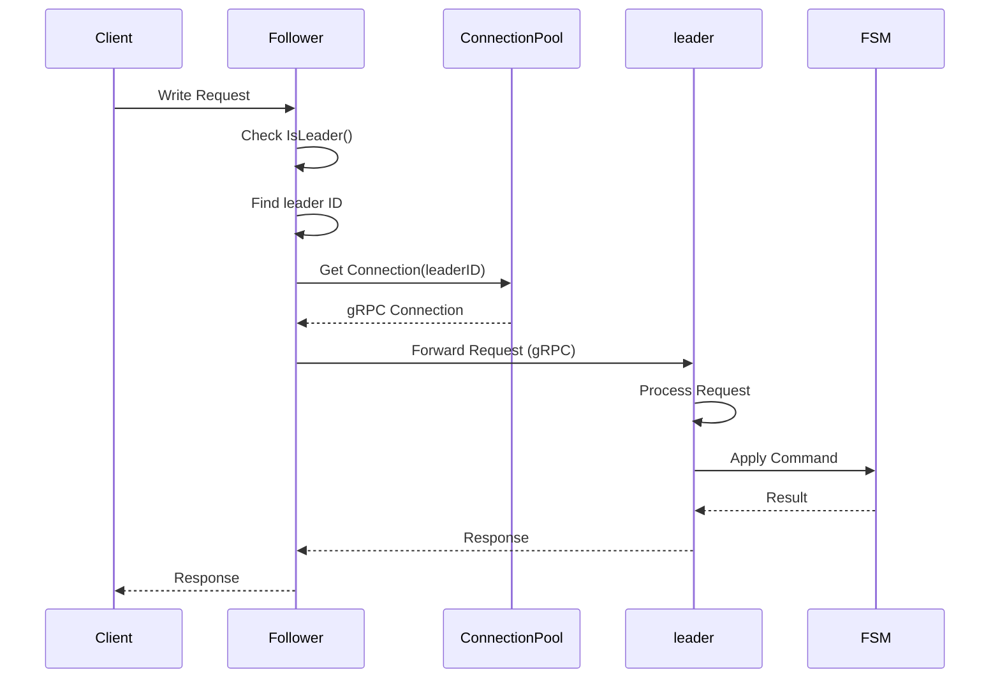
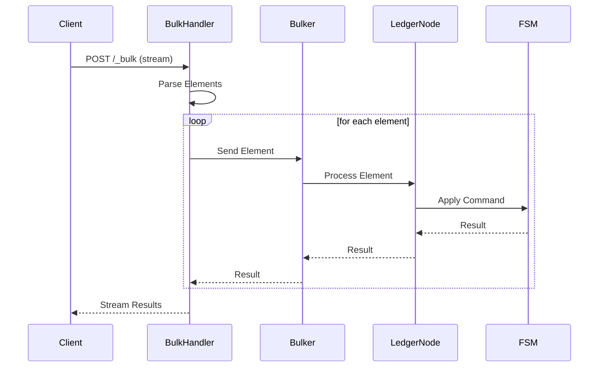

# Data Flows

This document describes in detail the data flows for the main system operations.

## Ledger Creation

### Overview

Ledger creation is a distributed operation that goes through the system Raft group.

### Complete Flow

### Detailed Steps

1. **HTTP Request Reception**
   - The HTTP handler receives `POST /ledgers/{name}`
   - Validates the body (driver, config)
   - Calls `cluster.CreateLedger()`

2. **Leader Verification**
   - The `SystemNodeAdapter` checks if the node is the leader
   - If not leader, identifies the leader and forwards the request

3. **Command Proposal**
   - The leader creates a `CreateLedgerCommand`
   - The command is proposed to the System Raft group
   - The command is replicated to all followers

4. **FSM Application**
   - The System FSM receives the committed command
   - Validates the driver configuration
   - Assigns a sequential ID to the ledger
   - Creates the ledger info

5. **Starting the Ledger Raft Group**
   - The FSM starts a new Raft group for the ledger
   - Initializes storage (WAL, logstore)
   - The Raft group joins the cluster

6. **Persistence**
   - The ledger metadata is stored in the System FSM
   - A snapshot can be created if necessary

## Transaction Creation

### Overview

Transaction creation goes through the ledger's Raft group.

### Complete Flow

### Detailed Steps

1. **Ledger Identification**
   - The system identifies the ledger and its Raft group
   - Retrieves the ledger's Raft group

2. **Transaction Validation**
   - Validates postings (valid accounts, positive amounts)
   - Checks balances (if necessary)
   - Verifies the idempotency key
   - Executes script if present

3. **Command Proposal**
   - Creates an `InsertLogCommand` with the transaction
   - Proposes to the ledger's Raft group
   - Replicates to all nodes in the group

4. **FSM Application**
   - The ledger FSM generates a sequence number
   - The log is written to the LogStore
   - Balances are updated

5. **Response Return**
   - The created transaction is returned to the client
   - Includes transaction ID, timestamp, etc.

## Raft Replication

### Overview

All writes are replicated via the Raft protocol to guarantee consistency.

### Replication Flow

### Detailed Steps

1. **Command Reception**
   - The leader receives a write command
   - The command is serialized to protobuf
   - A Raft entry is created

2. **Append to Local Log**
   - The entry is added to the leader's local log
   - The entry is written to the WAL
   - The WAL is synchronized on disk

3. **Replication to Followers**
   - The leader sends `AppendEntries` to all followers
   - Each follower validates the term
   - Each follower appends the entry to its local log

4. **Commit**
   - When a majority confirms, the leader commits the entry
   - The entry is marked as committed
   - The commit index is updated

5. **Application**
   - Committed entries are applied to the FSM
   - The FSM processes the command and updates the state
   - The result is returned to the client

## Follower Synchronization

### Overview

When a follower joins the cluster or recovers after a failure, it must synchronize with the leader.

### Synchronization Flow

### Detailed Steps

1. **Snapshot Loading**
   - The follower loads the most recent snapshot
   - The FSM state is restored from the snapshot
   - The last snapshot index is noted

2. **Log Request**
   - The follower requests logs from the snapshot index
   - The leader checks log availability
   - The leader sends missing logs

3. **Log Application**
   - Each log is appended to the local log
   - Each log is applied to the FSM
   - The state is progressively updated

4. **Catch-up Complete**
   - Once all logs are applied, the follower is up to date
   - The follower can now participate in replication
   - The follower votes during elections

## Snapshot Creation

### Overview

Snapshots are created periodically to compact logs and accelerate recovery.

### Creation Flow

### Creation Conditions

1. **Log Threshold**
   - If `SnapshotThreshold` logs have been created since the last snapshot
   - Configurable per ledger or globally

2. **Minimum Interval**
   - If `SnapshotInterval` has elapsed since the last snapshot
   - Prevents creating too many snapshots

### Snapshot Contents

- **Metadata**: index, term, timestamp
- **FSM State**: Complete FSM data
- **Index**: Index of the last included entry

## Request Forwarding

### Overview

When a follower receives a write request, it forwards it to the leader.

### Forwarding Flow

### Error Handling

If the leader is not available:

1. The follower detects `GetLeader() == 0`
2. An `ErrNoLeader` error is returned
3. The HTTP handler returns `503 Service Unavailable`
4. The header `Retry-After: 1` is added
5. The client SDK retries automatically

## Bulk Operations

### Overview

Bulk operations allow sending multiple operations in a single request.

### Bulk Flow

### Bulk Options

- **continueOnFailure**: Continue even if an operation fails
- **atomic**: All operations or nothing
- **parallel**: Execute in parallel (not compatible with atomic)

## Next Steps

To deepen your understanding:

1. [Raft Consensus](./raft-consensus.md) - Details on Raft replication
2. [Storage and Persistence](./storage.md) - How data is persisted
3. [API and Interfaces](./api.md) - API endpoint documentation
