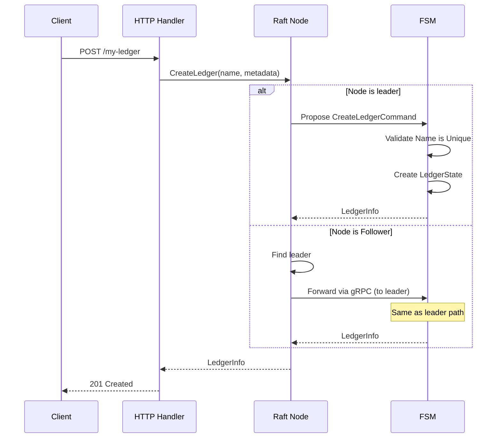
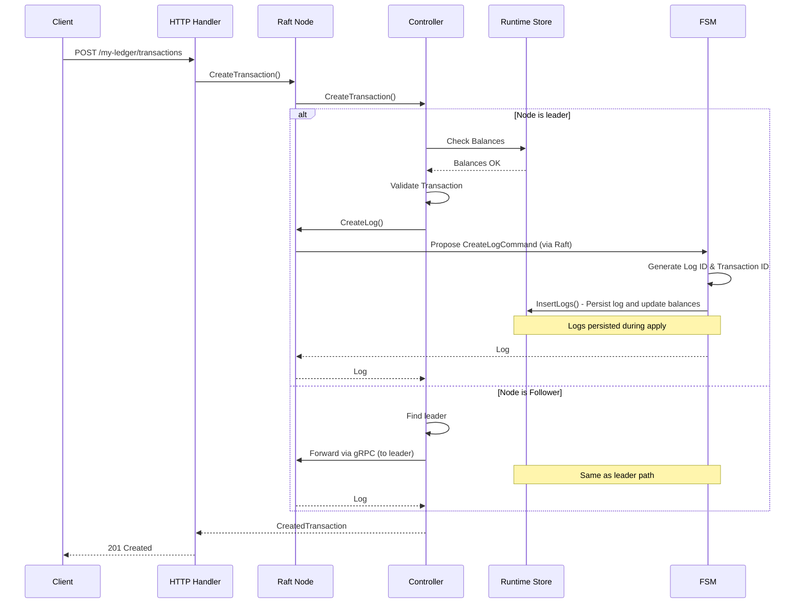
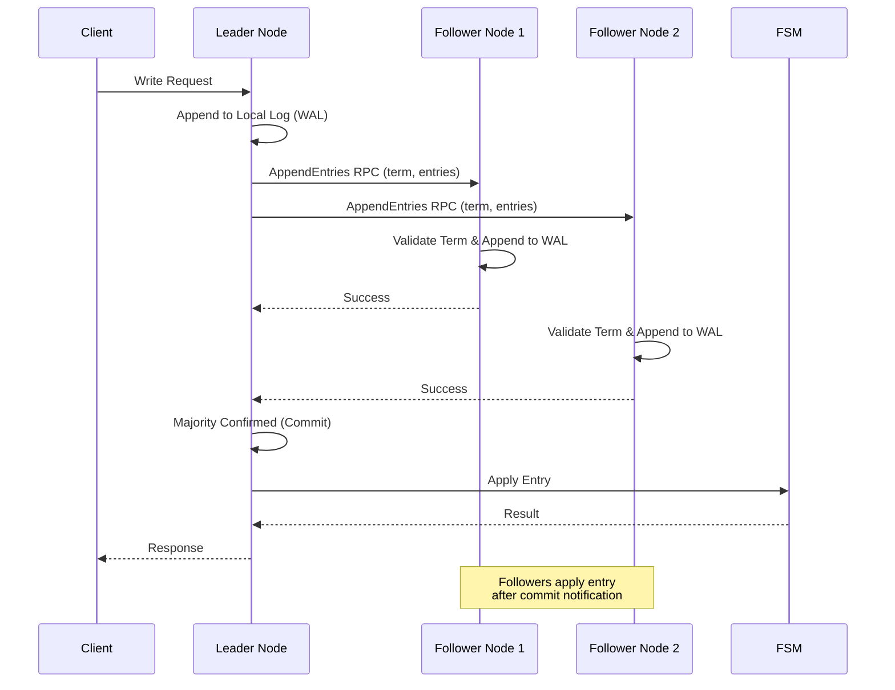
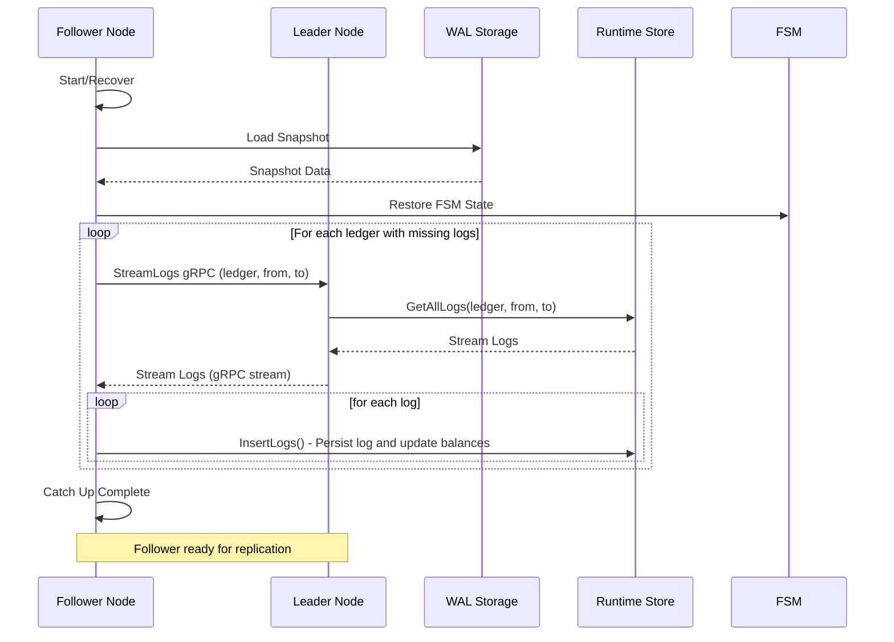
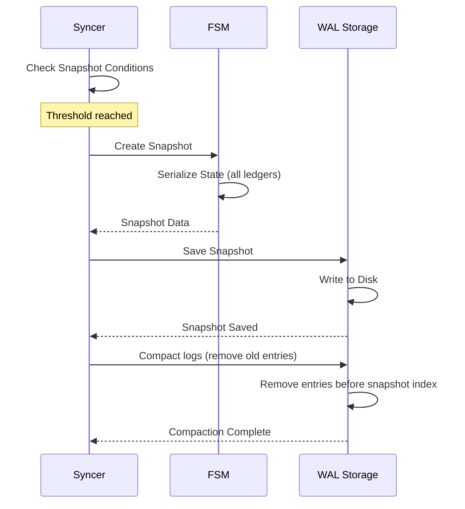
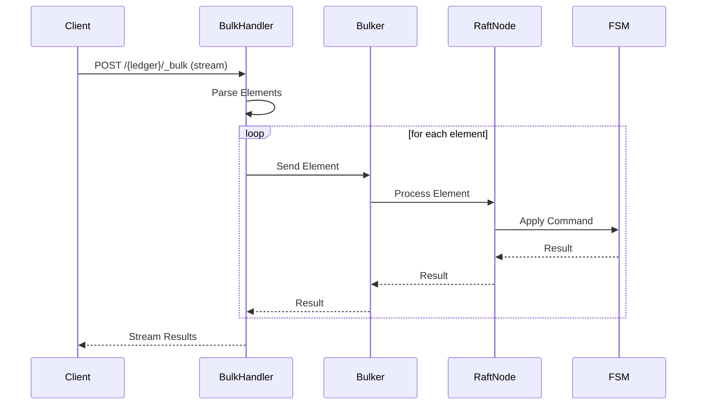

# Data Flows

This document describes in detail the data flows for the main system operations.

## Ledger Creation

### Overview

Ledger creation is a distributed operation that goes through the single Raft group.

### Complete Flow

### Detailed Steps

1. **HTTP Request Reception**
   - The HTTP handler receives `POST /{ledgerName}`
   - Validates the body (metadata)
   - Calls `raftNode.CreateLedger()`

2. **Leader Verification**
   - The Raft node checks if it is the leader
   - If not leader, identifies the leader and forwards the request

3. **Command Proposal**
   - The leader creates a `CreateLedgerCommand`
   - The command is proposed to the Raft group
   - The command is replicated to all followers

4. **FSM Application**
   - The FSM receives the committed command
   - Validates the ledger name is unique
   - Creates a new LedgerState with initial sequence numbers

5. **Persistence**
   - The ledger state is stored in the FSM's in-memory map
   - A snapshot can be created if necessary

## Transaction Creation

### Overview

Transaction creation goes through the single Raft group.

### Complete Flow

### Detailed Steps

1. **Ledger Verification**
   - The system checks the ledger exists in the FSM state
   - Retrieves the ledger's current state

2. **Transaction Validation**
   - Validates postings (valid accounts, positive amounts)
   - Checks balances (if necessary) from RuntimeStore
   - Verifies the idempotency key
   - Executes script if present

3. **Command Proposal**
   - Creates a `CreateLogCommand` with the transaction data
   - Proposes to the Raft group
   - Replicates to all nodes in the group

4. **FSM Application**
   - The FSM generates the next log ID and transaction ID for this ledger
   - The log is written to the RuntimeStore
   - Balances are updated

5. **Response Return**
   - The created transaction is returned to the client
   - Includes transaction ID, timestamp, etc.

## Raft Replication

### Overview

All writes are replicated via the Raft protocol to guarantee consistency.

### Replication Flow

### Detailed Steps

1. **Command Reception**
   - The leader receives a write command
   - The command is serialized to protobuf
   - A Raft entry is created

2. **Append to Local Log**
   - The entry is added to the leader's local log
   - The entry is written to the WAL
   - The WAL is synchronized on disk

3. **Replication to Followers**
   - The leader sends `AppendEntries` to all followers
   - Each follower validates the term
   - Each follower appends the entry to its local log

4. **Commit**
   - When a majority confirms, the leader commits the entry
   - The entry is marked as committed
   - The commit index is updated

5. **Application**
   - Committed entries are applied to the FSM
   - The FSM processes the command and updates the state
   - The result is returned to the client

## Follower Synchronization

### Overview

When a follower joins the cluster or recovers after a failure, it must synchronize with the leader.

### Synchronization Flow

### Detailed Steps

1. **Snapshot Loading**
   - The follower loads the most recent snapshot
   - The FSM state is restored from the snapshot
   - The last applied log ID for each ledger is noted

2. **Log Streaming**
   - For each ledger with missing logs (based on LastAppliedLogId)
   - The follower requests logs from the leader via gRPC
   - The leader streams logs from its RuntimeStore

3. **Log Application**
   - Each log is inserted into the follower's RuntimeStore
   - Balances and metadata are updated
   - The state is progressively updated

4. **Catch-up Complete**
   - Once all logs are applied, the follower is up to date
   - The follower can now participate in replication
   - The follower votes during elections

## Snapshot Creation

### Overview

Snapshots are created periodically to compact logs and accelerate recovery.

### Creation Flow

### Creation Conditions

1. **Log Threshold**
   - If `SnapshotThreshold` logs have been created since the last snapshot
   - Configurable globally via command line flags

### Snapshot Contents

- **Metadata**: index, term, timestamp
- **FSM State**: Complete state for all ledgers
- **Index**: Index of the last included entry

## Request Forwarding

### Overview

When a follower receives a write request, it forwards it to the leader.

### Forwarding Flow

### Error Handling

If the leader is not available:

1. The follower detects `GetLeader() == 0`
2. An `ErrNoLeader` error is returned
3. The HTTP handler returns `503 Service Unavailable`
4. The header `Retry-After: 1` is added
5. The client SDK retries automatically

## Bulk Operations

### Overview

Bulk operations allow sending multiple operations in a single request.

### Bulk Flow

### Bulk Options

- **continueOnFailure**: Continue even if an operation fails
- **atomic**: All operations or nothing
- **parallel**: Execute in parallel (not compatible with atomic)

## Next Steps

To deepen your understanding:

1. [Raft Consensus](./raft-consensus.md) - Details on Raft replication
2. [Storage and Persistence](./storage.md) - How data is persisted
3. [API and Interfaces](./api.md) - API endpoint documentation
