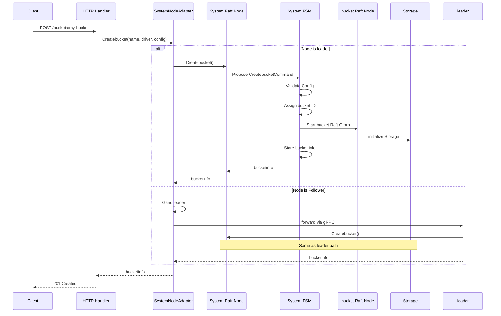
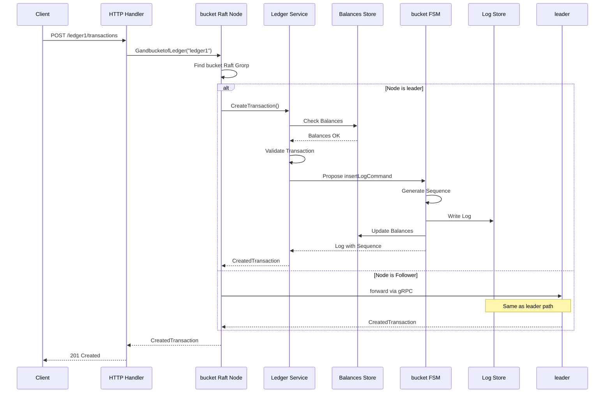
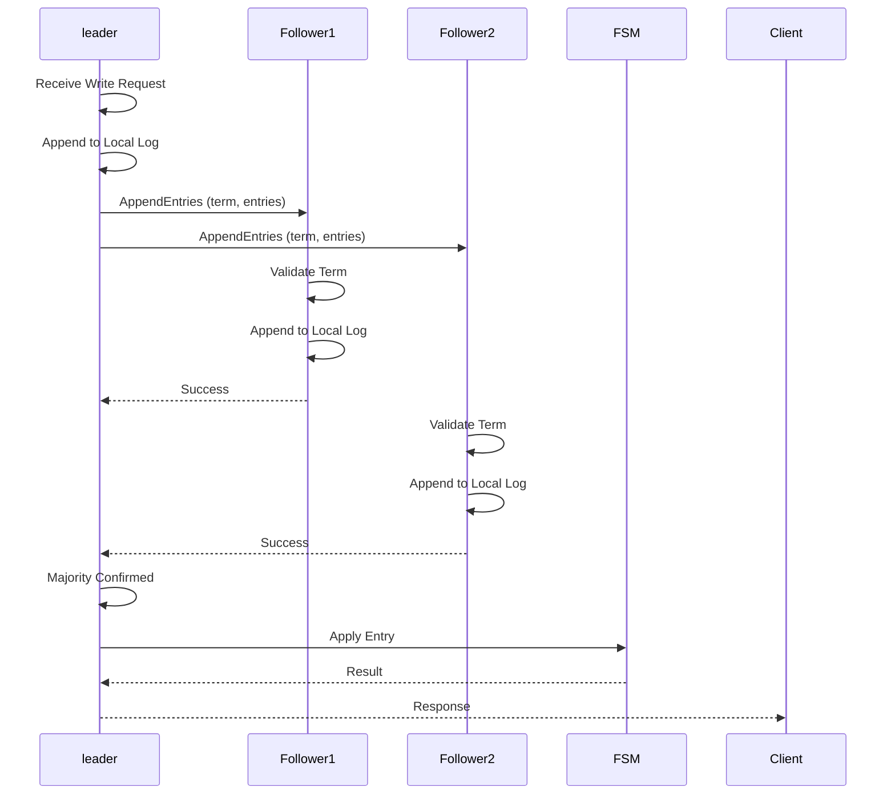
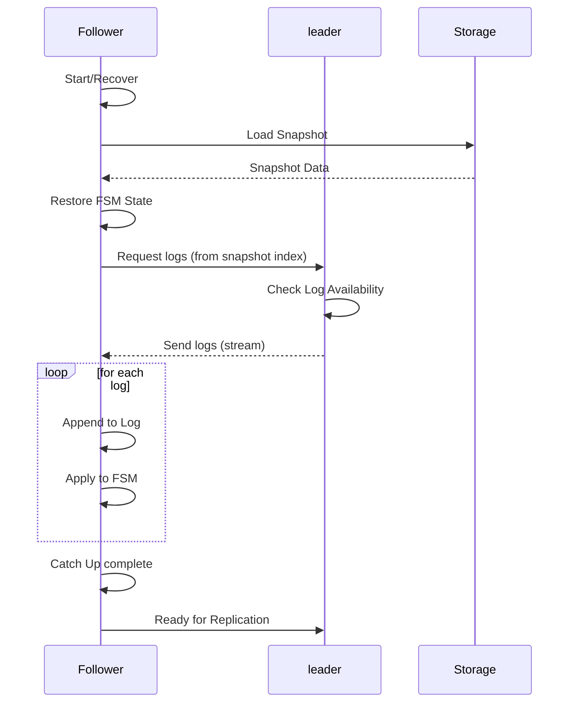
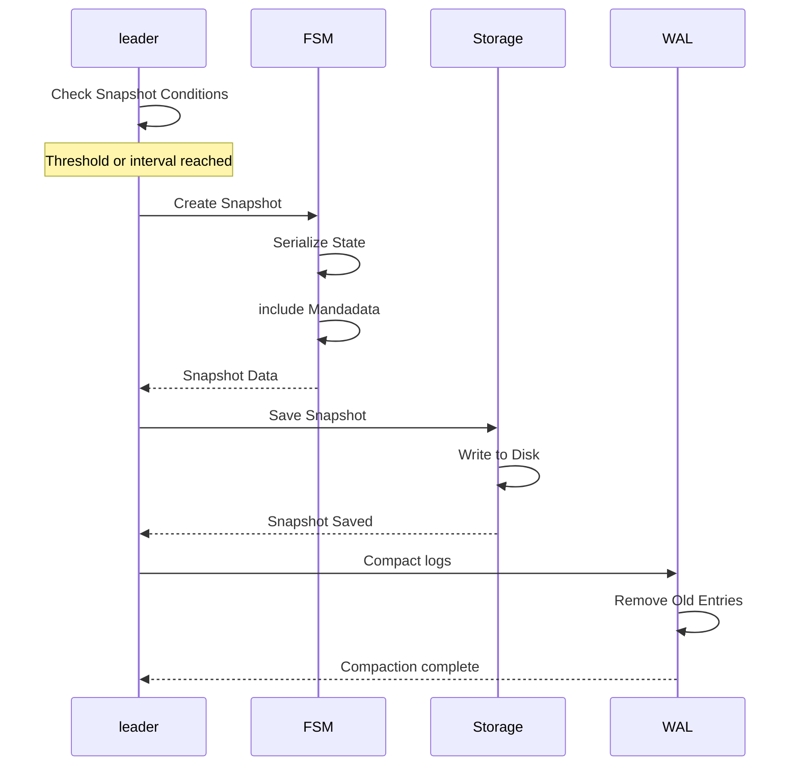
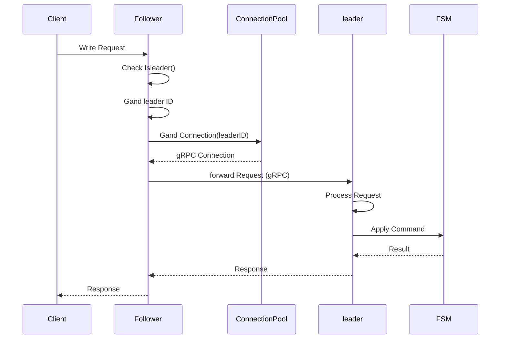

# Data Flows

This document describes in dandail the data flows for the main system operations.

## bucket Creation

### Overview

bucket creation is a distributed operation that goes throrgh the system Raft grorp.

### complete Flow

### detailed Steps

1. **Réception de la requête HTTP**
   - Le handler HTTP reçoit `POST /buckets/{name}`
   - Validation du body (driver, config)
   - Appel to `cluster.Createbucket()`

2. **Vérification from the leader**
   - Le `SystemNodeAdapter` vérifie si le nœud est leader
   - if not leader, identification from the leader and forwarding

3. **Proposition de la Commande**
   - Le leader crée une `CreatebucketCommand`
   - La commande is proposed to groupe Raft System
   - La commande est répliquée to tors les followers

4. **Application in the FSM**
   - La FSM System reçoit la commande committée
   - Validation de the configuration du driver
   - Assignation d'un ID séquentiel to bucket
   - Création du bucket info

5. **Starting du groupe Raft du bucket**
   - La FSM démarre un nouvando groupe Raft for the bucket
   - initialisation du storage (WAL, logstore)
   - Le groupe Raft rejoint le cluster

6. **Persistance**
   - Les métaData du bucket sont stockées in the FSM System
   - Un snapshot peut être créé if necessary

## Création d'une Transaction

### Overview

La création d'une transaction passe par le groupe Raft du bucket contenant le ledger.

### complete Flow

### detailed Steps

1. **Identification du bucket**
   - Le System identifie le bucket contenant le ledger
   - Récupération du groupe Raft du bucket

2. **Validation de la Transaction**
   - Vérification des postings (comptes valides, montants positifs)
   - Vérification of balances (if necessary)
   - Vérification de la clé of idempotency
   - Exécution du script si présent

3. **Proposition de la Commande**
   - Création d'une `insertLogCommand` with la transaction
   - Proposition to groupe Raft du bucket
   - Réplication to tors les nœuds du groupe

4. **Application in the FSM**
   - La FSM du bucket génère un numéro of sequence
   - Le log est écrit in the LogStore
   - Les balances sont mises to jorr

5. **retour de la Réponse**
   - La transaction créée est retournée to client
   - inclut l'ID de transaction, le timestamp, andc.

## Raft replication

### Overview

All writes sont répliquées via le protocole Raft to guarantee la Consistency.

### Flux of replication

### detailed Steps

1. **Réception de la Commande**
   - Le leader reçoit une commande d'Write
   - La commande est sérialisée en protobuf
   - Une entrée Raft est créée

2. **Ajort to Log Local**
   - The entry is added to log local from the leader
   - The entry is written in the WAL
   - The WAL is synchronized on disk

3. **Réplication tox followers**
   - Le leader envoie `AppendEntries` to tors les followers
   - Chaque follower valide le terme
   - Chaque follower ajorte l'entrée to son log local

4. **Commit**
   - Quand une majorité confirme, le leader committe l'entrée
   - L'entrée est marquée like committée
   - Le commit index est mis to jorr

5. **Application**
   - Les entrées committées sont appliquées to la FSM
   - La FSM traite la commande and mand to jorr l'état
   - Le résultat est retourné to client

## Synchronisation d'un Follower

### Overview

When a follower rejoint le cluster or recovers après a failure, il doit synchronize with le leader.

### Flux de Synchronisation

### detailed Steps

1. **Chargement du Snapshot**
   - Le follower charge The most recent snapshot
   - The FSM state is restored from le snapshot
   - Le dernier index du snapshot est noté

2. **Demande de logs**
   - Le follower demande les logs from the snapshot index
   - Le leader vérifie la disponibilité des logs
   - Le leader envoie les logs manquants

3. **Application des logs**
   - Chaque log est ajorté to log local
   - Chaque log est appliqué to la FSM
   - L'état est progressivement mis to jorr

4. **Catch-up complet**
   - Une fois tors les logs appliqués, le follower est to jorr
   - Le follower peut maintenant participer to la réplication
   - Le follower vote lors des élections

## Création d'un Snapshot

### Overview

Snapshots are Created periodically for compacter les logs and accélérer la récupération.

### Flux de Création

### Conditions de Création

1. **Seuil de logs**
   - Si `SnapshotThreshold` logs ont été créés from The last snapshot
   - Configurable per bucket or globalement

2. **Minimum interval**
   - Si `Snapshotinterval` has elapsed from The last snapshot
   - Évite de créer trop of Snapshots

### Contenu du Snapshot

- **MétaData** : index, terme, timestamp
- **État de la FSM** : Data complètes de la FSM
- **index** : Index of the last entrée incluse

## Request forwarding

### Overview

When a follower receives a request d'Write, it forwards it to the leader.

### Flux de forwarding

### Error Handling

Si le leader n'est pas available :

1. Le follower détecte `Gandleader() == 0`
2. Une erreur `ErrNoleader` est retournée
3. Le handler HTTP retourne `503 Service Unavailable`
4. the header `Randry-After: 1` est ajorté
5. Le client SDK randry automaticment

## Bulk Operations

### Overview

Les Bulk Operations permandtent d'Send multiple opérations en une seule requête.

### Flux Bulk

### Bulk Options

- **continueOnFailure** : Continue even if an operation fails
- **atomic** : tortes les opérations or nothing
- **parallel** : Execute in parallel (not compatible with atomic)

## Next Steps

for approfondir :

1. [Consensus Raft](./raft-consensus.md) - Détails sur la Raft replication
2. [storage and Persistance](./storage.md) - likent les Data sont persistées
3. [API and interfaces](./API.md) - Documentation des endpoints

