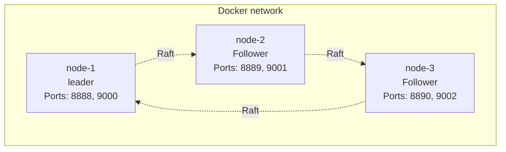

# Deployment

## Overview

This document describes the different deployment methods for Ledger v3 POC, from local configuration to production deployment on Kubernetes.

## Local Deployment

### Prerequisites

- Go 1.25+
- Just (command runner)
- Optional: Nix with Flakes

### Starting a Single Node

```bash
just run

# or manually
go run ./cmd/server \
  --node-id 1 \
  --bind-addr 127.0.0.1:8888 \
  --data-dir ./data/node-1 \
  --http-port 9000
```

### Configuration

Options can be provided via:
- Command line arguments
- Environment variables (without prefix, with underscores)

Example with environment variables:
```bash
export NODE_ID=1
export BIND_ADDR=127.0.0.1:8888
export DATA_DIR=./data/node-1
export HTTP_PORT=9000

go run ./cmd/server
```

## Deployment with Docker Compose

### Overview

The file `docker-compose.yml` configures a cluster of 3 nodes for development and testing.

### Architecture



### Starting

```bash
# Start the cluster
just docker-up

# View logs
just docker-logs

# Stop the cluster
just docker-down
```

### Configuration

Each node is configured with:
- **Node ID**: 1, 2, or 3
- **Advertise Address**: `node-{id}:8888`
- **Peers**: List of all nodes
- **Exposed ports**:
  - gRPC: 8888, 8889, 8890
  - HTTP: 9000, 9001, 9002

### Volumes

- **Source code**: Mounted from the current directory
- **Data**: `./data/node-{id}` for each node
- **Go modules cache**: Shared volume to speed up builds

## Kubernetes Deployment with Helm

### Prerequisites

- Kubernetes 1.19+
- Helm 3.0+
- PersistentVolume support
- Access to Formance Helm repository (for the core dependency)

### Chart Installation

```bash
# Add the Formance repository
helm repo add formance https://formancehq.github.io/helm
helm repo update

# Install the chart
helm install ledger-v3-poc ./deployments/chart \
  --set replicaCount=3 \
  --set config.nodeID=1
```

### Main Configuration

#### Number of Replicas

```yaml
replicaCount: 3  # Must be odd for Raft
```

#### Application Configuration

```yaml
config:
  bindAddr: "0.0.0.0:8888"
  httpPort: 9000
  dataDir: "/data/raft"
  debug: false
  
  raft:
    snapshotThreshold: 100
    snapshotInterval: "30s"
    electionTick: 10
    heartbeatTick: 1
    maxSizePerMsg: 1048576
    maxInflightMsgs: 256
    tickInterval: "100ms"
```

#### Storage

```yaml
persistence:
  enabled: true
  storageClass: "fast-ssd"
  size: 10Gi
  accessModes:
    - ReadWriteOnce
```

### Kubernetes Architecture


### Peer Discovery

The chart uses a StatefulSet with a headless service for automatic discovery:

1. Each pod calculates its Node ID from its index: `POD_INDEX + 1`
2. The advertise address is generated: `{POD_NAME}.{HEADLESS_SVC}.{NAMESPACE}.svc.cluster.local:8888`
3. The peer list is generated automatically

### Automatic Cluster Initialization

All pods automatically initialize their storage with the cluster configuration when starting with empty storage. No special bootstrap flag is needed.

### Health Checks

#### Liveness Probe

```yaml
livenessProbe:
  httpGet:
    path: /health
    port: http
  initialDelaySeconds: 30
  periodSeconds: 10
  timeoutSeconds: 5
  failureThreshold: 3
```

#### Readiness Probe

```yaml
readinessProbe:
  httpGet:
    path: /health
    port: http
  initialDelaySeconds: 10
  periodSeconds: 5
  timeoutSeconds: 3
  failureThreshold: 3
```

### Observability

#### OpenTelemetry

The chart supports OpenTelemetry integration:

```yaml
config:
  monitoring:
    traces:
      enabled: true
      exporter: "otlp"
      endpoint: "otel-collector:4317"
      mode: "grpc"
```

#### ServiceMonitor (Prometheus)

If Prometheus Operator is installed:

```yaml
ServiceMonitor:
  enabled: true
  interval: 30s
  scrapeTimeout: 10s
```

## Advanced Configuration

### Raft Parameters

#### Timeouts

```yaml
config:
  raft:
    electionTick: 10      # Election timeout (10 * tickInterval)
    heartbeatTick: 1       # Heartbeat interval (1 * tickInterval)
    tickInterval: "100ms"  # Interval between ticks
```

**Recommendations**:
- **Development**: `electionTick: 10`, `heartbeatTick: 1`, `tickInterval: "100ms"`
- **Production**: `electionTick: 20`, `heartbeatTick: 2`, `tickInterval: "50ms"`

#### Performance

```yaml
config:
  raft:
    maxSizePerMsg: 1048576    # 1MB - Max size per message
    maxInflightMsgs: 256      # Max number of messages in flight
```

### Snapshots

#### Global Configuration

```yaml
config:
  raft:
    snapshotThreshold: 100      # Number of logs before snapshot
    snapshotInterval: "30s"      # Minimum interval between snapshots
```

#### Per-Bucket Configuration

Buckets can have their own `snapshotThreshold` :

```bash
curl -X POST http://localhost:9000/buckets/my-bucket \
  -H "Content-Type: application/json" \
  -d '{
    "driver": "sqlite",
    "snapshotThreshold": 500
  }'
```

### Storage

#### SQLite

By default, SQLite is used with an auto-generated DSN:

```yaml
config:
  extraData:
    enabled: true
    mountPath: "/extra-data"
```

## Scaling

### Horizontal Scaling

To add nodes to the cluster:

```bash
# Kubernetes
kubectl scale statefulset ledger-v3-poc --replicas=5

# Update the Helm configuration
helm upgrade ledger-v3-poc ./deployments/chart \
  --set replicaCount=5
```

**Important** : The number of nodes must remain odd to avoid ties during votes.

### Vertical Scaling

for atgmenter resources of a node :

```yaml
resources:
  requests:
    CPU: 500m
    memory: 1Gi
  limits:
    CPU: 2000m
    memory: 4Gi
```

## Maintenance

### Manual Creation of Snapshot

```bash
# System Snapshot
curl -X POST http://localhost:9000/snapshot

# Bucket snapshot
curl -X POST http://localhost:9000/buckets/my-bucket/snapshot
```

### Vérification de l'Cluster State

```bash
curl http://localhost:9000/cluster/state
```

### Backup

#### Backup des Data Raft

```bash
# Kubernetes
kubectl exec -it ledger-v3-poc-0 -- tar czf /tmp/Backup.tar.gz /data/raft
kubectl cp ledger-v3-poc-0:/tmp/Backup.tar.gz ./Backup.tar.gz
```

#### Log Backup of Transactions

for SQLite :
```bash
kubectl exec -it ledger-v3-poc-0 -- sqlite3 /extra-data/buckets/my-bucket/logs.db ".Backup /tmp/Backup.db"
```


### Resttoration

1. Stop the cluster
2. Resttorer les Data from le Backup
3. ReStart the cluster
4. Verify the state with `/cluster/state`

## Security

### Production Recommendations

1. **TLS/HTTPS**: Configure TLS for all communications
2. **Authentication**: Add API authentication (JWT, OAuth2)
3. **Network Policies**: Restrict network communications
4. **Secrets Management**: Use Kubernetes Secrets or Vault
5. **RBAC**: Configure appropriate Kubernetes permissions

### Example with TLS

```yaml
ingress:
  enabled: true
  tls:
    - secretName: ledger-tls
      hosts:
        - ledger.example.com
```

## Monitoring and Alerting

### Key Metrics

- Cluster state (leader, followers)
- Number of buckets and ledgers
- Number of transactions per second
- Request latency
- Storage usage

### Recommended Alerts

- No leader available
- Desynchronized follower
- Low disk space
- High latency
- High error rate

## Troubleshooting

### Common Problems

#### No Leader

**Symptom**: Errors `503 Service Unavailable` with `NO_LEADER`

**Solutions**:
1. Verify that the majority of nodes are online
2. Verify network connectivity between nodes
3. Check logs for election errors

#### Desynchronized Follower

**Symptom**: Follower cannot synchronize

**Solutions**:
1. Check available disk space
2. Check logs for replication errors
3. Restart the follower to force resynchronization

#### Degraded Performance

**Symptom**: High latency, low throughput

**Solutions**:
1. Check CPU/memory load
2. Optimize Raft parameters (tickInterval, etc.)
3. Check storage performance
4. Consider horizontal scaling

## Next Steps

To deepen your understanding:

1. [General Architecture](./architecture.md) - Understand the architecture
2. [Consensus Raft](./raft-consensus.md) - Optimize Raft parameters
3. [Storage and Persistence](./storage.md) - Configure storage

