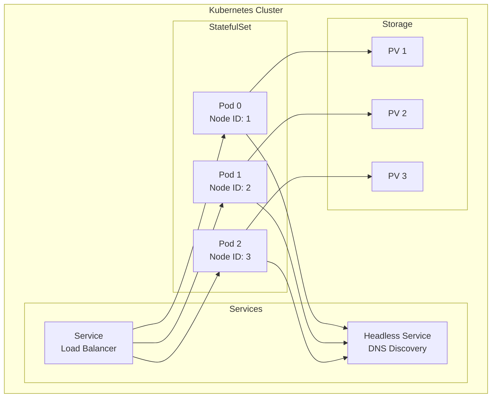

# Deployment

## Overview

This document describes the different deployment methods for Ledger v3 POC, from local configuration to production deployment on Kubernetes.

## Local Deployment

### Prerequisites

- Go 1.25+
- Just (command runner)
- Optional: Nix with Flakes

### Starting a Single Node

```bash
just run

# or manually
go run ./cmd/server \
  --node-id 1 \
  --bind-addr 127.0.0.1:8888 \
  --wal-dir ./wal/node-1 \
  --data-dir ./data/node-1 \
  --http-port 9000
```

### Configuration

Options can be provided via:
- Command line arguments
- Environment variables (without prefix, with underscores)

Example with environment variables:
```bash
export NODE_ID=1
export BIND_ADDR=127.0.0.1:8888
export DATA_DIR=./data/node-1
export HTTP_PORT=9000

go run ./cmd/server
```

## Kubernetes Deployment with Helm

### Prerequisites

- Kubernetes 1.19+
- Helm 3.0+
- PersistentVolume support
- Access to Formance Helm repository (for the core dependency)

### Chart Installation

```bash
# Add the Formance repository
helm repo add formance https://formancehq.github.io/helm
helm repo update

# Install the chart
helm install ledger-v3-poc ./deployments/chart \
  --set replicaCount=3

# Note: Node IDs are automatically generated by the chart based on the pod index
# (Pod index 0 -> Node ID 1, Pod index 1 -> Node ID 2, etc.)
```

### Main Configuration

#### Number of Replicas

```yaml
replicaCount: 3  # Must be odd for Raft
```

#### Application Configuration

```yaml
config:
  bindAddr: "0.0.0.0:8888"  # Port for both Raft and gRPC
  httpPort: 9000
  dataDir: "/data/raft"
  debug: false
  
  raft:
    snapshotThreshold: 5000   # Number of logs before triggering a snapshot
    snapshotInterval: "30s"   # Minimum interval between snapshots
    electionTick: 10          # Election timeout in ticks
    heartbeatTick: 1          # Heartbeat interval in ticks
    maxSizePerMsg: 1048576    # Maximum size per message in bytes (1MB)
    maxInflightMsgs: 256      # Maximum number of in-flight messages
    tickInterval: "100ms"     # Interval between Raft ticks
```

#### Storage

```yaml
persistence:
  enabled: true
  storageClass: ""  # Use default storage class if empty
  accessMode: ReadWriteOnce
  size: 10Gi
  annotations: {}
  persistentVolumeClaimRetentionPolicy:
    whenScaled: Retain
    whenDeleted: Retain
```

#### Service Configuration

```yaml
service:
  type: ClusterIP
  httpPort: 9000
  grpcPort: 8888  # Same port as bindAddr (Raft transport uses gRPC)
  annotations: {}
```

#### Headless Service

The headless service is automatically created for Raft peer discovery:

```yaml
headlessService:
  enabled: true
  annotations: {}
```

#### Security Configuration

```yaml
# Service account
serviceAccount:
  create: true
  annotations: {}
  name: ""

# Pod security context
podSecurityContext:
  fsGroup: 1000

# Container security context
securityContext:
  capabilities:
    drop:
      - ALL
  readOnlyRootFilesystem: false
  runAsNonRoot: true
  runAsUser: 1000
```

#### Resource Limits

```yaml
resources:
  limits:
    cpu: 1000m
    memory: 512Mi
  requests:
    cpu: 100m
    memory: 128Mi
```

#### Pod Scheduling

```yaml
# Node selector
nodeSelector: {}

# Tolerations
tolerations: []

# Affinity rules
affinity: {}

# Pod annotations
podAnnotations: {}
```

#### Pod Disruption Budget

```yaml
podDisruptionBudget:
  enabled: false
  minAvailable: 1  # Or use maxUnavailable instead
```

### Kubernetes Architecture



### Peer Discovery

The chart uses a StatefulSet with a headless service for automatic discovery:

1. Each pod calculates its Node ID from its index: `POD_INDEX + 1`
2. The advertise address is generated: `{POD_NAME}.{HEADLESS_SVC}.{NAMESPACE}.svc.cluster.local:8888`
3. The peer list is generated automatically

### Automatic Cluster Initialization

All pods automatically initialize their storage with the cluster configuration when starting with empty storage. No special bootstrap flag is needed.

### Health Checks

#### Liveness Probe

```yaml
livenessProbe:
  httpGet:
    path: /health
    port: http
  initialDelaySeconds: 30
  periodSeconds: 10
  timeoutSeconds: 5
  failureThreshold: 3
```

#### Readiness Probe

```yaml
readinessProbe:
  httpGet:
    path: /health
    port: http
  initialDelaySeconds: 10
  periodSeconds: 5
  timeoutSeconds: 3
  failureThreshold: 3
```

### Observability

#### OpenTelemetry Configuration

The chart supports comprehensive OpenTelemetry integration:

```yaml
config:
  monitoring:
    serviceName: "ledger-v3-poc"
    
    # Traces configuration
    traces:
      enabled: true
      exporter: "otlp"
      endpoint: ""  # OTLP endpoint (e.g., "otel-collector")
      port: ""      # OTLP port (e.g., "4317")
      insecure: "false"  # Set to "true" for insecure connections
      mode: "grpc"  # or "http"
      batch: "false"
    
    # Metrics configuration
    metrics:
      enabled: false
      exporter: "otlp"
      endpoint: ""
      port: ""
      insecure: "false"
      mode: "grpc"
      keepInMemory: true
      exporterPushInterval: "15s"
      runtime: true
      runtimeMinimumReadMemStatsInterval: "15s"
    
    # Logs configuration
    logs:
      enabled: true
      level: "info"
      exporter: "otlp"
      endpoint: ""
      port: ""
      insecure: "false"
      mode: "grpc"
      # format: "json"  # Optional
    
    # Additional resource attributes
    attributes: ""
```

**Note**: Monitoring configuration can also be set globally. Global values take precedence if `config.monitoring` values are not set.

#### ServiceMonitor (Prometheus)

If Prometheus Operator is installed:

```yaml
serviceMonitor:
  enabled: false
  interval: 30s
  scrapeTimeout: 10s
  labels: {}
  relabelings: []
  metricRelabelings: []
```

The ServiceMonitor scrapes metrics from the `/metrics` endpoint on the HTTP port.

## Advanced Configuration

### Raft Parameters

#### Timeouts

```yaml
config:
  raft:
    electionTick: 10      # Election timeout (10 * tickInterval)
    heartbeatTick: 1       # Heartbeat interval (1 * tickInterval)
    tickInterval: "100ms"  # Interval between ticks
```

**Recommendations**:
- **Development**: `electionTick: 10`, `heartbeatTick: 1`, `tickInterval: "100ms"`
- **Production**: `electionTick: 20`, `heartbeatTick: 2`, `tickInterval: "50ms"`

#### Performance

```yaml
config:
  raft:
    maxSizePerMsg: 1048576    # 1MB - Max size per message
    maxInflightMsgs: 256      # Max number of messages in flight
```

### Snapshots

#### Global Configuration

```yaml
config:
  raft:
    snapshotThreshold: 5000     # Number of logs before triggering a snapshot
    snapshotInterval: "30s"     # Minimum interval between snapshots
```

### Storage

#### SQLite

By default, SQLite is used with an auto-generated DSN:

```yaml
config:
  extraData:
    enabled: true
    mountPath: "/extra-data"
```

## Scaling

### Horizontal Scaling

To add nodes to the cluster:

```bash
# Kubernetes
kubectl scale statefulset ledger-v3-poc --replicas=5

# Update the Helm configuration
helm upgrade ledger-v3-poc ./deployments/chart \
  --set replicaCount=5
```

**Important** : The number of nodes must remain odd to avoid ties during votes.

### Vertical Scaling

To increase resources for a node:

```yaml
resources:
  requests:
    cpu: 500m
    memory: 1Gi
  limits:
    cpu: 2000m
    memory: 4Gi
```

**Default resources**:
- Requests: `cpu: 100m`, `memory: 128Mi`
- Limits: `cpu: 1000m`, `memory: 512Mi`

## Maintenance

### Cluster State Verification

```bash
curl http://localhost:9000/cluster/state
```

### Backup

#### Raft Data Backup

```bash
# Kubernetes
kubectl exec -it ledger-v3-poc-0 -- tar czf /tmp/backup.tar.gz /data/raft
kubectl cp ledger-v3-poc-0:/tmp/backup.tar.gz ./backup.tar.gz
```

#### Transaction Log Backup

For SQLite:
```bash
kubectl exec -it ledger-v3-poc-0 -- sqlite3 /extra-data/ledgers/my-ledger/ledger-<id>-runtime.db ".backup /tmp/backup.db"
```

### Restoration

1. Stop the cluster
2. Restore data from backup
3. Restart the cluster
4. Verify the state with `/cluster/state`

## Security

### Production Recommendations

1. **TLS/HTTPS**: Configure TLS for all communications
2. **Authentication**: Add API authentication (JWT, OAuth2)
3. **Network Policies**: Restrict network communications
4. **Secrets Management**: Use Kubernetes Secrets or Vault
5. **RBAC**: Configure appropriate Kubernetes permissions

### Ingress Configuration

```yaml
ingress:
  enabled: false
  className: ""  # Ingress class name (e.g., "nginx", "traefik")
  annotations: {}
    # kubernetes.io/ingress.class: nginx
    # kubernetes.io/tls-acme: "true"
    # cert-manager.io/cluster-issuer: "letsencrypt-prod"
  hosts:
    - host: ledger-v3-poc.local
      paths:
        - path: /
          pathType: Prefix
  tls: []
    # - secretName: ledger-v3-poc-tls
    #   hosts:
    #     - ledger-v3-poc.local
  
  # Per-pod ingress (for accessing individual pods from outside)
  perPod:
    enabled: false
    annotations: {}
```

**Per-pod ingress**: When enabled, creates individual ingress resources for each pod (e.g., `pod-0.ledger.example.com`, `pod-1.ledger.example.com`). Useful for debugging or direct pod access.

## Monitoring and Alerting

### Key Metrics

- Cluster state (leader, followers)
- Number of ledgers
- Number of transactions per second
- Request latency
- Storage usage

### Recommended Alerts

- No leader available
- Desynchronized follower
- Low disk space
- High latency
- High error rate

## Troubleshooting

### Common Problems

#### No Leader

**Symptom**: Errors `503 Service Unavailable` with `NO_LEADER`

**Solutions**:
1. Verify that the majority of nodes are online
2. Verify network connectivity between nodes
3. Check logs for election errors

#### Desynchronized Follower

**Symptom**: Follower cannot synchronize

**Solutions**:
1. Check available disk space
2. Check logs for replication errors
3. Restart the follower to force resynchronization

#### Degraded Performance

**Symptom**: High latency, low throughput

**Solutions**:
1. Check CPU/memory load
2. Optimize Raft parameters (tickInterval, etc.)
3. Check storage performance
4. Consider horizontal scaling

## Next Steps

To deepen your understanding:

1. [General Architecture](./architecture.md) - Understand the architecture
2. [Consensus Raft](./raft-consensus.md) - Optimize Raft parameters
3. [Storage and Persistence](./storage.md) - Configure storage
