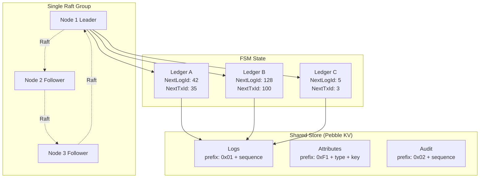
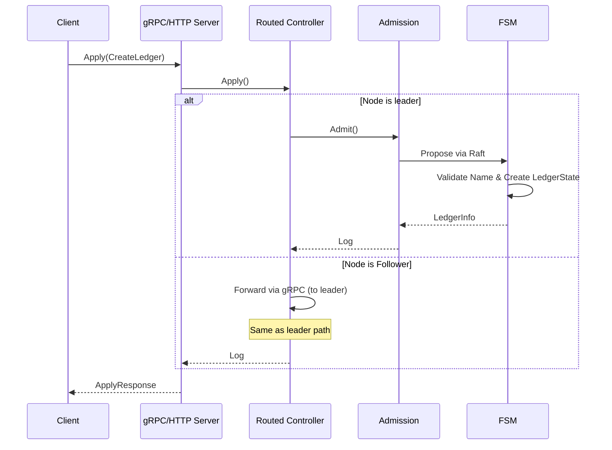
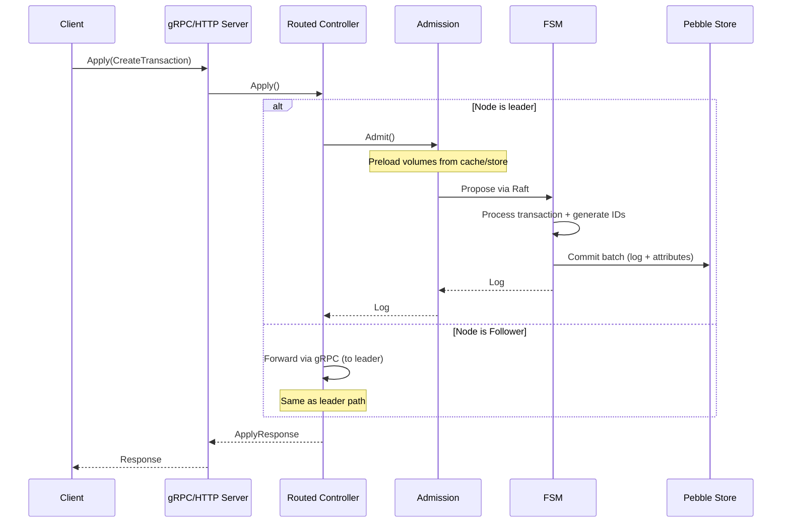
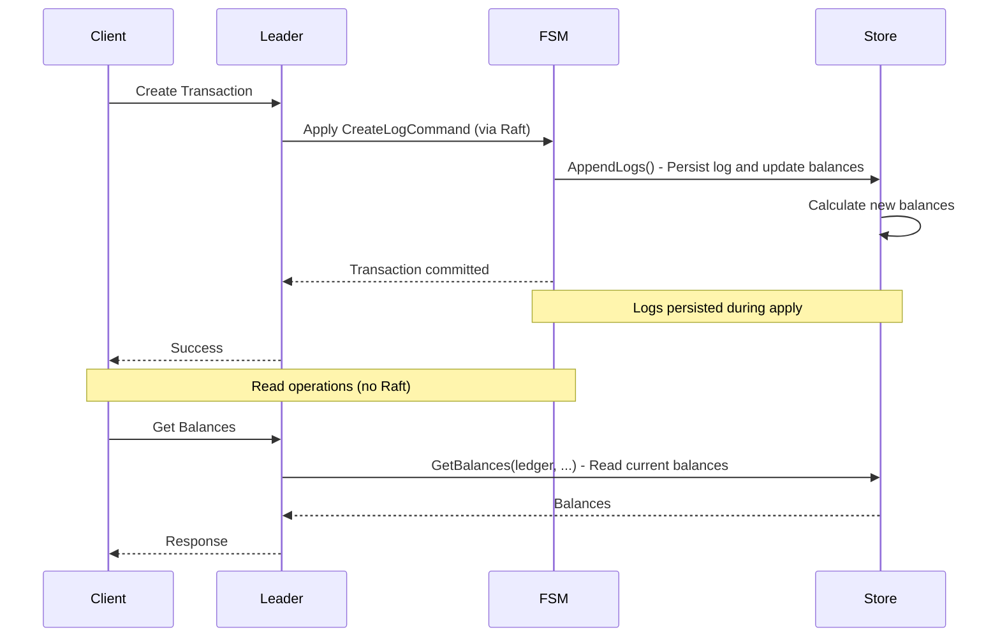

# Ledgers

## Overview

The Ledger v3 POC system uses a **single Raft group architecture** where all ledgers are managed together. This organization simplifies operations while maintaining strong consistency guarantees.

## Architecture



## Ledgers

### Concept

A **ledger** is an accounting book that:
- Is managed by the single Raft group
- Shares storage with other ledgers (keyed by numeric ledger ID)
- Contains financial transactions
- Has its own sequence numbers (log IDs and transaction IDs)
- Is logically isolated from other ledgers

### Ledger Properties

All data types are defined as Protocol Buffers messages:

```protobuf
// common.proto
message LedgerInfo {
  string name = 1;              // Ledger name (unique identifier)
  Timestamp created_at = 2;     // Creation timestamp
  uint32 id = 3;                // Numeric ledger ID (auto-assigned, max 65535)
  Timestamp deleted_at = 4;     // Soft delete timestamp (nil if not deleted)
}

// raftcmd.proto
message LedgerState {
  LedgerInfo ledger_info = 1;
  uint64 next_log_id = 2;        // Next log sequence number
  uint64 next_transaction_id = 3; // Next transaction ID
}
```

### Numeric Ledger ID

Each ledger is assigned a unique numeric ID (`uint32`) when created. This ID is used:

- **Internally**: For storage keys, log entries, and all internal operations
- **Externally**: The API continues to use ledger names for user convenience
- **Conversion**: The HTTP layer converts ledger names to IDs automatically

**Benefits of numeric IDs**:
- **Compact storage**: 4 bytes vs variable-length strings in storage keys
- **Fast lookups**: Integer comparison is faster than string comparison
- **Immutable reference**: The ID never changes, even if names could be updated in the future

### Limits

| Resource | Maximum | Notes |
|----------|---------|-------|
| Ledgers | **65,535** | Stored as uint32, application-level limit to 65535 |

> **Note**: The maximum number of ledgers is limited to 65,535 per cluster. Each ledger is assigned a unique numeric ID (stored as uint32 but limited to 65535 by application logic). This limit is intentional to keep the system simple and efficient.

### Ledger Creation

Ledger creation is a distributed operation that goes through the single Raft group. The primary API is gRPC (`Apply` RPC), with an HTTP compatibility layer available.

1. Client sends an `Apply` request (gRPC) or `POST /{ledgerName}` (HTTP)
2. The routed controller checks if the node is the leader
3. If not leader, the request is forwarded to the leader via gRPC
4. The admission layer preloads required attributes and proposes to Raft
5. Command is replicated to all nodes
6. Once committed, the FSM:
   - Validates the ledger name is unique
   - Creates a new LedgerState with initial values



### Storage

Storage is handled by Pebble, a high-performance LSM-tree storage engine. All ledgers on a node share the same Pebble database.

## Transactions

### Concept

A **transaction** represents an accounting operation with:
- **Postings** (accounting entries): source, destination, amount, asset
- Or a **Numscript script**: complex business logic
- **Metadata**: additional information
- A **reference**: optional external identifier
- An **idempotency key**: to avoid duplicates

### Transaction Structure

```protobuf
// common.proto
message Transaction {
  repeated Posting postings = 1;
  MetadataSet metadata = 2;
  Timestamp timestamp = 3;
  string reference = 4;
  uint64 id = 5;                // Sequential ID within the ledger
  bool reverted = 6;
  Timestamp inserted_at = 7;
  Timestamp updated_at = 8;
  Timestamp reverted_at = 9;
}

message Posting {
  string source = 1;
  string destination = 2;
  BigInt amount = 3;            // Arbitrary precision integer
  string asset = 4;
}
```

### Transaction Creation

The transaction creation process:

1. Client sends an `Apply` request (gRPC) or `POST /{ledgerName}/transactions` (HTTP)
2. The routed controller checks if the node is the leader
3. If not leader, the request is forwarded to the leader via gRPC
4. The admission layer:
   - Preloads balances from cache/store
   - Checks idempotency key
   - Proposes the command to Raft
5. FSM processes the command:
   - The request processor validates and executes the transaction (or Numscript)
   - Generates the next log ID and transaction ID for this ledger
   - Persists the log and updates attributes (volumes, metadata)



### Logs and Sequence

Each transaction is stored as a **log** with:

- **ID**: Sequential log ID within the ledger
- **Ledger**: Name of the ledger this log belongs to
- **Type**: Log type (transaction, metadata, reversion, etc.)
- **Data**: Serialized log payload
- **IdempotencyKey**: Optional idempotency key
- **IdempotencyHash**: Hash of inputs for idempotency verification

Sequences are generated sequentially by the FSM per ledger, ensuring global transaction order within each ledger.

## Storage Architecture: Store (logs + runtime state)

All ledgers share a single Store. The Store implements the LogStore interface and persists the immutable log history alongside derived state (balances, account metadata, idempotency).

### Log persistence

**Purpose**: Persistent storage of transaction logs (the immutable history of all transactions)

**Responsibilities**:
- Stores all transaction logs with their global sequence numbers (key prefix `0x01`)
- Maintains idempotency key lookups (`GetSequenceForIdempotencyKey`)
- Provides log retrieval (`GetLogBySequence`)
- Acts as the source of truth for transaction history
- Tracks the last applied Raft index for recovery (`GetLastAppliedIndex`)

**Usage in Raft**:
- **During writes**: When entries are applied by the FSM, a Pebble batch commits logs and attribute updates atomically
- **During reads**: Logs can be read directly from the Store without going through Raft (local reads)
- **During recovery**: The FSM uses `GetLastAppliedIndex()` to know where to resume

### Attribute storage (derived state)

**Purpose**: Runtime data access for volumes, metadata, and other derived attributes

**Responsibilities**:
- Stores account volumes (input/output) via the attribute system, keyed by `(ledger_id, account, asset)`
- Stores account metadata via attributes, keyed by `(ledger_id, account, key)`
- Stores ledger metadata via attributes
- Tracks reverted transactions
- Tracks transaction references per ledger
- Provides fast read access to current state via a dual-generation cache

**Usage in Raft**:
- **During writes**: When entries are applied by the FSM, a Pebble batch commits attribute updates atomically
- **During reads**: Attributes are read from the cache first, then from Pebble (local reads, no Raft consensus needed)
- **During recovery**: State is rebuilt from the last Pebble checkpoint + recent Raft entries

### How It Works



**Write Flow**:
1. Transaction is proposed to Raft leader
2. Once committed, FSM applies the command
3. FSM commits a Pebble batch containing the log and attribute updates
4. Logs and attributes are stored in the shared Pebble store

**Read Flow**:
1. Client requests account data (balances, metadata)
2. Node reads directly from the **attribute system** (cache + Pebble, no Raft consensus needed)
3. Since attributes are updated during writes, they always reflect the latest committed state

**Recovery Flow**:
1. On startup, the Pebble store is restored from its last checkpoint
2. The FSM loads the Raft snapshot and uses `Store.GetLastAppliedIndex()` to determine where to resume
3. If the store is behind, a Pebble checkpoint is fetched from the leader via the SnapshotService gRPC
4. Spooled entries (committed during sync) are replayed to bring the node up to date

### Why One Shared Store?

- **Atomic updates**: Log persistence and runtime state updates are handled together
- **Simpler configuration**: Single store for all ledgers
- **Consistent reads**: The same store provides both history and current state
- **Simpler operations**: One database to backup, monitor, and maintain
- **Snapshot support**: `CreateSnapshot()` for checkpoint-based recovery

**Note**: To keep Store compact and efficient, balances should be set to zero whenever possible. Zero balances can be omitted from storage, reducing the size of the Store and improving query performance.

## Data Isolation

### Logical Isolation Between Ledgers

Although all ledgers share the same Raft group and storage:

- Each ledger has its own sequence numbers (log IDs and transaction IDs)
- Attribute data is keyed by numeric ledger ID (not name) for compact storage
- Operations on one ledger do not affect the state of others
- Raft snapshots contain all ledger states

## Metadata Management

### Ledger Metadata

Ledger metadata is stored in the FSM state and can be:
- Added during creation
- Modified via the API
- Deleted via the API

### Transaction Metadata

Transaction metadata is stored in the log and can be:
- Added during transaction creation
- Modified via the API
- Deleted via the API
It is not stored separately in the Store.

### Account Metadata

Account metadata is stored in the Store and can be:
- Added during transaction creation
- Modified via the API
- Deleted via the API

## Idempotence

### System-Level Idempotency

Ledger v3 implements **system-level idempotency**, a key architectural difference from v2:

| Aspect | v2 | v3 |
|--------|----|----|
| **Scope** | Per-ledger | System-wide |
| **Key namespace** | `(ledger, key)` | `key` only |
| **Operations covered** | Transactions only | All operations (ledger CRUD, transactions, metadata) |
| **Cross-ledger** | Same key allowed in different ledgers | Unique across entire system |

### Idempotency Key

The system supports idempotency keys to avoid duplicate operations:

- The key is provided in the `Idempotency-Key` header or in the action payload
- If an operation with the same key already exists, the cached result is returned
- **All operation types** are covered: ledger creation, ledger deletion, transactions, metadata changes
- Verification is done at the controller level before proposing to Raft

### Storage

Idempotency keys are stored as attributes in the generation-based cache and persisted to Pebble:
- Keyed by a 128-bit XXH3 hash of the key string (system-wide, no ledger prefix)
- Linked to the **global sequence number** of the resulting log and a content hash for conflict detection
- Use `GetSequenceForIdempotencyKey()` to retrieve the associated sequence from Pebble
- See [Idempotency](./idempotency.md) for detailed documentation

### Benefits of System-Level Idempotency

1. **Simpler client implementation**: No need to track which ledger an idempotency key was used with
2. **Cross-ledger atomicity**: Bulk operations spanning multiple ledgers can use a single idempotency key
3. **Consistent behavior**: All operations behave the same way regarding idempotency
4. **Stronger guarantees**: Prevents accidental reuse of keys across ledgers

## Performance and Optimizations

### Local Reads

Reads can be served locally without going through Raft:
- `GetLedger`: Local read from attributes
- `ListLedgers`: Local read from attributes (streaming RPC)
- `GetAccount`: Local read from attributes (volumes + metadata)
- `GetTransaction`: Local read from Pebble store (log + transaction updates)
- `ListTransactions`: Local read from Pebble store (streaming RPC)
- `ListAuditEntries`: Local read from Pebble store (streaming RPC)

### Writes via Leader

All writes must go through the leader:
- `CreateLedger`: Raft group leader
- `DeleteLedger`: Raft group leader
- `CreateTransaction`: Raft group leader
- `SaveMetadata`: Raft group leader

### Batching

Transactions can be batched to improve throughput:
- `/_bulk` API to send multiple operations
- Parallel processing possible
- Optional atomicity

## Audit Log

The system supports an optional audit trail that records every proposal (success and failure) processed by the FSM.

### Configuration

Audit logging is controlled dynamically via the `SetAuditConfig` RPC (accessible via `ledgerctl audit enable/disable`). Audit starts **disabled** by default. When disabled, no audit entries are written and the `ListAuditEntries` RPC returns `FAILED_PRECONDITION`.

### Audit Entry Structure

```protobuf
// audit.proto
message AuditEntry {
  uint64 sequence = 1;              // Monotonically increasing audit sequence
  uint64 proposal_id = 2;           // ID of the Raft proposal
  repeated Order orders = 3;        // Orders in the proposal
  Timestamp timestamp = 4;          // When the proposal was applied
  oneof outcome {
    AuditSuccess success = 5;       // Contains log sequences produced
    AuditFailure failure = 6;       // Contains error type, message, context
  }
}
```

### Querying

Audit entries can be queried via:
- **gRPC**: `ListAuditEntries` streaming RPC with optional filters (`after_sequence`, `ledger`, `failures_only`)
- **CLI**: `ledgerctl audit list` with `--after`, `--ledger`, `--failures-only`, `--json` flags

## Next Steps

To deepen your understanding:

1. [API and Interfaces](./api.md) - API documentation for ledgers
2. [Storage and Persistence](./storage.md) - How data is stored
3. [Data Flows](./data-flows.md) - Detailed operation flows
