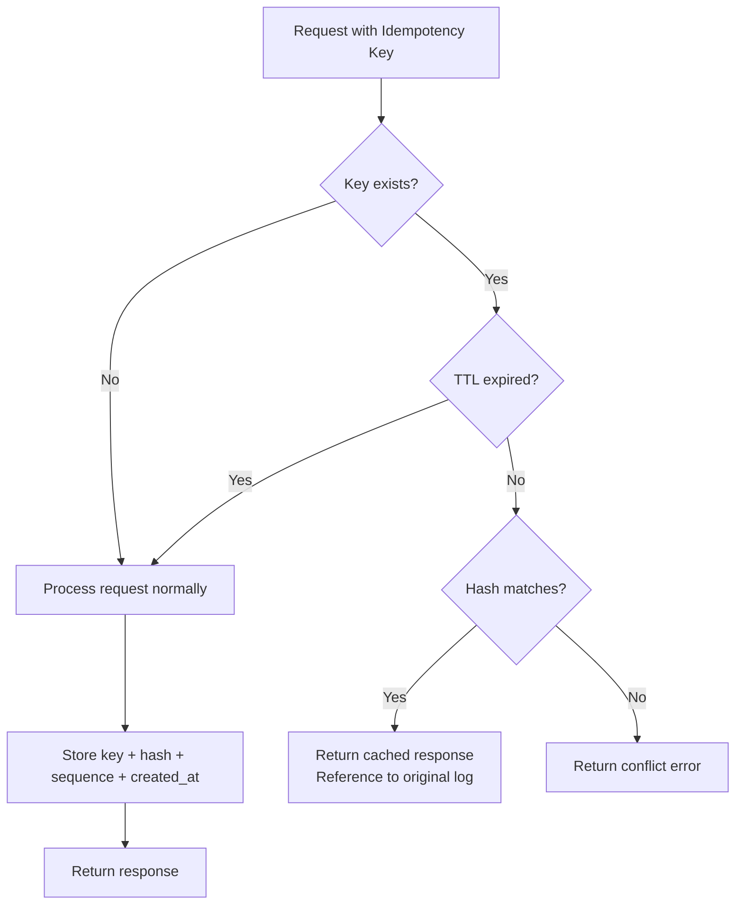

# Idempotency Keys

## Overview

Idempotency keys provide a mechanism to safely retry requests without risking duplicate operations. When a client includes an idempotency key with a request, the system guarantees that the operation will only be executed once, even if the request is sent multiple times.

Idempotency keys are stored under the dedicated `ZoneIdempotency` zone (`0x05`) with an in-memory bridge map for inter-proposal visibility. They are not part of the shared attribute/cache system.

## Key Characteristics

| Characteristic | Description |
|----------------|-------------|
| **Scope** | System-level (not per-ledger) |
| **Uniqueness** | Keys must be globally unique across all ledgers |
| **Hash verification** | Content is hashed (BLAKE3) to detect conflicts |
| **Persistence** | Stored under `{0x05, 0x01}` (`ZoneIdempotency` + `SubIdempKeys`) with a time index at `{0x05, 0x02}` (`ZoneIdempotency` + `SubIdempTimeIdx`) |
| **TTL** | Configurable time-to-live (default: 24h, 0 = no expiration) |
| **Eviction** | Deterministic cleanup via Raft `IdempotencyEviction` commands |

## How It Works

### Request Flow



### Hash Computation

When processing a request with an idempotency key:

1. **Hash computation**: The request content (excluding the idempotency key itself) is hashed using BLAKE3
2. **Storage**: The idempotency key maps to:
   - `LogSequence`: The global log sequence number of the original response
   - `Hash`: BLAKE3 hash of the request content
   - `CreatedAt`: HLC microsecond timestamp from the Raft entry

```go
type IdempotencyKeyValue struct {
    LogSequence uint64  // Global sequence number of the original log
    Hash        []byte  // BLAKE3 hash of the request content
    CreatedAt   uint64  // HLC microseconds (from Raft entry timestamp)
}
```

### Behavior Matrix

| Scenario | Result |
|----------|--------|
| New idempotency key | Process normally, store key |
| Same key + same content (within TTL) | Return reference to original log |
| Same key + different content (within TTL) | Return `idempotency key conflict` error |
| Same key (after TTL expiration) | Process normally (key treated as new) |
| No idempotency key | Process normally, no idempotency tracking |

## TTL and Eviction

### Configuration

| Flag | Default | Description |
|------|---------|-------------|
| `--idempotency-ttl` | `24h` | Time-to-live for idempotency keys (0 = no expiration) |
| `--idempotency-eviction-interval` | `60s` | How often the leader proposes eviction |

The TTL is persisted in `PersistedConfig` to ensure all Raft nodes use identical TTL values (FSM determinism requirement). Changing the TTL after first boot requires `--unsafe-skip-config-validation`.

### Eviction Mechanism

Expired idempotency keys are cleaned up via a dedicated Raft command (`IdempotencyEviction`):

1. The leader periodically computes `cutoff = now - TTL` and proposes an eviction
2. All nodes apply the eviction deterministically: scan in-memory map + Pebble, delete entries with `created_at <= cutoff`
3. The cutoff is embedded in the Raft proposal, so all nodes agree on exactly what to evict
4. No race conditions: eviction is serialized with business proposals in the FSM

### Memory Bounds

The in-memory map grows between eviction commands and shrinks on each eviction:
- With interval=60s and 1000 IK/s: ~60K entries x ~80B = ~5MB
- With interval=60s and 10K IK/s: ~600K entries x ~80B = ~48MB

## Storage Architecture

### Pebble Layout

```
[0x05][0x01][key_hash 16 bytes]                -> IdempotencyKeyValue protobuf
[0x05][0x02][created_at BE 8 bytes][key_hash 16 bytes]  -> empty (time index for eviction scan)
```

The key hash is a 16-byte BLAKE3 truncation of the idempotency key string.

### In-Memory Bridge

An in-memory map (`IdempotencyStore`) bridges state between consecutive proposals. A key written by proposal N must be visible to proposal N+1 even if N+1's preload ran before N was applied to Pebble.

```
Admission (preload) ─── direct Pebble Get ──> PreloadSet
                                                  │
FSM (apply) ─── in-memory map (bridge) ──────────>│
                │                                  │
                └── DerivedIdempotencyStore ───> Merge ──> Pebble [0x05][0x01]
```

### Preloading

During admission, idempotency keys are loaded directly from Pebble (no bloom filter, no dual-generation cache). The preload logic is in `internal/infra/preload/preloader.go`:

```go
value, err := state.LoadIdempotencyKey(reader, ik.Key)
if err != nil {
    results[i].err = err
    return
}

if value != nil {
    preloads = append(preloads, &raftcmdpb.Preload{
        Type: &raftcmdpb.Preload_IdempotencyKey{
            IdempotencyKey: &raftcmdpb.PreloadIdempotencyKey{
                Key:   ik.Key,
                Value: value,
            },
        },
    })
}
```

## API Usage

### HTTP API

Include the idempotency key in the `Idempotency-Key` HTTP header:

```bash
curl -X POST http://localhost:9000/my-ledger/transactions \
  -H "Content-Type: application/json" \
  -H "Idempotency-Key: unique-request-id-123" \
  -d '{
    "postings": [
      {"source": "world", "destination": "bank", "amount": 100, "asset": "USD"}
    ]
  }'
```

### gRPC API

Include the idempotency key in the `idempotency_key` field of the request.

## Supported Operations

All write operations support idempotency keys:

| Operation | Endpoint | Idempotency Support |
|-----------|----------|---------------------|
| Create transaction | `POST /{ledger}/transactions` | Yes |
| Revert transaction | `POST /{ledger}/transactions/{id}/revert` | Yes |
| Save account metadata | `POST /{ledger}/accounts/{addr}/metadata` | Yes |
| Delete account metadata | `DELETE /{ledger}/accounts/{addr}/metadata/{key}` | Yes |
| Save transaction metadata | `POST /{ledger}/transactions/{id}/metadata` | Yes |
| Delete transaction metadata | `DELETE /{ledger}/transactions/{id}/metadata/{key}` | Yes |
| Create ledger | `POST /{ledger}` | Yes |
| Delete ledger | `DELETE /{ledger}` | Yes |
| Bulk operations | `POST /{ledger}/_bulk` | Yes (per action) |

## Key Validation

| Rule | Limit | Error |
|------|-------|-------|
| Maximum length | 256 characters | `VALIDATION` (HTTP 400 / gRPC `INVALID_ARGUMENT`) |

## Error Handling

### Conflict Error

When a conflict is detected (same key, different content, within TTL):

**HTTP Response:**
```json
{
  "errorCode": "CONFLICT",
  "errorMessage": "idempotency key conflict: same key used with different request content"
}
```

**Status Code:** `409 Conflict`

### Best Practices

1. **Use unique keys**: UUIDs or composite keys (e.g., `{client-id}-{request-id}`)
2. **Be aware of TTL**: Keys expire after the configured TTL (default 24h)
3. **Don't reuse keys**: Even for "similar" operations
4. **Handle conflicts**: Implement retry logic with new keys on conflict
