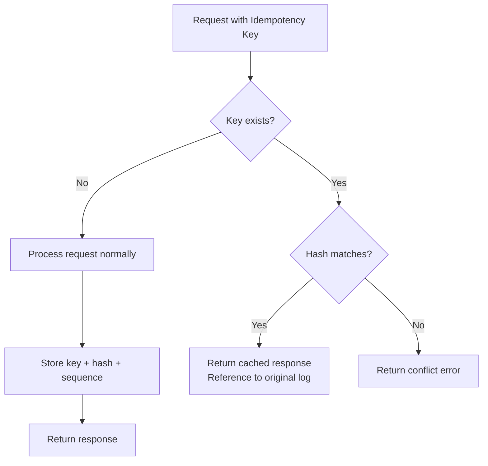

# Idempotency Keys

## Overview

Idempotency keys provide a mechanism to safely retry requests without risking duplicate operations. When a client includes an idempotency key with a request, the system guarantees that the operation will only be executed once, even if the request is sent multiple times.

Idempotency keys are implemented as a system [attribute](./attributes.md), following the same storage and caching patterns as volumes, metadata, and reversions.

## Key Characteristics

| Characteristic | Description |
|----------------|-------------|
| **Scope** | System-level (not per-ledger) |
| **Uniqueness** | Keys must be globally unique across all ledgers |
| **Hash verification** | Content is hashed (BLAKE3) to detect conflicts |
| **Persistence** | Stored in the generation-based cache and persisted to Pebble |
| **Immutability** | Once set, idempotency keys are never modified |

## How It Works

### Request Flow



### Hash Computation

When processing a request with an idempotency key:

1. **Hash computation**: The request content (excluding the idempotency key itself) is hashed using BLAKE3
2. **Storage**: The idempotency key maps to:
   - `LogSequence`: The global log sequence number of the original response
   - `Hash`: BLAKE3 hash of the request content

```go
type IdempotencyKeyValue struct {
    LogSequence uint64  // Global sequence number of the original log
    Hash        []byte  // BLAKE3 hash of the request content
}
```

### Behavior Matrix

| Scenario | Result |
|----------|--------|
| New idempotency key | Process normally, store key |
| Same key + same content | Return reference to original log |
| Same key + different content | Return `idempotency key conflict` error |
| No idempotency key | Process normally, no idempotency tracking |

## API Usage

### HTTP API

Include the idempotency key in the `Idempotency-Key` HTTP header:

```bash
# Create a transaction with idempotency key
curl -X POST http://localhost:9000/my-ledger/transactions \
  -H "Content-Type: application/json" \
  -H "Idempotency-Key: unique-request-id-123" \
  -d '{
    "postings": [
      {"source": "world", "destination": "bank", "amount": 100, "asset": "USD"}
    ]
  }'
```

### gRPC API

Include the idempotency key in the `idempotency_key` field of the request:

```protobuf
message Request {
  string idempotency_key = 1;
  oneof type {
    // ... request types
  }
}
```

```go
resp, err := client.Apply(ctx, &servicepb.ApplyRequest{
    Requests: []*servicepb.Request{{
        IdempotencyKey: "unique-request-id-123",
        Type: &servicepb.Request_Apply{
            Apply: &servicepb.LedgerApplyRequest{
                // ... request data
            },
        },
    }},
})
```

## Supported Operations

All write operations support idempotency keys:

| Operation | Endpoint | Idempotency Support |
|-----------|----------|---------------------|
| Create transaction | `POST /{ledger}/transactions` | ✅ |
| Revert transaction | `POST /{ledger}/transactions/{id}/revert` | ✅ |
| Save account metadata | `POST /{ledger}/accounts/{addr}/metadata` | ✅ |
| Delete account metadata | `DELETE /{ledger}/accounts/{addr}/metadata/{key}` | ✅ |
| Save transaction metadata | `POST /{ledger}/transactions/{id}/metadata` | ✅ |
| Delete transaction metadata | `DELETE /{ledger}/transactions/{id}/metadata/{key}` | ✅ |
| Create ledger | `POST /{ledger}` | ✅ |
| Delete ledger | `DELETE /{ledger}` | ✅ |
| Bulk operations | `POST /{ledger}/_bulk` | ✅ (per action) |

## Key Validation

Idempotency keys are validated at admission time:

| Rule | Limit | Error |
|------|-------|-------|
| Maximum length | 256 characters | `VALIDATION` (HTTP 400 / gRPC `INVALID_ARGUMENT`) |

Keys exceeding 256 characters are rejected before reaching Raft consensus. This limit applies to both the `Idempotency-Key` HTTP header and the `idempotency_key` gRPC field, as well as the `ik` field in bulk operations.

## Storage Architecture

### Cache Layer

Idempotency keys are stored in the generation-based cache (same as other attributes):

```
┌─────────────────────────────────────────────────────────┐
│                    AttributeLoader                       │
│         (Coordinates concurrent loads from store)        │
└─────────────────────────────────────────────────────────┘
                           │
                           ▼
┌─────────────────────────────────────────────────────────┐
│                  Generation Cache                        │
│   ┌─────────────┐    ┌─────────────┐                    │
│   │    Gen0     │    │    Gen1     │                    │
│   │  (current)  │    │  (previous) │                    │
│   └─────────────┘    └─────────────┘                    │
│      U128 → IdempotencyKeyValue                         │
└─────────────────────────────────────────────────────────┘
                           │
                           ▼
┌─────────────────────────────────────────────────────────┐
│                      Pebble                              │
│            (Persisted idempotency keys)                  │
└─────────────────────────────────────────────────────────┘
```

### Key Format

Idempotency keys are stored using the same U128 hash-based key format as other attributes:

- **ID**: 128-bit BLAKE3 hash of the key string
- **Tag**: 64-bit truncated hash for collision detection
- **Value**: `IdempotencyKeyValue` (log sequence + content hash)

## Preloading

During admission (before Raft proposal), idempotency keys are preloaded if:

1. The key is not guaranteed to be in the cache (`gen0 ∪ gen1`)
2. The key exists in the store

```go
// Only send preload if the key exists in the store
if result.Value != nil {
    cmd.Preload.Preloads = append(cmd.Preload.Preloads, &raftcmdpb.Preload{
        Type: &raftcmdpb.Preload_IdempotencyKey{
            IdempotencyKey: &raftcmdpb.PreloadIdempotencyKey{
                Id:          attrID,
                LogSequence: result.Value.LogSequence,
                Hash:        result.Value.Hash,
            },
        },
    })
}
```

This ensures the FSM can check idempotency deterministically without store reads.

## Error Handling

### Conflict Error

When a conflict is detected (same key, different content):

**HTTP Response:**
```json
{
  "errorCode": "CONFLICT",
  "errorMessage": "idempotency key conflict: same key used with different request content"
}
```

**Status Code:** `409 Conflict`

### Best Practices

1. **Use unique keys**: UUIDs or composite keys (e.g., `{client-id}-{request-id}`)
2. **Include timestamp in key**: `{operation}-{timestamp}-{random}` for debugging
3. **Don't reuse keys**: Even for "similar" operations
4. **Handle conflicts**: Implement retry logic with new keys on conflict

## Example: Safe Retry Pattern

```go
func createTransactionWithRetry(ctx context.Context, client LedgerClient, req *CreateTransactionRequest) (*Log, error) {
    idempotencyKey := uuid.New().String()
    
    for attempt := 0; attempt < 3; attempt++ {
        resp, err := client.Apply(ctx, &servicepb.ApplyRequest{
            Requests: []*servicepb.Request{{
                IdempotencyKey: idempotencyKey,
                Type: &servicepb.Request_Apply{
                    Apply: &servicepb.LedgerApplyRequest{
                        Ledger: req.Ledger,
                        Data: &servicepb.LedgerApplyRequest_CreateTransaction{
                            CreateTransaction: req.Transaction,
                        },
                    },
                },
            }},
        })
        
        if err != nil {
            if isRetryable(err) {
                // Same idempotency key - safe to retry
                continue
            }
            return nil, err
        }
        
        return resp.Logs[0], nil
    }
    
    return nil, errors.New("max retries exceeded")
}
```

## Next Steps

- [Deterministic FSM](./deterministic-fsm.md) - Generation-based caching that powers idempotency
- [API Documentation](./api.md) - Complete API reference
- [Data Flows](./data-flows.md) - Transaction processing flow
