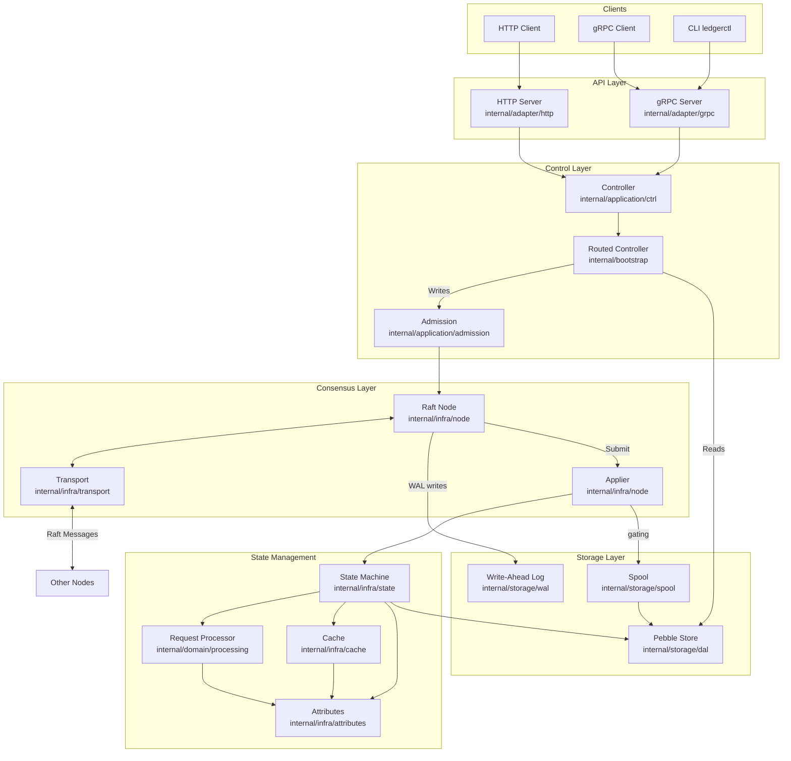
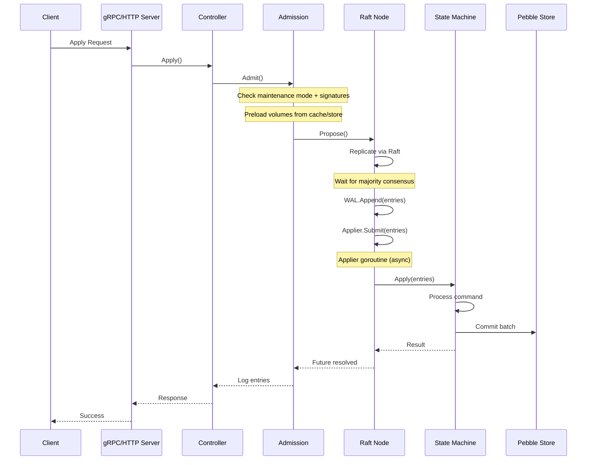
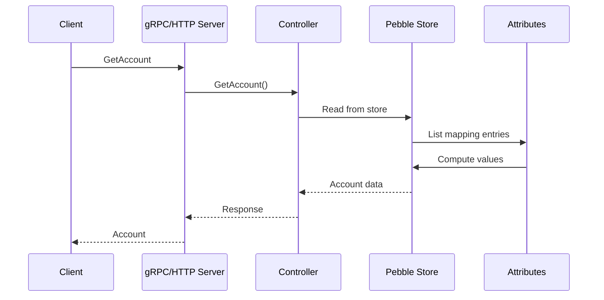
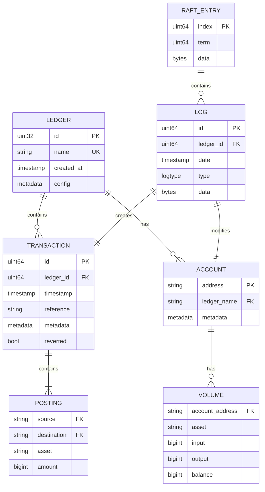
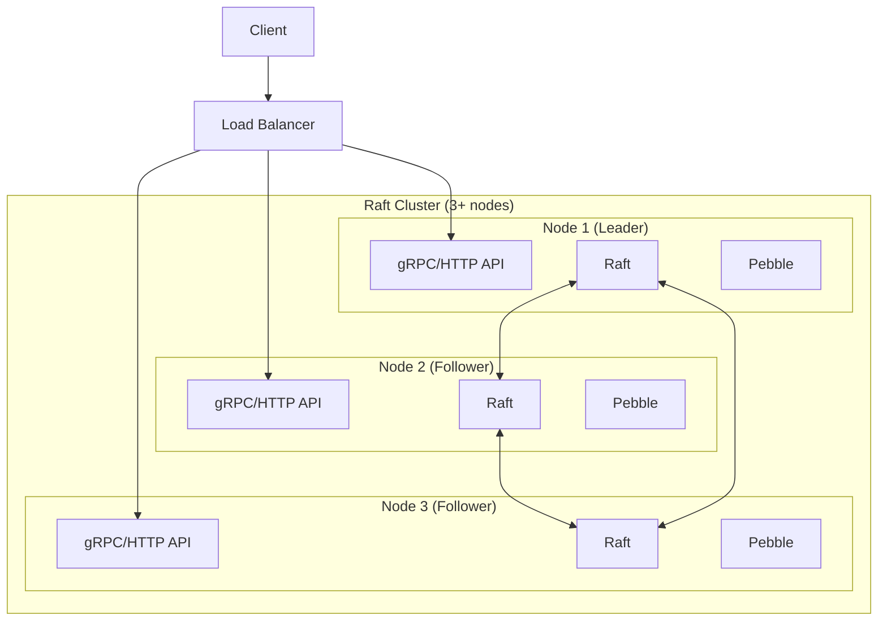

# Architecture Overview

This document provides a high-level overview of the Ledger v3 POC architecture, including component interactions and package dependencies.

## System Architecture

The Ledger v3 POC is a distributed ledger system built on Raft consensus. It provides strong consistency guarantees for financial transactions across a cluster of nodes.

## Component Interactions

### Request Flow (Write Path)

### Request Flow (Read Path)

## Package Dependencies

```mermaid
graph TB
    subgraph External["External Dependencies"]
        etcd[etcd/raft]
        pebble[cockroachdb/pebble]
        proto[protobuf/grpc]
        fx[uber/fx]
    end

    subgraph Bootstrap["internal/bootstrap"]
        app_module[module.go]
        app_ctrl[controller_routed.go]
    end

    subgraph GRPCAdapter["internal/adapter/grpc"]
        app_grpc[server_*.go]
    end

    subgraph Compat["internal/adapter"]
        http_handler[http/handler.go]
        http_server[http/server.go]
    end

    subgraph Ctrl["internal/application/ctrl"]
        ctrl_iface[controller.go]
        ctrl_default[controller_default.go]
        ctrl_store[store.go]
    end

    subgraph Node["internal/infra/node"]
        node_main[node.go]
        node_applier[applier.go]
        node_transport[transport.go]
        node_queue[queue.go]
    end

    subgraph State["internal/infra/state"]
        state_machine[machine.go]
        state_buffer[batch.go]
        state_snapshot[snapshot.go]
    end

    subgraph Processing["internal/domain/processing"]
        proc_main[processor.go]
        proc_cache[numscript/cache.go]
    end

    subgraph Admission["internal/application/admission"]
        adm_main[admission.go]
        adm_loader[preload/loader.go]
    end

    subgraph Cache["internal/infra/cache"]
        cache_main[cache.go]
        cache_gen[generation.go]
    end

    subgraph Attributes["internal/infra/attributes"]
        attr_main[attributes.go]
        attr_keystore[key_store.go]
        attr_u128[u128.go]
    end

    subgraph Storage["internal/storage"]
        data_store[dal/store.go]
        data_batch[dal/batch.go]
        wal_main[wal/wal.go]
        spool_main[spool/spool.go]
    end

    subgraph Proto["internal/proto"]
        commonpb[commonpb/]
        servicepb[servicepb/]
        raftcmdpb[raftcmdpb/]
        clusterpb[clusterpb/]
    end

    %% External dependencies
    node_main --> etcd
    data_store --> pebble
    app_grpc --> proto
    app_module --> fx

    %% Application layer
    app_module --> app_grpc
    app_module --> app_ctrl
    app_module --> http_handler
    app_ctrl --> ctrl_iface

    %% HTTP layer
    http_handler --> ctrl_iface
    http_server --> http_handler

    %% Controller layer
    ctrl_default --> ctrl_store
    ctrl_store --> attr_main
    ctrl_default --> data_store

    %% Node layer
    node_main --> node_applier
    node_main --> node_transport
    node_main --> wal_main
    node_applier --> state_machine
    node_applier --> spool_main
    node_main --> cache_main

    %% State layer
    state_machine --> state_buffer
    state_machine --> proc_main
    state_machine --> cache_main
    state_machine --> attr_keystore
    state_buffer --> attr_main

    %% Processing layer
    proc_main --> attr_keystore
    proc_main --> proc_cache

    %% Admission layer
    adm_main --> adm_loader
    adm_main --> cache_main
    adm_main --> node_main

    %% Cache layer
    cache_main --> cache_gen
    cache_main --> attr_keystore

    %% Attributes layer
    attr_main --> attr_keystore
    attr_keystore --> attr_u128

    %% Storage layer
    data_store --> data_batch
    wal_main --> data_store
    spool_main --> data_store

    %% Proto dependencies
    state_machine --> commonpb
    state_machine --> raftcmdpb
    app_grpc --> servicepb
    app_grpc --> clusterpb
```

## Entity Relationship Diagram

## Key Components

### 1. API Layer (`internal/adapter/grpc`, `internal/adapter/http`)

- **gRPC Server**: Primary API for client interactions, supports Apply, GetLedger, GetAccount, GetTransaction
- **HTTP Server**: REST compatibility layer for legacy clients
- **Routed Controller**: Routes requests to leader node for writes, serves reads locally

### 2. Control Layer (`internal/application/ctrl`, `internal/application/admission`)

- **Controller**: Interface defining read and write operations
- **DefaultController**: Local implementation reading from Pebble store
- **Admission**: Handles write request admission, preloads volumes, coordinates with Raft

### 3. Consensus Layer (`internal/infra/node`, `internal/infra/transport`)

- **Raft Node**: Wraps etcd/raft, manages consensus, WAL writes, and transport
- **Applier**: Dedicated goroutine that applies committed entries to the FSM (or spools them during maintenance). Decouples WAL writes from FSM application so they overlap across consecutive Ready cycles.
- **Transport**: gRPC-based message transport between cluster nodes
- **Connection Pool**: Manages persistent gRPC connections to peers

### 4. State Management (`internal/infra/state`, `internal/domain/processing`)

- **State Machine (FSM)**: Deterministic state machine, processes Raft log entries
- **Request Processor**: Business logic for transactions, Numscript execution
- **Buffer**: Accumulates changes during command processing before commit

### 5. Caching Layer (`internal/infra/cache`, `internal/infra/attributes`)

- **Cache**: Dual-generation cache for hot data, rotates based on Raft index
- **Attributes**: Generic attribute system for volumes, metadata, reversions
- **KeyStore**: Hash-based key mapping with collision detection

### 6. Storage Layer (`internal/storage/dal`, `internal/storage/wal`, `internal/storage/spool`)

- **Pebble Store**: Persistent key-value storage for all state
- **WAL (Write-Ahead Log)**: Durability for Raft entries before FSM apply
- **Spool**: Committed entry buffer during FSM synchronization

## Data Flow Summary

| Operation | Path | Consensus Required |
|-----------|------|-------------------|
| Create Ledger | Client → API → Admission → Raft → FSM → Store | Yes |
| Create Transaction | Client → API → Admission → Raft → FSM → Store | Yes |
| Get Account | Client → API → Controller → Store | No (local read) |
| Get Transaction | Client → API → Controller → Store | No (local read) |
| Revert Transaction | Client → API → Admission → Raft → FSM → Store | Yes |
| Save Metadata | Client → API → Admission → Raft → FSM → Store | Yes |

## Deployment Topology

## See Also

- [Raft Consensus](./raft-consensus.md) - Detailed Raft implementation
- [Deterministic FSM](./deterministic-fsm.md) - State machine design
- [Attributes](./attributes.md) - Attribute storage system
- [Storage](./storage.md) - Persistence architecture
- [gRPC API](./grpc-api.md) - API documentation
