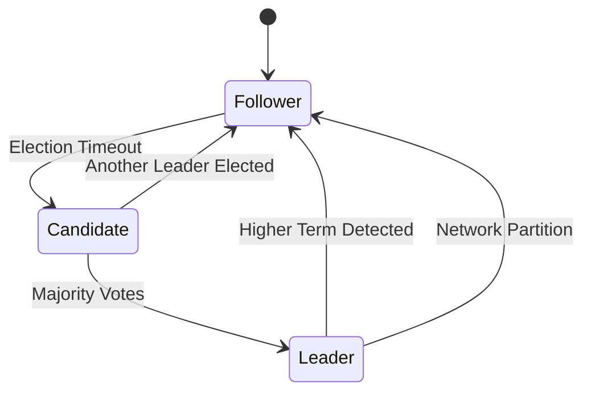
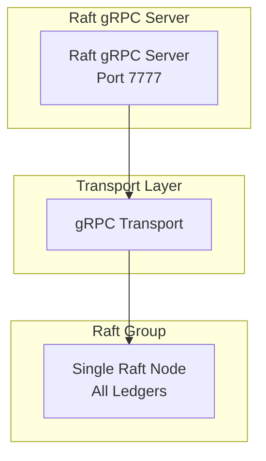
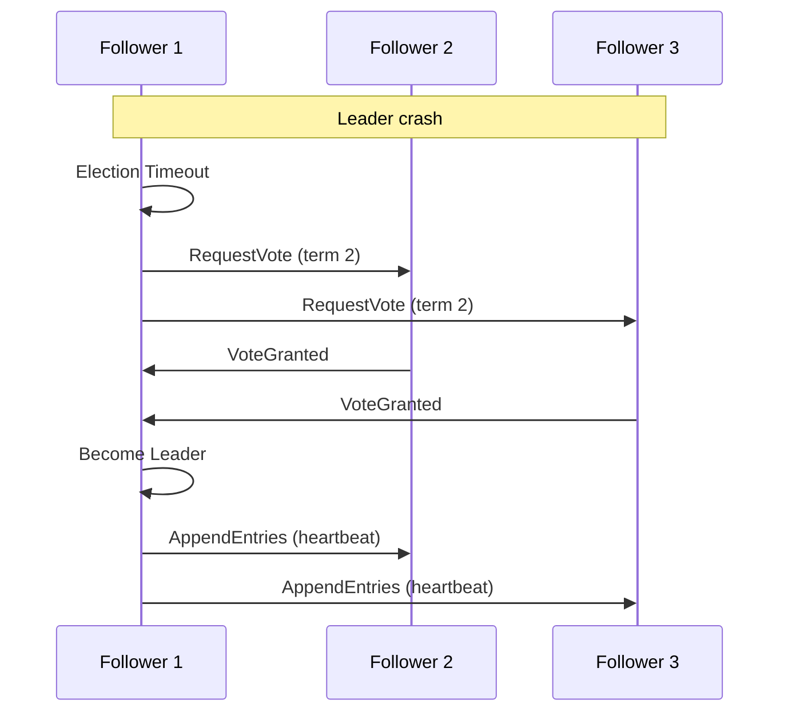
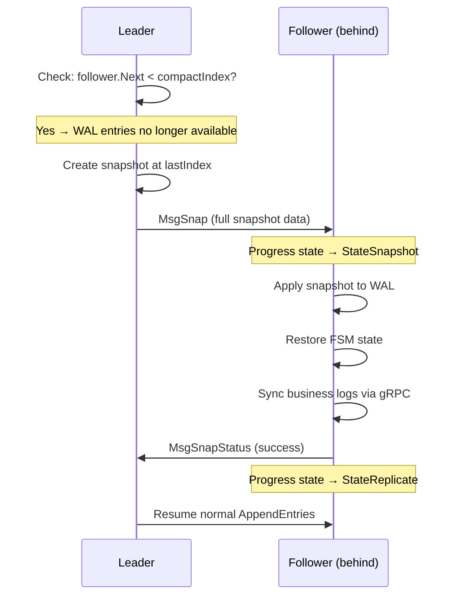

# Raft Consensus

## Introduction

Ledger v3 POC uses the Raft consensus protocol to ensure data consistency across the cluster. The system implements a **single Raft group** architecture where all operations (ledger management and transactions) go through the same consensus layer.

## Raft Overview

Raft is a distributed consensus algorithm designed to be easy to understand and implement. It ensures that all nodes in the cluster maintain a consistent copy of the data.

### Raft Node States

A Raft node can be in one of the following states:

- **Leader**: Handles all write requests and replicates data to followers
- **Follower**: Receives updates from the leader and votes in elections
- **Learner**: Receives updates from the leader but does not vote (non-voting replica)
- **Candidate**: Transient state during leader election
- **PreCandidate**: Transient state before becoming candidate (optional)

Nodes join the cluster as **learners** and are automatically promoted to **voters** (followers) once they catch up. See [Cluster Lifecycle](../../ops/cluster-operations.md) for the complete bootstrap/join/promotion flow.



## Single Raft Architecture

### Unified Command Processing

The single Raft group handles all commands through a unified FSM:

**Managed Commands**:
- `CreateLedgerCommand`: Create a new ledger
- `DeleteLedgerCommand`: Delete an existing ledger
- `CreateLogCommand`: Insert a log (transaction, metadata changes, reversions) into any ledger

**FSM**: `internal/service/state/machine.go`

### State Management

The FSM maintains a unified state for all ledgers:

```protobuf
message State {
  map<uint32, LedgerState> ledgers = 1;  // All ledgers by numeric ID
  uint32 next_ledger_id = 2;
  uint64 next_sequence = 3;              // Global log sequence
  uint64 checkpoint_id = 4;
}

message LedgerState {
  LedgerInfo ledger_info = 1;
  uint64 next_log_id = 2;
  uint64 next_transaction_id = 3;
}
```

### Advantages of Single Raft

1. **Simplified Operations**: Only one Raft group to monitor and maintain
2. **Unified Snapshots**: Single snapshot contains all ledger states
3. **Atomic Multi-Ledger Operations**: Easier to implement cross-ledger features in the future
4. **Reduced Resource Usage**: No overhead from multiple Raft leaders and elections

## Technical Implementation

### Library Used

The system uses `go.etcd.io/etcd/raft/v3`, a high-quality Raft implementation used by etcd.

### Main Components

#### Node Wrapper

`internal/service/node/node.go` provides a wrapper around `raft.RawNode` that:

- Manages node lifecycle
- Processes incoming Raft messages
- Applies committed commands to the FSM (Machine)
- Manages snapshots and synchronization

```go
type Node struct {
    rawNode                 *raft.RawNode
    logger                  logging.Logger
    fsm                     *state.Machine
    wal                     wal.WAL
    transport               Transport
    config                  NodeConfig
    spool                   spool.Spool
    store                   *data.Store
    snapshotFetcherProvider state.SnapshotFetcherProvider
    // ... and other fields
}
```

#### Storage

`internal/storage/wal/wal.go` implements the WAL storage required by etcd/raft:

- **HardState**: Cluster state (term, vote, commit index)
- **Entries**: Raft log entries
- **Snapshots**: System snapshots

#### Transport

`internal/service/node/transport.go` manages communication between nodes:

- Send Raft messages
- Receive Raft messages
- Detect unreachable nodes



## Raft Configuration

### Configurable Parameters

The system exposes several configurable Raft parameters:

```go
type NodeConfig struct {
    ElectionTick         int           // Election timeout in ticks (default: 10)
    HeartbeatTick        int           // Heartbeat interval in ticks (default: 1)
    MaxSizePerMsg        uint64        // Maximum size per message in bytes (default: 1MB)
    MaxInflightMsgs      int           // Maximum number of in-flight messages (default: 256)
    TickInterval         time.Duration // Interval between ticks
    SnapshotThreshold    uint64        // Number of logs before triggering a snapshot
    CompactionMargin     uint64        // Compaction margin in number of logs
    ProposeQueueCapacity int           // Capacity of the propose queue
}
```

### Timeout Calculation

Raft timeouts are calculated by multiplying ticks by `TickInterval`:

- **Election Timeout**: `ElectionTick * TickInterval` (default: 10 * 100ms = 1s)
- **Heartbeat Interval**: `HeartbeatTick * TickInterval` (default: 1 * 100ms = 100ms)

### Recommendations

For a stable cluster:
- `ElectionTick`: 10-20 (reasonable election timeout)
- `HeartbeatTick`: 1-2 (frequent heartbeat to quickly detect failures)
- `TickInterval`: 50-200ms (balance between responsiveness and CPU load)

## Leader Election

### Election Process

1. A follower detects it hasn't received a heartbeat from the leader for `ElectionTick` ticks
2. It transitions to `Candidate` state and increments its `term`
3. It sends `RequestVote` to all other nodes
4. If a majority votes for it, it becomes `Leader`
5. It immediately sends heartbeats to prevent other elections

### Election Scenarios

#### Normal Election



#### Split Vote

If two nodes become candidates simultaneously, neither can obtain a majority. They wait for a new timeout and retry with a higher term.

## Data Replication

### Replication Process

1. Client sends a write request to the leader
2. Leader adds the entry to its local log
3. Leader sends `AppendEntries` to all followers
4. When a majority confirms, the leader commits the entry
5. Leader applies the entry to its FSM
6. Leader returns the response to the client

### Consistency Guarantees

- **Linearizability**: All operations are seen in the same order by all nodes
- **Durability**: Once committed, an entry is guaranteed to be persisted
- **Consistency**: All nodes see the same data once synchronized

## Snapshots

### Why Snapshots?

Raft logs grow indefinitely. Snapshots allow:
- Compacting old logs
- Reducing recovery time after a failure
- Limiting disk usage

### Snapshot Creation

Snapshots are created automatically when:
- The number of logs exceeds `SnapshotThreshold`

### Snapshot Contents

A snapshot contains:
- Complete FSM state at a given index (all ledgers and their states)
- Metadata necessary to restore the state

### Restoring from a Snapshot

When a node joins the cluster or recovers after a failure:
1. It loads the most recent snapshot
2. It restores the FSM state from the snapshot
3. It applies log entries after the snapshot index
4. For each ledger, it syncs missing logs from the leader via gRPC streaming

## Failure Management

### Failure Types

#### Leader Failure

1. Followers detect the absence of heartbeat
2. A new election is triggered
3. A new leader is elected
4. The cluster continues to function

#### Follower Failure

1. The leader continues to function with other followers
2. The missing follower is marked as unreachable
3. When the follower returns, it synchronizes automatically

### Desynchronized Follower Detection

The Raft leader maintains a **progress tracker** for each follower that tracks:
- `Match`: The highest log index known to be replicated on this follower
- `Next`: The next log index to send to this follower

#### Detection Mechanism

```
Leader Progress Tracker:
┌────────────────────────────────────────────────────────────────────┐
│ Follower 2:  Match=950   Next=951   State=Replicate               │
│ Follower 3:  Match=100   Next=101   State=Probe       ← Behind!   │
└────────────────────────────────────────────────────────────────────┘
```

1. **Normal operation**: When a follower successfully receives `AppendEntries`, it returns success and the leader advances `Match` and `Next`

2. **Follower behind**: When `AppendEntries` fails (term mismatch or log inconsistency), the leader decreases `Next` and retries with earlier entries. The follower enters `StateProbe`.

3. **Follower too far behind**: If the required entries have been compacted from the WAL (index < compactIndex), the leader **cannot** send the missing entries.

#### Snapshot Transfer (MsgSnap)

When a follower is too far behind for log replay, the leader sends a **MsgSnap** (InstallSnapshot) message:



#### Progress States

The leader tracks each follower's state:

| State | Description |
|-------|-------------|
| `StateProbe` | Follower's `Match` is unknown, sending one entry at a time |
| `StateReplicate` | Normal operation, pipeline enabled |
| `StateSnapshot` | Snapshot is being sent, waiting for confirmation |

#### Code Reference

In `internal/service/node/node.go`, the follower receives and applies the snapshot through a two-phase process:

```go
// Phase 1: Install snapshot to FSM (in-memory state)
if !raft.IsEmptySnap(rd.Snapshot) {
    node.logger.Infof("Applying snapshot sent by leader")
    
    // Write snapshot to WAL
    node.wal.ApplySnapshot(rd.Snapshot)
    
    // Install snapshot state in FSM (fast, in-memory)
    node.fsm.InstallSnapshot(rd.Snapshot.Data)
    
    // Report success to Raft
    node.rawNode.ReportSnapshot(rd.Snapshot.Metadata.Index, raft.SnapshotFinish)
}

// Phase 2: Synchronize store with leader (async, can be slow)
// This happens when the FSM detects the store is behind
if !node.fsm.IsStoreUpToDate() {
    node.fsm.SynchronizeWithLeader(ctx, leaderID, logReaderProvider)
}
```

#### Snapshot Synchronization Flow

The `SynchronizeWithLeader` method handles the complex task of bringing the store up to date:

1. **Ledger reconciliation**: Compare FSM ledgers with store ledgers
   - Delete ledgers that exist in store but not in FSM
   - Register new ledgers that exist in FSM but not in store
2. **Log synchronization**: For each ledger, stream missing logs from the leader
3. **Store update**: Apply logs to bring balances and metadata up to date

#### Why Two-Level Synchronization?

The snapshot contains only the **FSM state** (ledger metadata, next IDs). After receiving a snapshot, the follower must also sync **business logs** from the leader's Store:

1. **Snapshot** → FSM state (lightweight, ~KB)
2. **gRPC StreamLogs** → Transaction logs per ledger (can be large, ~GB)

This two-level approach avoids embedding large transaction data in Raft snapshots.

See [Follower Synchronization](./data-flows.md#follower-synchronization) for the detailed synchronization flow

#### Network Partition

If the cluster is partitioned:
- The partition with the majority continues to function
- The minority partition cannot elect a leader
- When the partition is resolved, nodes synchronize

### Recovery

Recovery after failure is automatic:
- Nodes reconnect automatically
- Synchronization happens via logs or snapshots
- No manual intervention is required

## Performance and Optimizations

### Batching

Commands can be batched to improve throughput:
- Multiple commands in a single `AppendEntries`
- Reduction in the number of network messages
- Overall throughput improvement

### Pipeline

The system can pipeline requests:
- Send multiple `AppendEntries` before receiving confirmations
- Limited by `MaxInflightMsgs`

### Local Reads

Reads can be served locally without going through Raft:
- Followers can read their local data
- Only writes require consensus
- Significant improvement in read performance

## Next Steps

To deepen your understanding:

1. [Cluster Lifecycle](../../ops/cluster-operations.md) - Bootstrap, join, synchronization, and learner promotion
2. [Ledgers](./buckets-ledgers.md) - How ledgers are managed
3. [Storage and Persistence](./storage.md) - Raft storage implementation
4. [Data Flows](./data-flows.md) - Detailed Raft operation flows
5. [gRPC Connections](./grpc-connections.md) - Transport layer, reconnection strategies, and rolling deployment optimizations
