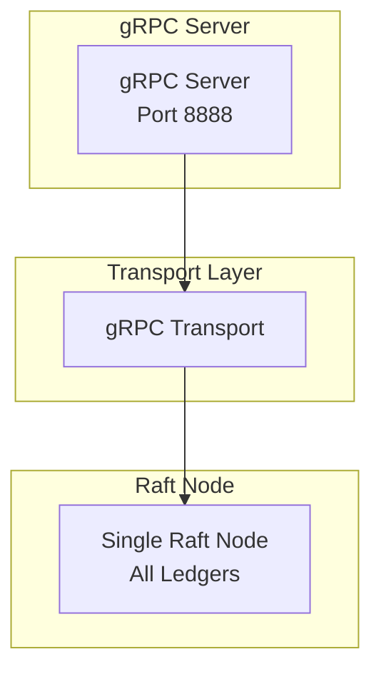
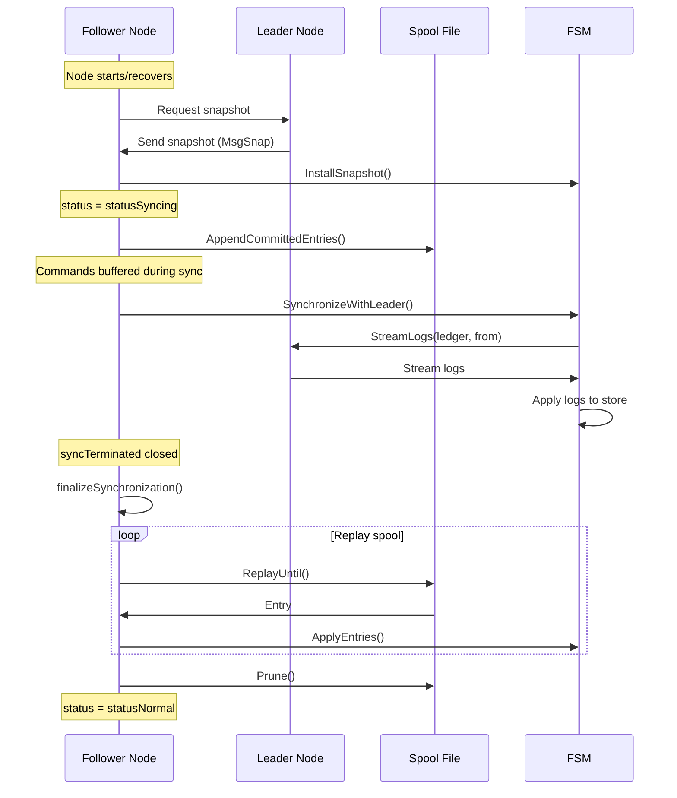

# Advanced Concepts

## Overview

This document covers advanced concepts and implementation details of the Ledger v3 POC system.

## gRPC Transport

### Concept

The system uses a gRPC transport for inter-node communication. This handles:

- Raft message exchange between nodes
- Request forwarding to the leader
- Log synchronization during recovery

### Architecture



### Message Routing

Raft messages are sent directly between nodes via gRPC:

- **Leader to Followers**: AppendEntries, Heartbeats
- **Followers to Leader**: Vote requests, Log responses
- **Any to Leader**: Forwarded write requests

## Connection Management gRPC

### Connection Pool

The system maintains a gRPC connection pool to avoid creating a new connection at each request:

```go
type ConnectionPool struct {
    mu          sync.RWMutex
    connections map[uint64]*grpc.ClientConn
    dialer      func(uint64) (*grpc.ClientConn, error)
}
```

### Reuse

Connections are reused for:
- Request forwarding to the leader
- Raft communication between nodes
- Log synchronization

### Lifecycle Management

- Connections are created on demand
- They are reused as long as they are valid
- They are closed during node shutdown

## Snapshot Restoration and Synchronization

### Synchronization Process

When a node joins the cluster or recovers from a failure, it must synchronize its state with the leader. The synchronization process involves:

1. **Snapshot Restoration**: The node receives and restores a snapshot from the leader
2. **Spool Buffering**: Commands arriving during synchronization are buffered in a spool file
3. **Log Catch-up**: Missing logs are streamed from the leader using range queries
4. **Spool Replay**: Buffered commands are replayed sequentially after catch-up completes

### Spool: Command Buffer

**File**: `internal/storage/spool/spool.go`

The spool is a persistent buffer that stores commands during synchronization:

- **Purpose**: Prevents command loss during synchronization
- **Location**: `{dataDir}/spool`
- **Format**: Binary records with CRC32 checksums

**Operations**:
- `AppendCommittedEntries()`: Write commands to the spool during sync
- `Next()`: Read the next command (iterator pattern, returns `io.EOF` when done)
- `Reset()`: Clear the spool after replay completes

**Record Format**:
```
[Magic: 4 bytes] [Length: 4 bytes] [CRC32: 4 bytes] [Reserved: 4 bytes] [Payload: variable]
```

### Synchronization Manager

**File**: `internal/infra/node/node.go`

The Node manages the synchronization lifecycle directly (previously in a separate `syncer.go` file):

- **Syncing State**: Tracks whether the node is currently synchronizing (`status` field)
- **Command Routing**: Routes commands to spool during sync, to FSM during normal operation
- **Replay Coordination**: Manages the replay of spool commands after catch-up via `finalizeSynchronization()`

**Synchronization Flow**:



### Log Range Queries

During catch-up, the system uses range queries to efficiently stream only the needed logs:

- **From Snapshot**: `GetAllLogs(ctx, ledger, snapshotSequence, targetSequence)`
- **Efficient**: Only streams logs in the required range
- **Per Ledger**: Logs are streamed for each ledger that has missing data

**Implementation**:
- Pebble: Range iteration with prefix-based key filtering
- gRPC: `StreamLogs` with ledger name and `from_id`/`to_id` parameters

## Command Batching

### Concept

To improve throughput, multiple commands can be batched in a single Raft entry or multiple entries can be proposed in parallel.

### Implementation

The system supports batching at the application level:

```go
// Multiple commands in ApplyEntries
results := fsm.ApplyEntries(ctx, commands...)
```

### Advantages

- Reduction in the number of network messages
- Overall throughput improvement
- Better resource utilization

### Limitations

- Commands must be independent
- The order must be preserved
- Errors must be handled individually

## Idempotency Management

### Concept

Idempotency keys allow avoiding duplicate operations in case of retry. In Ledger v3, idempotency is managed at the **system level**, meaning the same idempotency key applies across all ledgers and all operation types (ledger creation, deletion, and ledger log operations).

### System-Level Idempotency

Unlike v2 where idempotency was per-ledger, v3 implements **global idempotency**:

- **Single namespace**: Idempotency keys are unique across the entire system
- **All operations covered**: Ledger creation, ledger deletion, transactions, metadata operations
- **Cross-ledger safety**: The same idempotency key cannot be used for operations on different ledgers

This approach simplifies client implementations and provides stronger guarantees for distributed systems.

### Storage

Idempotency keys are stored:
- **In the Store**: For fast access and persistence
- **System-wide**: Keyed by `idempotency_key` (no ledger prefix)
- **Linked to global sequence**: Points to the global log sequence number

### Verification

Verification is done before proposing commands:

1. **Lock idempotency key**: Acquire distributed lock on `ik/{idempotency_key}`
2. **Check in Store**: Query `GetSequenceForIdempotencyKey()`
3. **If found**: Retrieve log by sequence, verify hash matches, return cached log
4. **If not found**: Proceed with command proposal

### Format

```go
type Idempotency struct {
    Key  string  // The idempotency key
    Hash []byte  // Hash of the input for verification
}
```

### Example Flow

> **Note**: This example uses the deprecated `KeySetLocker` pattern. The current implementation uses `AttributeLoader` for concurrent load coordination. See [Deterministic FSM - Concurrent Load Coordination](../technical/architecture/core/deterministic-fsm.md#76-concurrent-load-coordination-attributeloader) for the current approach.

```go
// All action types go through the same idempotency check
func forgeAction(ctx context.Context, s store.Store, keySetLocker KeySetLocker, 
                 in *ForgeActionInput, builder ForgeActionBuilder) (*Action, *Log, error) {
    if in.IdempotencyKey != "" {
        // 1. Acquire system-level lock
        release, err := keySetLocker.TryLockKeys(ctx, "ik/"+in.IdempotencyKey)
        if err != nil {
            return nil, nil, ErrIdempotencyKeyConflict
        }
        defer release()

        // 2. Check if already processed
        sequence, err := s.GetSequenceForIdempotencyKey(ctx, in.IdempotencyKey)
        if err == nil && sequence > 0 {
            log, _ := s.GetLogBySequence(ctx, sequence)
            // 3. Verify hash and return cached response
            if hashMatches(log.Idempotency.Hash, in.Input) {
                return nil, log, nil
            }
            return nil, nil, ErrIdempotencyKeyConflict
        }
    }
    // 4. Build and apply new action
    cmd, err := builder(ctx, uow, in)
    // ...
}
```

## Balance Reconstruction

### Problem

Balances must be available after a failure or at startup of a new node.

### Solution

Balances are **not** reconstructed by replaying all logs (which would be too slow). Instead:

1. **Persistent balances**: Balances are stored in the Store alongside logs and updated on every write
2. **Snapshot-based recovery**: On restart, state is rebuilt from the last Store snapshot
3. **Incremental catch-up**: Only Raft entries after the snapshot need to be applied

### How It Works

- The Store persists volume entries in Pebble
- On `AppendLogs()`, balances are updated atomically with the log insertion
- On recovery, the Store snapshot already contains the correct balances up to the snapshot point
- Only the recent Raft entries (after the snapshot) need to be replayed

## Timeout Management

### Raft Timeouts

Raft timeouts are calculated dynamically:

- **Election Timeout**: `ElectionTick * TickInterval`
- **Heartbeat Interval**: `HeartbeatTick * TickInterval`

### Recommendations

For a stable cluster:

- **ElectionTick**: 10-20 (reasonable timeout)
- **HeartbeatTick**: 1-2 (quick failure detection)
- **TickInterval**: 50-200ms (balance performance/responsiveness)

### Dynamic Adjustment

Timeouts can be adjusted according to conditions:

- **Slow network**: Increase timeouts
- **Fast network**: Reduce timeouts for more responsiveness

## Network Partition Management

### Scenario

If the cluster is partitioned into two groups:

- **Majority partition**: Continues to function, elects a leader
- **Minority partition**: Cannot elect a leader, blocks writes

### Detection

Nodes detect partitions via:
- Absence of heartbeats from the leader
- Unsuccessful election attempts
- Raft messages rejected (lower term)

### Recovery

When the partition is resolved:

1. Nodes detect a higher term
2. They synchronize with the leader
3. Missing logs are replicated
4. The state is unified

## Performance and Optimizations

### Local Reads

Reads can be served locally without going through Raft:

- `GetLedger`: Read from the local FSM
- `GetAllLedgers`: Read from the local FSM
- `GetBalances`: Read from the local Store
- `GetAllLogs`: Read from the local Store

### Writes via Leader

All writes must go through the leader:

- Automatic forwarding if necessary
- Leader detection via `GetLeader()`
- "No Leader" error handling

### Raft Pipeline

The system can pipeline requests:

- Send multiple `AppendEntries` before receiving confirmations
- Limited by `MaxInflightMsgs`
- Improves throughput but increases latency

### Compression

Raft messages can be compressed:

- Bandwidth reduction
- Network performance improvement
- CPU/bandwidth trade-off

## Security

### Inter-node Authentication

Currently, no authentication is required between nodes. In production:

- **mTLS**: Mutual authentication via TLS
- **Tokens**: Token authentication
- **Network Policies**: Network-level restriction

### Encryption

Communications can be encrypted:

- **TLS for gRPC**: Encryption of inter-node communications
- **TLS for HTTP**: Encryption of client-server communications

### Authorization

Authorization can be added:

- **RBAC**: Roles and permissions
- **Policies**: Access policies per ledger

## Extensibility

### Adding a New Storage Driver

1. Implement the `Store` interface
2. Add the driver in the factory function
3. Register the storage type flag

### Adding a New Command Type

1. Define the protobuf in `misc/proto/raftcmd.proto`
2. Regenerate protobufs using `just generate-proto`
3. Create the command function in `internal/pkg/commands/command.go`
4. Add the handler in the FSM (`internal/infra/state/machine.go`)
5. Update `ApplyEntries` to handle the new command type

### Adding a New Log Type

1. Define the type in `misc/proto/common.proto`
2. Regenerate protobufs using `just generate-proto`
3. Implement the conversion protobuf ↔ Go in `internal/proto/commonpb/`
4. Add support in the Store
5. Update the handlers

## Known Limitations

### Maximum Ledgers

- Each ledger is assigned a unique numeric uint32 ID (~4.3 billion max per cluster)
- In practice limited by available memory, since each ledger maintains in-memory state

### Message Size

- Limited by `MaxSizePerMsg` (default: 1MB)
- Large transactions may require an adjustment

### Latency

- All writes go through the leader
- Latency depends on replication to majority
- Reads can be served locally

### Single Leader

- All ledgers share the same Raft leader
- High write volume across many ledgers may bottleneck at the leader

## Next Steps

To deepen your understanding:

1. [Raft Consensus](../technical/architecture/core/raft-consensus.md) - Details on Raft
2. [Storage and Persistence](../technical/architecture/storage/storage.md) - Storage optimizations
3. [Development](../technical/contributing/development.md) - Implementing new features
