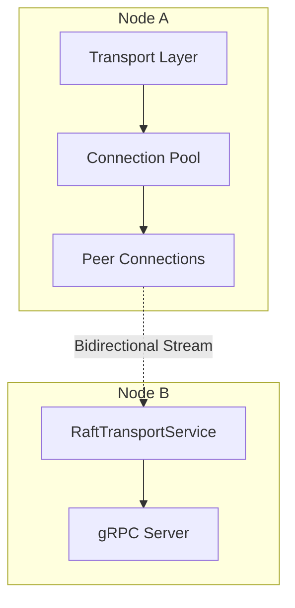
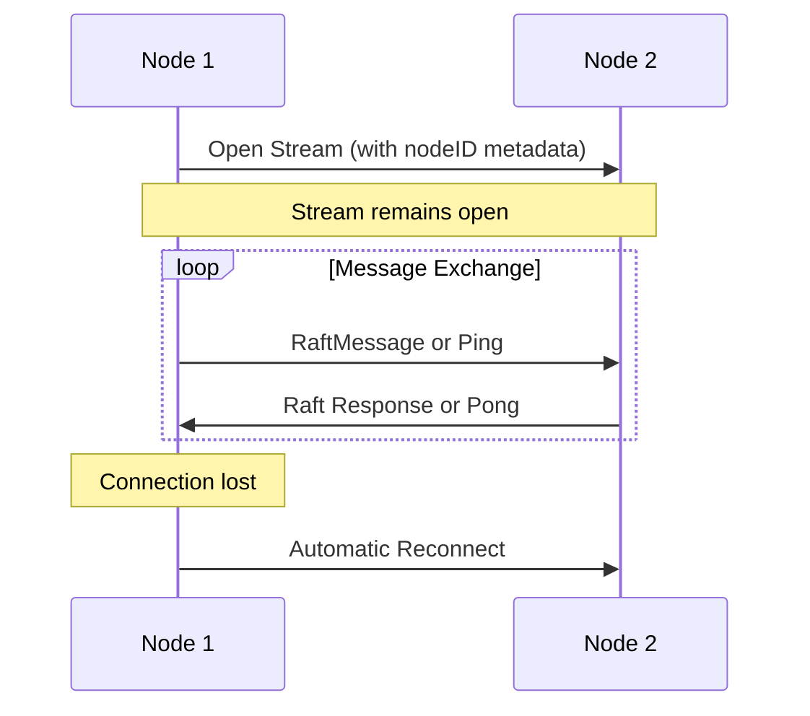
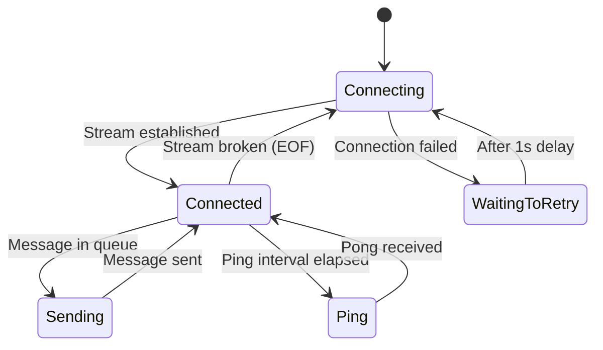
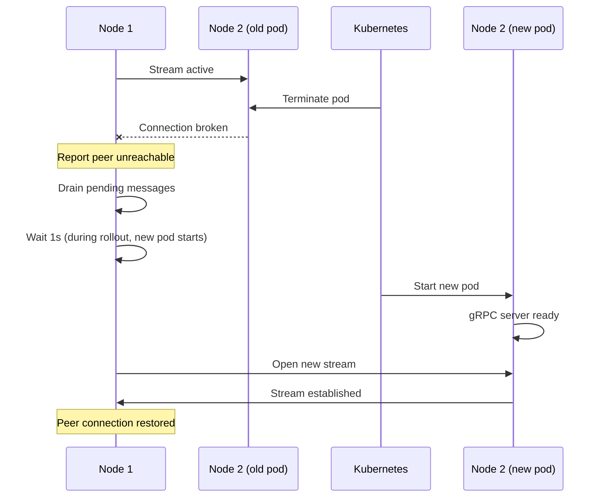

# gRPC Connection Mechanics

## Overview

The Ledger v3 POC uses gRPC for inter-node communication within the Raft cluster. This document describes the connection architecture and the measures implemented to ensure the fastest possible automatic reconnection during rolling deployments or network failures.

## Architecture



## Key Components

### Connection Pool

**File**: `internal/transport/connection_pool.go`

The connection pool manages raw gRPC connections to peers. Each connection is created lazily when needed.

```go
type ConnectionPool struct {
    peers map[uint64]string  // peer ID -> address
}
```

### Transport Layer

**File**: `internal/raft/transport.go`

The transport layer wraps the connection pool and manages Raft-specific message routing:

- **Priority Queues**: Messages are prioritized (heartbeats, votes, and append entries have different priorities)
- **Per-Peer Connections**: Each peer has a dedicated bidirectional stream
- **Unreachable Detection**: Reports unreachable peers to the Raft node

## Reconnection Strategy

### Aggressive Backoff Configuration

The connection pool uses an aggressive backoff strategy optimized for fast reconnection:

```go
grpc.WithConnectParams(grpc.ConnectParams{
    Backoff: backoff.Config{
        BaseDelay:  100 * time.Millisecond,  // Start with 100ms delay
        Multiplier: 1.6,                      // Exponential multiplier
        Jitter:     0.2,                      // 20% jitter to avoid thundering herd
        MaxDelay:   time.Second,              // Never wait more than 1 second
    },
    MinConnectTimeout: time.Second,
})
```

**Critical Design Decision**: `MaxDelay` is set to 1 second, which is **less than the Raft election timeout** (default: 1 second with 10 election ticks × 100ms). This ensures that:
- Reconnection attempts happen frequently enough to restore connectivity before a new election
- The cluster remains stable during brief network interruptions

### DNS-Based Service Discovery

Connections use DNS resolution for service discovery:

```go
grpc.NewClient("dns:///"+address, ...)
```

Benefits:
- **Automatic endpoint updates**: When a pod is replaced during rollout, DNS updates propagate to all clients
- **Load balancing friendly**: Works with Kubernetes headless services

## Bidirectional Streaming

### Why Bidirectional Streaming?

Instead of unary RPC calls for each message, the transport uses bidirectional streaming (`StreamMessages`):



Benefits:
- **Reduced latency**: No connection setup overhead per message
- **Persistent connection**: Maintains an open channel for immediate message delivery
- **Bi-directional acknowledgment**: Each Raft message gets an explicit response

### Connection State Machine

Each peer connection (`peerConnection`) runs a state loop:



## Rollout-Specific Optimizations

### Fast Reconnection During Pod Replacement

When a pod is terminated during a Kubernetes rollout:

1. **Connection Breaks**: The existing stream fails with EOF
2. **Immediate Retry**: The connection loop starts reconnecting without delay
3. **Unreachable Notification**: The Raft node is notified the peer is unreachable
4. **DNS Update**: gRPC re-resolves DNS to get the new pod IP
5. **Reconnection**: New stream established to the replacement pod
6. **Peer Signals Reconnection**: Server notifies the client via `reconnected` channel



### Reconnection Signaling

When a peer reconnects, the server-side transport signals this event:

```go
// Server-side: signal reconnection
t.logger.Infof("Peer %x connected!", peerID)
select {
case <-t.peers[peerID].reconnected:
    // Let a small delay to the send loop to detect the reconnection
case <-time.After(5 * time.Millisecond):
}
```

This allows the sending goroutine to quickly resume message delivery instead of waiting for the full retry delay.

### Message Draining During Disconnection

While disconnected, the connection loop drains pending messages:

```go
drainLoop:
for {
    select {
    case <-conn.closeCh:
        close(ch)
        return
    case <-conn.sendCh.Recv():
        // Message dropped, report peer unreachable
        conn.unreachableCh.Push(conn.peerID)
    case <-conn.reconnected:
        // Server signaled reconnection, break immediately
    case <-time.After(time.Until(waitingDelayBeforeReconnect)):
        break drainLoop
    }
}
```

This prevents message queue buildup and allows the Raft layer to handle the unreachable peer appropriately (e.g., by sending a snapshot when the peer returns).

## Health Monitoring

### Ping/Pong Mechanism

Each connection includes periodic health checks:

- **Ping interval**: Every 1 second
- **Latency tracking**: Round-trip time is recorded as a histogram metric
- **Sequence validation**: Ensures ping responses match expected sequence IDs

```go
type ping struct {
    at    time.Time
    seqId uint64
}
```

Metrics exposed:
- `raft.transport.ping.latency` (microseconds): Histogram of ping round-trip times

### Pending Response Tracking

The transport tracks pending Raft message responses:

- `raft.transport.sending.pending_response`: Counter of messages awaiting acknowledgment

This helps detect connection issues where messages are sent but responses are not received.

## Configuration Recommendations

### For Fast Rollouts

| Parameter | Value | Reason |
|-----------|-------|--------|
| `MaxDelay` (backoff) | ≤ 1 second | Must be less than election timeout |
| `MinConnectTimeout` | 1 second | Balance between fast failure detection and network delays |
| `BaseDelay` (backoff) | 100ms | Start with short delay for quick recovery |
| `Jitter` | 0.2 (20%) | Prevent thundering herd on mass reconnection |

### For Stable Clusters

- Keep election timeout at 10 ticks (1 second with 100ms tick interval)
- Ensure heartbeat interval (1 tick = 100ms) is much shorter than election timeout
- Configure Kubernetes readiness probes to avoid routing traffic to unhealthy pods

## Observability

### Metrics

The transport exposes several metrics for monitoring:

| Metric | Type | Description |
|--------|------|-------------|
| `raft.transport.recv.queued` | Gauge | Messages queued for reception |
| `raft.transport.peer.sending.queued` | Gauge | Messages queued for sending to peer |
| `raft.transport.ping.latency` | Histogram | Ping round-trip time in microseconds |
| `raft.transport.sending.pending_response` | UpDownCounter | Messages awaiting response |
| `raft.transport.unreachable.queued` | Gauge | Unreachable reports in queue |

### Logging

Key log messages for debugging connection issues:

| Message | Meaning |
|---------|---------|
| `Peer %x connected!` | Peer established a new stream |
| `Created stream to peer` | Outgoing stream established |
| `Failed to create stream to peer` | Connection attempt failed |
| `Peer connection broken, reconnect` | Stream EOF detected |
| `Send channel full, dropping message` | Queue overflow (indicates sustained connection issues) |

## Future Improvements

Potential enhancements under consideration:

1. **Configurable timeouts**: Expose backoff parameters as command-line flags
2. **TLS support**: Add mTLS for secure inter-node communication
3. **Connection compression**: Enable gzip compression for large messages (currently commented out)
4. **Graceful shutdown**: Implement proper GOAWAY handling for planned pod terminations

## Related Documentation

- [Architecture](./architecture.md) - Overall system architecture
- [Raft Consensus](./raft-consensus.md) - Raft protocol details
- [Deployment](./deployment.md) - Kubernetes deployment configuration
- [Metrics](./metrics.md) - Observability and monitoring
