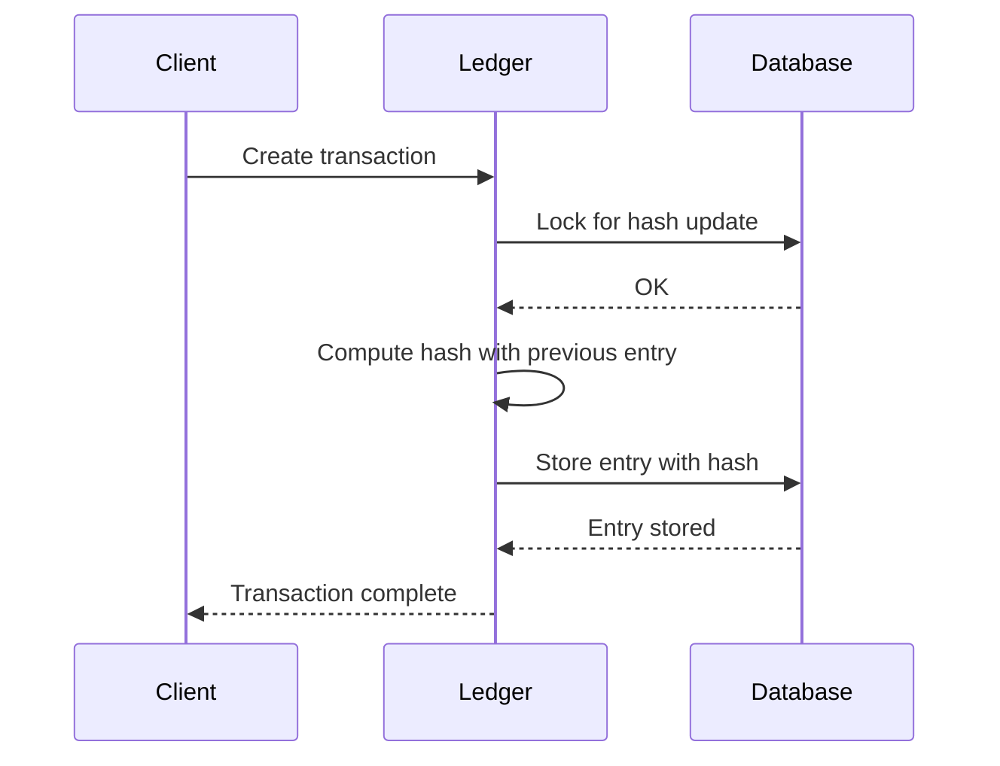

# Hash System in Formance Ledger

## Introduction

The Formance Ledger includes a robust hashing mechanism that ensures data integrity and provides auditability of all ledger operations. This document explains how the hash system works and how it can be configured to meet your specific needs.

## What Is the Hash System?

The hash system creates a cryptographic audit trail of all operations performed on the ledger. Each transaction and operation is recorded in a log entry, which is then cryptographically linked to the previous entries. This creates a tamper-evident chain that can be verified for integrity at any time.

## Core Components

### 1. Log Entries

Each log entry in the Formance Ledger contains:
- The operation type (transaction creation, metadata update, etc.)
- The operation data (transaction details, metadata changes, etc.)
- A timestamp
- A unique identifier
- A hash linking it to previous entries

### 2. The Bucket System

Ledgers in Formance are organized into "buckets" - isolated containers that help with organization and performance:

- Each bucket can contain multiple ledgers
- Buckets are automatically created when ledgers are created
- By default, new ledgers use the "_default" bucket
- Custom buckets can be specified when creating ledgers

The hash system operates within each bucket, maintaining separate hash chains for each ledger.

## Hash Configuration Options

The Formance Ledger offers three modes for the hash system that can be configured per ledger:

### SYNC Mode

When configured for synchronous hashing (`HASH_LOGS: "SYNC"`):
- Each log entry is immediately hashed and verified when created
- The hash chain is always up to date
- Provides maximum security and immediate consistency
- May impact write performance under high load

### ASYNC Mode

When configured for asynchronous hashing (`HASH_LOGS: "ASYNC"`):
- Transactions are processed immediately without waiting for hash computation
- Hashing is performed in the background by a worker process
- Provides better performance while maintaining eventual consistency
- Suitable for high-throughput scenarios

### DISABLED Mode

When hashing is disabled (`HASH_LOGS: "DISABLED"`):
- No hashing is performed
- Maximum performance for write operations
- Suitable when auditability is not a primary concern

## Benefits of the Hash System

The hash system provides several important benefits:

### 1. Data Integrity

The hash chain ensures that once data is written to the ledger, it cannot be altered without detection. Any attempt to modify past entries would break the hash chain, making tampering evident.

### 2. Auditability

The hash chain provides a cryptographic proof of the ledger's history, allowing for independent verification of the complete transaction record.

### 3. Non-repudiation

With the hash system enabled, parties cannot deny the existence or authenticity of transactions they've authorized, as the hash chain provides cryptographic proof of all operations.

## Performance Considerations

The hash system's configuration can impact ledger performance:

1. **SYNC Mode**: Provides immediate consistency but may reduce throughput during high-volume periods
2. **ASYNC Mode**: Offers better performance with eventual consistency
3. **Bucket Strategy**: Using separate buckets for high-traffic ledgers can help isolate performance impacts

## Best Practices

### Choosing the Right Hash Mode

- **For Financial Applications**: Use SYNC mode where immediate verification is critical
- **For High-Volume Systems**: Consider ASYNC mode to balance performance and auditability
- **For Development/Testing**: DISABLED mode may be appropriate for faster iteration

### Bucket Organization

- Group related ledgers in the same bucket for organizational clarity
- Use separate buckets for ledgers with different security or performance requirements

## Conclusion

The hash system in Formance Ledger provides a powerful mechanism for ensuring data integrity and auditability. By selecting the appropriate hash mode and bucket organization, you can achieve the right balance between security, consistency, and performance for your specific use case. 