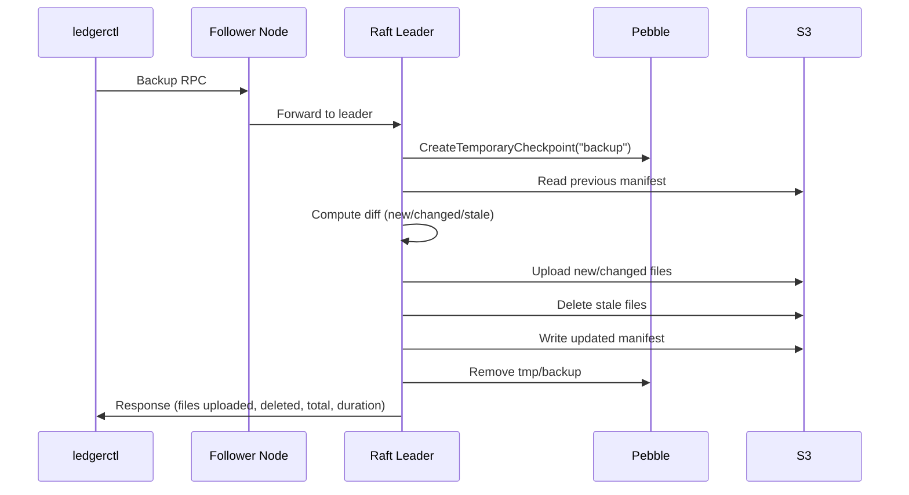

# Backup and Restore

## Overview

The ledger provides a two-tier backup and restore pipeline:

1. **Full backup** (`store backup`) — captures a complete Pebble checkpoint (all SST files). Forwarded to the leader (SST numbering is node-local). Done infrequently.
2. **Incremental backup** (`store incremental-backup`) — exports only new log and audit entries since the last backup. Forwarded to the leader: the FSM owns a per-destination lock so only one backup runs against the same destination at a time, and only the leader can push Raft proposals. Done frequently.

A restore combines the latest checkpoint with any incremental exports to reconstruct the full state.

### Storage Backends

Backups and restores support two storage backends, selected with `--driver`:

- **`s3`** (default) — Amazon S3 or any S3-compatible store (MinIO). Built with the `s3` build tag.
- **`azure`** — Azure Blob Storage. Built with the `azure` build tag. Authenticates with an account key (`--azure-account-key`) or, when omitted, `DefaultAzureCredential` (managed identity, environment, etc.). Use `--azure-endpoint` to target a non-default Blob service URL — note that **Azurite requires the account name in the path** (e.g. `http://127.0.0.1:10000/devstoreaccount1`); a bare `http://127.0.0.1:10000` will yield 400/404 responses.

All backup/restore commands accept the same provider flags; only the `--driver` value and the matching `--s3-*` / `--azure-*` flags differ.

### End-to-End Flow

```
┌─────────────────────────────────────────────────────────────────────────┐
│ 1a. FULL BACKUP (running cluster, leader only)                         │
│                                                                        │
│    ledgerctl store backup --driver s3 --s3-bucket my-bucket            │
│    ─► Leader: create Pebble checkpoint                                │
│    ─► Leader: diff SSTs against previous checkpoint                   │
│    ─► Leader: upload new/changed files, clean old exports             │
│    ─► Leader: write manifest (checkpoint + empty exports)             │
├─────────────────────────────────────────────────────────────────────────┤
│ 1b. INCREMENTAL BACKUP (leader only, forwarded)                        │
│                                                                        │
│    ledgerctl store incremental-backup --driver s3 --s3-bucket my-bucket│
│    ─► Leader: read manifest, determine last exported sequences        │
│    ─► Leader: stream new log + audit entries as KV segments           │
│    ─► Leader: append segments to manifest exports list                │
└─────────────────────────────────────────────────────────────────────────┘
                                │
                 ┌──────────────┴──────────────┐
                 ▼                             ▼
┌──────────────────────────────┐ ┌──────────────────────────────────────┐
│ 2a. RESTORE (gRPC, 4-step)  │ │ 2b. OFFLINE BOOTSTRAP (single CLI)   │
│                              │ │                                      │
│  Start server with --restore │ │  ledgerctl store bootstrap           │
│  a. restore download         │ │    --s3-bucket ... --data-dir ./data │
│  b. restore validate         │ │                                      │
│  c. restore preview          │ │  No server needed.                   │
│  d. restore finalize         │ │  Download → compact → finalize.      │
└──────────────────────────────┘ └──────────────────────────────────────┘
                 │                             │
                 └──────────────┬──────────────┘
                                ▼
┌─────────────────────────────────────────────────────────────────────────┐
│ 3. BOOTSTRAP (restart without --restore)                               │
│                                                                        │
│    Node detects RESTORED marker → recovers FSM state from Pebble      │
│    → creates WAL snapshot → removes marker → normal Raft startup       │
└─────────────────────────────────────────────────────────────────────────┘
```

---

## Backup ()

### CLI Command

```bash
# Backup to S3
ledgerctl store backup --driver s3 --s3-bucket my-bucket --s3-region us-east-1

# Backup to MinIO
ledgerctl store backup --driver s3 --s3-bucket my-bucket --s3-endpoint http://minio:9000

# Backup to Azure Blob Storage
ledgerctl store backup --driver azure --azure-account-name myaccount --azure-account-key <key> --azure-container backups
```

| Flag | Default | Description |
|------|---------|-------------|
| `--driver` | `s3` | Storage driver: `s3` or `azure` |
| `--bucket-id` | cluster-id | Namespace prefix for backup files |
| `--s3-bucket` | | S3 bucket name (required when `driver=s3`) |
| `--s3-region` | | AWS region for S3 bucket |
| `--s3-endpoint` | | Custom S3 endpoint (for MinIO) |
| `--s3-access-key-id` | | Static AWS access key ID (default: use default credential chain) |
| `--s3-secret-access-key` | | Static AWS secret access key (default: use default credential chain) |
| `--azure-account-name` | | Azure storage account name (required when `driver=azure`) |
| `--azure-account-key` | | Azure storage account key (omit to use `DefaultAzureCredential`) |
| `--azure-container` | | Azure Blob Storage container name (required when `driver=azure`) |
| `--azure-endpoint` | | Custom Azure endpoint (for Azurite) |
| `--timeout` | `1000s` | Request timeout |

### How It Works

The `store backup` command calls the `ClusterService.Backup` gRPC RPC (unary). If connected to a follower, the request is transparently forwarded to the leader.

#### Step 1: Direct Pebble Checkpoint

The leader creates a **temporary Pebble checkpoint** — a point-in-time filesystem snapshot using hardlinks. Because boundaries (nextTransactionId, nextLogId per ledger) are written to Pebble on every committed entry, the checkpoint is immediately consistent without requiring Raft consensus or FSM gating. Backup does not block writes.

#### Step 2: Diff Against Previous Manifest

The backup reads the previous manifest from storage (if any) and computes a diff:
- **New/changed files**: SST files that are new or have changed size are uploaded.
- **Stale files**: Files present in the old manifest but not in the current checkpoint are deleted.

SST files in Pebble are immutable — same filename means same content. This makes the diff very efficient.

#### Step 3: Upload and Manifest

New files are uploaded to the storage backend. A manifest JSON file is written last (for atomicity).

**File**: `internal/infra/backup/manager.go` — `RunBackup()`

#### Cleanup

The temporary checkpoint is removed from the leader's filesystem after the backup completes.

### Compaction on Restore

Attribute compaction is performed on the **restore side** (during `FinalizeRestore` or `store bootstrap`), not during backup. This means backups contain raw Pebble data, while the restore process prepares it for standalone use:

1. **Attribute compaction**: All versioned attribute entries are compacted to index 0.
2. **Reset lastAppliedIndex**: The Raft applied index is reset to 0.
3. **Remove persisted config**: Node and cluster IDs are stripped for portability.

**File**: `internal/infra/attributes/compact.go` — `CompactAllForBackup()`

### What the Backup Contains

The backup is a complete Pebble database that contains:

| Zone | Prefix | Contents |
|------|--------|----------|
| Attributes | `0x01` | Volumes, account metadata, ledger metadata, reversions, references, ledger info, boundaries (compacted to index 0) |
| Cache | `0x02` | Derived/cached state |
| Per-Ledger | `0x03` | Per-ledger data |
| Cold | `0x04` | Transaction logs (`{0x04, 0x01}`), audit entries (`{0x04, 0x02}`) |
| Idempotency | `0x05` | Idempotency keys |
| Global | `0x06` | Last applied index (reset to 0), last applied timestamp, signing keys, signing config, chapters, sink configs, sink cursors, sink statuses |

> **Note**: If chapters have been archived before the backup, the archived logs and audit entries are no longer in the backup (they have been purged to cold storage). Attributes remain.

### Sequence Diagram



---

## Incremental Backup

### CLI Command

```bash
# Incremental backup to S3 (forwarded to the leader)
ledgerctl store incremental-backup --driver s3 --s3-bucket my-bucket --s3-region us-east-1

# Incremental backup to MinIO
ledgerctl store incremental-backup --driver s3 --s3-bucket my-bucket --s3-endpoint http://minio:9000

# Incremental backup to Azure Blob Storage
ledgerctl store incremental-backup --driver azure --azure-account-name myaccount --azure-account-key <key> --azure-container backups
```

| Flag | Default | Description |
|------|---------|-------------|
| `--driver` | `s3` | Storage driver: `s3` or `azure` |
| `--bucket-id` | cluster-id | Namespace prefix for backup files |
| `--s3-bucket` | | S3 bucket name (required when `driver=s3`) |
| `--s3-region` | | AWS region for S3 bucket |
| `--s3-endpoint` | | Custom S3 endpoint (for MinIO) |
| `--s3-access-key-id` | | Static AWS access key ID (default: use default credential chain) |
| `--s3-secret-access-key` | | Static AWS secret access key (default: use default credential chain) |
| `--azure-account-name` | | Azure storage account name (required when `driver=azure`) |
| `--azure-account-key` | | Azure storage account key (omit to use `DefaultAzureCredential`) |
| `--azure-container` | | Azure Blob Storage container name (required when `driver=azure`) |
| `--azure-endpoint` | | Custom Azure endpoint (for Azurite) |
| `--timeout` | `1000s` | Request timeout |

### How It Works

The `store incremental-backup` command calls the `ClusterService.IncrementalBackup` gRPC RPC. Like the full backup, this RPC is **forwarded to the leader**: backup jobs are tracked by the FSM under a per-destination lock, so only the node currently driving Raft proposals can open one.

1. **Forward**: A request hitting a follower is transparently forwarded to the leader.
2. **Start**: The leader proposes a `BackupOrder.Start` through Raft. A duplicate destination is rejected with `FailedPrecondition` (`ErrBackupInProgress`); a duplicate `job_id` with `FailedPrecondition` (`ErrBackupJobIDCollision`).
3. **Read manifest**: Reads the existing manifest from S3 to determine the last exported sequences.
4. **Snapshot**: Takes a `ReadHandle` (Pebble snapshot) for point-in-time consistency.
5. **Determine delta**: Compares current sequences against the manifest's last exported sequences.
6. **Stream entries**: Iterates new log entries (`{0x04, 0x01}` prefix) and audit entries (`{0x04, 0x02}` prefix) via raw Pebble range scan, writing them as a KV stream binary format to S3 segments. Progress proposals were dropped from the FSM lifecycle: liveness is observed in-memory on the leader via the orchestrator's executor registry rather than inferred from progress staleness.
7. **Update manifest**: Appends new export segments to the manifest.
8. **Complete / Fail**: The leader proposes the terminal order under a bounded background context (so a client disconnect does not strand the destination lock).

### Prerequisites

A **full backup must exist** before running an incremental backup. The incremental backup needs a checkpoint as a base.

### Leadership and Mutual Exclusion

Although log and audit sequences are deterministic across replicas — so any node could in principle read the same delta — incremental backups go through the leader for two reasons:

- The FSM owns the destination lock. Two concurrent runs against the same destination would otherwise race the same on-S3 manifest. Pushing the lifecycle through Raft inherits cross-node mutual exclusion from apply determinism, with no separate lease primitive and no clock-skew window.
- The leader is the only node that can propose. A follower-driven backup would have to round-trip every progress beat through the leader anyway.

If leadership changes mid-backup, `OnLeadershipChange(false)` on the previous leader cancels the context that the in-flight upload runs under — the S3 SDK respects the cancellation and aborts the request, closing the two-writer race that would otherwise open between the old executor and the new leader. The new leader inherits the `RUNNING` FSM entry via cache snapshot restore but sees no live executor for it in its in-memory registry; the next cleanup tick proposes `Fail` to free the destination slot. The client retries explicitly.

### Manifest Structure

The manifest combines checkpoint metadata with incremental exports:

```json
{
  "checkpoint": {
    "timestamp": "2024-01-15T10:30:00Z",
    "lastAppliedIndex": 12345,
    "lastLogSequence": 500,
    "lastAuditSequence": 300,
    "files": {"000001.sst": 1234, "000002.sst": 5678}
  },
  "exports": [
    {"type": "log", "startSeq": 501, "endSeq": 600, "key": "...", "size": 12345},
    {"type": "audit", "startSeq": 301, "endSeq": 350, "key": "...", "size": 6789}
  ]
}
```

When a new **full backup** is taken, old exports are cleaned up and the exports list is reset to empty.

**File**: `internal/infra/backup/manager.go` — `RunIncrementalBackup()`

---

## Restore

### Prerequisites

- A **fresh data directory** (no existing checkpoints in `checkpoints/`). Restore mode refuses to start on an existing database.
- The server must be started with the `--restore` flag. This flag is mutually exclusive with `--bootstrap` and `--join`.

### Starting the Server in Restore Mode

```bash
ledger run --node-id 1 --cluster-id prod-ledger --data-dir ./data --restore --grpc-port 8888
```

In restore mode, only a minimal subset of the application runs:

| Started | Not Started |
|---------|-------------|
| gRPC server (RestoreService + health) | WAL, Raft Node, Transport |
| HTTP server (`/health` only) | Spool, Cache, Attributes, KeyStore |
| | Admission, Controller, HealthChecker |
| | ClusterService, SnapshotService |
| | Event sinks, Signing |

**File**: `internal/bootstrap/module_restore.go` — `RestoreModule()`

### Step 1: Download

```bash
# From S3
ledgerctl restore download --s3-bucket my-bucket --s3-region us-east-1

# From Azure Blob Storage
ledgerctl restore download --driver azure --azure-account-name myaccount --azure-account-key <key> --azure-container backups
```

| Flag | Required | Description |
|------|----------|-------------|
| `--driver` | No | Storage driver: `s3` or `azure` (default: `s3`) |
| `--s3-bucket` | s3 only | S3 bucket containing the backup (required when `driver=s3`) |
| `--s3-region` | No | AWS region for S3 bucket |
| `--s3-endpoint` | No | Custom S3 endpoint (for MinIO) |
| `--s3-access-key-id` | No | Static AWS access key ID (default: use default credential chain) |
| `--s3-secret-access-key` | No | Static AWS secret access key (default: use default credential chain) |
| `--azure-account-name` | azure only | Azure storage account name (required when `driver=azure`) |
| `--azure-account-key` | No | Azure storage account key (omit to use `DefaultAzureCredential`) |
| `--azure-container` | azure only | Azure Blob Storage container name (required when `driver=azure`) |
| `--azure-endpoint` | No | Custom Azure endpoint (for Azurite) |
| `--bucket-id` | No | Namespace prefix for backup files (default: cluster-id) |
| `--poll-interval` | No | Interval between progress polls (default: 3s) |
| `--rpc-timeout` | No | Per-RPC timeout for Start, status poll, and Cancel (default: 30s) |

The client calls `RestoreService.StartDownloadBackup`, which returns a job ID
immediately and runs the actual transfer on a goroutine detached from the
calling RPC. The client then polls `RestoreService.GetDownloadStatus` on
`--poll-interval` until the job reaches a terminal state (SUCCEEDED, FAILED,
or CANCELED). Pressing `Ctrl+C` issues `RestoreService.CancelDownload` so the
staging directory is wiped before the CLI exits — the server-side goroutine
never outlives the CLI.

The server-side job:

1. Validates state (no concurrent download, no previous download already staged).
2. Creates a clean staging directory at `{dataDir}/restore-staging/`.
3. Reads the manifest from S3 and downloads the checkpoint files in parallel
   through an `errgroup` worker pool. The pool size is set by the server flag
   `--restore-download-parallelism` (default 16, clamped to `[1, 64]`).
4. Applies any incremental export segments on top of the checkpoint and rebuilds derived state (volumes, metadata, transactions) from the exported logs, starting at the checkpoint's last log sequence. This is the same `ApplyExports` + `RebuildDelta` path used by the offline `ledgerctl store bootstrap` command, so a manifest with incremental backups restores all data written after the last full checkpoint.
5. On success, marks the staging as ready.

If the job fails or is cancelled, the staging directory is wiped so the
operator can retry with a fresh state without restarting the server.

### Step 2: Validate

```bash
ledgerctl restore validate
```

| Flag | Required | Description |
|------|----------|-------------|
| `--timeout` | No | Request timeout (default: 50s) |

Calls `RestoreService.ValidateRestore` (server-streaming). The server opens the staging directory as a read-only Pebble database and runs the full integrity checker (`check.Checker`). The checker performs three passes:

1. **Log sequence verification**: Iterates all logs from sequence 1 to the last sequence. Verifies sequence continuity (no gaps).

2. **Volume verification**: For every (account, asset) pair accumulated during log replay, computes the expected input/output from the attribute storage and compares against the replayed totals.

3. **Metadata verification**: For every metadata key accumulated during replay, compares the expected value from attribute storage against the replayed state.

Progress events (percentage) and error events are streamed back to the client in real time.

> **This is the same checker used by `ledgerctl store check` during normal operations.**

### Step 3: Preview

```bash
ledgerctl restore preview
```

| Flag | Required | Description |
|------|----------|-------------|
| `--timeout` | No | Request timeout (default: 10s) |

Calls `RestoreService.PreviewRestore` (unary). Returns a summary of the staged data:

- Last applied index and timestamp
- Last log sequence
- Number of ledgers and their names

### Step 4: Finalize

```bash
# With confirmation prompt
ledgerctl restore finalize

# Skip confirmation
ledgerctl restore finalize --yes
```

| Flag | Required | Description |
|------|----------|-------------|
| `--yes`, `-y` | No | Skip confirmation prompt |
| `--timeout` | No | Request timeout (default: 10s) |

Calls `RestoreService.FinalizeRestore` (unary). This commits the staged backup as live data:

1. Opens the staging directory read-only to extract `lastAppliedIndex` and `lastAppliedTimestamp`.
2. Writes the **RESTORED marker** JSON file to `{dataDir}/RESTORED`.
3. Creates `{dataDir}/checkpoints/` directory.
4. **Atomically** hard-links the staging directory to `{dataDir}/checkpoints/0` (using a temp directory + `os.Rename` for crash safety).
5. Removes the staging directory.

On next startup, `ScanLatestCheckpointID()` scans the `checkpoints/` directory for the highest numbered subdirectory to find the active checkpoint.

After finalize, the server stays running but refuses new uploads. Restart without `--restore` to use the restored data.

### Data Flow

```
Client                       Restore Server                    Disk / S3
  |                               |                               |
  |--- StartDownloadBackup ------>|                               |
  |    (S3 params)                |--- spawn job goroutine        |
  |<-- {jobId} -------------------|                               |
  |                               |--- parallel Download (N) ---->|
  |--- GetDownloadStatus -------->|    {dataDir}/restore-staging/ |
  |<-- {state, files, bytes} ----|                               |
  |    (poll every 3s)            |                               |
  |--- GetDownloadStatus -------->|                               |
  |<-- {SUCCEEDED} ---------------|                               |
  |                               |                               |
  |--- ValidateRestore ---------->|                               |
  |    (stream events)            |--- check.Checker.Check() ---->|
  |<-- progress/error ------------|    (read-only staging DB)     |
  |                               |                               |
  |--- PreviewRestore ----------->|                               |
  |<-- summary -------------------|--- OpenReadOnly(staging) ---->|
  |                               |                               |
  |--- FinalizeRestore ---------->|                               |
  |                               |--- Write RESTORED marker ---->|
  |                               |--- HardLink staging --------->|
  |                               |    -> checkpoints/0           |
  |                               |--- Remove staging ----------->|
  |<-- response ------------------|                               |

   On Ctrl+C while polling:
  |--- CancelDownload ----------->|                               |
  |                               |--- cancel job ctx             |
  |                               |--- wipe restore-staging/      |
  |<-- ack ----------------------|                               |
```

---

## Offline Bootstrap

An alternative to the 4-step gRPC restore flow. The `store bootstrap` command builds a ready-to-use data directory by downloading backup files directly from S3 or Azure Blob Storage — no server required.

### CLI Command

```bash
ledgerctl store bootstrap --driver s3 --s3-bucket my-bucket --s3-region us-east-1 --data-dir ./fresh-data [--validate] [--yes]
```

| Flag | Default | Description |
|------|---------|-------------|
| `--driver` | `s3` | Storage driver: `s3` or `azure` |
| `--s3-bucket` | | S3 bucket containing the backup (required when `driver=s3`) |
| `--s3-region` | | AWS region for S3 bucket |
| `--s3-endpoint` | | Custom S3 endpoint (for MinIO) |
| `--s3-access-key-id` | | Static AWS access key ID (default: use default credential chain) |
| `--s3-secret-access-key` | | Static AWS secret access key (default: use default credential chain) |
| `--azure-account-name` | | Azure storage account name (required when `driver=azure`) |
| `--azure-account-key` | | Azure storage account key (omit to use `DefaultAzureCredential`) |
| `--azure-container` | | Azure Blob Storage container name (required when `driver=azure`) |
| `--azure-endpoint` | | Custom Azure endpoint (for Azurite) |
| `--bucket-id` | | Namespace prefix for backup files (default: uses cluster-id from config) |
| `--data-dir` | | Target data directory (required, must be fresh) |
| `--validate` | `false` | Run integrity checks after download |
| `-y, --yes` | `false` | Skip confirmation prompt |

### How It Works

1. **Fresh directory guard**: Scans the target data directory's `checkpoints/` subdirectory for existing checkpoints using `ScanLatestCheckpointID()`. Refuses to overwrite.
2. **Download**: Reads the manifest from the configured backend, downloads all checkpoint files and export segments into `{data-dir}/restore-staging/`.
3. **Apply exports**: If the manifest contains incremental export segments, applies them to the staging database and rebuilds derived state.
4. **Preview**: Opens the staging as a read-only Pebble database, reads metadata (last applied index, timestamp, ledger list), and displays a summary table.
5. **Validate** (optional): If `--validate` is set, runs the full integrity checker (`check.Checker`) -- the same checker used by `store check` and `restore validate`.
6. **Confirm**: Unless `--yes` is set, prompts for user confirmation.
7. **Compact**: Compacts all attributes for restore compatibility.
8. **Finalize**: Hard-links staging to `{data-dir}/checkpoints/0`, writes the `RESTORED` marker JSON.
9. **Cleanup**: Removes the staging directory.

### When to Use

- **Scripted disaster recovery**: No need to start a server in `--restore` mode.
- **CI/CD pipelines**: Single command, non-interactive with `--yes`.

For the gRPC-based flow with S3 download and remote validation, see the [Restore](#restore) section above.

### Example

```bash
# ── On a fresh machine ──

# 1. Bootstrap from S3 backup (with validation)
ledgerctl store bootstrap --driver s3 --s3-bucket my-bucket --s3-region us-east-1 --data-dir ./fresh-data --validate --yes

# Or from Azure Blob Storage
ledgerctl store bootstrap --driver azure --azure-account-name myaccount --azure-account-key <key> --azure-container backups --data-dir ./fresh-data --validate --yes

# 2. Start the server normally
ledger run --node-id 1 --cluster-id prod-ledger --data-dir ./fresh-data --bootstrap --wal-dir ./fresh-wal --grpc-port 9999
```

**File**: `cmd/ledgerctl/store/bootstrap.go`

---

## Post-Restore Bootstrap

After finalize (either via `restore finalize` or `store bootstrap`), restart the server in normal mode:

```bash
ledger run --node-id 1 --cluster-id prod-ledger --data-dir ./data --bootstrap --wal-dir ./wal --grpc-port 8888
```

On startup, the node detects the `RESTORED` marker in `NewNode()`:

1. WAL is empty (first start) AND `RESTORED` marker exists:
   - Calls `fsm.RecoverState()` to recover in-memory FSM counters from Pebble:
     - `nextLedgerID` from the highest existing ledger ID
     - `nextSequenceID` from the last log sequence
     - `lastAuditHash` and `nextAuditSequenceID` from the last audit entry
   - Creates an FSM snapshot (`fsm.CreateSnapshot()`)
   - Creates a WAL snapshot at `marker.LastAppliedIndex` with `ConfState{Voters: [nodeID]}` (single-node bootstrap)
   - Removes the RESTORED marker
   - Continues with normal Raft startup

2. WAL is empty AND no marker: falls through to normal bootstrap/join logic.

This ensures the Raft index is properly aligned with the restored data.

### RESTORED Marker

The `RESTORED` file is a JSON file written to the data directory during `FinalizeRestore`:

```json
{
  "lastAppliedIndex": 12345,
  "lastAppliedTimestamp": 1700000000000000
}
```

- `lastAppliedIndex`: The Raft index of the last applied entry in the backup (reset to 0 after compaction, so this is always 0 in practice).
- `lastAppliedTimestamp`: The HLC timestamp (microseconds) of the last applied entry.

**File**: `internal/infra/node/restored_marker.go`

---

## Safety Guarantees

| Guarantee | Mechanism |
|-----------|-----------|
| **Consistent snapshot** | Backup checkpoint is created as a direct Pebble checkpoint. Boundaries are always up-to-date in Pebble (written on every commit), so the checkpoint is consistent without Raft consensus or FSM gating. |
| **Incremental efficiency** | SST files are immutable — same name means same content. Only new/changed files are uploaded; stale files are deleted. |
| **Self-contained on restore** | During restore finalize, attributes are compacted to index 0 and `lastAppliedIndex` is reset. No dependency on the original cluster's Raft indices. |
| **Data integrity (content)** | `ValidateRestore` runs the full integrity checker: log sequence continuity, volume balance verification, metadata consistency. |
| **Fresh directory required** | Restore mode refuses to start if existing checkpoints are found in `checkpoints/`, preventing accidental overwrites. |
| **Atomic finalize** | Checkpoint placement uses `HardLink()` (temp directory + atomic `os.Rename`) for crash safety. |
| **Idempotent marker** | The RESTORED marker is consumed exactly once on the next normal boot, then deleted. |
| **No data loss** | The original cluster is unaffected by the restore operation. Backup is a read-only operation on the source cluster. |

---

## Complete Example

```bash
# ── On the running cluster ──

# 1. Create a backup to S3
ledgerctl store backup --driver s3 --s3-bucket my-bucket --s3-region us-east-1

# ── On a fresh server ──

# 2a. OPTION A: Offline bootstrap (no server needed, downloads from S3)
ledgerctl store bootstrap --s3-bucket my-bucket --s3-region us-east-1 --data-dir ./fresh-data --validate --yes
ledger run --node-id 1 --cluster-id prod-ledger --data-dir ./fresh-data --bootstrap --wal-dir ./fresh-wal --grpc-port 9999

# 2b. OPTION B: Online restore (4-step gRPC flow, downloads from S3)
ledger run --node-id 1 --cluster-id prod-ledger --data-dir ./fresh-data --restore --grpc-port 9999
ledgerctl --server localhost:9999 restore download --s3-bucket my-bucket --s3-region us-east-1
ledgerctl --server localhost:9999 restore validate
ledgerctl --server localhost:9999 restore finalize --yes
# Stop restore server, then restart normally:
ledger run --node-id 1 --cluster-id prod-ledger --data-dir ./fresh-data --bootstrap --wal-dir ./fresh-wal --grpc-port 9999
```

---

## Relationship with Chapters and Cold Storage

Chapters partition the ledger's history into sealed segments. Each chapter covers a contiguous range of log sequences and, once archived, its logs and audit entries are purged from Pebble and exported to cold storage (S3 or filesystem).

**Impact on backups**:

- A backup always contains the **current hot storage state**. If chapters have been archived before the backup, the archived logs and audit entries are no longer present — they live in cold storage.
- **Attributes are never purged**: volumes, metadata, reversions, idempotency keys, and references remain in Pebble permanently (and therefore in every backup), regardless of chapter archival.
- To obtain a complete historical record, you need both the backup (hot data) and the cold storage archives (archived chapters).

See [Chapters](../technical/architecture/data-model/chapters.md) for the full chapter lifecycle and cold storage documentation.

---

## Files

| File | Description |
|------|-------------|
| **Backup** | |
| `cmd/ledgerctl/store/backup.go` | `store backup` CLI command |
| `cmd/ledgerctl/store/incremental_backup.go` | `store incremental-backup` CLI command |
| `internal/adapter/grpc/server_cluster.go` | `ClusterService.Backup` gRPC implementation |
| `internal/infra/backup/manager.go` | `RunBackup()` — diff, upload, manifest |
| `internal/infra/backup/s3.go` | S3 storage driver |
| `internal/infra/backup/storage.go` | Storage interface and driver factory |
| `internal/infra/attributes/compact.go` | `CompactAllForBackup()` — attribute compaction (used during restore) |
| **Restore (gRPC)** | |
| `misc/proto/restore.proto` | RestoreService proto definition |
| `internal/proto/restorepb/` | Generated proto code |
| `internal/adapter/grpc/server_restore.go` | RestoreService gRPC implementation |
| `internal/bootstrap/module_restore.go` | Minimal fx module for restore mode |
| `internal/pkg/tarutil/extract.go` | Shared tar extraction utility |
| `internal/storage/dal/store_readonly.go` | Read-only Pebble store opener |
| **Offline Bootstrap** | |
| `cmd/ledgerctl/store/bootstrap.go` | `store bootstrap` CLI command (offline) |
| **Post-Restore Bootstrap** | |
| `internal/infra/node/restored_marker.go` | RESTORED marker read/write/remove |
| `internal/infra/state/machine.go` | `RecoverState()` — FSM state recovery from Pebble |
| **Integrity Checker** | |
| `internal/application/check/checker.go` | Hash chain, volumes, metadata verification |
