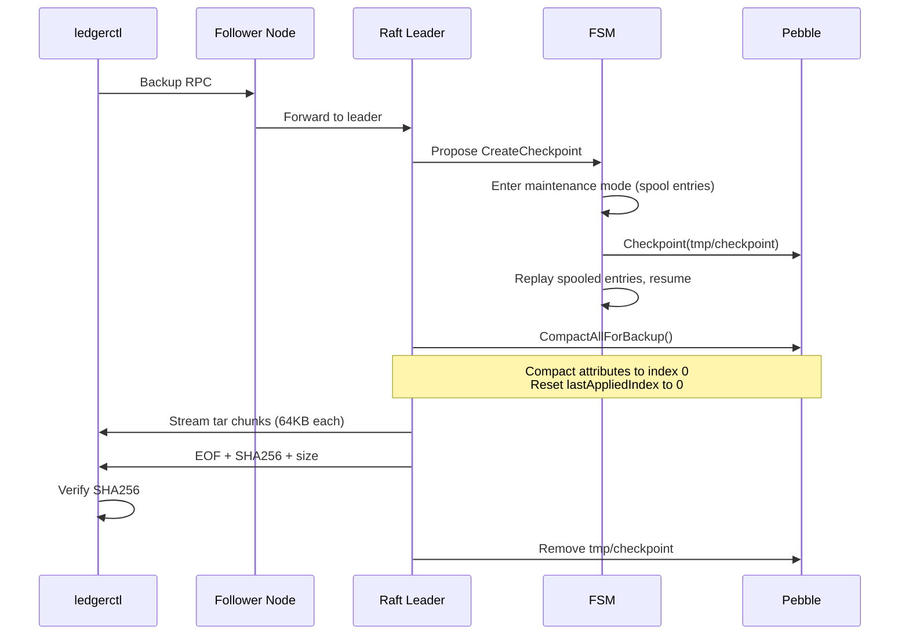

# Backup and Restore

## Overview

The ledger provides a complete backup and restore pipeline. A backup captures a point-in-time snapshot of the entire Pebble database (all ledgers, logs, audit entries, attributes, and system metadata). A restore bootstraps a fresh cluster from that snapshot.

### End-to-End Flow

```
┌─────────────────────────────────────────────────────────────────────────┐
│ 1. BACKUP (running cluster)                                            │
│                                                                        │
│    ledgerctl store backup -o backup.tar                                │
│    ─► Raft consensus: CreateCheckpoint (all nodes enter maintenance)   │
│    ─► Leader: compact attributes to index 0, reset lastAppliedIndex   │
│    ─► Leader: stream checkpoint directory as tar + SHA256              │
│    ─► Client: verify SHA256, write to disk                            │
└─────────────────────────────────────────────────────────────────────────┘
                                │
                                ▼
┌─────────────────────────────────────────────────────────────────────────┐
│ 2. RESTORE (fresh server with --restore)                               │
│                                                                        │
│    a. ledgerctl restore upload -i backup.tar    ── upload + SHA256     │
│    b. ledgerctl restore validate                ── integrity check     │
│    c. ledgerctl restore preview                 ── inspect contents    │
│    d. ledgerctl restore finalize                ── commit to disk      │
└─────────────────────────────────────────────────────────────────────────┘
                                │
                                ▼
┌─────────────────────────────────────────────────────────────────────────┐
│ 3. BOOTSTRAP (restart without --restore)                               │
│                                                                        │
│    Node detects RESTORED marker → recovers FSM state from Pebble      │
│    → creates WAL snapshot → removes marker → normal Raft startup       │
└─────────────────────────────────────────────────────────────────────────┘
```

---

## Backup

### CLI Command

```bash
# Save to a file
ledgerctl store backup --output backup.tar

# Pipe to gzip
ledgerctl store backup | gzip > backup.tar.gz
```

| Flag | Default | Description |
|------|---------|-------------|
| `-o, --output` | | Output file path (required if stdout is a terminal) |
| `--timeout` | `100s` | Request timeout |

### How It Works

The `store backup` command calls the `ClusterService.Backup` gRPC RPC (server-streaming). If connected to a follower, the request is transparently forwarded to the leader.

#### Step 1: Raft Checkpoint

The leader proposes a `CreateCheckpoint` command through Raft consensus. All nodes agree to enter **maintenance mode**: the Raft loop stops applying entries directly to the FSM and spools them instead. The leader then creates a **Pebble checkpoint** — a point-in-time filesystem snapshot using hardlinks — off the critical path. After checkpoint creation, spooled entries are replayed and normal operation resumes.

This ensures the checkpoint is taken at a consistent Raft boundary without blocking write traffic for more than the Raft round-trip latency.

**File**: `internal/service/node/node.go` — `ProposeBackupCheckpoint()`

#### Step 2: Compaction for Restore Compatibility

The checkpoint is opened in read-write mode and prepared for standalone use:

1. **Attribute compaction**: All versioned attribute entries (volumes, metadata, reversions, idempotency keys, references, ledger info, boundaries) in the `[0xF1, 0xF2)` key range are compacted to index 0. This removes the version history and keeps only the final value, making the backup self-contained.

2. **Reset lastAppliedIndex**: The Raft applied index is reset to 0 in the checkpoint. The restored cluster starts with fresh Raft indices — no index conflict with the original cluster.

3. **Flush**: Pebble is flushed to ensure all compacted data is written to SSTs.

**File**: `internal/service/attributes/compact.go` — `CompactAllForBackup()`

#### Step 3: Tar Streaming

The checkpoint directory is streamed to the client as a tar archive:

- Files and directories are added to the tar in filesystem walk order.
- Data is sent in **64 KB chunks** through the gRPC server stream.
- A **SHA256 hash** is computed over the entire tar content as it streams.
- The final message is an EOF marker containing the SHA256 hash and total content size.
- The client verifies the hash against the server-reported hash and fails if they differ.

**File**: `internal/application/tar_streaming.go` — `StreamDirAsTar()`

#### Cleanup

The temporary checkpoint is removed from the leader's filesystem after streaming completes (or on error).

### What the Backup Contains

The backup is a complete Pebble database that contains:

| Zone | Key Range | Contents |
|------|-----------|----------|
| Cold | `[0x01, 0xF1)` | Transaction logs, audit entries, transaction updates |
| Attributes | `[0xF1, 0xF2)` | Volumes, account metadata, ledger metadata, reversions, idempotency keys, references, ledger info, boundaries (compacted to index 0) |
| System | `[0xF2, 0xFF]` | Last applied index (reset to 0), last applied timestamp, ledger info, signing keys, signing config, periods, sink configs, sink cursors, sink statuses |

> **Note**: If periods have been archived before the backup, the archived logs and audit entries are no longer in the backup (they have been purged to cold storage). Attributes remain.

### Sequence Diagram



---

## Restore

### Prerequisites

- A **fresh data directory** (no `CURRENT_CHECKPOINT` file). Restore mode refuses to start on an existing database.
- The server must be started with the `--restore` flag. This flag is mutually exclusive with `--bootstrap` and `--join`.

### Starting the Server in Restore Mode

```bash
ledger-v3-poc run --node-id 1 --data-dir ./data --restore --grpc-port 8888
```

In restore mode, only a minimal subset of the application runs:

| Started | Not Started |
|---------|-------------|
| gRPC server (RestoreService + health) | WAL, Raft Node, Transport |
| HTTP server (`/health` only) | Spool, Cache, Attributes, KeyStore |
| | Admission, Controller, HealthChecker |
| | ClusterService, SnapshotService |
| | Event sinks, Signing |

**File**: `internal/application/module_restore.go` — `RestoreModule()`

### Step 1: Upload

```bash
ledgerctl restore upload --input backup.tar
```

| Flag | Required | Description |
|------|----------|-------------|
| `--input`, `-i` | Yes | Path to the backup tar file |
| `--timeout` | No | Request timeout (default: 100s) |

The client streams the tar file in 64 KB chunks to the `RestoreService.UploadBackup` RPC (client-streaming). The server:

1. Validates state (no concurrent upload, no previous upload already staged).
2. Creates a clean staging directory at `{dataDir}/restore-staging/`.
3. Extracts the tar archive into the staging directory using a pipe-based concurrent reader.
4. Computes SHA256 over the received data and verifies it against the client-provided hash.
5. On hash mismatch, removes the staging directory and returns `DataLoss` error.
6. On success, marks the staging as ready.

### Step 2: Validate

```bash
ledgerctl restore validate
```

| Flag | Required | Description |
|------|----------|-------------|
| `--timeout` | No | Request timeout (default: 50s) |

Calls `RestoreService.ValidateRestore` (server-streaming). The server opens the staging directory as a read-only Pebble database and runs the full integrity checker (`check.Checker`). The checker performs three passes:

1. **Log chain verification**: Iterates all logs from sequence 1 to the last sequence. Verifies sequence continuity (no gaps) and recomputes the BLAKE3 hash chain (each log's hash depends on the previous log's hash).

2. **Volume verification**: For every (account, asset) pair accumulated during log replay, computes the expected input/output from the attribute storage and compares against the replayed totals.

3. **Metadata verification**: For every metadata key accumulated during replay, compares the expected value from attribute storage against the replayed state.

Progress events (percentage) and error events are streamed back to the client in real time.

> **This is the same checker used by `ledgerctl store check` during normal operations.**

### Step 3: Preview

```bash
ledgerctl restore preview
```

| Flag | Required | Description |
|------|----------|-------------|
| `--timeout` | No | Request timeout (default: 10s) |

Calls `RestoreService.PreviewRestore` (unary). Returns a summary of the staged data:

- Last applied index and timestamp
- Last log sequence
- Number of ledgers and their names

### Step 4: Finalize

```bash
# With confirmation prompt
ledgerctl restore finalize

# Skip confirmation
ledgerctl restore finalize --yes
```

| Flag | Required | Description |
|------|----------|-------------|
| `--yes`, `-y` | No | Skip confirmation prompt |
| `--timeout` | No | Request timeout (default: 10s) |

Calls `RestoreService.FinalizeRestore` (unary). This commits the staged backup as live data:

1. Opens the staging directory read-only to extract `lastAppliedIndex` and `lastAppliedTimestamp`.
2. Writes the **RESTORED marker** JSON file to `{dataDir}/RESTORED`.
3. Creates `{dataDir}/checkpoints/` directory.
4. **Atomically** hard-links the staging directory to `{dataDir}/checkpoints/0` (using a temp directory + `os.Rename` for crash safety).
5. Writes `{dataDir}/CURRENT_CHECKPOINT` with content `"0"`.
6. Removes the staging directory.

After finalize, the server stays running but refuses new uploads. Restart without `--restore` to use the restored data.

### Data Flow

```
Client                  Restore Server                     Disk
  |                          |                               |
  |--- UploadBackup -------->|                               |
  |    (streaming tar)       |--- ExtractTar() ------------->|
  |                          |    {dataDir}/restore-staging/  |
  |<-- UploadBackupResponse--|                               |
  |                          |                               |
  |--- ValidateRestore ----->|                               |
  |    (stream events)       |--- check.Checker.Check() --->|
  |<-- progress/error -------|    (read-only staging DB)     |
  |                          |                               |
  |--- PreviewRestore ------>|                               |
  |<-- summary --------------|--- OpenReadOnly(staging) ---->|
  |                          |                               |
  |--- FinalizeRestore ----->|                               |
  |                          |--- Write RESTORED marker ---->|
  |                          |--- HardLink staging --------->|
  |                          |    -> checkpoints/0           |
  |                          |--- Write CURRENT_CHECKPOINT ->|
  |                          |--- Remove staging ----------->|
  |<-- response -------------|                               |
```

---

## Post-Restore Bootstrap

After finalize, restart the server in normal mode:

```bash
ledger-v3-poc run --node-id 1 --data-dir ./data --bootstrap --wal-dir ./wal --grpc-port 8888
```

On startup, the node detects the `RESTORED` marker in `NewNode()`:

1. WAL is empty (first start) AND `RESTORED` marker exists:
   - Calls `fsm.RecoverState()` to recover in-memory FSM counters from Pebble:
     - `nextLedgerID` from the highest existing ledger ID
     - `nextSequenceID` from the last log sequence
     - `lastLogHash` from the last log entry's hash
     - `nextAuditSequenceID` from the last audit entry
   - Creates an FSM snapshot (`fsm.CreateSnapshot()`)
   - Creates a WAL snapshot at `marker.LastAppliedIndex` with `ConfState{Voters: [nodeID]}` (single-node bootstrap)
   - Removes the RESTORED marker
   - Continues with normal Raft startup

2. WAL is empty AND no marker: falls through to normal bootstrap/join logic.

This ensures the Raft index is properly aligned with the restored data.

### RESTORED Marker

The `RESTORED` file is a JSON file written to the data directory during `FinalizeRestore`:

```json
{
  "lastAppliedIndex": 12345,
  "lastAppliedTimestamp": 1700000000000000
}
```

- `lastAppliedIndex`: The Raft index of the last applied entry in the backup (reset to 0 after compaction, so this is always 0 in practice).
- `lastAppliedTimestamp`: The HLC timestamp (microseconds) of the last applied entry.

**File**: `internal/service/node/restored_marker.go`

---

## Safety Guarantees

| Guarantee | Mechanism |
|-----------|-----------|
| **Consistent snapshot** | Backup checkpoint is created via Raft consensus — all nodes agree on the boundary. Entries arriving during checkpoint creation are spooled and replayed after. |
| **Self-contained backup** | Attributes are compacted to index 0 and `lastAppliedIndex` is reset. No dependency on the original cluster's Raft indices. |
| **Data integrity (transport)** | SHA256 hash is computed during streaming and verified by both client and server. Hash mismatch aborts the operation. |
| **Data integrity (content)** | `ValidateRestore` runs the full integrity checker: log hash chain continuity, volume balance verification, metadata consistency. |
| **Fresh directory required** | Restore mode refuses to start if `CURRENT_CHECKPOINT` exists, preventing accidental overwrites. |
| **Atomic finalize** | Checkpoint placement uses `HardLink()` (temp directory + atomic `os.Rename`) for crash safety. |
| **Idempotent marker** | The RESTORED marker is consumed exactly once on the next normal boot, then deleted. |
| **No data loss** | The original cluster is unaffected by the restore operation. Backup is a read-only operation on the source cluster. |

---

## Complete Example

```bash
# ── On the running cluster ──

# 1. Create a backup
ledgerctl store backup --output backup.tar

# ── On a fresh server ──

# 2. Start server in restore mode
ledger-v3-poc run --node-id 1 --data-dir ./fresh-data --restore --grpc-port 9999

# 3. Upload the backup
ledgerctl --server localhost:9999 restore upload --input backup.tar

# 4. Validate integrity
ledgerctl --server localhost:9999 restore validate

# 5. Preview contents
ledgerctl --server localhost:9999 restore preview

# 6. Finalize
ledgerctl --server localhost:9999 restore finalize --yes

# 7. Stop the restore-mode server (Ctrl+C or SIGTERM)

# 8. Restart in normal mode
ledger-v3-poc run --node-id 1 --data-dir ./fresh-data --bootstrap --wal-dir ./fresh-wal --grpc-port 9999
```

---

## Relationship with Periods and Cold Storage

Periods partition the ledger's history into sealed segments. Each period covers a contiguous range of log sequences and, once archived, its logs and audit entries are purged from Pebble and exported to cold storage (S3 or filesystem).

**Impact on backups**:

- A backup always contains the **current hot storage state**. If periods have been archived before the backup, the archived logs and audit entries are no longer present — they live in cold storage.
- **Attributes are never purged**: volumes, metadata, reversions, idempotency keys, and references remain in Pebble permanently (and therefore in every backup), regardless of period archival.
- To obtain a complete historical record, you need both the backup (hot data) and the cold storage archives (archived periods).

See [Periods](../dev/architecture/periods.md) for the full period lifecycle and cold storage documentation.

---

## Files

| File | Description |
|------|-------------|
| **Backup** | |
| `cmd/ledgerctl/store_backup.go` | `store backup` CLI command |
| `internal/application/grpc_cluster_server.go` | `ClusterService.Backup` gRPC implementation |
| `internal/application/tar_streaming.go` | Tar streaming with SHA256 |
| `internal/service/attributes/compact.go` | `CompactAllForBackup()` — attribute compaction |
| `internal/service/node/node.go` | `ProposeBackupCheckpoint()` — Raft checkpoint |
| **Restore** | |
| `misc/proto/restore.proto` | RestoreService proto definition |
| `internal/proto/restorepb/` | Generated proto code |
| `internal/application/grpc_restore_server.go` | RestoreService gRPC implementation |
| `internal/application/module_restore.go` | Minimal fx module for restore mode |
| `internal/storage/tarutil/extract.go` | Shared tar extraction utility |
| `internal/storage/data/store_readonly.go` | Read-only Pebble store opener |
| **Post-Restore Bootstrap** | |
| `internal/service/node/restored_marker.go` | RESTORED marker read/write/remove |
| `internal/service/state/machine.go` | `RecoverState()` — FSM state recovery from Pebble |
| **Integrity Checker** | |
| `internal/service/check/checker.go` | Hash chain, volumes, metadata verification |
