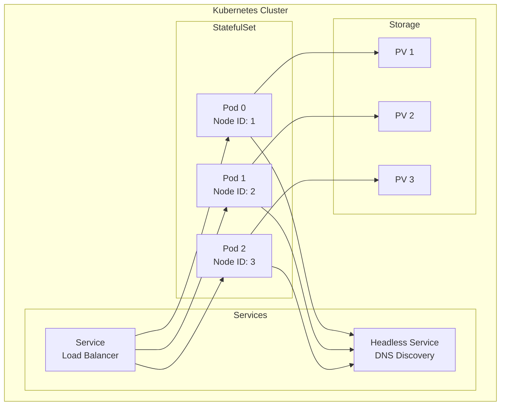

# Deployment

## Overview

This document describes the different deployment methods for Ledger v3 POC, from local configuration to production deployment on Kubernetes.

## Local Deployment

### Prerequisites

- Go 1.26+
- Just (command runner)
- Optional: Nix with Flakes

### Starting a Single Node (Bootstrap)

```bash
just run

# or manually
go run . run \
  --node-id 1 \
  --cluster-id local-dev \
  --bind-addr 127.0.0.1:7777 \
  --grpc-port 8888 \
  --wal-dir ./wal/node-1 \
  --data-dir ./data/node-1 \
  --http-port 9000 \
  --bootstrap
```

The `--cluster-id` value identifies the cluster and is persisted in the data directory. The `--bootstrap` flag initializes a new single-node cluster. It must be used only on the first node and only on the first start.

### Command Structure

The CLI uses a subcommand structure:

```bash
ledger run [flags]
```

Available flags for `run`:
- `--node-id`: Numeric node ID for this instance (must be non-zero)
- `--cluster-id`: Cluster ID for inter-node communication and persisted configuration validation (required)
- `--bind-addr`: Address to bind to for Raft transport (internal inter-node communication, default: `0.0.0.0:7777`)
- `--grpc-port`: Port for gRPC service API (external client-facing, default: `8888`)
- `--advertise-addr`: Address to advertise to other nodes (defaults to bind-addr)
- `--wal-dir`: WAL directory for Raft (default: `./wal`)
- `--data-dir`: Data directory for application storage (default: `./data`)
- `--bootstrap`: Initialize a new single-node cluster (mutually exclusive with `--join`)
- `--join`: Raft transport address of an existing cluster member to join as a learner (e.g., `--join node-1:7777`; mutually exclusive with `--bootstrap`). Discovery and learner registration go through the inter-node `ClusterBootstrapService` on the RaftServer — no user JWT is required. If the target cluster enforces a `--cluster-secret` and this node's secret is missing or wrong, startup **fails fast** with an actionable error rather than retrying until the discovery deadline (EN-1080). See the [`--cluster-secret`](cli.md#server-cluster-secret-flag) section.
- `--learner-promotion-threshold`: Max log entry lag before auto-promoting a caught-up learner to voter (default: `100`, `0` = disable auto-promotion)
- `--http-port`: HTTP server port (default: `9000`)
- `--health-check-interval`: Interval between disk usage health checks (default: `30s`)
- `--health-wal-threshold`: WAL volume usage threshold, 0.0-1.0 (default: `0.8`)
- `--health-data-threshold`: Data volume usage threshold, 0.0-1.0 (default: `0.8`)
- `--receipt-signing-key`: HMAC-SHA256 key for JWT transaction receipts (env: `RECEIPT_SIGNING_KEY`)
- `--cold-storage-driver`: Cold storage driver: `none` (default), `filesystem`, or `s3`
- `--cold-storage-path`: Base path for filesystem driver (default: `<data-dir>/cold-storage`)
- `--cold-storage-bucket-id`: Shared namespace prefix for archives (default: cluster-id)
- `--cold-storage-s3-bucket`: S3 bucket name (required when driver=s3)
- `--cold-storage-s3-region`: AWS region for S3
- `--cold-storage-s3-endpoint`: Custom S3 endpoint (for MinIO)

### Configuration

Options can be provided via:
- Command line arguments
- Environment variables (without prefix, with underscores)

Example with environment variables:
```bash
export NODE_ID=1
export CLUSTER_ID=local-dev
export BIND_ADDR=127.0.0.1:7777
export GRPC_PORT=8888
export DATA_DIR=./data/node-1
export HTTP_PORT=9000
export BOOTSTRAP=true

go run . run
```

## Kubernetes Deployment with Operator

> **WARNING: This Ledger operator is intended for development and testing purposes only.**
> **The official method for deploying Formance in production is the [Formance Stack Operator](https://github.com/formancehq/operator).**

### Prerequisites

- Kubernetes 1.19+
- Helm 3.0+ (for deploying the operator)
- PersistentVolume support

### Operator Installation

The Ledger operator manages the full lifecycle of Ledger clusters via a `Ledger` custom resource.

```bash
# 1. Apply the CRD
kubectl apply -f misc/operator/config/crd/bases/ledger.formance.com_ledgers.yaml

# 2. Deploy the operator via its Helm chart
helm install ledger-operator misc/operator/chart \
  --namespace ledger \
  --set watchNamespace=ledger
```

### Creating a Ledger Cluster

Create a `Ledger` custom resource:

```yaml
apiVersion: ledger.formance.com/v1alpha1
kind: Ledger
metadata:
  name: my-ledger
  namespace: ledger
spec:
  replicas: 3  # Must be odd for Raft
  image:
    repository: ghcr.io/formancehq/ledger
    tag: latest
  config:
    bindAddr: "0.0.0.0:7777"
    grpcPort: 8888
    httpPort: 9000
    dataDir: "/data/app"
    walDir: "/data/raft"
    raft:
      maintenanceInterval: "30s"
      compactionMargin: 1000
      electionTick: 10
      heartbeatTick: 1
      maxSizePerMsg: 1048576
      maxInflightMsgs: 256
      tickInterval: "100ms"
```

The operator creates and manages all sub-resources: StatefulSet, Services, Ingresses, ServiceAccount, PDB, etc.

### Main Configuration

#### Number of Replicas

```yaml
spec:
  replicas: 3  # Must be odd for Raft
```

#### Storage

```yaml
spec:
  persistence:
    wal:
      storageClass: ""
      accessMode: ReadWriteOnce
      size: 10Gi
    data:
      storageClass: ""
      accessMode: ReadWriteOnce
      size: 50Gi
    retentionPolicy:
      whenScaled: Retain
      whenDeleted: Retain
```

#### Service Configuration

```yaml
spec:
  service:
    type: ClusterIP
    httpPort: 9000
    grpcPort: 8888
    raftPort: 7777
    annotations: {}
```

#### Headless Service

The headless service is automatically created for Raft peer discovery:

```yaml
spec:
  headlessService:
    enabled: true
    annotations: {}
```

#### Custom Labels

`spec.additionalLabels` is merged on top of the default selector labels
(`app.kubernetes.io/name=ledger`, `app.kubernetes.io/instance=<cr>`) on every
owned resource AND on the pod template / Service selectors. Use it to escape
an unrelated Service whose broad selector accidentally targets the ledger
pods — override `app.kubernetes.io/name` for a discriminating value, or add
custom keys:

```yaml
spec:
  additionalLabels:
    app.formance.com/service: ledger-v3
```

Notes:

- Colliding keys override the defaults (typical fix: rewrite
  `app.kubernetes.io/name=ledger` to `app.kubernetes.io/name=ledger-v3`).
- `app.kubernetes.io/managed-by` is operator-owned and dropped from the merge
  on both top-level object labels and pod-template labels.
- Selector fields on `Service` and `StatefulSet` are immutable. Changing
  `additionalLabels` on an existing cluster surfaces a
  `SelectorImmutable=False` condition listing the drifting objects; the
  reconcile pauses (no requeue) until the spec is reverted or the affected
  objects are deleted so they can be recreated with the new selector.

#### Security Configuration

```yaml
spec:
  serviceAccount:
    create: true
    annotations: {}
    name: ""
```

#### Resource Limits

```yaml
spec:
  resources:
    limits:
      cpu: 1000m
      memory: 512Mi
    requests:
      cpu: 100m
      memory: 128Mi
```

#### Pod Scheduling

```yaml
spec:
  nodeSelector: {}
  tolerations: []
  affinity: {}

  podAntiAffinity:
    enabled: true
    type: "soft"
    weight: 100
    topologyKey: "kubernetes.io/hostname"

  podAnnotations: {}
```

##### Pod Anti-Affinity

By default, the operator configures **soft pod anti-affinity** to prefer scheduling pods on different Kubernetes nodes. This improves high availability by reducing the risk of multiple replicas failing simultaneously if a node goes down.

**Configuration options**:

| Parameter | Description | Default |
|-----------|-------------|---------|
| `podAntiAffinity.enabled` | Enable pod anti-affinity | `true` |
| `podAntiAffinity.type` | `"soft"` (preferred) or `"hard"` (required) | `"soft"` |
| `podAntiAffinity.weight` | Weight for soft anti-affinity (1-100) | `100` |
| `podAntiAffinity.topologyKey` | Topology key for spreading pods | `"kubernetes.io/hostname"` |

**Types**:
- **soft** (`preferredDuringSchedulingIgnoredDuringExecution`): Kubernetes will try to schedule pods on different nodes, but will still schedule on the same node if necessary (e.g., not enough nodes available)
- **hard** (`requiredDuringSchedulingIgnoredDuringExecution`): Kubernetes will refuse to schedule a pod if it would be placed on a node with another pod from the same StatefulSet

**Recommendations**:
- Use `soft` (default) for development or clusters with limited nodes
- Use `hard` for production clusters where each pod MUST run on a different node

#### Pod Disruption Budget

```yaml
spec:
  podDisruptionBudget:
    enabled: false
    minAvailable: 1
```

### Kubernetes Architecture



### Peer Discovery

The operator creates a StatefulSet with a headless service for automatic discovery:

1. Each pod calculates its Node ID from its index: `POD_INDEX + 1`
2. The advertise address is generated: `{POD_NAME}.{HEADLESS_SVC}.{NAMESPACE}.svc.cluster.local:{RAFT_PORT}`
3. Pod 0 starts with `--bootstrap` to initialize a single-node cluster
4. Pods 1..N-1 start with `--join` pointing to pod-0's RaftServer address to join as learners
5. Learner nodes are automatically promoted to voters once they catch up (controlled by `--learner-promotion-threshold`)

### Automatic Cluster Initialization

Pod 0 uses the `--bootstrap` flag to create a new single-node cluster. All subsequent pods use `--join` to contact pod-0's RaftServer address and join the cluster as learner (non-voting) nodes. The `--join` flag triggers peer discovery (`ClusterBootstrapService.GetPeers`) from the existing cluster member with retry and exponential backoff (up to 60 seconds), allowing the bootstrap node time to start.

Once a learner has caught up with the leader's log (within the threshold configured by `--learner-promotion-threshold`, default: 100 entries), it is automatically promoted to a full voting member.

### Disk Space Limiting

The cluster monitors disk usage across all nodes and rejects write operations when usage exceeds configurable thresholds. See [Disk Space Limiting](./disk-space.md) for detailed architecture documentation.

```yaml
config:
  health:
    interval: "30s"       # Health check interval
    walThreshold: 0.8     # WAL volume threshold (80%)
    dataThreshold: 0.8    # Data volume threshold (80%)
```

When a threshold is exceeded, all write operations (create ledger, create transaction, metadata updates) are rejected. Read operations remain available.

### Health Checks

The server exposes four HTTP probes on the management port:

| Endpoint    | 200 when…                                                                                  | Use it for                                                       |
|-------------|--------------------------------------------------------------------------------------------|------------------------------------------------------------------|
| `/livez`    | the process is running                                                                     | Kubernetes liveness probe                                        |
| `/readyz`   | the local Raft loop has started (any role: PreCandidate, Candidate, Follower, Leader)      | Kubernetes readiness probe / StatefulSet `OrderedReady` gate     |
| `/clusterz` | the local node is connected to a healthy cluster: leader elected, disk and clock checks OK | Monitoring; clients that need cluster-availability semantics     |
| `/health`   | the local Raft node is a Leader or Follower (connected to the cluster)                     | Legacy compatibility check                                       |

`/readyz` is intentionally permissive: it must report Ready even before quorum
exists, so that the StatefulSet's `OrderedReady` policy can bring up peer pods
during a cold start. The stricter "cluster is actually serving" signal lives
on `/clusterz`.

#### Liveness Probe

```yaml
livenessProbe:
  httpGet:
    path: /livez
    port: http
  initialDelaySeconds: 30
  periodSeconds: 10
  timeoutSeconds: 5
  failureThreshold: 3
```

#### Readiness Probe

```yaml
readinessProbe:
  httpGet:
    path: /readyz
    port: http
  initialDelaySeconds: 5
  periodSeconds: 5
  timeoutSeconds: 3
  failureThreshold: 3
```

### Observability

#### OpenTelemetry Configuration

The operator supports comprehensive OpenTelemetry integration via the CR spec:

```yaml
config:
  monitoring:
    serviceName: "ledger"
    
    # Traces configuration
    traces:
      enabled: true
      exporter: "otlp"
      endpoint: ""  # OTLP endpoint (e.g., "otel-collector")
      port: ""      # OTLP port (e.g., "4317")
      insecure: "false"  # Set to "true" for insecure connections
      mode: "grpc"  # or "http"
      batch: "false"
      
      # Error-aware sampling (reduces volume while keeping all errors)
      sampling:
        enabled: false      # Enable error-aware trace sampling
        successRatio: 0.1   # Sample 10% of successful traces
    
    # Metrics configuration
    metrics:
      enabled: false
      exporter: "otlp"
      endpoint: ""
      port: ""
      insecure: "false"
      mode: "grpc"
      keepInMemory: true
      exporterPushInterval: "15s"
      runtime: true
      runtimeMinimumReadMemStatsInterval: "15s"
    
    # Logs configuration
    logs:
      enabled: true
      level: "info"
      exporter: "otlp"
      endpoint: ""
      port: ""
      insecure: "false"
      mode: "grpc"
      # format: "json"  # Optional
    
    # Additional resource attributes
    attributes: ""
    
    # Pyroscope continuous profiling
    pyroscope:
      enabled: false
      serverAddress: "http://pyroscope:4040"
      applicationName: ""  # Defaults to serviceName
      authToken: ""        # For Grafana Cloud
      tenantId: ""         # For multi-tenant Pyroscope
      uploadRate: "15s"
      tags: ""             # Format: key=value,key2=value2
      profileTypes: "cpu,alloc_objects,alloc_space,inuse_objects,inuse_space"
      mutexProfileFraction: 5
      blockProfileRate: 5
      disableGCRuns: false
```

#### Pyroscope Continuous Profiling

The operator supports [Grafana Pyroscope](https://grafana.com/docs/pyroscope/latest/) for continuous profiling:

```yaml
config:
  monitoring:
    pyroscope:
      enabled: true
      serverAddress: "http://pyroscope:4040"
      profileTypes: "cpu,alloc_objects,alloc_space,inuse_objects,inuse_space"
```

Available profile types:
- `cpu` - CPU usage
- `alloc_objects` - Number of allocated objects
- `alloc_space` - Total allocated memory
- `inuse_objects` - Objects currently in use
- `inuse_space` - Memory currently in use
- `goroutines` - Goroutine stacks
- `mutex_count` / `mutex_duration` - Mutex contention
- `block_count` / `block_duration` - Blocking operations

For Grafana Cloud:

```yaml
config:
  monitoring:
    pyroscope:
      enabled: true
      serverAddress: "https://profiles-prod-001.grafana.net"
      authToken: "${GRAFANA_CLOUD_PYROSCOPE_TOKEN}"
      tenantId: "your-tenant-id"
```

**Note**: Monitoring configuration can also be set globally. Global values take precedence if `config.monitoring` values are not set.

#### Error-Aware Trace Sampling

The application supports intelligent trace sampling that prioritizes error traces while reducing the volume of successful traces. This is particularly useful in high-throughput production environments where you want to:

- **Always capture errors**: All traces containing errors are exported, regardless of sampling ratio
- **Reduce costs**: Lower the volume of successful traces to reduce storage and processing costs
- **Maintain visibility**: Keep enough successful traces for baseline performance analysis

**Configuration**:

```bash
# Enable error-aware sampling with 10% success rate
go run . run \
  --node-id 1 \
  --cluster-id prod-ledger \
  --bootstrap \
  --trace-sampling-enabled \
  --trace-sampling-success-ratio 0.1

# Environment variables
export TRACE_SAMPLING_ENABLED=true
export TRACE_SAMPLING_SUCCESS_RATIO=0.1
```

| Flag | Environment Variable | Default | Description |
|------|---------------------|---------|-------------|
| `--trace-sampling-enabled` | `TRACE_SAMPLING_ENABLED` | `false` | Enable error-aware trace sampling |
| `--trace-sampling-success-ratio` | `TRACE_SAMPLING_SUCCESS_RATIO` | `0.1` | Sampling ratio for successful spans (0.0-1.0) |

**How it works**:

1. All spans are recorded locally
2. At export time, the sampling decision is made:
   - **Error spans**: Always exported (status code ERROR, exception attributes, or error=true)
   - **Successful spans**: Sampled based on `successRatio` using deterministic hash of trace ID
3. All spans within the same trace have the same sampling decision (trace-level consistency)

**Recommendations**:

| Environment | `successRatio` | Notes |
|-------------|---------------|-------|
| Development | `1.0` (disabled) | Keep all traces for debugging |
| Staging | `0.5` | Balance between visibility and volume |
| Production (low traffic) | `0.2` | Keep 20% of successful traces |
| Production (high traffic) | `0.05-0.1` | Keep 5-10% of successful traces |

**Kubernetes (Ledger CR) configuration**:

```yaml
spec:
  config:
    monitoring:
      traces:
        sampling:
          enabled: true
          successRatio: "0.1"  # 10% of successful traces
```

#### ServiceMonitor (Prometheus)

If Prometheus Operator is installed:

```yaml
serviceMonitor:
  enabled: false
  interval: 30s
  scrapeTimeout: 10s
  labels: {}
  relabelings: []
  metricRelabelings: []
```

The ServiceMonitor scrapes metrics from the `/metrics` endpoint on the HTTP port.

## Advanced Configuration

### Raft Parameters

#### Timeouts

```yaml
config:
  raft:
    electionTick: 10      # Election timeout (10 * tickInterval)
    heartbeatTick: 1       # Heartbeat interval (1 * tickInterval)
    tickInterval: "100ms"  # Interval between ticks
```

**Recommendations**:
- **Development**: `electionTick: 10`, `heartbeatTick: 1`, `tickInterval: "100ms"`
- **Production**: `electionTick: 20`, `heartbeatTick: 2`, `tickInterval: "50ms"`

#### Performance

```yaml
config:
  raft:
    maxSizePerMsg: 1048576    # 1MB - Max size per message
    maxInflightMsgs: 256      # Max number of messages in flight
```

### Maintenance (Snapshots, Compaction, Checkpoints)

#### Global Configuration

```yaml
config:
  raft:
    maintenanceInterval: "30s"  # Periodic maintenance interval (default: 30s)
    compactionMargin: 1000      # Minimum WAL entries retained after compaction (default: 1000)
```

> **Tuning maintenance interval**: The `maintenanceInterval` controls how often the background maintenance cycle runs. Each cycle creates a WAL snapshot (if new entries were applied), compacts old WAL entries, and creates a Pebble checkpoint. Shorter intervals reduce recovery time but increase I/O overhead. The default of 30s is suitable for most workloads.
>
> **Tuning compaction margin**: The `compactionMargin` controls how many WAL entries are retained after compaction, allowing followers that are slightly behind to catch up without needing a full snapshot transfer. Increase this value if followers frequently fall behind.

### Configuration Safety Checks at Startup

The server persists critical configuration parameters in Pebble under the Global zone (key `{0x06, 0x0C}`) on first boot and validates them on every subsequent boot. This prevents silent data corruption from accidentally changing critical parameters between restarts.

#### Persisted Parameters

| Parameter | Risk if changed | Behavior on mismatch |
|-----------|----------------|---------------------|
| `node-id` | Cluster confusion -- node becomes invisible | **Fatal error** |
| `cluster-id` | Breaks inter-node communication | **Fatal error** |
| `idempotency-ttl` | Idempotency window mismatch | **Fatal error** |
| `storage-schema-version` | Data layout incompatibility | **Fatal error** (never bypassable, even with `--unsafe-skip-config-validation`) |

#### Edge Cases

- **First boot**: No persisted config exists -- current config is saved (no error)
- **Restore flow**: Validation is skipped in restore mode (`--restore`)
- **Existing deployments upgrading**: Treated as first boot (no persisted config key yet)
- **Schema version mismatch**: Always fatal regardless of `--unsafe-skip-config-validation`, because data corruption is certain

#### Override

Use `--unsafe-skip-config-validation` to bypass safety checks for `node-id`, `cluster-id`, and `idempotency-ttl` mismatches and overwrite the persisted config. **Use only for intentional migrations.** Note that `storage-schema-version` mismatches are never bypassable. See [CLI Reference](./cli.md) for flag documentation.

### Upgrading from pre-#400 clusters

This refactor changes two things that are not backward-compatible with persisted state from older binaries:

- The **attribute hash scheme** moves from seeded XXH3 (`DefaultSeeds`) to unseeded XXH3. Persisted cache U128 keys (zone `0xFF`) and persisted bloom blocks were computed under the old hash, so they no longer match the IDs the new binary computes for the same canonical inputs.
- The **audit hash chain** moves from an unkeyed hash to one keyed by a value derived from the immutable `cluster-id` (`processing.HashGenerator`). Audit entries written by the old binary become unverifiable under the new scheme.

The service is not yet stable, so this break is accepted instead of adding migration code. **The only supported upgrade path is a full data wipe**:

1. Drain the cluster.
2. Delete the Pebble data directory on every node.
3. Redeploy with the new binary and restore from your source-of-truth state (e.g. replay logs from a trusted upstream).

Trying to keep existing Pebble data and upgrade in-place is **unsafe**:

- The cache zone `0xFF` produces no correctness issue on its own (zombies miss → fall through to zone `0xF1` keyed by canonical bytes), but stays bloated with unreachable entries until gen0 → gen1 rotation evicts them.
- Persisted bloom blocks are loaded as-is by `cache_snapshotter.restoreBloomFilters` with no scheme-change detection. Lookups under the new hash produce systematic false negatives → `preload/resolve.go` injects a zero balance for accounts that actually have one → silent corruption replicated via Raft.
- The audit checker will report `HASH_MISMATCH` on every pre-upgrade entry.

Mixed-binary rolling upgrades are **not supported** across this change. Stop all nodes before deploying the new binary.

### Audit hash keying — threat model

The audit hash chain (`processing.HashGenerator`) is keyed by a value derived from the immutable `cluster-id`. This is **defense in depth against offline grinding from outside the cluster boundary**, not a tamper-evidence guarantee against an attacker with persisted-store access.

What the keying protects against:

- An external actor with public-API access (or read access to canonical inputs like account names, metadata keys, references) cannot grind XXH3 collisions to fabricate audit entries that hash identically to legitimate ones — they would first need to learn the `cluster-id`, which is not exposed on public surfaces.

What the keying does **not** protect against:

- An attacker who has obtained the persisted Pebble store (a leaked backup, a compromised node, a malicious operator) can read the `cluster-id` directly from `PersistedConfig` and recompute the entire chain after modifying orders. The keying buys nothing in that scenario.

If true tamper-evidence is required (e.g., regulated audit log integrity, third-party verification of leaked backups), configure the cluster's `HashAlgorithm` to `BLAKE3` instead of `XXH3`. BLAKE3 is collision-resistant by construction, so an attacker cannot replace orders with crafted inputs that hash to the same value — but the chain itself can still be replayed from any tampered point onward unless the key is moved to an out-of-store trust anchor (HSM, environment variable, external secret). That move is out of scope for this PoC.

## Scaling

### Horizontal Scaling

To add nodes to the cluster, update the `replicas` field in the Ledger CR:

```bash
kubectl patch ledgers.ledger.formance.com my-ledger --type=merge -p '{"spec":{"replicas":5}}'
```

**Important** : The number of nodes must remain odd to avoid ties during votes.

### Vertical Scaling

To increase resources for a node:

```yaml
resources:
  requests:
    cpu: 500m
    memory: 1Gi
  limits:
    cpu: 2000m
    memory: 4Gi
```

**Default resources**:
- Requests: `cpu: 100m`, `memory: 128Mi`
- Limits: `cpu: 1000m`, `memory: 512Mi`

## Maintenance

### Maintenance Mode

Use maintenance mode to block all write operations cluster-wide before performing planned maintenance (upgrades, migrations, etc.). Read operations continue to work normally.

```bash
# Enable maintenance mode (blocks all writes)
ledgerctl cluster maintenance enable

# Verify maintenance mode is active
ledgerctl cluster status

# Perform maintenance tasks...

# Disable maintenance mode (resumes writes)
ledgerctl cluster maintenance disable
```

The maintenance mode flag is replicated through Raft consensus and enforced at both the admission layer and the FSM level. Clients receive gRPC `UNAVAILABLE` errors during maintenance.

### Cluster State Verification

```bash
curl http://localhost:9000/cluster/state
```

### Backup

#### Raft Data Backup

```bash
# Kubernetes
kubectl exec -it ledger-0 -- tar czf /tmp/backup.tar.gz /data/raft
kubectl cp ledger-0:/tmp/backup.tar.gz ./backup.tar.gz
```

### Restoration

1. Stop the cluster
2. Restore data from backup
3. Restart the cluster
4. Verify the state with `/cluster/state`

## Security

### Production Recommendations

1. **TLS/HTTPS**: Configure TLS for all communications. To enable or disable TLS on a running cluster without downtime, see [TLS migration](tls-migration.md).
2. **Authentication**: Add API authentication (JWT, OAuth2). `--auth-enabled` requires `--tls-mode=required` and the server refuses to start with `--tls-mode=disabled` or `--tls-mode=optional` — bearer tokens would otherwise be exposed to plaintext interception (`optional` still accepts plaintext client connections). This is intentionally stricter than the `--cluster-secret` rule, which permits `optional` for zero-downtime migration. See [Authentication](authentication.md#configuration-invariants).
3. **Network Policies**: Restrict network communications
4. **Secrets Management**: Use Kubernetes Secrets or Vault
5. **RBAC**: Configure appropriate Kubernetes permissions

### Storage Recommendations

1. **Fast disk for WAL**: The Raft WAL directory (`data/raft/`) should be on a fast SSD/NVMe disk. WAL writes are synchronous and on the critical path of every write operation.
2. **Separate disks**: For high-throughput workloads, consider using separate disks for WAL and data directories to avoid I/O contention.
3. **Persistent volumes**: In Kubernetes, use fast storage classes (e.g., `gp3` on AWS, `pd-ssd` on GCP) for persistent volume claims.
4. **IOPS provisioning**: For cloud deployments, provision sufficient IOPS for the storage volumes based on expected write throughput.

### Ingress Configuration

```yaml
spec:
  ingress:
    enabled: false
    className: ""
    annotations: {}
    hosts:
      - host: ledger.example.com
        paths:
          - path: /
            pathType: Prefix
    tls: []

  ingressGrpc:
    enabled: false
    className: ""
    hosts:
      - host: grpc.ledger.example.com
        paths:
          - path: /
            pathType: Prefix
```

## Monitoring and Alerting

### Key Metrics

- Cluster state (leader, followers)
- Number of ledgers
- Number of transactions per second
- Request latency
- Storage usage

### Recommended Alerts

- No leader available
- Desynchronized follower
- Low disk space
- High latency
- High error rate

## Troubleshooting

### Common Problems

#### No Leader

**Symptom**: Errors `503 Service Unavailable` with `NO_LEADER`

**Solutions**:
1. Verify that the majority of nodes are online
2. Verify network connectivity between nodes
3. Check logs for election errors

#### Desynchronized Follower

**Symptom**: Follower cannot synchronize

**Solutions**:
1. Check available disk space
2. Check logs for replication errors
3. Restart the follower to force resynchronization

#### Degraded Performance

**Symptom**: High latency, low throughput

**Solutions**:
1. Check CPU/memory load
2. Optimize Raft parameters (tickInterval, etc.)
3. Check storage performance
4. Consider horizontal scaling

## Development Environment (Pulumi)

The project includes a Pulumi-based development environment in `misc/devenv/` that deploys a complete observability stack and development tools to a Kubernetes cluster.

### Components Deployed

| Component | Purpose | Namespace |
|-----------|---------|-----------|
| **VictoriaMetrics** | Metrics storage and querying (Prometheus-compatible) | `monitoring` |
| **Grafana** | Dashboards and visualization | `monitoring` |
| **Loki** | Log aggregation | `monitoring` |
| **Tempo** | Distributed tracing backend | `monitoring` |
| **Pyroscope** | Continuous profiling (CPU, memory, goroutines) | `monitoring` |
| **OpenTelemetry Collector** | Metrics, traces, and logs collection | `monitoring` |
| **k6-operator** | Kubernetes operator for running k6 load tests | `bench` |
| **Benchmark Operator** | Automated test reporting and Grafana snapshots | `bench` |
| **Ledger Operator** | Kubernetes operator managing Ledger clusters | `ledger` |
| **Ledger v3 POC** | The application itself (deployed via operator CR) | `ledger` |

### Quick Start

```bash
cd misc/devenv

# Install dependencies
go mod download

# Configure Pulumi stack
pulumi stack init dev
pulumi config set formance-dev-registry-username <username>
pulumi config set formance-dev-registry-password <password> --secret

# Deploy
pulumi up
```

### Pre-configured Dashboards

The environment includes pre-configured Grafana dashboards:

- **Ledger Metrics Dashboard**: Shows Raft metrics, transaction
  rates, latencies. Ships in **seven variants** — one per
  combination of *(server `--metrics-naming` flag, OTel→Prom
  collector normalisation, histogram representation)*. The most
  common pick on a default modern stack is
  `ledger-metrics-prom-normalized.json` (server in `prom` mode +
  collector with normalisation enabled + classic histograms) or
  `ledger-metrics-prom-normalized-native.json` if you use
  Prometheus 3.x native histograms. See
  [`misc/devenv/monitoring-dashboards/README.md`](../../misc/devenv/monitoring-dashboards/README.md)
  for the full matrix.
- **k6 Dashboard**: Displays load test results in real-time

All seven ledger variants are generated from the same Jsonnet source.
Dashboards are automatically provisioned via ConfigMaps with the `grafana_dashboard: "1"` label.

### Accessing Services

After deployment:

```bash
# Grafana (default credentials: admin/admin)
kubectl port-forward -n monitoring svc/grafana 3000:80

# VictoriaMetrics
kubectl port-forward -n monitoring svc/vm-victoria-metrics-single-server 8428:8428

# Ledger HTTP API
kubectl port-forward -n ledger svc/ledger-exp 9000:9000

# OpenTelemetry Collector (OTLP gRPC)
kubectl port-forward -n monitoring svc/otel-opentelemetry-collector 4317:4317

# Pyroscope (continuous profiling)
kubectl port-forward -n monitoring svc/pyroscope 4040:4040
```

### k6 Operator

The k6 operator allows running load tests as Kubernetes-native resources:

```yaml
apiVersion: k6.io/v1alpha1
kind: TestRun
metadata:
  name: my-test
  namespace: bench
spec:
  parallelism: 4
  script:
    configMap:
      name: test-script
      file: script.js
```

Pre-built k6 test scripts are available in `misc/k6/scripts/`.

### Benchmark Operator

The benchmark operator automates post-test reporting:

1. Watches for `TestRun` completions
2. Creates Grafana dashboard snapshots
3. Generates Markdown reports with metrics

Enable it in the Pulumi configuration:

```yaml
# Pulumi.dev.yaml
config:
  devenv:benchmarkOperator:
    file: values/benchmark-operator.yaml
```

Configure in `values/benchmark-operator.yaml`:
```yaml
enabled: true
grafana:
  url: http://grafana.monitoring:80
  username: admin
  password: admin
```

### Configuration Files

| File | Description |
|------|-------------|
| `values/ledger.yaml` | Ledger CR spec values |
| `values/victoriametrics.yaml` | VictoriaMetrics configuration |
| `values/grafana.yaml` | Grafana configuration |
| `values/loki.yaml` | Loki configuration |
| `values/tempo.yaml` | Tempo configuration |
| `values/otlp.yaml` | OpenTelemetry Collector configuration |
| `values/pyroscope.yaml` | Pyroscope continuous profiling configuration |
| `values/k6operator.yaml` | k6 operator configuration |
| `values/benchmark-operator.yaml` | Benchmark operator configuration |
| `config/grafana/provisioning/dashboards/` | Grafana dashboard JSON files |
| `config/grafana/provisioning/datasources/` | Grafana datasource configurations |

### Destroying the Environment

```bash
pulumi destroy
```

## Next Steps

To deepen your understanding:

1. [General Architecture](../technical/architecture/overview.md) - Understand the architecture
2. [Consensus Raft](../technical/architecture/subsystems/consensus/raft-consensus.md) - Optimize Raft parameters
3. [Storage and Persistence](../technical/architecture/subsystems/storage/storage.md) - Configure storage
4. [Metrics](./monitoring.md) - Available application metrics
