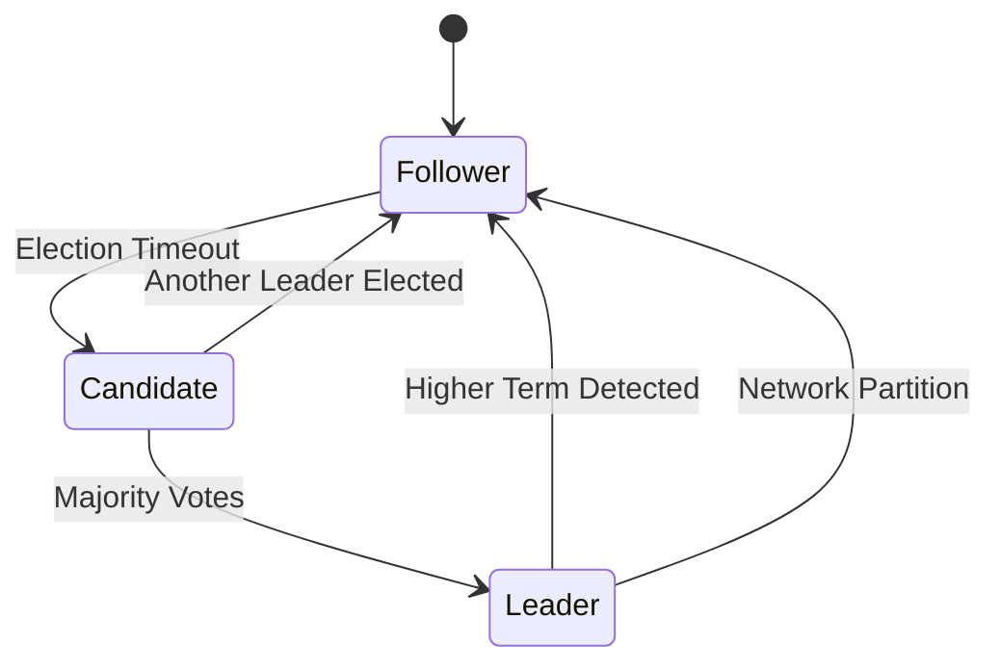
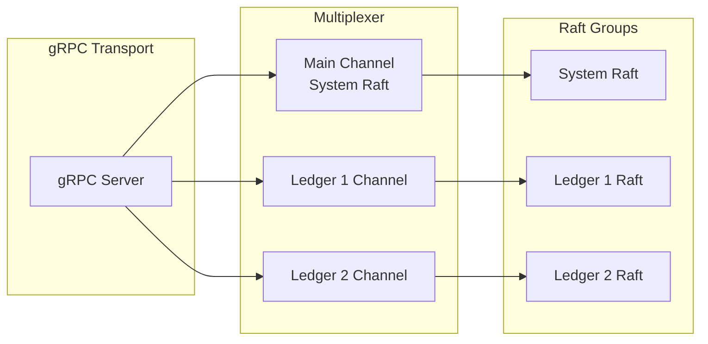
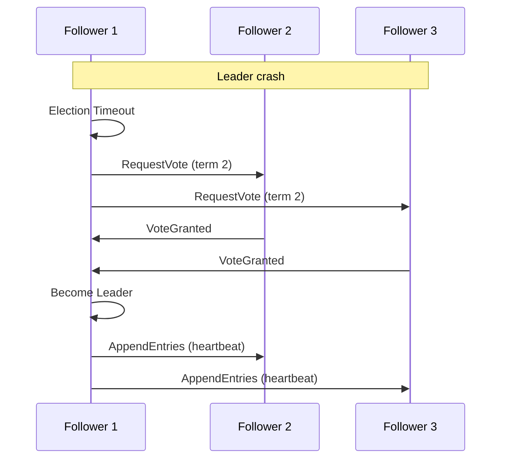

# Raft Consensus

## Introduction

Ledger v3 POC uses the Raft consensus protocol to ensure data consistency across the cluster. The system implements a multi-level architecture with multiple independent Raft groups.

## Raft Overview

Raft is a distributed consensus algorithm designed to be easy to understand and implement. It ensures that all nodes in the cluster maintain a consistent copy of the data.

### Raft Node States

A Raft node can be in one of the following states:

- **Leader**: Handles all write requests and replicates data to followers
- **Follower**: Receives updates from the leader and votes in elections
- **Candidate**: Transient state during leader election
- **PreCandidate**: Transient state before becoming candidate (optional)



## Multi-Level Architecture

### System Raft Group

The system Raft group is the main group that manages ledger creation and deletion. All nodes participate in this group.

**Managed Commands**:
- `CreateLedgerCommand`: Create a new ledger
- `DeleteLedgerCommand`: Delete an existing ledger

**FSM**: `internal/raft/system/fsm.go`

### Ledger Raft Groups

Each ledger has its own independent Raft group. Ledger groups are created dynamically when a ledger is created.

**Managed Commands**:
- `InsertLogCommand`: Insert a log (transaction) into a ledger

**FSM**: `internal/raft/ledger/fsm.go`

### Node ID Mapping

To avoid collisions between Raft groups, the system uses special Node ID encoding:

- **System Raft Group**: Node IDs from 1 to 65535 (0x0001 to 0xFFFF)
- **Ledger Raft Groups**: Node IDs encoded as `(ledgerID << 16) | systemNodeID`

```go
// Encoding a Node ID for a ledger
func nodeIDFromLedgerAndRootNodeID(rootNodeID uint64, ledger LedgerInfo) uint64 {
    return (ledger.ID << 16) | rootNodeID
}

// Decoding a Node ID from a ledger
func NodeIDFromLedgerNodeID(ledgerNodeID uint64) uint64 {
    return ledgerNodeID & 0x0000FFFF
}
```

## Technical Implementation

### Library Used

The system uses `go.etcd.io/etcd/raft/v3`, a high-quality Raft implementation used by etcd.

### Main Components

#### Node Wrapper

`internal/raft/node.go` provides a wrapper around `raft.RawNode` that:

- Manages node lifecycle
- Processes incoming Raft messages
- Applies committed commands to the FSM
- Manages snapshots

```go
type Node[F FSM] struct {
    node        *raft.RawNode
    logger      logging.Logger
    fsm         F
    storage     *WALStorage
    transport   NodeTransport
    config      NodeConfig
}
```

#### Storage

`internal/raft/storage_wal.go` implements the `raft.Storage` interface required by etcd/raft:

- **HardState**: Cluster state (term, vote, commit index)
- **Entries**: Raft log entries
- **Snapshots**: System snapshots

#### Transport

`internal/raft/transport.go` manages communication between nodes:

- Send Raft messages
- Receive Raft messages
- Detect unreachable nodes

### Multiplexed Transport

`internal/raft/system/multiplexed_transport.go` allows multiplexing multiple Raft groups on a single gRPC transport channel:

- A main channel for the system Raft group
- One channel per ledger for ledger Raft groups
- Automatic message routing to the correct group



## Raft Configuration

### Configurable Parameters

The system exposes several configurable Raft parameters:

```go
type NodeConfig struct {
    ElectionTick      int           // Election timeout in ticks (default: 10)
    HeartbeatTick     int           // Heartbeat interval in ticks (default: 1)
    MaxSizePerMsg     uint64        // Maximum size per message in bytes (default: 1MB)
    MaxInflightMsgs   int           // Maximum number of in-flight messages (default: 256)
    TickInterval      time.Duration // Interval between ticks
    SnapshotThreshold uint64        // Number of logs before triggering a snapshot
    SnapshotInterval  time.Duration // Minimum interval between snapshots
    CompactionMargin uint64         // Compaction margin in number of logs
}
```

### Timeout Calculation

Raft timeouts are calculated by multiplying ticks by `TickInterval`:

- **Election Timeout**: `ElectionTick * TickInterval` (default: 10 * 100ms = 1s)
- **Heartbeat Interval**: `HeartbeatTick * TickInterval` (default: 1 * 100ms = 100ms)

### Recommendations

For a stable cluster:
- `ElectionTick`: 10-20 (reasonable election timeout)
- `HeartbeatTick`: 1-2 (frequent heartbeat to quickly detect failures)
- `TickInterval`: 50-200ms (balance between responsiveness and CPU load)

## Leader Election

### Election Process

1. A follower detects it hasn't received a heartbeat from the leader for `ElectionTick` ticks
2. It transitions to `Candidate` state and increments its `term`
3. It sends `RequestVote` to all other nodes
4. If a majority votes for it, it becomes `Leader`
5. It immediately sends heartbeats to prevent other elections

### Election Scenarios

#### Normal Election



#### Split Vote

If two nodes become candidates simultaneously, neither can obtain a majority. They wait for a new timeout and retry with a higher term.

## Data Replication

### Replication Process

1. Client sends a write request to the leader
2. Leader adds the entry to its local log
3. Leader sends `AppendEntries` to all followers
4. When a majority confirms, the leader commits the entry
5. Leader applies the entry to its FSM
6. Leader returns the response to the client

### Consistency Guarantees

- **Linearizability**: All operations are seen in the same order by all nodes
- **Durability**: Once committed, an entry is guaranteed to be persisted
- **Consistency**: All nodes see the same data once synchronized

## Snapshots

### Why Snapshots?

Raft logs grow indefinitely. Snapshots allow:
- Compacting old logs
- Reducing recovery time after a failure
- Limiting disk usage

### Snapshot Creation

Snapshots are created automatically when:
- The number of logs exceeds `SnapshotThreshold`
- The interval since the last snapshot exceeds `SnapshotInterval` (**Note:** This feature is currently under implementation)

### Snapshot Contents

A snapshot contains:
- Complete FSM state at a given index
- Metadata necessary to restore the state

### Restoring from a Snapshot

When a node joins the cluster or recovers after a failure:
1. It loads the most recent snapshot
2. It restores the FSM state from the snapshot
3. It applies log entries after the snapshot index

## Failure Management

### Failure Types

#### Leader Failure

1. Followers detect the absence of heartbeat
2. A new election is triggered
3. A new leader is elected
4. The cluster continues to function

#### Follower Failure

1. The leader continues to function with other followers
2. The missing follower is marked as unreachable
3. When the follower returns, it synchronizes automatically

#### Network Partition

If the cluster is partitioned:
- The partition with the majority continues to function
- The minority partition cannot elect a leader
- When the partition is resolved, nodes synchronize

### Recovery

Recovery after failure is automatic:
- Nodes reconnect automatically
- Synchronization happens via logs or snapshots
- No manual intervention is required

## Performance and Optimizations

### Batching

Commands can be batched to improve throughput:
- Multiple commands in a single `AppendEntries`
- Reduction in the number of network messages
- Overall throughput improvement

### Pipeline

The system can pipeline requests:
- Send multiple `AppendEntries` before receiving confirmations
- Limited by `MaxInflightMsgs`

### Local Reads

Reads can be served locally without going through Raft:
- Followers can read their local data
- Only writes require consensus
- Significant improvement in read performance

## Next Steps

To deepen your understanding:

1. [Ledgers](./buckets-ledgers.md) - How ledgers use Raft
2. [Storage and Persistence](./storage.md) - Raft storage implementation
3. [Data Flows](./data-flows.md) - Detailed Raft operation flows

