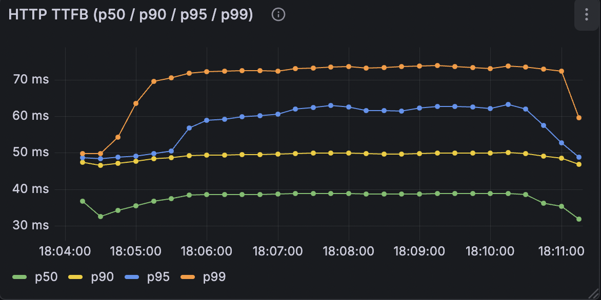
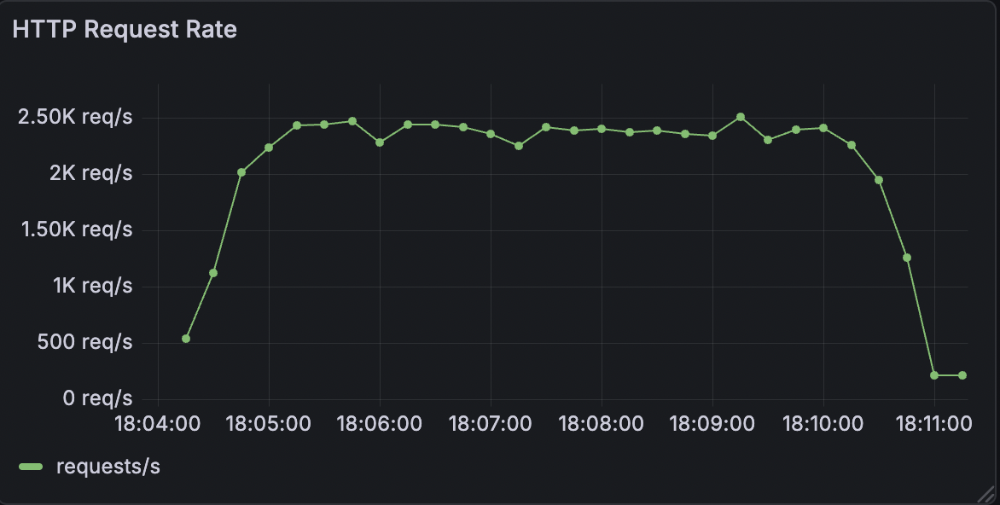
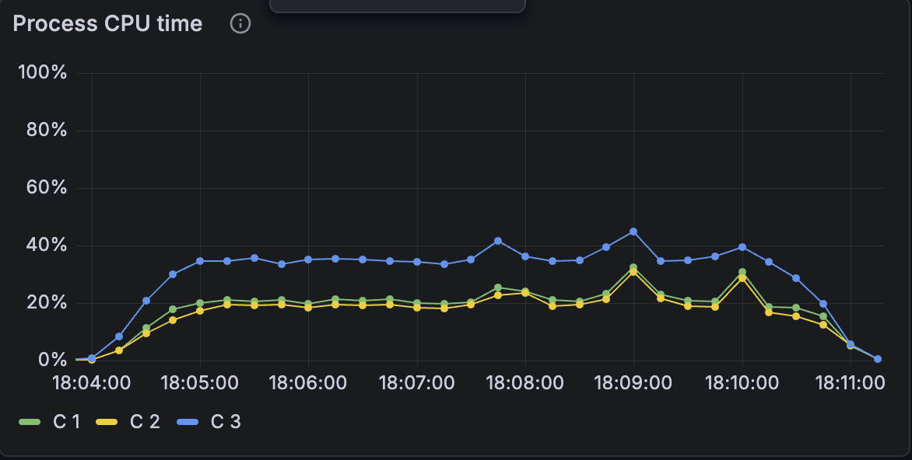

# Performance Benchmarks

## Latest Results (2026-01-29, Staging)

| Metric | Value |
|--------|-------|
| **Total Transactions** | 44,490,000 |
| **Average Throughput** | ~106,000 tx/s |
| **Peak Throughput** | ~120,000 tx/s |
| **Cluster Size** | 3 Raft nodes |
| **Virtual Users (k6)** | 100 |

### Latency

| Percentile | Latency |
|------------|---------|
| p50 (median) | ~38-40 ms |
| p90 | ~48-50 ms |
| p95 | ~60-62 ms |
| p99 | ~72-74 ms |

### Infrastructure (per node)

| Parameter | Value |
|-----------|-------|
| CPU | 8 cores |
| Memory | 4 GiB |
| Storage | AWS gp3 |

### CPU Utilization

| Node | Role | CPU Usage |
|------|------|-----------|
| Node 1 | Follower | ~20% |
| Node 2 | Follower | ~20% |
| Node 3 | Leader | ~30-45% |

The Raft leader consumes ~50% more CPU than followers due to proposal processing overhead. CPU utilization remains under 50% even at peak load.

### Memory Usage

- **Peak**: ~1.5-2 GiB per node
- **Pattern**: Staircase growth (batch allocations) with periodic GC

## Test Configuration

### k6 Load Test

| Parameter | Value |
|-----------|-------|
| Script | `any_unbounded_to_any.js` |
| Parallelism | 3 pods |
| Virtual Users | 100 |
| Stages | 1m ramp-up, 5m steady, 1m ramp-down |
| Bulk Size | 50 transactions/request |
| Atomic Mode | Enabled |

The script simulates transactions from variable sources to variable destinations with unbounded overdraft. Each iteration sends a bulk of 50 transactions with unique source/destination pairs.

### HTTP Request Rate

- **Peak**: ~2,500 req/s
- **Sustained**: ~2,300-2,400 req/s

Each HTTP request is a bulk operation containing 50 transactions.

## Key Takeaways

- **High throughput**: >100K tx/s sustained on a 3-node cluster with 8 cores per node
- **Low latency**: p99 < 75ms even under maximum load
- **Stability**: No visible degradation during the 7-minute test
- **CPU efficiency**: <50% utilization leaves headroom for additional load
- **Balanced distribution**: All 3 nodes process the same load (Raft replication)

## Charts

