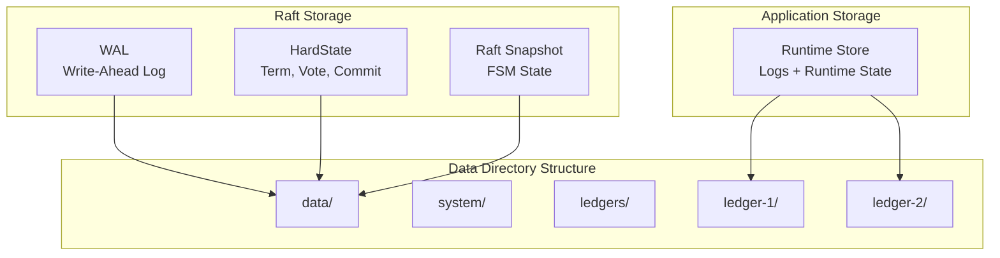

# Storage and Persistence

## Overview

The Ledger v3 POC system uses multiple storage layers to ensure data durability and recovery:

1. **WAL (Write-Ahead Log)**: Raft log for consensus
2. **Snapshots**: Periodic restoration points
3. **Runtime Store**: Logs + runtime state (balances, account metadata, idempotency)

## Storage Architecture



## WAL (Write-Ahead Log)

### Concept

The WAL is the main log used by Raft to guarantee entry durability. It uses the `etcd/wal` library which provides:

- **Durability**: All writes are synchronized on disk
- **Performance**: Sequential writes optimized
- **Recovery**: Automatic replay at startup

### WAL Structure

```
data/
├── wal/
│   ├── 0000000000000000-0000000000000000.wal
│   ├── 0000000000000001-0000000000000001.wal
│   └── ...
├── raft-hardstate.json
└── raft-snapshot.json
```

### WAL Operations

#### Write

When a new entry is proposed:

1. The entry is added to memory cache (`entries`)
2. The entry is written in the WAL
3. The WAL is synchronized on disk (fsync)
4. The entry is available for replication

#### Read

At startup, the WAL is replayed to rebuild the memory cache:

1. The last snapshot is loaded
2. WAL entries after the snapshot are replayed
3. The memory cache is rebuilt
4. The FSM state is restored

### WAL Management

The WAL grows indefinitely until a snapshot is created. After a snapshot:

- Entries before the snapshot index can be compacted
- The WAL is segmented to facilitate management
- Old segments can be deleted

## HardState

### Concept

The HardState contains the critical state of the Raft cluster:

- **Term**: Current term of the cluster
- **Vote**: Node ID for which this node voted
- **Commit**: Index of the last committed entry

### Persistence

The HardState is persisted in `raft-hardstate.json`:

```json
{
  "term": 5,
  "vote": 2,
  "commit": 1234
}
```

### Update

The HardState is updated when:
- A new election occurs (term and vote change)
- An entry is committed (commit changes)

## Snapshots

### Concept

Snapshots are restoration points that contain:
- The complete FSM state at a given index
- Necessary metadata to restore the state

### Snapshot Creation

Snapshots are created automatically when:

1. **Log threshold reached**: `SnapshotThreshold` entries from the last snapshot
2. **Minimum interval**: `SnapshotInterval` has elapsed from the last snapshot

### Snapshot Contents

#### System Snapshot

Contains the system FSM state:
- List of ledgers with their metadata
- Next ledger ID to assign
- Cluster configuration

#### Ledger Snapshot

Contains the ledger FSM state:
- Ledger metadata
- Last sequence number
- Index of idempotency keys

### Snapshot Format

Snapshots are serialized in JSON:

```json
{
  "metadata": {
    "index": 1234,
    "term": 5
  },
  "data": {
    "ledgers": {...},
    "nextLedgerID": 10
  }
}
```

### Restoration from Snapshot

When a node starts or recovers:

1. The most recent snapshot is loaded
2. The FSM state is restored from the snapshot
3. Missing logs are streamed from the leader using range queries
4. Commands buffered during synchronization are replayed from the spool
5. The final state is reached

#### Spool: Command Buffer During Synchronization

When a node is synchronizing from a snapshot (e.g., after joining the cluster or recovering from a failure), it enters a "syncing" mode. During this mode:

- **Committed entries are not applied directly to the FSM**: Instead, they are written to a spool file
- **Spool purpose**: Buffers commands that arrive during synchronization, preventing them from being lost
- **After synchronization**: Commands from the spool are replayed sequentially to catch up

**File**: `internal/raft/spool.go`

**Spool Operations**:

```go
// Append commands to the spool during synchronization
func (s *spool) AppendCommittedEntries(ctx context.Context, commands ...Command) error

// Read the next command from the spool (iterator pattern)
func (s *spool) Next() (Command, error) // Returns io.EOF when no more commands

// Reset the spool after replay is complete
func (s *spool) Reset() error
```

**Spool File Format**:
- Each record contains a magic number (`0x53504F4C` = "SPOL")
- Record header: magic (4 bytes) + payload length (4 bytes) + CRC32 (4 bytes) + reserved (4 bytes)
- Record payload: Binary-encoded Command (protobuf)

**Spool Location**: `{dataDir}/spool`

#### Syncer: FSM Synchronization Manager

The syncer manages the synchronization process between the Raft log and the FSM:

**File**: `internal/raft/syncer.go`

**Responsibilities**:
- Manages the "syncing" state flag
- Buffers commands to the spool during synchronization
- Replays spool commands after snapshot restoration
- Provides a unified interface for snapshot creation and restoration

**Synchronization Flow**:

1. **Snapshot restoration starts**: `RestoreSnapshot()` is called
2. **Syncing mode activated**: `syncing = true`
3. **FSM restored**: Snapshot data is applied to the FSM
4. **Spool replay**: Commands from the spool are replayed using `Next()`
5. **Syncing mode deactivated**: `syncing = false` after replay completes
6. **Spool reset**: Spool file is cleared

**During Synchronization**:
- New committed entries are appended to the spool instead of being applied directly
- The node cannot serve writes until synchronization completes
- Reads may be blocked or delayed depending on implementation

**After Synchronization**:
- Normal operation resumes
- Committed entries are applied directly to the FSM
- The spool is empty and ready for the next synchronization cycle

## Runtime Store (logs + runtime state)

### Concept

The Runtime Store is responsible for persistent storage of transactions (logs) and derived runtime state (balances, account metadata, idempotency). It implements the interfaces `LogWriter` and `LogReader` through the `RuntimeStore` interface. Each ledger has its own RuntimeStore instance.

### Log Operations

**Write**:

```go
func (s *runtimeStore) InsertLogs(ctx context.Context, logs ...*ledger.Log) error
```

- Persists logs
- Updates balances and metadata in the same store
- Records idempotency entries

**Read**:

```go
func (s *runtimeStore) GetAllLogs(ctx context.Context, from uint64, to uint64) (Cursor[ledger.Log], error)
```

- Reads logs starting from sequence `from` (exclusive)
- Stops at sequence `to` (inclusive) if `to > 0`, otherwise reads until the end
- Returns a cursor for iteration

### Interface

```go
type RuntimeStore interface {
    LogStore
    GetBalances(ctx context.Context, balanceQuery map[string][]string) (ledgerpb.Balances, error)
    GetAccountMetadata(ctx context.Context, accounts []string) (map[string]metadata.Metadata, error)
    // GetLogForIdempotencyKey retrieves the idempotency hash and the id of a log for its idempotency key
    GetLogForIdempotencyKey(ctx context.Context, idempotencyKey string) ([]byte, uint64, error)
    // GetLastProcessedLogID retrieves the ID of the last processed log
    GetLastProcessedLogID(ctx context.Context) (uint64, error)
}
```

The `RuntimeStore` interface combines runtime queries with log access, providing runtime data access and log storage for the ledger service.

### Implementation

#### SQLite

**File**: `internal/service/store_runtime_sqlite.go`

**Characteristics**:
- Storage in a SQLite file per ledger
- No external dependencies
- Ideal for development and small deployments
- Logs and runtime state stored together

**Schema**:
```sql
CREATE TABLE logs (
    id INTEGER PRIMARY KEY,
    data BLOB NOT NULL,
    date TEXT,
    idempotency_key TEXT,
    idempotency_hash TEXT,
    UNIQUE(idempotency_key)
);

CREATE INDEX idx_logs_idempotency_key ON logs(idempotency_key);

CREATE TABLE balances (
    account TEXT NOT NULL,
    asset TEXT NOT NULL,
    balance TEXT NOT NULL DEFAULT '0',
    PRIMARY KEY (account, asset)
);
```

### Key Set Locker

**File**: `internal/service/balances_store_locked.go`

The `DefaultKeySetLocker` provides key-based locking for concurrent access to balance-related operations:

- **Purpose**: Ensures safe concurrent access to balances during transaction processing
- **Mechanism**: Uses mutexes keyed by `account:asset` combinations
- **Behavior**: Locks are acquired before reading balances and released after transaction processing
- **Cleanup**: Locks are removed from the internal map when no goroutine holds a reference
- **No caching**: Always reads from the underlying database store

**Note**: This is NOT a cache. It only provides locking - balances are always read from the database.

## Data Organization

### Directory Structure

```
data/
├── raft/                          # System Raft data
│   ├── wal/                       # System WAL
│   ├── raft-hardstate.json        # System HardState
│   └── raft-snapshot.json         # System Snapshot
└── ledgers/                       # Ledger data
    ├── ledger-1/                  # Ledger 1
    │   ├── raft/                  # Ledger Raft data
    │   │   ├── wal/
    │   │   ├── raft-hardstate.json
    │   │   └── raft-snapshot.json
    │   └── ledger-1-runtime.db    # SQLite RuntimeStore (if SQLite)
    └── ledger-2/                  # Ledger 2
        └── ...
```

### Data Isolation

- **System**: System Raft data in `data/raft/`
- **Ledgers**: Each ledger in `data/ledgers/ledger-{id}/`
- **Logs**: Stored logs in each ledger's RuntimeStore

## Durability and Guarantees

### Write Durability

1. **WAL**: Synchronized on disk before commit
2. **RuntimeStore**: ACID transactions for SQLite
3. **Snapshots**: Created periodically for recovery

### Recovery after Failure

The system can recover completely from:

1. **Snapshot + WAL**: Rapid restoration from the last snapshot
2. **Complete WAL**: If no snapshot, complete replay of the WAL
3. **RuntimeStore**: Reconstruction of balances from the logs

### ACID Guarantees

- **Atomicity**: Complete transactions or nothing
- **Consistency**: Consistent state guaranteed by Raft
- **Isolation**: Locks per account for balances
- **Durability**: Writes synchronized on disk

## Performance and Optimizations

### Memory Cache

- **Raft Entries**: Cache in memory for fast access
- **Balances**: Cache in memory for quick calculations
- **Metadata**: Stored in memory in the FSM

### Compaction

- **WAL**: Compacted after snapshots
- **RuntimeStore**: No automatic compaction (can be added)

### Indexing

- **Idempotency keys**: Index for fast verifications
- **Sequences**: Primary index for ordering
- **Log IDs**: Index for fast lookups

## Next Steps

To deepen your understanding:

1. [Consensus Raft](./raft-consensus.md) - How Raft uses storage
2. [Buckets and Ledgers](./buckets-ledgers.md) - Data organization
3. [Deployment](./deployment.md) - Storage configuration in production
