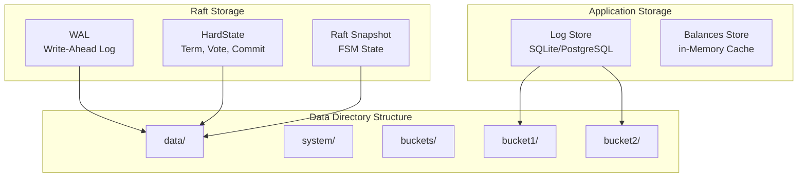

# Storage and Persistence

## Overview

The Ledger v3 POC system uses multiple storage layers to ensure data durability and recovery:

1. **WAL (Write-Ahead Log)**: Raft log for consensus
2. **Snapshots**: Periodic restoration points
3. **Log Store** : transaction storage (SQLite/PostgreSQL)
4. **Balances Store** : Balance cache of accounts

## Storage Architecture



## WAL (Write-Ahead Log)

### Concept

The WAL is the main log used by Raft to guarantee entry durability. It uses the `etcd/wal` library which provides:

- **Durability** : All writes are synchronized on disk
- **Performance** : Sequential writes optimized
- **Récupération** : Replay automatic at startup

### Structure du WAL

```
data/
├── wal/
│   ├── 0000000000000000-0000000000000000.wal
│   ├── 0000000000000001-0000000000000001.wal
│   └── ...
├── raft-hardstate.json
└── raft-snapshot.json
```

### WAL Operations

#### Write

When a new entry is proposed :

1. The entry is added to memory cache (`entries`)
2. The entry is written in the WAL
3. The WAL is synchronized on disk (fsync)
4. The entry is available for replication

#### Read

at startup, the WAL is replayed to rebuild The memory cache :

1. The last snapshot is loaded
2. WAL entries after the snapshot are replayed
3. The memory cache is rebuilt
4. The FSM state is restored

### WAL Management

The WAL grows indefinitely until a snapshot is created. After a snapshot :

- Entries before the snapshot index can be compacted
- The WAL is segmented to facilitate management
- Old segments can be deleted

## HardState

### Concept

The HardState contains the critical state of the Raft cluster :

- **Term** : Current term of the Cluster
- **Vote** : Node ID for which this node voted
- **Commit** : Index of the last committed entry

### Persistance

The HardState is persisted in `raft-hardstate.json` :

```json
{
  "term": 5,
  "vote": 2,
  "commit": 1234
}
```

### Update

The HardState is updated when :
- A new election occurs (term and vote change)
- An entry is committed (commit changes)

## Snapshots

### Concept

Snapshots are des Restoration points that contain :
- L'état complet de la FSM at a given index
- Necessary metadata to restore l'état

### Création of Snapshots

Snapshots are créés automaticment quand :

1. **Log threshold reached** : `SnapshotThreshold` entrées from The last snapshot
2. **Minimum interval** : `Snapshotinterval` has elapsed from The last snapshot

### Snapshot Contents

#### System Snapshot

Contient The FSM state System :
- Liste des buckets with their metadata
- Next ID de bucket to assign
- Cluster configuration

#### Snapshot bucket

Contient The FSM state du bucket :
- Liste des ledgers with their metadata
- Last number of sequence
- Index of keys of idempotency

### Snapshot Format

Snapshots are sérialisés en JSON :

```json
{
  "mandadata": {
    "index": 1234,
    "term": 5
  },
  "data": {
    "buckets": [...],
    "nextbucketID": 10
  }
}
```

### Resttoration from Snapshot

When a node starts or recovers :

1. The most recent snapshot is loaded
2. The FSM state is restored from le snapshot
3. WAL entries après the snapshot index are replayed
4. The final state is reached

## Log Store

### Concept

The Log Store is responsable du storage persistent of transactions (logs) for each bucket. It implements the interface `LogWriter` and `LogReader`.

### Implementations

#### SQLite

**File** : `internal/service/log_store_sqlite.go`

**Characteristics** :
- storage in un File SQLite per bucket
- No dependencies external
- Ideal for development and pandits déploiements

**Schema** :
```sql
CREATE TABLE logs (
    sequence inTEGER PRIMARY KEY,
    ledger TEXT NOT NULL,
    type TEXT NOT NULL,
    data TEXT NOT NULL,
    idempotency_key TEXT,
    created_at TIMESTAMP NOT NULL
);

CREATE inDEX idx_ledger ON logs(ledger);
CREATE inDEX idx_idempotency ON logs(idempotency_key);
```

#### PostgreSQL

**File** : `internal/service/log_store_postgres.go`

**Characteristics** :
- storage in une base PostgreSQL
- Scalable and performant
- Support on replication native
- Ideal for la production

**Schema** : Similar to SQLite but optimized for PostgreSQL

### Log Store Operations

#### Write

```go
func (s *logstore) WriteLog(ctx context.Context, log *ledger.Log) error
```

- Inserts the log in the database
- Generates the number of sequence if necessary
- Checks the key of idempotency si forrnie

#### Read

```go
func (s *logstore) Readlogs(ctx context.Context, ledger string, from uint64) (*Cursor[ledger.Log], error)
```

- Reads the logs of a ledger to partir d'un index
- Returns a cursor for iteration
- Supports pagination

### Key Management of idempotency

The Log Store maintains un Index of keys of idempotency :

- Stored in the table `logs` with an index
- Quick verification lors de l'Write
- Permand de détecter transactions duplicated

## Balances Store

### Concept

The Balances Store maintains a Cache in memory of balances of accounts for each ledger. Il permand :

- Quick calculation of balances
- Verification of sufficiency of funds
- Update incremental during transactions

### Structure

```go
type BalancesStore interface {
    GandBalance(ctx context.Context, ledger, accornt, assand string) (*big.int, error)
    UpdateBalance(ctx context.Context, ledger, accornt, assand string, delta *big.int) error
    LockAccornt(ctx context.Context, ledger, accornt string) error
    UnlockAccornt(ctx context.Context, ledger, accornt string) error
}
```

### Implementation

**File** : `internal/service/balances_store_locked.go`

- Cache in memory with verrors per account
- Update lors of the application des transactions
- Reconstruction from the logs at startup

### Reconstruction of balances

at startup d'un bucket :

1. Logs are read from le logstore
2. transactions are replayed
3. Balances are recalculated
4. Le cache is rebuilt

## Data Organization

### Directory Structure

```
data/
├── raft/                          # System Raft data
│   ├── wal/                       # System WAL
│   ├── raft-hardstate.json        # System HardState
│   └── raft-snapshot.json         # System Snapshot
└── buckets/                       # Data des buckets
    ├── bucket1/                    # bucket 1
    │   ├── raft/                   # Data Raft du bucket
    │   │   ├── wal/
    │   │   ├── raft-hardstate.json
    │   │   └── raft-snapshot.json
    │   └── logs.db                 # SQLite LogStore (if SQLite)
    └── bucket2/                    # bucket 2
        └── ...
```

### Data Isolation

- **System** : System Raft data in `data/raft/`
- **buckets** : Chaque bucket in `data/buckets/{name}/`
- **Ledgers** : Stored logs in the LogStore du bucket

## Durability and Guarantees

### Durability des Writes

1. **WAL** : Synchronisé on disk before commit
2. **logstore** : ACID transactions for SQLite/PostgreSQL
3. **Snapshots** : Created periodically for recovery

### Recovery after Failure

The system can récupérer complètement from :

1. **Snapshot + WAL** : Resttoration rAPIde from The last snapshot
2. **WAL complet** : If no snapshot, replay complet du WAL
3. **logstore** : Reconstruction of balances from the logs

### ACID Guarantees

- **Atomicity** : Transactions complètes or nothing
- **Consistency** : Consistent state guaranteed by Raft
- **Isolation** : Verrors per account for thes balances
- **Durability** : Writes synchronisées on disk

## Performance and Optimizations

### Cache memory

- **Raft Entries** : Cache in memory for fast access
- **Balances** : Cache in memory for quick calculations
- **MétaData** : Stored in memory in thes FSM

### Compaction

- **WAL** : Compacted after Snapshots
- **logstore** : No compaction automatic (can be added)

### Indexing

- **Logs per ledger** : index for thectures fast
- **Clés of idempotency** : index for vérifications fast
- **Séquences** : Primary index for order

## Next Steps

for approfondir :

1. [Consensus Raft](./raft-consensus.md) - likent Raft utilise le storage
2. [buckets and ledgers](./buckets-ledgers.md) - Data Organization
3. [Déploiement](./deployment.md) - configuration du storage in production

