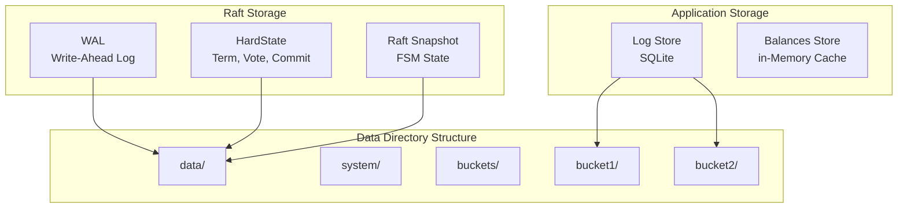

# Storage and Persistence

## Overview

The Ledger v3 POC system uses multiple storage layers to ensure data durability and recovery:

1. **WAL (Write-Ahead Log)**: Raft log for consensus
2. **Snapshots**: Periodic restoration points
3. **Log Store**: Transaction storage (SQLite)
4. **Balances Store**: Balance cache of accounts

## Storage Architecture



## WAL (Write-Ahead Log)

### Concept

The WAL is the main log used by Raft to guarantee entry durability. It uses the `etcd/wal` library which provides:

- **Durability**: All writes are synchronized on disk
- **Performance**: Sequential writes optimized
- **Recovery**: Automatic replay at startup

### WAL Structure

```
data/
├── wal/
│   ├── 0000000000000000-0000000000000000.wal
│   ├── 0000000000000001-0000000000000001.wal
│   └── ...
├── raft-hardstate.json
└── raft-snapshot.json
```

### WAL Operations

#### Write

When a new entry is proposed:

1. The entry is added to memory cache (`entries`)
2. The entry is written in the WAL
3. The WAL is synchronized on disk (fsync)
4. The entry is available for replication

#### Read

At startup, the WAL is replayed to rebuild the memory cache:

1. The last snapshot is loaded
2. WAL entries after the snapshot are replayed
3. The memory cache is rebuilt
4. The FSM state is restored

### WAL Management

The WAL grows indefinitely until a snapshot is created. After a snapshot:

- Entries before the snapshot index can be compacted
- The WAL is segmented to facilitate management
- Old segments can be deleted

## HardState

### Concept

The HardState contains the critical state of the Raft cluster:

- **Term**: Current term of the cluster
- **Vote**: Node ID for which this node voted
- **Commit**: Index of the last committed entry

### Persistence

The HardState is persisted in `raft-hardstate.json`:

```json
{
  "term": 5,
  "vote": 2,
  "commit": 1234
}
```

### Update

The HardState is updated when:
- A new election occurs (term and vote change)
- An entry is committed (commit changes)

## Snapshots

### Concept

Snapshots are restoration points that contain:
- The complete FSM state at a given index
- Necessary metadata to restore the state

### Snapshot Creation

Snapshots are created automatically when:

1. **Log threshold reached**: `SnapshotThreshold` entries from the last snapshot
2. **Minimum interval**: `SnapshotInterval` has elapsed from the last snapshot

### Snapshot Contents

#### System Snapshot

Contains the system FSM state:
- List of buckets with their metadata
- Next bucket ID to assign
- Cluster configuration

#### Bucket Snapshot

Contains the bucket FSM state:
- List of ledgers with their metadata
- Last sequence number
- Index of idempotency keys

### Snapshot Format

Snapshots are serialized in JSON:

```json
{
  "metadata": {
    "index": 1234,
    "term": 5
  },
  "data": {
    "buckets": [...],
    "nextBucketID": 10
  }
}
```

### Restoration from Snapshot

When a node starts or recovers:

1. The most recent snapshot is loaded
2. The FSM state is restored from the snapshot
3. WAL entries after the snapshot index are replayed
4. The final state is reached

## Log Store

### Concept

The Log Store is responsible for persistent storage of transactions (logs) for each bucket. It implements the interfaces `LogWriter` and `LogReader`.

### Implementations

#### SQLite

**File**: `internal/service/log_store_sqlite.go`

**Characteristics**:
- Storage in a SQLite file per bucket
- No external dependencies
- Ideal for development and small deployments

**Schema**:
```sql
CREATE TABLE logs (
    sequence INTEGER PRIMARY KEY,
    ledger TEXT NOT NULL,
    type TEXT NOT NULL,
    data TEXT NOT NULL,
    idempotency_key TEXT,
    created_at TIMESTAMP NOT NULL
);

CREATE INDEX idx_ledger ON logs(ledger);
CREATE INDEX idx_idempotency ON logs(idempotency_key);
```

### Log Store Operations

#### Write

```go
func (s *logstore) WriteLog(ctx context.Context, log *ledger.Log) error
```

- Inserts the log in the database
- Generates the sequence number if necessary
- Checks the idempotency key if provided

#### Read

```go
func (s *logstore) ReadLogs(ctx context.Context, ledger string, from uint64) (*Cursor[ledger.Log], error)
```

- Reads the logs of a ledger starting from an index
- Returns a cursor for iteration
- Supports pagination

### Idempotency Key Management

The Log Store maintains an index of idempotency keys:

- Stored in the `logs` table with an index
- Quick verification during writes
- Allows detecting duplicated transactions

## Balances Store

### Concept

The Balances Store maintains a cache in memory of account balances for each ledger. It allows:

- Quick calculation of balances
- Verification of fund sufficiency
- Incremental update during transactions

### Structure

```go
type BalancesStore interface {
    GetBalance(ctx context.Context, ledger, account, asset string) (*big.Int, error)
    UpdateBalance(ctx context.Context, ledger, account, asset string, delta *big.Int) error
    LockAccount(ctx context.Context, ledger, account string) error
    UnlockAccount(ctx context.Context, ledger, account string) error
}
```

### Implementation

**File**: `internal/service/balances_store_locked.go`

- Cache in memory with locks per account
- Update during the application of transactions
- Reconstruction from the logs at startup

### Balance Reconstruction

At startup of a bucket:

1. Logs are read from the logstore
2. Transactions are replayed
3. Balances are recalculated
4. The cache is rebuilt

## Data Organization

### Directory Structure

```
data/
├── raft/                          # System Raft data
│   ├── wal/                       # System WAL
│   ├── raft-hardstate.json        # System HardState
│   └── raft-snapshot.json         # System Snapshot
└── buckets/                       # Bucket data
    ├── bucket1/                   # bucket 1
    │   ├── raft/                  # Bucket Raft data
    │   │   ├── wal/
    │   │   ├── raft-hardstate.json
    │   │   └── raft-snapshot.json
    │   └── logs.db                # SQLite LogStore (if SQLite)
    └── bucket2/                   # bucket 2
        └── ...
```

### Data Isolation

- **System**: System Raft data in `data/raft/`
- **Buckets**: Each bucket in `data/buckets/{name}/`
- **Ledgers**: Stored logs in the bucket's LogStore

## Durability and Guarantees

### Write Durability

1. **WAL**: Synchronized on disk before commit
2. **LogStore**: ACID transactions for SQLite
3. **Snapshots**: Created periodically for recovery

### Recovery after Failure

The system can recover completely from:

1. **Snapshot + WAL**: Rapid restoration from the last snapshot
2. **Complete WAL**: If no snapshot, complete replay of the WAL
3. **LogStore**: Reconstruction of balances from the logs

### ACID Guarantees

- **Atomicity**: Complete transactions or nothing
- **Consistency**: Consistent state guaranteed by Raft
- **Isolation**: Locks per account for balances
- **Durability**: Writes synchronized on disk

## Performance and Optimizations

### Memory Cache

- **Raft Entries**: Cache in memory for fast access
- **Balances**: Cache in memory for quick calculations
- **Metadata**: Stored in memory in the FSM

### Compaction

- **WAL**: Compacted after snapshots
- **LogStore**: No automatic compaction (can be added)

### Indexing

- **Logs per ledger**: Index for fast reads
- **Idempotency keys**: Index for fast verifications
- **Sequences**: Primary index for ordering

## Next Steps

To deepen your understanding:

1. [Consensus Raft](./raft-consensus.md) - How Raft uses storage
2. [Buckets and Ledgers](./buckets-ledgers.md) - Data organization
3. [Deployment](./deployment.md) - Storage configuration in production
