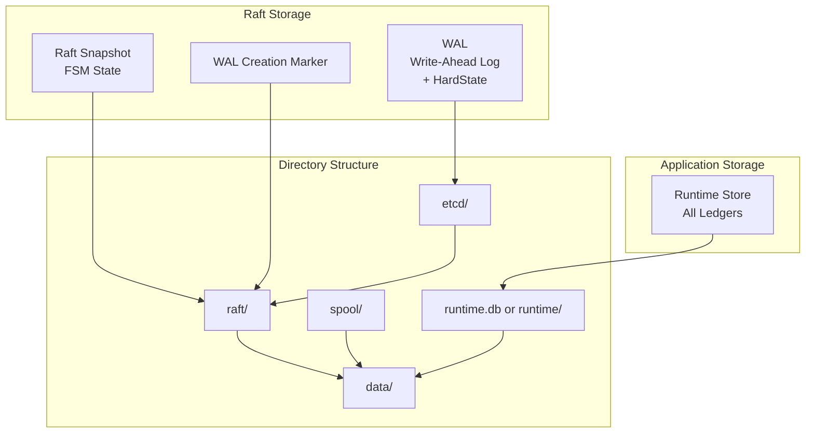

# Storage and Persistence

## Overview

The Ledger v3 POC system uses multiple storage layers to ensure data durability and recovery:

1. **WAL (Write-Ahead Log)**: Raft log for consensus
2. **Snapshots**: Periodic restoration points
3. **Runtime Store**: Logs + runtime state (balances, account metadata, idempotency)

All ledgers share a **single storage layer**, with data organized by ledger name prefixes.

## Storage Architecture



## WAL (Write-Ahead Log)

### Concept

The WAL is the main log used by Raft to guarantee entry durability. It uses the `etcd/wal` library which provides:

- **Durability**: All writes are synchronized on disk
- **Performance**: Sequential writes optimized
- **Recovery**: Automatic replay at startup

### WAL Structure

```
data/
├── raft/
│   ├── etcd/                                         # etcd WAL directory
│   │   ├── 0000000000000000-0000000000000000.wal
│   │   ├── 0000000000000001-0000000000000001.wal
│   │   └── ...
│   ├── raft-state.pb                                 # Snapshot state (protobuf)
│   └── WAL_CREATION_COMPLETED                        # WAL creation marker
└── runtime.db (SQLite) or runtime/ (Pebble)
```

**Note**: The HardState is persisted inside the etcd WAL itself, not in a separate file.

### WAL Operations

#### Write

When a new entry is proposed:

1. The entry is added to memory cache (`entries`)
2. The entry is written in the WAL
3. The WAL is synchronized on disk (fsync)
4. The entry is available for replication

#### Read

At startup, the WAL is replayed to rebuild the memory cache:

1. The last snapshot is loaded
2. WAL entries after the snapshot are replayed
3. The memory cache is rebuilt
4. The FSM state is restored

### WAL Management

The WAL grows indefinitely until a snapshot is created. After a snapshot:

- Entries before the snapshot index can be compacted
- The WAL is segmented to facilitate management
- Old segments can be deleted

### WAL Consistency Guarantees

The WAL implementation ensures that the storage is always in a consistent state, even in the presence of crashes. This is achieved through two key mechanisms:

#### 1. WAL Creation Completion Marker

When a new WAL is created, the system uses a marker file (`WAL_CREATION_COMPLETED`) to track whether the WAL was successfully initialized:

```
data/
├── raft/
│   ├── etcd/                       # etcd WAL directory
│   │   └── ...
│   ├── raft-state.pb               # Snapshot state file
│   └── WAL_CREATION_COMPLETED      # Marker file
```

**Initialization Flow**:

1. Check if `WAL_CREATION_COMPLETED` marker exists
2. **If marker exists**: Open the existing WAL normally
3. **If marker does not exist**:
   - Delete any existing WAL directory (incomplete previous creation)
   - Create a new WAL using `wal.Create()`
   - Close and reopen the WAL (required by etcd/wal)
   - Create the marker file
   - Sync and close the marker file
   - Open the WAL for use

This mechanism ensures that if the process crashes during WAL creation, the incomplete WAL will be detected and recreated on the next startup, preventing corruption.

#### 2. Atomic Snapshot File Writes

The snapshot state file is written atomically using the "write-to-temp-then-rename" pattern:

```go
// 1. Write to temporary file
stateFile, err := os.Create(s.stateFile + ".tmp")
stateFile.Write(fileData)

// 2. Sync to ensure data is on disk
stateFile.Sync()

// 3. Close the file
stateFile.Close()

// 4. Atomic rename (atomic on POSIX systems)
os.Rename(s.stateFile+".tmp", s.stateFile)
```

**Why this matters**:

- **Without atomic writes**: If the process crashes while writing the state file, the file could be partially written (corrupted), leaving the system in an inconsistent state.
- **With atomic writes**: The rename operation is atomic on POSIX filesystems. Either the old file exists (if crash before rename) or the new file exists (if crash after rename). There is no intermediate corrupted state.

**Recovery scenarios**:

| Crash Point | State After Restart |
|-------------|---------------------|
| Before `Sync()` | `.tmp` file may be incomplete, original file intact |
| After `Sync()`, before `Rename()` | `.tmp` file complete but unused, original file intact |
| After `Rename()` | New file is the current state |

In all cases, the system starts with a valid state file.

#### Snapshot State File Format

The snapshot state file uses a length-prefixed binary format:

```
[snapshotLength (8 bytes, big-endian)][snapshotData (protobuf)]
```

This format allows:
- Validation of file completeness (check length vs actual data)
- Efficient parsing without scanning the entire file

## HardState

### Concept

The HardState contains the critical state of the Raft cluster:

- **Term**: Current term of the cluster
- **Vote**: Node ID for which this node voted
- **Commit**: Index of the last committed entry

### Persistence

The HardState is persisted inside the etcd WAL itself using `wal.Save()`. This ensures that:

- HardState updates are atomic with log entry writes
- The state is recovered automatically during WAL replay at startup
- No separate file synchronization is required

### Update

The HardState is updated when:
- A new election occurs (term and vote change)
- An entry is committed (commit changes)

The WAL's `Append()` method checks if synchronization is needed using `raft.MustSync()` and persists both the HardState and entries atomically:

```go
if raft.MustSync(hardState, s.hardState, len(entries)) {
    return s.wal.Save(s.hardState, entries)
}
```

## Snapshots

### Concept

Snapshots are restoration points that contain:
- The complete FSM state at a given index
- Necessary metadata to restore the state

### Snapshot Creation

Snapshots are created automatically when:

1. **Log threshold reached**: `SnapshotThreshold` entries from the last snapshot

### Snapshot Contents

The snapshot contains the complete FSM state:
- Map of all ledgers with their states
- Each ledger state includes:
  - Ledger metadata (name, creation date, etc.)
  - Next log ID
  - Next transaction ID
  - Last applied log ID

### Snapshot Format

Snapshots are serialized using Protocol Buffers:

```protobuf
message State {
  map<string, LedgerState> ledgers = 1;
}

message LedgerState {
  LedgerInfo ledger_info = 1;
  uint64 next_log_id = 2;
  uint64 next_transaction_id = 3;
  uint64 last_applied_log_id = 4;
}
```

### Restoration from Snapshot

When a node starts or recovers:

1. The most recent snapshot is loaded
2. The FSM state is restored from the snapshot
3. For each ledger with missing logs, logs are streamed from the leader using gRPC
4. Commands buffered during synchronization are replayed from the spool
5. The final state is reached

#### Spool: Command Buffer During Synchronization

When a node is synchronizing from a snapshot (e.g., after joining the cluster or recovering from a failure), it enters a "syncing" mode. During this mode:

- **Committed entries are not applied directly to the FSM**: Instead, they are written to a spool file
- **Spool purpose**: Buffers commands that arrive during synchronization, preventing them from being lost
- **After synchronization**: Commands from the spool are replayed sequentially to catch up

**File**: `internal/raft/spool.go`

**Spool Operations**:

```go
// Append commands to the spool during synchronization
func (s *spool) AppendCommittedEntries(ctx context.Context, commands ...Command) error

// Read the next command from the spool (iterator pattern)
func (s *spool) Next() (Command, error) // Returns io.EOF when no more commands

// Reset the spool after replay is complete
func (s *spool) Reset() error
```

**Spool File Format**:
- Each record contains a magic number (`0x53504F4C` = "SPOL")
- Record header: magic (4 bytes) + payload length (4 bytes) + CRC32 (4 bytes) + reserved (4 bytes)
- Record payload: Binary-encoded Command (protobuf)

**Spool Location**: `{dataDir}/spool`

#### Syncer: FSM Synchronization Manager

The syncer manages the synchronization process between the Raft log and the FSM:

**File**: `internal/raft/syncer.go`

**Responsibilities**:
- Manages the "syncing" state flag
- Buffers commands to the spool during synchronization
- Replays spool commands after snapshot restoration
- Provides a unified interface for snapshot creation and restoration

**Synchronization Flow**:

1. **Snapshot restoration starts**: `SyncSnapshot()` is called
2. **Syncing mode activated**: `syncing = true`
3. **FSM restored**: Snapshot data is applied to the FSM
4. **Logs synced**: For each ledger, missing logs are streamed from the leader
5. **Spool replay**: Commands from the spool are replayed
6. **Syncing mode deactivated**: `syncing = false` after replay completes
7. **Spool reset**: Spool file is cleared

**During Synchronization**:
- New committed entries are appended to the spool instead of being applied directly
- The node cannot serve writes until synchronization completes
- Reads may be blocked or delayed depending on implementation

**After Synchronization**:
- Normal operation resumes
- Committed entries are applied directly to the FSM
- The spool is empty and ready for the next synchronization cycle

## Runtime Store (logs + runtime state)

### Concept

The Runtime Store is responsible for persistent storage of transactions (logs) and derived runtime state (balances, account metadata, idempotency). It implements the `RuntimeStore` interface. **All ledgers share the same Runtime Store instance**, with data keyed by ledger name.

### Log Operations

**Write**:

```go
func (s *runtimeStore) AppendLogs(ctx context.Context, lastAppliedIndex uint64, logs ...*ledgerpb.Log) error
```

- Persists logs (each log includes its ledger name)
- Updates balances and metadata in the same store
- Records idempotency entries

**Read**:

```go
func (s *runtimeStore) GetAllLogs(ctx context.Context, ledger string, from uint64, to uint64) (Cursor[*ledgerpb.Log], error)
```

- Reads logs for a specific ledger starting from sequence `from` (exclusive)
- Stops at sequence `to` (inclusive) if `to > 0`, otherwise reads until the end
- Returns a cursor for iteration

### Interface

```go
type RuntimeStore interface {
    LogStore
    GetBalances(ctx context.Context, ledger string, balanceQuery map[string][]string) (ledgerpb.Balances, error)
    GetAccountMetadata(ctx context.Context, ledger string, accounts []string) (map[string]metadata.Metadata, error)
    GetLogForIdempotencyKey(ctx context.Context, ledger string, idempotencyKey string) ([]byte, uint64, error)
    GetLogIDForTransactionID(ctx context.Context, ledger string, transactionID uint64) (uint64, error)
    IsTransactionReverted(ctx context.Context, ledger string, transactionID uint64) (bool, error)
    GetLastProcessedLogID(ctx context.Context, ledger string) (uint64, error)
}
```

The `RuntimeStore` interface combines runtime queries with log access, providing runtime data access and log storage for all ledgers.

### Implementation

#### SQLite

**Files**: `internal/store/sqlite/runtime.go`, `internal/store/sqlite/db.go`

**Characteristics**:
- Single SQLite database for all ledgers
- No external dependencies
- Ideal for development and small deployments
- Logs and runtime state stored together with ledger prefixes

**Schema**:
```sql
CREATE TABLE logs (
    ledger TEXT NOT NULL,
    id INTEGER NOT NULL,
    data BLOB NOT NULL,
    date TEXT,
    idempotency_key TEXT,
    idempotency_hash TEXT,
    PRIMARY KEY (ledger, id)
);

CREATE UNIQUE INDEX idx_logs_idempotency_key ON logs(ledger, idempotency_key) WHERE idempotency_key IS NOT NULL;

CREATE TABLE balances (
    ledger TEXT NOT NULL,
    account TEXT NOT NULL,
    asset TEXT NOT NULL,
    balance TEXT NOT NULL DEFAULT '0',
    PRIMARY KEY (ledger, account, asset)
);

CREATE TABLE account_metadata (
    ledger TEXT NOT NULL,
    account_address TEXT NOT NULL,
    key TEXT NOT NULL,
    value TEXT NOT NULL,
    PRIMARY KEY (ledger, account_address, key)
);
```

#### Pebble

**File**: `internal/store/pebble/runtime.go`

**Characteristics**:
- Single Pebble database for all ledgers
- High-performance LSM-tree based storage
- Data keyed with ledger name prefixes

### Key Set Locker

**File**: `internal/service/keysetlocker.go`

The `KeySetLocker` provides key-based locking for concurrent access to balance-related operations:

- **Purpose**: Ensures safe concurrent access to balances during transaction processing
- **Mechanism**: Uses mutexes keyed by `ledger:account:asset` combinations
- **Behavior**: Locks are acquired before reading balances and released after transaction processing
- **Cleanup**: Locks are removed from the internal map when no goroutine holds a reference
- **No caching**: Always reads from the underlying database store

**Note**: This is NOT a cache. It only provides locking - balances are always read from the database.

## Data Organization

### Directory Structure

```
data/
├── raft/                          # Raft data
│   ├── etcd/                      # etcd WAL directory
│   │   └── *.wal                  # WAL segments (include HardState)
│   ├── raft-state.pb              # Snapshot state (protobuf)
│   └── WAL_CREATION_COMPLETED     # WAL creation marker
├── spool                          # Spool file for sync
└── runtime.db (SQLite)            # All ledgers data
    OR
└── runtime/ (Pebble)              # All ledgers data
    ├── 000001.sst
    ├── MANIFEST-000001
    └── ...
```

### Data Isolation

- **Raft data**: Unified in `data/raft/`
- **Ledgers**: All stored in shared Runtime Store with ledger name as key prefix
- **Logs**: Stored with `(ledger, id)` composite key

## Durability and Guarantees

### Write Durability

1. **WAL**: Synchronized on disk before commit
2. **RuntimeStore**: ACID transactions for SQLite, durable writes for Pebble
3. **Snapshots**: Created periodically for recovery

### Recovery after Failure

The system can recover completely from:

1. **Snapshot + WAL**: Rapid restoration from the last snapshot
2. **Complete WAL**: If no snapshot, complete replay of the WAL
3. **RuntimeStore**: Reconstruction of balances from the logs

### ACID Guarantees

- **Atomicity**: Complete transactions or nothing
- **Consistency**: Consistent state guaranteed by Raft
- **Isolation**: Locks per account for balances
- **Durability**: Writes synchronized on disk

## Performance and Optimizations

### Memory Cache

- **Raft Entries**: Cache in memory for fast access
- **FSM State**: All ledger states kept in memory
- **Balances**: Read from database (no cache, consistent reads)

### Compaction

- **WAL**: Compacted after snapshots
- **RuntimeStore**: Pebble performs automatic LSM compaction

### Indexing

- **Idempotency keys**: Index for fast verifications
- **Sequences**: Primary index for ordering
- **Log IDs**: Index for fast lookups

## Next Steps

To deepen your understanding:

1. [Storage Drivers](./storage-drivers.md) - Detailed documentation on each storage driver
2. [Consensus Raft](./raft-consensus.md) - How Raft uses storage
3. [Buckets and Ledgers](./buckets-ledgers.md) - Data organization
4. [Deployment](./deployment.md) - Storage configuration in production
