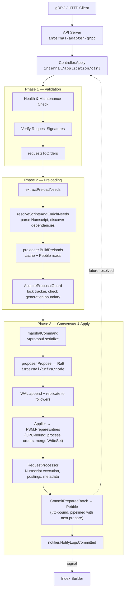
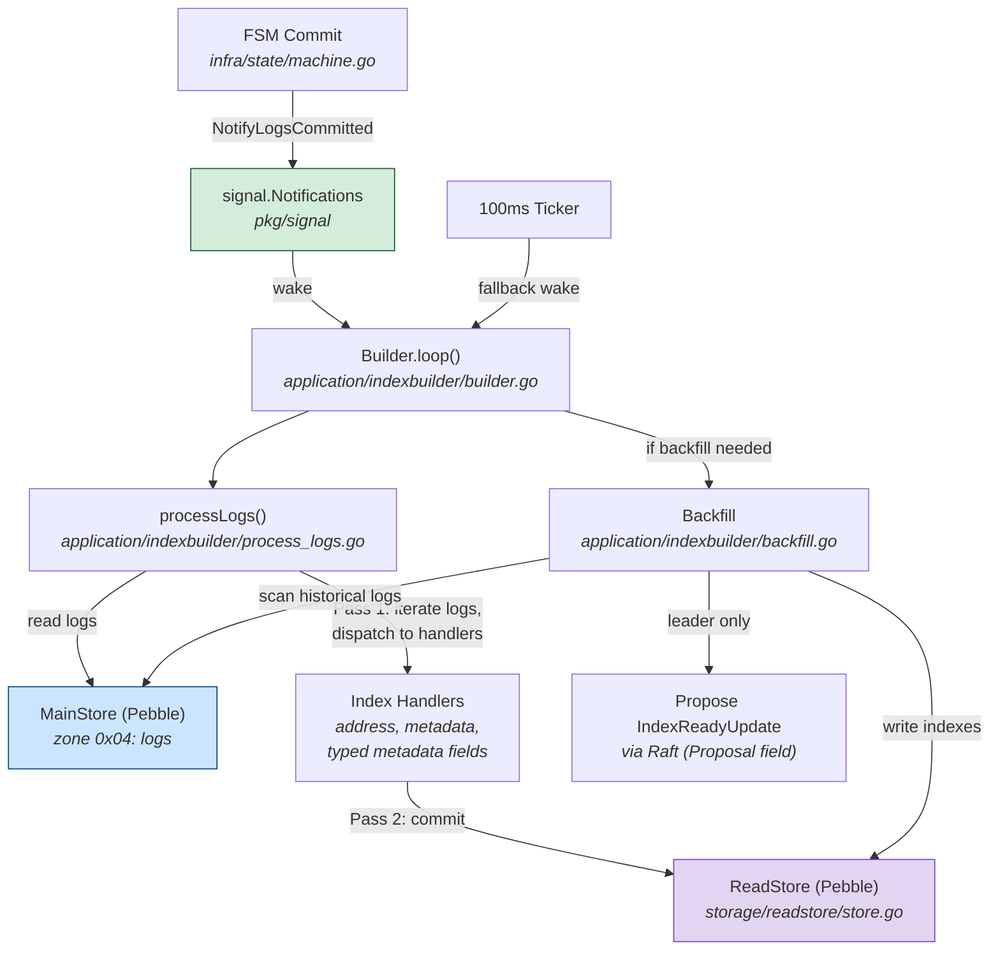
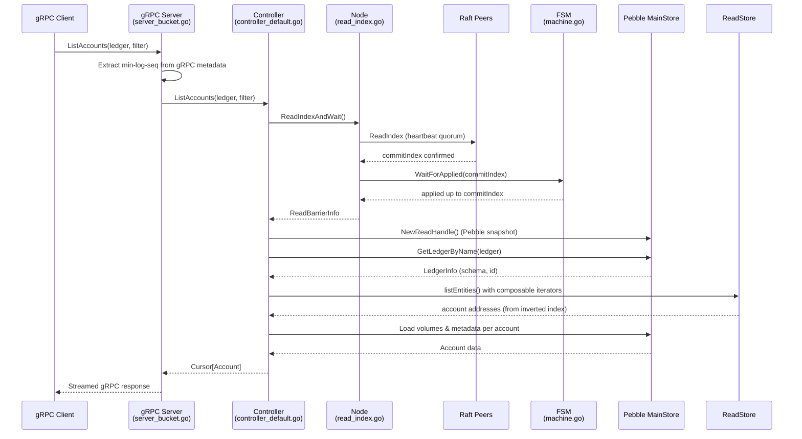
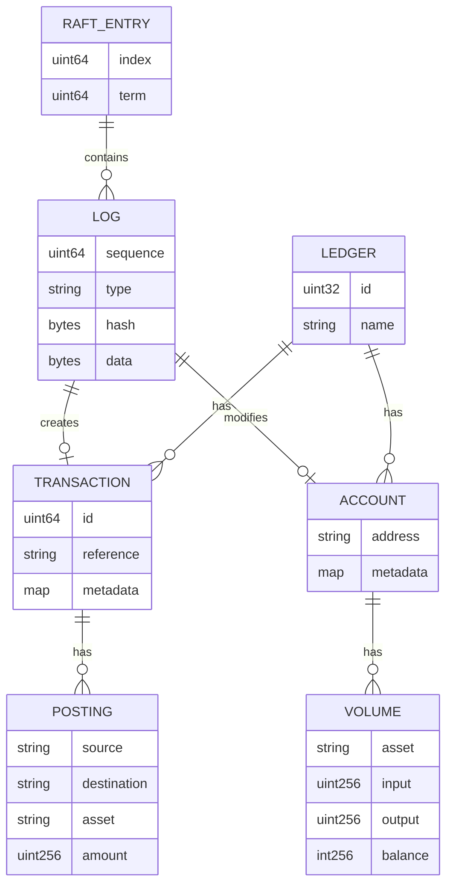
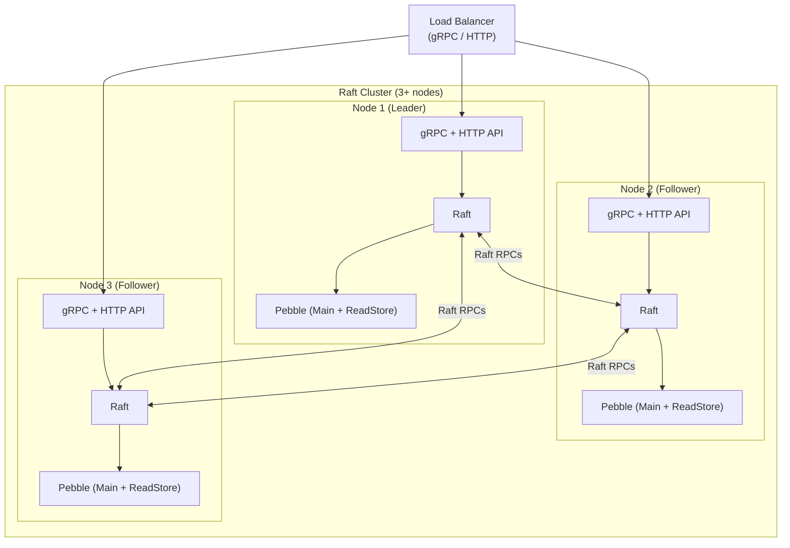

# Architecture Overview

This document describes the high-level architecture of the distributed ledger system: how writes flow through the admission pipeline into Raft consensus, how the asynchronous index builder populates the read store, and how linearizable reads are served. Each section includes a Mermaid diagram followed by explanatory prose referencing the key source files.

---

## Overview

The system is a replicated state machine built on top of etcd Raft with Pebble as the storage engine. Every mutation -- creating a ledger, posting a transaction, setting metadata -- enters through a single admission pipeline on the Raft leader, is serialized into a deterministic log, and applied identically on every node. Reads are served from a consistent Pebble snapshot after a Raft ReadIndex quorum check, guaranteeing linearizability without blocking the write path.

Three data paths define the runtime behavior:

1. **Admission Hot Path (Write)** -- gRPC request through admission, Numscript resolution, preloading, Raft proposal, FSM application, and Pebble commit.
2. **Index Builder Path** -- asynchronous background loop that tails committed logs and builds inverted indexes in a separate read store.
3. **Read Path** -- gRPC query through ReadIndex quorum, Pebble snapshot, composable iterators, and streamed response.

---

## 1. Admission Hot Path (Write)

The write path begins at `BucketServiceServerImpl.Apply()` in `internal/adapter/grpc/server_bucket.go`, which authenticates the request and delegates to `DefaultController.Apply()`. The controller is a thin forwarding layer; the real work happens in `Admission.Admit()` (`internal/application/admission/admission.go`).

Admission performs health and maintenance-mode checks, then verifies Ed25519 request signatures when enabled. It converts gRPC requests into internal orders, extracts the set of accounts, volumes, and metadata entries that must be preloaded, and resolves any Numscript programs to discover additional data dependencies.

The preloader (`internal/infra/preload/`) fetches required data from the in-memory cache first, falling back to Pebble for cache misses. It then acquires a proposal guard -- a short-lived lock that ensures no concurrent proposal can invalidate the preloaded cache entries. Under this lock, the command is serialized with vtprotobuf, the predicted Raft index is appended cheaply via a raw protobuf wire-format trick, and the proposal is submitted to `Node.Propose()`.

The node writes the entry to the WAL (`internal/storage/wal/`), replicates to followers, and hands committed entries to the Applier (`internal/infra/node/applier.go`), a dedicated goroutine that decouples WAL persistence from FSM application. The Applier pipelines batch processing: the FSM (`internal/infra/state/machine.go`) runs `PrepareEntries()` (CPU-bound: unmarshal proposals, execute business logic via `RequestProcessor`, merge state into a WriteSet, build a Pebble batch) while the previous batch's `CommitPreparedBatch()` (I/O-bound: Pebble `batch.Commit()`) runs concurrently in a dedicated committer goroutine. This overlaps prepare and commit across consecutive batches, reducing per-batch latency from `prepare_time + commit_time` to `max(prepare_time, commit_time)`. After commit, the committer resolves proposal futures immediately and signals the index builder, allowing the gRPC handler to return without waiting for the next batch.

---

## 2. Index Builder Path

The index builder runs as a background goroutine on every node, not just the leader. It is defined in `internal/application/indexbuilder/builder.go` and is woken either by a `signal.Notifications` signal from the FSM (fired after each batch commit) or by a 100ms fallback ticker.

On each tick, `processLogs()` (`internal/application/indexbuilder/process_logs.go`) opens a direct read handle on the main Pebble store, iterates log entries starting after the last indexed sequence, and dispatches each entry to index handlers. The design is two-pass: Pass 1 iterates logs and buffers index writes into a `WriteBatch`; Pass 2 commits the batch to the read store along with a progress cursor. When a batch produces no index writes, the Pebble batch is skipped entirely, reducing fsyncs to O(1) per batch.

The read store (`internal/storage/readstore/store.go`) is a separate Pebble database with WAL disabled -- it stores only derived inverted indexes for metadata keys, account addresses, and typed metadata fields. Because it is fully derived from the log, it can be rebuilt from scratch on startup or when a new index type is introduced.

When a new index is created (e.g., a new metadata field type), the builder enters backfill mode (`internal/application/indexbuilder/backfill.go`), scanning the full history of committed logs to populate the new index. Only the leader node proposes an `IndexReadyUpdate` through Raft (as a direct `Proposal` field, not an order) once backfill completes, ensuring all nodes agree on when a new index becomes queryable.

---

## 3. Read Path

Every read operation begins with a linearizability barrier. The gRPC server (`internal/adapter/grpc/server_bucket.go`) extracts an optional minimum log sequence from request metadata for session consistency, then delegates to the controller. `DefaultController.ListAccounts()` (and all other read methods) calls `node.ReadIndexAndWait()` (`internal/infra/node/read_index.go`), which performs a Raft ReadIndex: a lightweight heartbeat quorum check that confirms the current commit index without writing to the log. The node then waits for the FSM to apply all entries up to that commit index, ensuring the local state is fully up to date.

After the barrier, the controller opens a Pebble snapshot via `store.NewReadHandle()`, which provides a point-in-time consistent view. It resolves the ledger schema via `query.GetLedgerByName()`, then calls the generic `listEntities()` function (`internal/application/ctrl/list_entities.go`), which builds a composable iterator pipeline over the read store.

The read store iterators (`internal/storage/readstore/iterator.go`) support AND, OR, NOT, address prefix matching, and reverse traversal. They operate over inverted indexes to produce candidate entity keys, which are then enriched with volumes and metadata from the main Pebble store (`internal/storage/dal/`). Results are paginated into a `Cursor[T]` and streamed back to the client via gRPC.

---

## Beyond the Hot Path

The three data paths above handle the core read/write lifecycle. Several additional subsystems extend the architecture:

### Event Sinks

The leader node can stream ledger events to external systems (NATS JetStream, Kafka, ClickHouse, Databricks, HTTP webhooks). Each named sink runs an independent emitter that tails the global log from a persisted cursor, batches events, and publishes them with at-least-once delivery. Cursor advances are Raft-replicated; on failure, the emitter reports error status via Raft so it is visible cluster-wide. See [Event System](architecture/data-model/events.md).

### Chapters and Archiving

Ledger history is divided into chapters. A chapter progresses through five states: **open** (accepting writes) → **closing** (writes blocked, hash chain captured) → **closed** (sealed with a BLAKE3 state hash) → **archiving** (exporting to cold storage) → **archived** (logs purged from Pebble). Sealing produces a cryptographic proof that the chapter's data has not been tampered with. See [Chapters](architecture/data-model/chapters.md).

### Mirror Replication

A ledger can be created in **mirror mode**, ingesting transactions from an external source (HTTP or PostgreSQL). A per-ledger worker on the leader polls the source, translates logs into `MirrorIngest` Raft commands, and replicates them through consensus. Mirror ledgers can later be promoted to normal mode. See [Architecture](architecture/core/architecture.md).

### Dual-Generation Cache

The in-memory attribute cache uses two generations (gen0 and gen1) that rotate at Raft index intervals. During admission, a proposal guard ensures preloaded values remain consistent across generation boundaries -- if a rotation occurs between preload and proposal, the guard triggers a rebuild. This avoids stale balance reads without global locking. See [Attributes](architecture/storage/attributes.md) and [Deterministic FSM](architecture/core/deterministic-fsm.md).

### Bloom Filters

Per-attribute bloom filters sit in the preload path (`internal/infra/preload/`) and short-circuit Pebble point lookups during admission when a key is definitely absent from the main store. Each attribute type (volumes, metadata, references, etc.) has its own filter with independent sizing. Bloom blocks are persisted to Pebble (Global zone) and restored asynchronously on startup; during the restore scan (`bloom.ready = 0`), `MayContain` always returns true so correctness is never compromised. Dirty blocks are flushed during cache generation rotation. See [Performance Tuning](../ops/performance-tuning.md) for configuration flags.

### Query Checkpoints

A query checkpoint freezes both the main store and read index at a specific Raft index, creating a consistent point-in-time snapshot. Clients can then execute queries against this frozen state, useful for reconciliation or auditing. See [Query Checkpoints](architecture/data-model/query-checkpoints.md).

### Typed Metadata

Accounts and transactions carry typed metadata with a schema per ledger. When a new type is declared for a metadata key, the system gradually converts existing values in the background. Queries can filter on metadata fields once indexed. See [Typed Metadata](architecture/data-model/typed-metadata.md).

---

## Component Map

The system is organized into six layers, each with clear dependency boundaries:

| Layer | Packages | Responsibility |
|---|---|---|
| **API** | `internal/adapter/grpc`, `internal/adapter/http` | Protocol translation. gRPC is the primary API; HTTP provides REST compatibility. Both delegate to the Controller. |
| **Control** | `internal/application/ctrl`, `internal/application/admission` | Use-case orchestration. The Controller handles reads; Admission handles writes through the Raft pipeline. |
| **Consensus** | `internal/infra/node`, `internal/infra/transport` | Raft lifecycle, WAL management, snapshot transfer, and the Applier goroutine that feeds committed entries to the FSM. |
| **State** | `internal/infra/state`, `internal/domain/processing` | Deterministic FSM and business-logic processor. All mutation logic lives here and must be purely deterministic. |
| **Caching** | `internal/infra/cache`, `internal/infra/attributes` | In-memory volume/metadata cache and ledger attribute tracking, used by the Admission preloader to avoid Pebble reads on the hot path. |
| **Storage** | `internal/storage/dal`, `internal/storage/wal`, `internal/storage/spool`, `internal/storage/readstore` | Pebble data access layer (main store), write-ahead log, spool for snapshot replay, and the derived read store for query indexes. |

---

## Entity Model

Every mutation in the system produces one or more `LOG` entries, which are the authoritative record of state changes. Logs are contained within `RAFT_ENTRY` records, tying them to the consensus layer. A `LEDGER` is a named namespace (identified by a uint32 id) that owns `TRANSACTION` and `ACCOUNT` entities. Each `TRANSACTION` contains one or more `POSTING` entries representing double-entry movements between a source and destination account. An `ACCOUNT` tracks per-asset `VOLUME` records (input, output, and derived balance). All amounts use 256-bit unsigned integers for precision.

---

## Deployment Topology

The system deploys as a cluster of 3 or more identical nodes, each running the full stack: gRPC and HTTP API servers, a Raft participant, and local Pebble storage (both the main store and the derived read store). A load balancer distributes client traffic across all nodes. Write requests are automatically forwarded to the current Raft leader by the transport layer. Read requests can be served by any node after a ReadIndex quorum check, making reads horizontally scalable.

Each node persists its critical configuration (node ID, cluster ID, storage schema version) in Pebble on first boot. Subsequent boots validate these values to prevent accidental data corruption from misconfiguration. Nodes that fall behind receive snapshots from the leader to catch up.

---

## Deep Dives

For detailed documentation on specific subsystems, see:

- [Raft Consensus](architecture/core/raft-consensus.md) -- Raft lifecycle, leader election, log replication, and snapshot transfer.
- [Deterministic FSM](architecture/core/deterministic-fsm.md) -- FSM design, determinism constraints, and the request processor.
- [Attributes & Caching](architecture/storage/attributes.md) -- Ledger attribute tracking and the in-memory volume/metadata cache.
- [Storage Engine](architecture/storage/storage.md) -- Pebble key layout, zone design, and the read store architecture.
- [Data Flows](architecture/data-model/data-flows.md) -- Detailed data flow through the system, including event sinks and cold storage.
- [gRPC API](architecture/api/grpc-api.md) -- API design, protobuf conventions, and streaming patterns.
- [Getting Started](contributing/getting-started.md) -- Development environment setup, build instructions, and testing guide.
