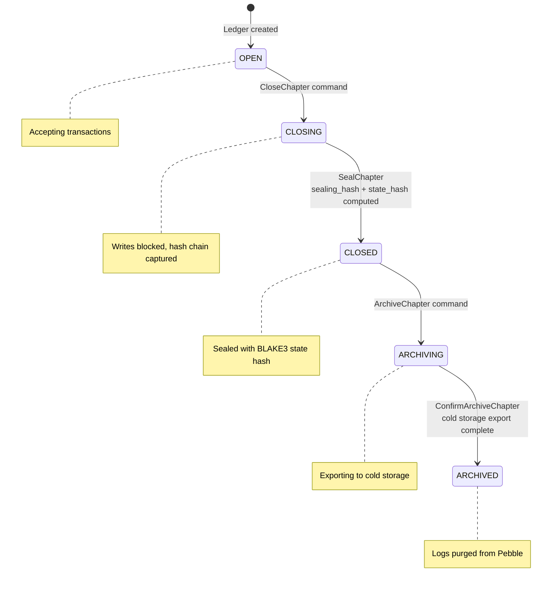
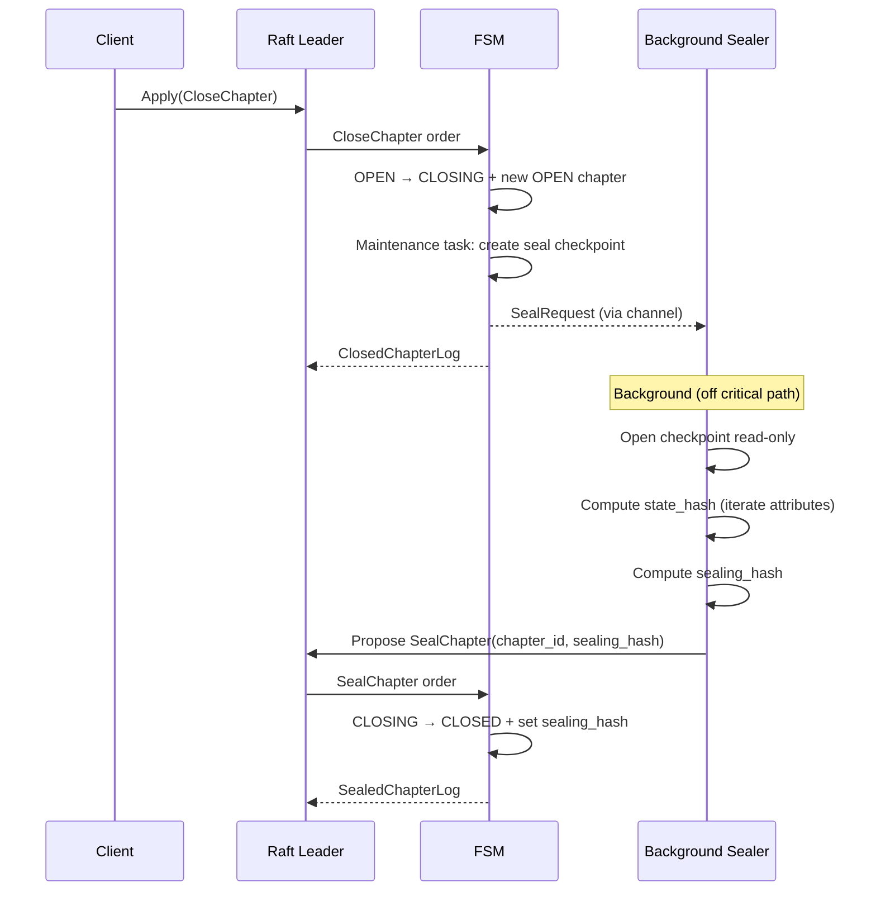
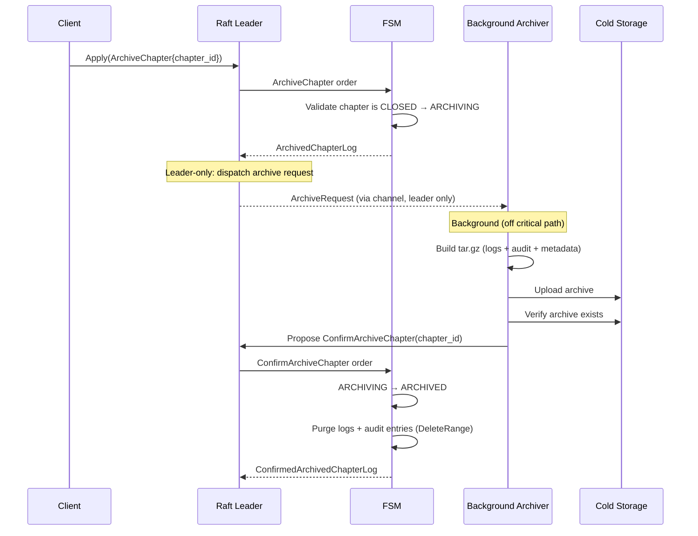

# Chapters

## Overview

Chapters provide a mechanism for partitioning a ledger's history into discrete, sealed segments. Each chapter covers a contiguous range of transactions and, once closed and sealed, produces a cryptographic hash that attests to the integrity of all data written during that chapter.

Once sealed, a chapter can be **archived to cold storage** (S3 or filesystem): logs and audit entries are exported and purged from Pebble, while attributes (volumes, metadata, reversion status) remain in hot storage. This reduces snapshot sizes, speeds up node recovery, and keeps Pebble compaction fast. **Receipt-based reverts** (JWT) allow reverting archived transactions without accessing cold storage.

## Chapter Lifecycle

A chapter transitions through five states:



| Status | Description |
|--------|-------------|
| `CHAPTER_OPEN` | Actively accepting transactions. Exactly one open chapter exists at any time. |
| `CHAPTER_CLOSING` | No longer accepts transactions; a background Sealer is computing the sealing hash. |
| `CHAPTER_CLOSED` | Sealed with a cryptographic hash. Immutable. Eligible for archival. |
| `CHAPTER_ARCHIVING` | Archive in progress. The leader is exporting data to cold storage. Provides deterministic crash recovery: on leadership gain, the new leader scans for ARCHIVING chapters and retries. |
| `CHAPTER_ARCHIVED` | Logs and audit entries exported to cold storage and purged from hot storage. Attributes (volumes, metadata) remain in Pebble. |

### Invariants

- Exactly **one** chapter is in `OPEN` state at any time.
- At most **one** chapter is in `CLOSING` state at any time.
- A `CloseChapter` request is rejected if a chapter is already closing (`ErrChapterAlreadyClosing`).

## Protobuf Definition

```protobuf
enum ChapterStatus {
  CHAPTER_OPEN = 0;
  CHAPTER_CLOSING = 1;
  CHAPTER_CLOSED = 2;
  CHAPTER_ARCHIVED = 3;
  CHAPTER_ARCHIVING = 4;
}

message Chapter {
  fixed64 id = 1;
  Timestamp start = 2;
  Timestamp end = 3;
  ChapterStatus status = 4;
  fixed64 close_sequence = 5;   // Global sequence at close time
  bytes sealing_hash = 6;       // Set when CLOSED
  bytes last_audit_hash = 7;    // Audit chain hash at close time
}
```

## Two-Step Close Process

Closing a chapter is split into two Raft commands to avoid blocking the consensus loop with expensive I/O (iterating the full state to compute a hash).

### Step 1: CloseChapter (instant, on Raft critical path)

The `CloseChapter` order is a lightweight Raft command that:

1. Transitions the current `OPEN` chapter to `CLOSING`, recording `close_sequence` and `end` timestamp. The `last_audit_hash` is set by `applyProposal` after the batch-level audit hash is computed.
2. Creates a new `OPEN` chapter (transactions continue flowing into the new chapter immediately).
3. Triggers a **maintenance task** that creates a Pebble seal checkpoint — a frozen snapshot of the database at the exact close boundary.
4. Sends a `SealRequest` to the background Sealer.

**File**: `internal/domain/processing/processor_chapter.go`

### Step 2: SealChapter (background, then Raft)

The Sealer runs outside the Raft critical path:

1. Opens the seal checkpoint as a read-only Pebble database.
2. Iterates all attribute entries in the `[0x09, 0x0A)` key range to compute a **state hash**.
3. Computes the **sealing hash** and proposes a `SealChapter` order back into Raft.
4. The FSM transitions the chapter from `CLOSING` to `CLOSED` and records the sealing hash.

**File**: `internal/infra/state/sealer.go`

### Sealing Hash Computation

```
state_hash   = BLAKE3(all attribute key+value pairs in the checkpoint)
sealing_hash = BLAKE3(chapter_id || close_sequence || last_audit_hash || state_hash)
```

The state hash is deterministic because:
- Pebble iteration order is deterministic.
- Compaction is 100% deterministic via Raft (all nodes apply the same operations in the same order).

### Sequence Diagram



## Crash Recovery

Two crash windows exist between `CloseChapter` and `SealChapter`. Both are handled automatically on node restart.

### Window 1: Crash after CloseChapter commit, before checkpoint creation

The node crashed after the `CloseChapter` Pebble batch was committed but before the maintenance task created the seal checkpoint.

**Recovery** (in `NewNode()`):
- On startup, if `ClosingChapter() != nil` and `SealCheckpointPath()` does not exist, the node creates the checkpoint from the current Pebble state.
- This works because no entries were applied after `CloseChapter` (it was the last operation before the crash), so Pebble's state is exactly at the close boundary.

**File**: `internal/infra/node/node.go` (lines 385–401)

### Window 2: Crash after checkpoint creation, before SealChapter proposal

The seal checkpoint exists on disk but the Sealer never proposed the `SealChapter` command.

**Recovery** (in `Sealer.Start()`):
- On startup, if a `closingChapter` exists and the seal checkpoint is on disk, the Sealer re-sends a `SealRequest` to recompute the hash and propose `SealChapter`.

**File**: `internal/infra/state/sealer.go` (lines 57–78)

### Retry on Failure

The Sealer uses exponential backoff (100ms → 10s max) to retry on transient errors. The checkpoint remains on disk until the hash is successfully computed, ensuring no data is lost.

## Transaction Receipts (JWT)

Every transaction created during a chapter includes a JWT receipt that links the transaction to its chapter. The `chapter_id` is captured from the FSM's current open chapter at transaction creation time and stored in the `CreatedTransaction` log entry.

### Receipt Claims

```json
{
  "iss": "ledger-v3",
  "iat": 1700000000,
  "ledger": "default",
  "txId": 42,
  "postings": [
    {"source": "world", "destination": "bank:main", "amount": "10000", "asset": "USD/2"}
  ],
  "chapterId": 1
}
```

- **Signing**: HMAC-SHA256 with a configurable key (`--receipt-signing-key`).
- **Verification**: The receipt can be verified independently to prove a transaction was recorded in a specific chapter.
- **Chapter ID**: Set from the current open chapter in `processCreateTransaction` (FSM). If no chapter is open, `chapterId` is `0`.

**File**: `internal/infra/receipt/receipt.go`

### Obtaining Receipts

Receipts are available in two ways:

1. **On creation**: The `Apply()` response includes a receipt for each newly created transaction (signed outside the FSM to avoid Raft nondeterminism).
2. **Via `GetTransaction`**: The `GetTransaction` RPC returns a `GetTransactionResponse` containing both the transaction and its receipt. The receipt is computed on-the-fly from the stored creation log.

### Receipt-Based Revert

When reverting a transaction, the client can provide the receipt instead of requiring the server to read the original transaction from Pebble. This is useful after a chapter is closed and data may be archived.

The admission layer verifies the receipt's signature and validates that the ledger name and transaction ID match the request. If valid, the postings are extracted from the receipt claims instead of reading from storage.

```bash
# Revert using a receipt (avoids server-side transaction lookup)
ledgerctl transactions revert 42 --ledger my-ledger --receipt <jwt-token>
```

**Files**:
- `internal/application/admission/admission.go` — Receipt verification and postings extraction
- `internal/adapter/grpc/server_bucket.go` — Receipt signing and `GetTransaction` receipt computation

## Automatic Chapter Rotation (Cron Scheduler)

Chapter rotation can be automated via a cron schedule. The schedule is a runtime-modifiable configuration stored in Raft (not a static CLI flag), following the same pattern as `SetMaintenanceMode`.

### Configuration

```bash
# Rotate every day at midnight
ledgerctl chapters set-schedule "0 0 * * *"

# Rotate on the 1st of every month at midnight
ledgerctl chapters set-schedule "0 0 1 * *"

# Disable automatic rotation
ledgerctl chapters delete-schedule

# Show current schedule
ledgerctl chapters get-schedule
```

The cron expression uses the standard 5-field format (`minute hour day-of-month month day-of-week`) or the extended 6-field format with an optional leading seconds field (`second minute hour day-of-month month day-of-week`).

### How It Works

The `ChapterScheduler` runs on every node but only triggers chapter rotation on the **Raft leader**. When the cron fires, the leader proposes a `CloseChapter` order through the admission layer — the same path as `ledgerctl chapters close`.

1. The schedule is persisted in Pebble (key prefix `0xEF`) and replicated via Raft.
2. When the schedule changes, a notification channel wakes the scheduler goroutine to recompute the next fire time.
3. On leader change, the new leader's scheduler is already running and will fire at the next scheduled time.

The chapter granularity is configurable and can be changed at any time. Changing from monthly to quarterly mid-flight simply means the next chapter will be longer — existing closed chapters are unaffected.

**File**: `internal/infra/state/chapter_scheduler.go`

### Protobuf Messages

```protobuf
// Raft-replicated log entries
message SetChapterScheduleLog {
  string cron = 1;
}
message DeletedChapterScheduleLog {}

// gRPC requests (via Apply)
message SetChapterScheduleRequest {
  string cron = 1;
}
message DeleteChapterScheduleRequest {}

// gRPC query
rpc GetChapterSchedule(GetChapterScheduleRequest) returns (GetChapterScheduleResponse);
```

## gRPC API

| Method | Description |
|--------|-------------|
| `Apply(CloseChapterRequest)` | Close the current open chapter (write, leader-only) |
| `Apply(SetChapterScheduleRequest)` | Set the automatic chapter rotation schedule (write, leader-only) |
| `Apply(DeleteChapterScheduleRequest)` | Delete the automatic chapter rotation schedule (write, leader-only) |
| `Apply(ArchiveChapterRequest)` | Archive a closed chapter to cold storage (write, leader-only) |
| `GetChapterSchedule(GetChapterScheduleRequest)` | Get the current chapter rotation schedule (read, any node) |
| `ListChapters(ListChaptersRequest)` | Stream all chapters (read, any node) |

### CLI Commands

```bash
# Close the current open chapter
ledgerctl chapters close

# Set automatic chapter rotation schedule
ledgerctl chapters set-schedule "0 0 1 * *"

# Disable automatic rotation
ledgerctl chapters delete-schedule

# Show current schedule
ledgerctl chapters get-schedule

# Archive a closed chapter to cold storage
ledgerctl chapters archive <chapter-id>

# List all chapters
ledgerctl chapters list
```

## Storage

Chapters are persisted in Pebble using two key prefixes:

| Prefix | Key | Value |
|--------|-----|-------|
| `0xEF` | `[keyPrefixChapterSchedule]` | Cron expression string (empty = disabled) |
| `0xF7` | `[keyPrefixChapters][chapterID]` | Chapter protobuf blob |
| `0xF8` | `[keyPrefixNextChapterID]` | `uint64` — next chapter ID counter |

The seal checkpoint is stored in a `seal/` subdirectory under the data directory. It is removed after the sealing hash is computed.

```
data/
├── runtime/          # Main Pebble database
│   └── ...
└── seal/             # Temporary seal checkpoint (exists only during CLOSING)
    └── ...           # Read-only Pebble checkpoint
```

## In-Memory Chapter Management

All non-purged chapters are kept in memory in the FSM's `allChapters` map, eliminating Pebble reads for chapter lookups. The `currentOpenChapter` and `closingChapter` fields are convenience pointers into this map for fast access on the hot path.

- `WriteSet.GetChapterByID()` reads from the in-memory map (no Pebble fallback).
- `DefaultController.ListChapters()` reads from `Machine.AllChapters()` via the `ChapterProvider` interface.
- When a chapter is archived and purged, it is removed from the in-memory map.
- Chapters are still persisted to Pebble (for crash recovery and startup), but never read from Pebble during normal operation after startup.

## FSM Snapshot

The chapter state is included in Raft snapshots:

```protobuf
message MemorySnapshot {
  // ... other fields ...
  common.Chapter open_chapter = 10;               // Current open chapter
  common.Chapter closing_chapter = 11;            // Chapter being sealed (nil when idle)
  fixed64 next_chapter_id = 12;
  repeated common.Chapter closed_chapters = 13;   // CLOSED + ARCHIVED chapters (non-purged)
}
```

## Archival (CLOSED → ARCHIVED)

Once a chapter is sealed (CLOSED), it can be archived to cold storage. Archival exports logs and audit entries to an external storage backend and purges them from Pebble, reducing hot storage size and compaction pressure. Attributes (volumes, metadata, reversion status) remain in Pebble to serve read queries.

### Two-Step Archive Process

Like the seal process, archival uses two Raft commands to avoid blocking consensus with slow I/O.

#### Step 1: ArchiveChapter (validation, state transition to ARCHIVING)

The `ArchiveChapter` order validates that the chapter is CLOSED and transitions it to `ARCHIVING`. This state change is deterministic across all nodes via Raft. Only the **leader** dispatches the actual archive request to the background Archiver — followers apply the state transition but do not perform the S3 upload. This avoids N redundant exports in an N-node cluster.

**File**: `internal/domain/processing/processor_chapter.go`

#### Step 2: ConfirmArchiveChapter (deterministic purge on all nodes)

After the Archiver exports data to cold storage and verifies the upload, it proposes a `ConfirmArchiveChapter` order back into Raft. The FSM:

1. Validates the chapter is in `ARCHIVING` state (not CLOSED — the intermediate state provides crash recovery).
2. Transitions the chapter from ARCHIVING to ARCHIVED.
3. Signals a purge of logs and audit entries for the chapter's sequence range `[start_sequence, close_sequence]`.
4. The purge is executed as `DeleteRange` operations in the Pebble batch during `Merge()`.

**File**: `internal/infra/state/archiver.go`

### Archive Contents

The archive is a tar.gz file containing:

| File | Format | Description |
|------|--------|-------------|
| `metadata.json` | JSON | Chapter ID, start/close sequence, archive timestamp |
| `data.bin` | Raw binary KV dump | All cold-storable Pebble KV pairs for the chapter |

The `data.bin` file contains length-prefixed key+value pairs: `[keyLen:4][key][valueLen:4][value]` repeated for each entry, dumped directly from Pebble without deserialization, enabling fast archival and exact restoration.

**Purged key prefixes** (cold-storable zone `[0x01, 0xF1)`):

| Prefix | Data | Purge method |
|--------|------|-------------|
| `0x01` | Transaction logs | `DeleteRange` by `[prefix][startSeq]..[prefix][closeSeq]` |
| `0x02` | Audit entries | `DeleteRange` by `[prefix][startSeq]..[prefix][closeSeq]` |
| `0x03` | Transaction updates | Filtered iteration: delete entries where `byLog` falls in `[startSeq, closeSeq]` |

Attributes (`0xF1`) and system data (`0xF2+`) are never purged — they remain in hot storage permanently.

### Cold Storage Interface

```go
type ColdStorage interface {
    Archive(ctx context.Context, bucketID string, chapterID uint64, data io.Reader) error
    Exists(ctx context.Context, bucketID string, chapterID uint64) (bool, error)
}
```

**Implementations:**
- `FilesystemStorage` — writes to `{basePath}/{bucketID}/chapters/{chapterID}/archive.tar.gz` (development/testing)
- `S3Storage` — writes to `s3://{s3-bucket}/{bucketID}/chapters/{chapterID}/archive.tar.gz` (production, S3-compatible including MinIO)

**Configuration:**

```bash
--cold-storage-driver filesystem        # Storage driver: "filesystem" (default) or "s3"
--cold-storage-path /path/to/cold       # Base path for filesystem driver (default: <data-dir>/cold-storage)
--cold-storage-bucket-id my-cluster     # Shared namespace prefix for archives (default: cluster-id)
--cold-storage-s3-bucket my-bucket      # S3 bucket name (required when driver=s3)
--cold-storage-s3-region eu-west-1      # AWS region for S3
--cold-storage-s3-endpoint http://minio:9000  # Custom S3 endpoint (for MinIO)
```

### Leader-Only Archival

Archive dispatch is **leader-only**: when the FSM applies an `ArchiveChapter` log and transitions the chapter to `ARCHIVING`, only the Raft leader sends the `ArchiveRequest` to the background Archiver. Followers apply the state transition but do not perform the upload. This ensures a single S3 upload per archive operation regardless of cluster size.

### Crash Recovery

Crash recovery is deterministic via the `ARCHIVING` state. On leadership gain, the new leader scans all chapters and retries any that are in `ARCHIVING` state by re-sending `ArchiveRequest` to the Archiver channel. The export is idempotent (same data, same key in cold storage), so re-exporting is safe. This handles:
- Leader crash during S3 upload
- Leadership transfer while archiving is in progress
- Network partition that causes a leader change

### Sequence Diagram



## Deployment Configuration

### Helm Chart

Cold storage is configured via `config.coldStorage` in the Helm `values.yaml`:

```yaml
config:
  coldStorage:
    driver: "s3"           # "filesystem" (default) or "s3"
    path: ""               # Base path for filesystem driver
    bucketId: ""           # Shared namespace prefix (default: cluster-id)
    s3:
      bucket: "my-bucket"  # S3 bucket name (required when driver=s3)
      region: "eu-west-1"  # AWS region
      endpoint: ""         # Custom endpoint (for MinIO)
```

These values are emitted as `COLD_STORAGE_*` environment variables in the StatefulSet.

### Pulumi (devenv)

The Pulumi deployment can optionally create an S3 bucket for cold storage:

```yaml
# Pulumi config
ledger-exp-devenv:coldStorage-enabled: true
ledger-exp-devenv:coldStorage-s3-region: eu-west-1
```

When enabled, Pulumi creates an S3 bucket (`ledger-exp-cold-storage-{stack}`) and injects the `config.coldStorage` values into the Helm release automatically. AWS credentials are auto-injected via the service account.

## Design Decisions

### Per-Bucket vs Per-Ledger Retention

**Decision**: Chapters operate at the **bucket level** (entire Raft group). All ledgers within a bucket share the same chapter boundaries and retention policy.

**For different retention policies per ledger**, shard ledgers into **separate Raft groups (buckets)**, each with its own chapter configuration, cold storage settings, and retention duration.

#### Why per-bucket

| Argument | Detail |
|---|---|
| **Log stream is global** | The Raft log uses a single global sequence. Cutting at a global sequence naturally captures all ledgers. Per-ledger would require filtering interleaved logs, turning a simple range delete into a scatter-gather operation. |
| **Attribute generations are global** | The two-generation compaction system tracks Raft index (global), not per-ledger sequences. Per-ledger chapters would break generation boundary alignment. |
| **Idempotency keys are bucket-level** | IK keys are stored globally (`0x02` prefix). Their retention aligns naturally with bucket-wide chapters. |
| **Pebble range delete is trivial** | Logs are keyed `[0x01][global_sequence]`. Purging a chapter is a single `DeleteRange(seqStart, seqEnd)`. Per-ledger purge would require iterating all logs and checking ledger membership. |
| **Single FSM state** | One chapter state to track in the FSM. Per-ledger would require N chapter states in the FSM hot path. |
| **Sealing hash is straightforward** | One hash chain, one sealing point. Per-ledger would require N independent sealing hashes. |

### Decisions Summary

| Topic | Decision | Rationale |
|---|---|---|
| **Chapter scope** | Per-bucket | Aligns with global log, global generations, trivial range delete |
| **Receipt format** | JWT (HS256) | Client-readable, standard format, upgradable to RS256/EdDSA later |
| **Signing key** | Cluster-level secret (CLI flag / env var) | Simple provisioning, shared across all nodes |
| **Archive format** | Raw binary KV dump in tar.gz | Fast archival and exact restoration, gzip-compressed |
| **Purge strategy** | Auto-purge after verified archive | System verifies archive exists before purging |
| **Chapter granularity** | Configurable cron schedule, modifiable at runtime | Changing granularity only affects future chapters |
| **Cold storage cleanup** | Not the system's responsibility | Delegated to external tooling (S3 lifecycle rules) |
| **Close process** | Two-step (CloseChapter + SealChapter) | Full state scan cannot block the Raft consensus loop |
| **No balance snapshot** | Keep attributes in hot storage, purge only logs | Attributes ARE the compact derived state; reads continue after archival |

## Future Considerations

### Read-Only Access to Archives

Transparent read-only querying of archived chapters: the service detects a query targets an archived chapter, fetches and caches the archive locally, serves the query, and evicts the cache after a configurable TTL.

### Receipt Key Rotation

The signing key should be rotatable. Receipts would include a `kid` (key ID) field in the JWT header to support verification with older keys during rotation.

## Related Documentation

- [Storage](../storage/storage.md) — Key prefix details and Pebble persistence
- [Data Flows](./data-flows.md) — CloseChapter and SealChapter flow diagrams
- [Deterministic FSM](../core/deterministic-fsm.md) — How the FSM ensures deterministic state across nodes
