# Data Flows

This document describes in detail the data flows for the main system operations.

## Ledger Creation

### Overview

Ledger creation is a distributed operation that goes through the single Raft group.

### Complete Flow

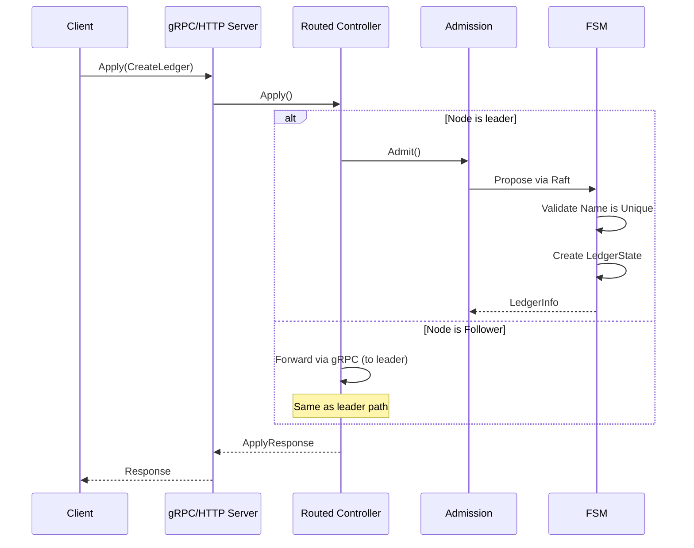

### Detailed Steps

1. **Request Reception**
   - The gRPC/HTTP server receives the Apply request
   - Validates the request
   - The routed controller checks if the node is the leader

2. **Leader Verification**
   - The routed controller checks if it is the leader
   - If not leader, identifies the leader and forwards the request via gRPC

3. **Command Proposal**
   - The leader creates a `CreateLedgerCommand`
   - The command is proposed to the Raft group
   - The command is replicated to all followers

4. **FSM Application**
   - The FSM receives the committed command
   - Validates the ledger name is unique
   - Creates a new LedgerState with initial sequence numbers

5. **Persistence**
   - The ledger state is stored in the FSM's in-memory map
   - A snapshot can be created if necessary

## Transaction Creation

### Overview

Transaction creation goes through the single Raft group.

### Complete Flow

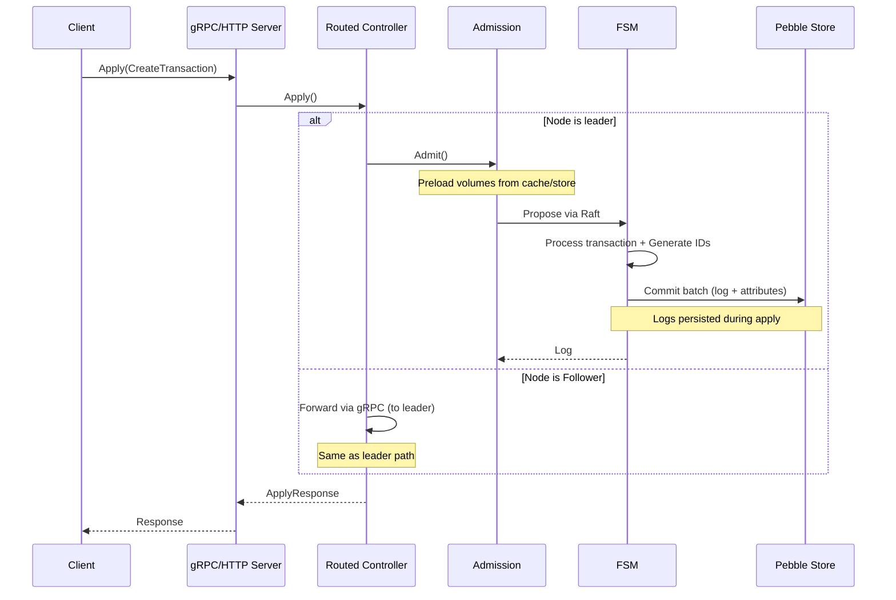

### Detailed Steps

1. **Ledger Verification**
   - The system checks the ledger exists in the FSM state
   - Retrieves the ledger's current state

2. **Transaction Validation**
   - Validates postings (valid accounts, positive amounts)
   - Checks balances (if necessary) from Store
   - Verifies the idempotency key
   - Executes script if present

3. **Command Proposal**
   - Creates a `CreateLogCommand` with the transaction data
   - Proposes to the Raft group
   - Replicates to all nodes in the group

4. **FSM Application**
   - The FSM generates the next log ID and transaction ID for this ledger
   - The log is written to the Store
   - Balances are updated

5. **Response Return**
   - The created transaction is returned to the client
   - Includes transaction ID, timestamp, etc.

## Raft Replication

### Overview

All writes are replicated via the Raft protocol to guarantee consistency.

### Replication Flow

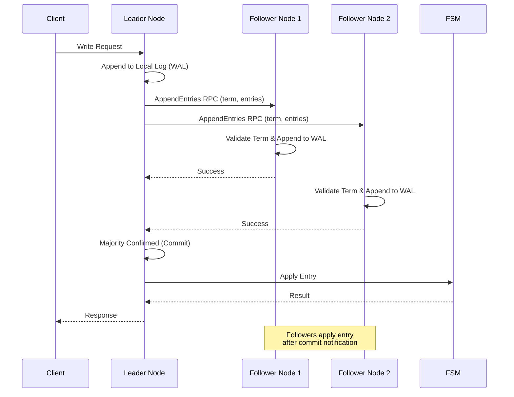

### Detailed Steps

1. **Command Reception**
   - The leader receives a write command
   - The command is serialized to protobuf
   - A Raft entry is created

2. **Append to Local Log**
   - The entry is added to the leader's local log
   - The entry is written to the WAL
   - The WAL is synchronized on disk

3. **Replication to Followers**
   - The leader sends `AppendEntries` to all followers
   - Each follower validates the term
   - Each follower appends the entry to its local log

4. **Commit**
   - When a majority confirms, the leader commits the entry
   - The entry is marked as committed
   - The commit index is updated

5. **Application**
   - Committed entries are applied to the FSM
   - The FSM processes the command and updates the state
   - The result is returned to the client

## Follower Synchronization

### Overview

When a follower joins the cluster or recovers after a failure, it must synchronize with the leader. This process involves two levels of synchronization:
1. **Raft log synchronization** via the Spool (committed but not yet applied entries)
2. **Business log synchronization** via gRPC streaming (per-ledger transaction logs)

> **🔗 Raft Mechanics**: The synchronization is triggered when the Raft leader detects that a follower is too far behind (entries have been compacted from the WAL). The leader then sends a **MsgSnap** message containing the FSM snapshot. See [Desynchronized Follower Detection](../core/raft-consensus.md#desynchronized-follower-detection) for details on how Raft detects and handles this scenario.

### Node Synchronization State Machine

The **Applier** (owned by the Node) manages the synchronization process through a four-state machine. For the complete cluster lifecycle (bootstrap, join, synchronization, and learner promotion), see [Cluster Lifecycle](../../../ops/cluster-operations.md).

| Status | Value | Description |
|--------|-------|-------------|
| `statusNormal` | 0 | Normal operation: committed entries applied directly to FSM (pipelined) |
| `statusSyncing` | 1 | Pebble checkpoint fetch from leader in progress: entries spooled |
| `statusSnapshotting` | 2 | Local checkpoint creation in progress (CloseChapter / QueryCheckpoint): entries spooled |
| `statusOutOfSync` | 3 | Store behind FSM snapshot: waiting for leader discovery |
| `statusInstallingSnapshot` | 4 | Leader snapshot being installed by processReadies: entries spooled, unspool skipped |

#### State Transitions

```
                    ┌────────────────────────────────────────────┐
                    │                                            │
                    ▼                                            │
             ┌─────────────┐                                    │
  startup ──►│ statusNormal │◄──────────────────────┐           │
             └──────┬───────┘                       │           │
                    │                               │           │
    checkpoint      │                    replay      │           │
    required        │                    complete    │           │
    (CloseChapter)   │                               │           │
                    ▼                               │           │
           ┌─────────────────┐               ┌──────┴──────┐   │
           │statusSnapshotting│──── done ────►│ unspool &   │   │
           └─────────────────┘               │ resume      │   │
                                             └─────────────┘   │
                                                    ▲           │
  startup ──►┌──────────────┐  leader    ┌─────────────────┐   │
  (store     │statusOutOfSync│──found───►│  statusSyncing   │──┘
   behind)   └──────────────┘            └────────┬────────┘
                    ▲                             │
                    │         peer unavailable     │
                    └─────────────────────────────┘
```

#### Synchronization Trigger

When the node starts with an out-of-date store, or when a `MsgSnap` is received from the leader:

1. Snapshot is applied to WAL and FSM state is restored (fast, in-memory)
2. If the store is behind, status transitions to `statusOutOfSync`
3. When a leader is discovered (`SoftState` with non-zero leader), status transitions to `statusSyncing`
4. A background task fetches the Pebble checkpoint from the leader via gRPC
5. On completion, spooled entries are replayed and status returns to `statusNormal`

If the leader is unreachable during sync, the node falls back to `statusOutOfSync` and retries when a new leader is found.

#### Entry Processing During Sync

While synchronization is in progress (`status != statusNormal`), entry processing behaves differently. The Applier goroutine routes committed entries to either the FSM or the Spool:

```go
// In the Applier.Run() goroutine:
case work := <-a.ch:
    switch a.status.Load() {
    case statusNormal:
        // Normal: pipelined apply (PrepareEntries + async CommitPreparedBatch)
        a.applyEntriesPipelined(ctx, work.entries...)

    default: // statusSyncing, statusSnapshotting
        // Drain any pending commit, then spool entries for later
        a.waitPendingCommit(ctx)
        a.spool.AppendCommittedEntries(ctx, work.entries...)
    }
```

In normal mode, the Applier uses a pipelined approach: `PrepareEntries()` (CPU-bound: process orders, build Pebble batch) runs immediately while the previous batch's `CommitPreparedBatch()` (I/O-bound) completes in a dedicated committer goroutine. At most one commit is in-flight at a time. Before switching to spool mode, the Applier drains any pending commit to ensure consistency.

The `processReadies` goroutine submits entries asynchronously via `node.applier.Submit()`, allowing WAL writes to overlap with FSM application across consecutive Ready cycles. This ensures that new Raft entries committed during synchronization are not lost -- they are buffered in the Spool.

#### Protection Against Premature Leadership

Two mechanisms prevent a syncing node from becoming leader prematurely:

1. **Tick suppression**: During `statusSyncing` and `statusOutOfSync`, `rawNode.Tick()` is not called. Without ticks, the node cannot trigger election timeouts.
2. **MsgTimeoutNow rejection**: If a leader tries to transfer leadership to a syncing node via `TransferLeadership`, the `MsgTimeoutNow` message is silently dropped.

#### Sync Completion

When the background sync completes:

1. The `gatingTerminated` channel is closed
2. The `Applier` goroutine detects this and calls `unspoolAndResume`:
   - Replays remaining spooled entries
   - Prunes applied spool entries
   - Sets status to `statusNormal`

#### Complete Timeline

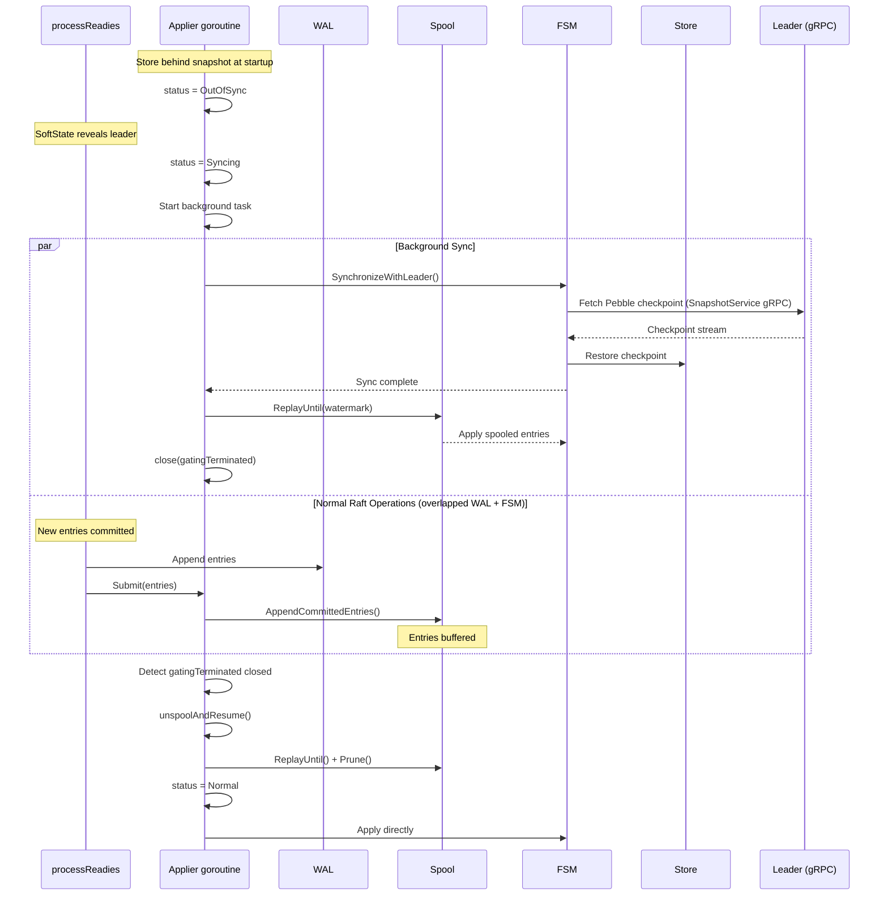

### The Spool

The **Spool** is a temporary buffer that stores committed Raft entries that haven't been applied to the FSM yet. It acts as a staging area between Raft consensus and FSM application.

#### Purpose

1. **Decoupling**: Separates the Raft commit path from the FSM apply path
2. **Durability**: Ensures committed entries survive crashes before FSM application
3. **Bounded replay**: On recovery, only entries in the Spool need to be replayed. Note that for long-running clusters, old WAL entries are compacted (deleted after snapshots), making full WAL replay impossible anyway.
4. **Efficient catch-up**: Followers can catch up from a known watermark position

#### How It Works

```
┌─────────────────────────────────────────────────────────────────────┐
│                          Raft Node                                   │
├─────────────────────────────────────────────────────────────────────┤
│                                                                      │
│  processReadies goroutine:          Applier goroutine:              │
│                                                                      │
│  ┌──────────┐  Submit()  ┌──────────┐   apply    ┌──────────┐     │
│  │   WAL    │ ─────────► │ Applier  │ ─────────► │   FSM    │     │
│  └──────────┘            └──────────┘            └──────────┘     │
│                                │                                    │
│                          (if gating)                                │
│                                │                                    │
│                          ┌──────────┐                               │
│                          │  Spool   │                               │
│                          └──────────┘                               │
│                                                                      │
└─────────────────────────────────────────────────────────────────────┘
```

1. **Append**: When Raft commits entries, they are appended to the Spool via `AppendCommittedEntries()`
2. **Watermark**: `End()` returns the current position (segment ID + offset) for replay bounds
3. **Replay**: `ReplayUntil()` replays entries from the cached read position to the watermark
4. **Prune**: Old segments are pruned when all entries have been applied

For detailed implementation, see [Spool Technical Documentation](../storage/spool.md).

### Synchronization Flow

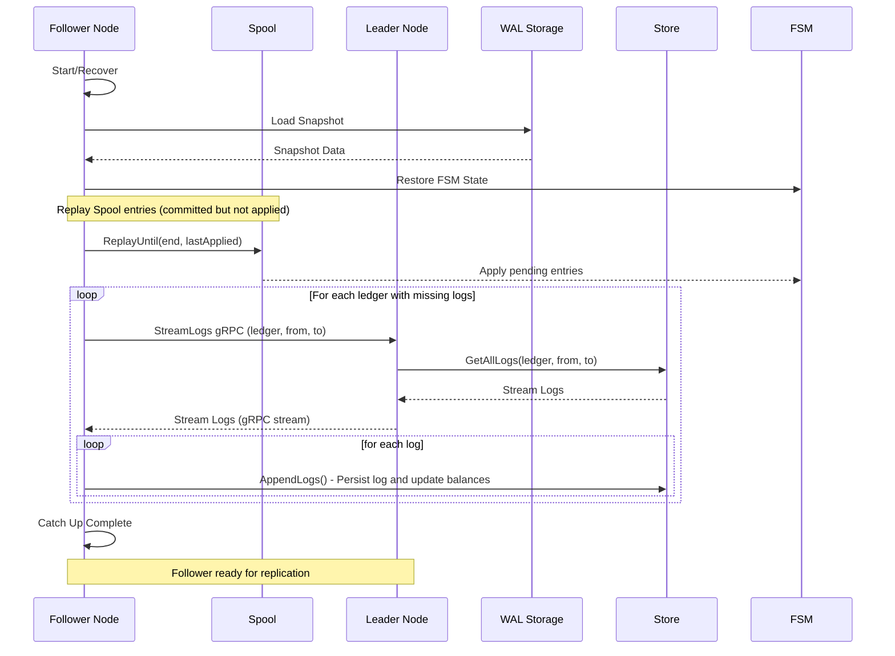

### Detailed Steps

1. **Snapshot Loading**
   - The follower loads the most recent snapshot
   - The FSM state is restored from the snapshot
   - The last applied log ID for each ledger is noted

2. **Spool Replay**
   - The Spool is replayed from the last known position
   - Only entries with `Index > lastApplied` are applied
   - The read cache advances, avoiding re-parsing on subsequent calls

3. **Log Streaming**
   - For each ledger with missing logs (based on LastAppliedLogId)
   - The follower requests logs from the leader via gRPC
   - The leader streams logs from its Store

4. **Log Application**
   - Each log is inserted into the follower's Store
   - Balances and metadata are updated
   - The state is progressively updated

5. **Catch-up Complete**
   - Once all logs are applied, the follower is up to date
   - The follower can now participate in replication
   - The follower votes during elections

## Snapshot Creation

### Overview

Snapshots are created periodically to compact logs and accelerate recovery.

### Creation Flow

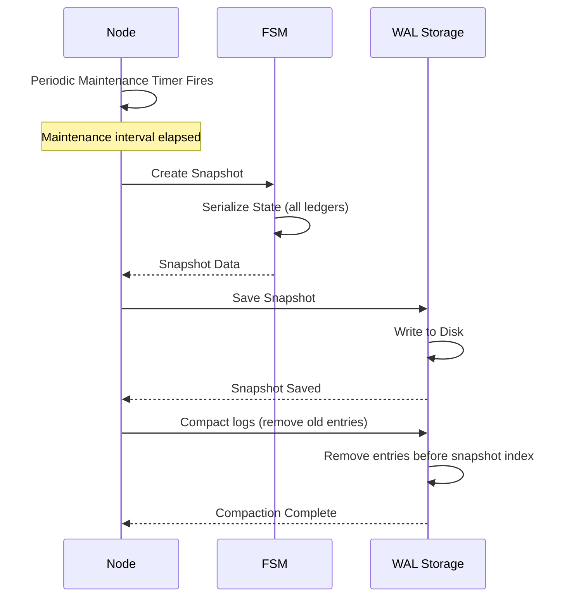

### Creation Conditions

1. **Periodic Maintenance Timer**
   - A background goroutine runs on a configurable interval (`--maintenance-interval`, default 30s)
   - On each tick, if `lastPersistedIndex` has advanced since the last snapshot, a new snapshot is created
   - The timer also triggers WAL compaction and Pebble checkpoint creation

### Snapshot Contents

- **Metadata**: index, term, timestamp
- **FSM State**: Complete state for all ledgers
- **Index**: Index of the last included entry

## WAL Compaction

### Overview

WAL compaction is a critical mechanism that removes old log entries to prevent unbounded storage growth. It is tightly coupled with snapshots.

### How Compaction Works

```
Before Compaction:
┌─────────────────────────────────────────────────────────────────────┐
│ WAL: [Entry 1] [Entry 2] ... [Entry 1000] [Entry 1001] ... [Entry N]│
│                              ↑                                       │
│                     Snapshot at index 1000                          │
└─────────────────────────────────────────────────────────────────────┘

After Compaction:
┌─────────────────────────────────────────────────────────────────────┐
│ WAL: [Entry 1001] [Entry 1002] ... [Entry N]                        │
│      ↑                                                               │
│      First entry after snapshot                                      │
└─────────────────────────────────────────────────────────────────────┘
```

### Compaction Trigger

Compaction is triggered automatically after a snapshot is created:

1. A snapshot is created at index `N`
2. The system keeps a **compaction margin** (configurable via `CompactionMargin`)
3. Entries before `N - CompactionMargin` are deleted from the WAL
4. Old WAL segment files are removed

### Compaction Margin

The compaction margin (`CompactionMargin` in configuration) determines how many entries are kept before the snapshot index:

```
snapshotIndex = 1000
compactionMargin = 100
compactIndex = 1000 - 100 = 900

→ Entries 1-900 are deleted
→ Entries 901-1000 are kept (margin for safety)
→ Entries 1001+ are the new entries
```

**Why keep a margin?**
- Allows followers slightly behind to catch up without needing a full snapshot transfer
- Provides a safety buffer in case of partial replication failures

### Implications for Recovery

Because old WAL entries are compacted:

1. **A node cannot recover from the beginning of time** - it must use snapshots
2. **Late-joining nodes** receive the latest snapshot + recent WAL entries
3. **Very late followers** (behind the compaction point) must receive a full snapshot from the leader

### Configuration

```yaml
config:
  raft:
    maintenanceInterval: "30s"  # Periodic maintenance interval (snapshots, compaction, checkpoints)
    compactionMargin: 1000      # Minimum WAL entries retained after compaction for follower catch-up
```

**Recommendations**:
- `maintenanceInterval` controls how often snapshots and compaction occur; shorter intervals reduce recovery time but increase I/O
- `compactionMargin` should be at least 1-2x the typical replication lag
- Larger margins use more disk but allow slower followers to catch up
- Smaller margins save disk but may force more snapshot transfers

## Request Forwarding (Writes Only)

### Overview

Only **write requests** (`Apply`) and **`ListChapters`** are forwarded to the leader. All other reads use the ReadIndex mechanism (see below).

### Forwarding Flow

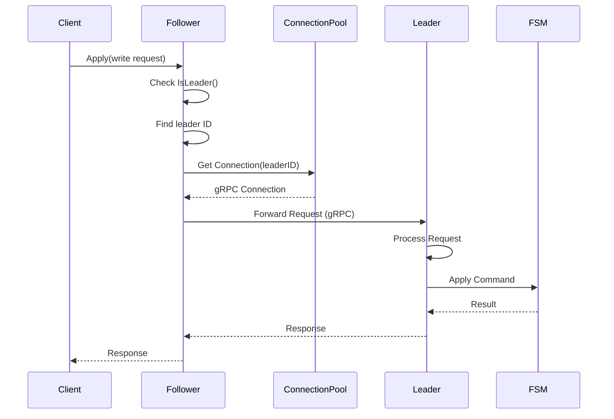

### Error Handling

If the leader is not available:

1. The follower detects `GetLeader() == 0`
2. An `ErrNoLeader` error is returned
3. The HTTP handler returns `503 Service Unavailable`
4. The header `Retry-After: 1` is added
5. The client SDK retries automatically

## Linearizable Read (ReadIndex)

### Overview

All read operations use the Raft **ReadIndex** mechanism to provide linearizable reads on any node (leader or follower) without forwarding to the leader. This distributes read load across the cluster while guaranteeing consistency.

### ReadIndex Flow

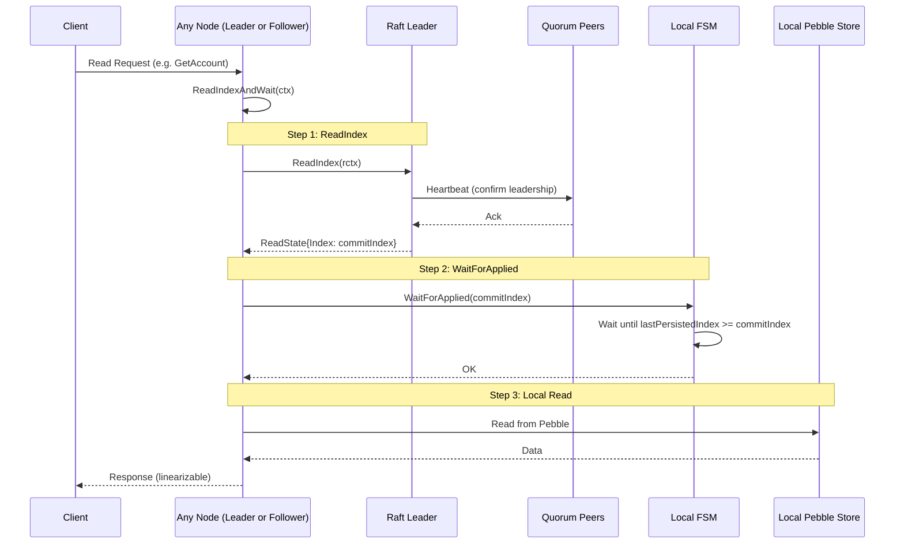

### Key Properties

- **Linearizable**: The read reflects all writes committed before the ReadIndex call
- **Distributed**: Any node can serve reads, not just the leader
- **Efficient**: No data forwarding via gRPC, only a lightweight heartbeat round-trip
- **Context-aware**: Respects deadlines and cancellation throughout

## Bulk Operations

### Overview

Bulk operations allow sending multiple operations in a single request. Unlike v2, v3 supports **system-level atomic bulk operations** that can span multiple ledgers.

> **📋 Related**: See [Global Log Architecture](../core/global-log.md) for details on how the global log enables cross-ledger atomic operations.

### Sequential Bulk Flow

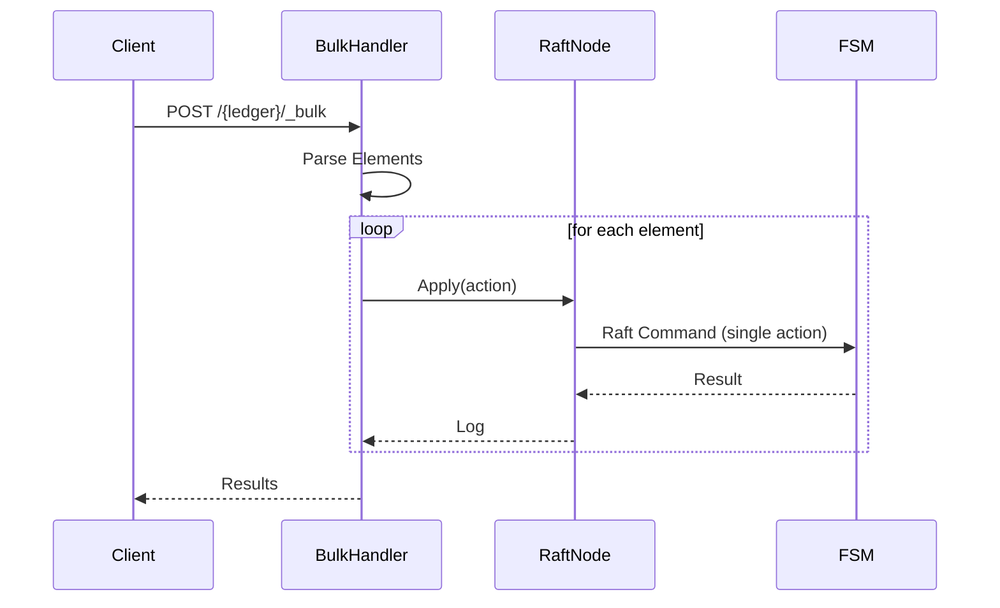

### Atomic Bulk Flow

When `atomic=true`, all operations are sent as a single Raft command:

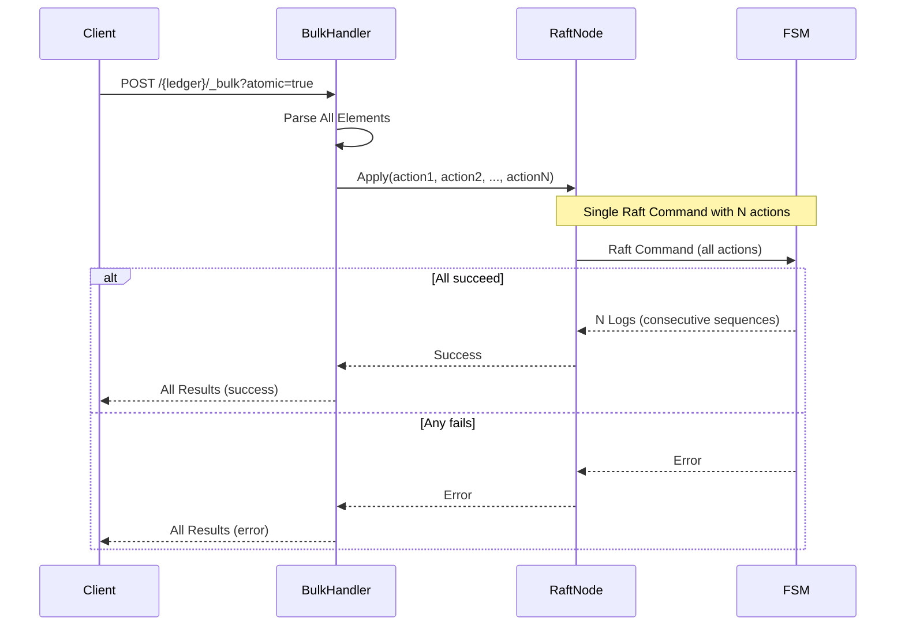

### Bulk Options

- **continueOnFailure**: Continue even if an operation fails (sequential mode only)
- **atomic**: All operations or nothing - supported and enables cross-ledger atomicity

## Chapter Close and Seal

### Overview

Closing a chapter is a two-step process. The first step (`CloseChapter`) is a lightweight Raft command that transitions the chapter state. The second step (`SealChapter`) runs in the background to compute a cryptographic hash and then proposes the result back into Raft.

For full documentation on chapters, see [Chapters](./chapters.md).

### Complete Flow

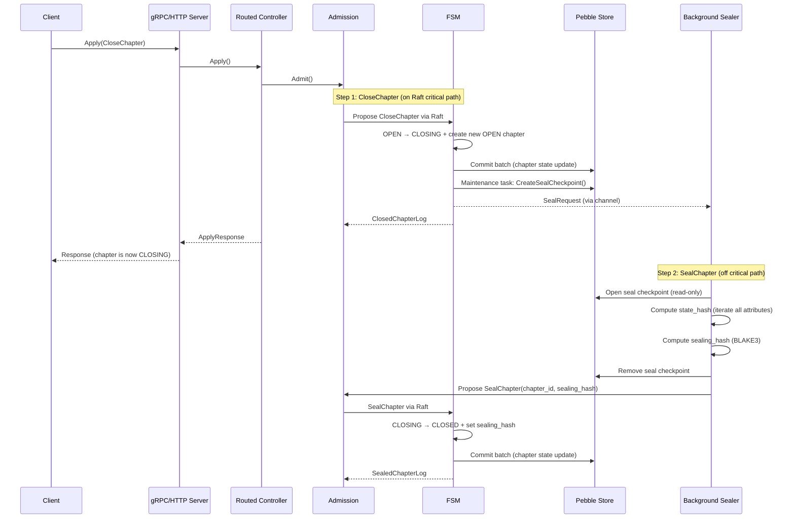

### Detailed Steps

1. **CloseChapter Request**
   - The client sends `Apply(CloseChapter)` via gRPC
   - The routed controller forwards to the leader if needed

2. **CloseChapter FSM Application**
   - The current `OPEN` chapter transitions to `CLOSING`
   - `close_sequence`, `end` timestamp, and `last_audit_hash` are recorded
   - A new `OPEN` chapter is created (transactions continue immediately)
   - A Pebble checkpoint is created in the `seal/` directory

3. **Background Sealing**
   - The Sealer opens the checkpoint as a read-only Pebble database
   - Iterates all attribute entries in `[0x09, 0x0A)` to compute `state_hash`
   - Computes `sealing_hash = BLAKE3(chapter_id || close_sequence || last_audit_hash || state_hash)`
   - Removes the seal checkpoint from disk

4. **SealChapter Proposal**
   - The Sealer proposes `SealChapter` back into Raft
   - The FSM transitions the chapter from `CLOSING` to `CLOSED`
   - The sealing hash is persisted

### Crash Recovery

Two crash windows are handled automatically on restart:

| Crash Window | Condition | Recovery |
|-------------|-----------|----------|
| After CloseChapter commit, before checkpoint | `closingChapter != nil && !checkpointExists` | `NewNode()` creates checkpoint from Pebble state |
| After checkpoint, before SealChapter | `closingChapter != nil && checkpointExists` | `Sealer.Start()` re-sends SealRequest |

## Next Steps

To deepen your understanding:

1. [Raft Consensus](../core/raft-consensus.md) - Details on Raft replication
2. [Storage and Persistence](../storage/storage.md) - How data is persisted
3. [API and Interfaces](../api/api.md) - API endpoint documentation
4. [Spool](../storage/spool.md) - Technical details of the Spool component
5. [Chapters](./chapters.md) - Chapter lifecycle, sealing, and crash recovery