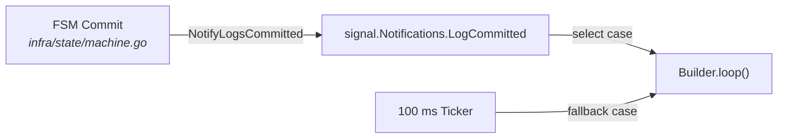
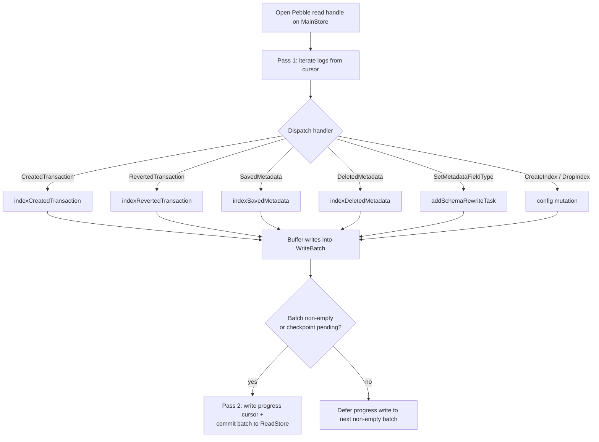

# Indexer Pipeline

## Overview

The **indexer** (`internal/application/indexbuilder`) is the background goroutine that turns committed audit logs into the inverted, queryable keyspaces consumed by the read API. It runs on every node — leader and followers alike — and is intentionally **decoupled from the FSM hot path**: the FSM commits the main store + audit log, then signals the indexer; the indexer reads from its own Pebble read handle and writes to the **read store**, a separate Pebble database with WAL disabled.

This page covers the pipeline mechanics. For the **what** of indexes (definition proto, version state, on-demand statistics, checker coverage), see [indexes.md](indexes.md).

## Builder Lifecycle

### Wake-up



| Trigger | Source |
|---------|--------|
| FSM commit signal | `signal.Notifications.LogCommitted.C()` — fired by the FSM committer via `NotifyLogsCommitted(lastSeq)` (`internal/pkg/signal/notifications.go`). |
| 100 ms fallback ticker | `time.NewTicker(100 * time.Millisecond)` in `Builder.loop()`. Guarantees progress even if the signal layer is starved. |
| Cancellation | `ctx.Done()` (wired through `worker.Worker`). |

The ticker is intentional: an indexer that wakes only on signal would stall on signal-channel loss or under heavy GC pressure. The 100 ms cap bounds query-staleness even in the worst case.

### Goroutine ownership

`Builder.Start()` wraps `Builder.loop(ctx)` in a `worker.New().RunCtx(...)` (`internal/pkg/worker`). The worker owns goroutine lifetime; `Builder.Stop()` cancels the worker's context and waits for the loop to drain. There is **no panic recovery** inside the loop — an indexer panic is a non-recoverable invariant violation (see `feedback_no_soft_wall_crash_on_invariant`).

### Boot

On `Start()`, the builder:

1. Reads the persisted progress cursors (main + AppliedProposal) — see [Progress Cursors](#progress-cursors).
2. Reads all `IndexVersionState` rows under `SubInternalIndexVersion` into an in-memory map.
3. Performs an **initial catch-up pass** with a larger batch size, stripping `BUILDING` indexes from the dispatch set so partially-built keyspaces do not get half-populated rows before backfill resumes.

## `processLogs` — Two-Pass Commit



`internal/application/indexbuilder/process_logs.go`.

### Pass 1 — iterate + dispatch

- Opens a direct Pebble read handle on the **main store** (`query.ReadLogsSince(ctx, handle, cursor, ...)`).
- Iterates committed logs starting at `cursor + 1`.
- For each log entry, calls `b.indexPayload(kb, cfg, ledger, payload, excludedVolumes)`, which switches on the payload type and dispatches to the matching handler.
- Handlers buffer their key/value writes into a single `pebble.Batch` (`b.wb`), they never `Commit()` themselves.
- An `AppliedProposal` cursor is advanced in lock-step so the next pass can filter transient-account postings deterministically.

### Pass 2 — commit (or skip)

- If the batch is non-empty (or a checkpoint action is pending), the progress cursor is **written into the same batch** and the batch is committed in one `batch.Commit()`. This makes "index writes" and "indexer progress" atomic — a crash mid-pass cannot leave the progress ahead of the data.
- If the batch is **empty** (no log type in the range produced index writes), the Pebble batch is skipped entirely and the progress cursor is persisted lazily on the next non-empty batch (or via a small dedicated batch at loop exit). This reduces fsyncs to `O(1)` per active batch instead of `O(1)` per tick.
- Query-checkpoint create/delete operations force a batch boundary so the checkpoint state is never persisted across two passes.

## Handlers

`process_logs.go` and `index_payload.go`.

| Log type | Handler | What it writes |
|----------|---------|---------------|
| `CreatedTransaction` | `indexCreatedTransaction` | Transaction existence keys, account-postings mapping (source/destination), reference index, timestamp index, per-posting account existence, transaction metadata via `dualWriteMetadataIndex`. |
| `RevertedTransaction` | `indexRevertedTransaction` | Inverse adjustments to the postings mappings; the revert link is kept (not deleted) so revert lookups stay queryable. |
| `SavedMetadata` | `indexSavedMetadata` → `dualWriteMetadataIndex` | New `(value, entity)` row in the metadata index, plus a reverse-map row for later schema rewrites. |
| `DeletedMetadata` | `indexDeletedMetadata` → `dualDeleteMetadataEntry` | Removes the metadata index row and the reverse-map row. |
| `SetMetadataFieldType` | `addSchemaRewriteTask` | Schedules a deferred rewrite that re-encodes the existing values under a new type tag (see [Schema Rewrite](#schema-rewrite)). |
| `CreateIndex` / `DropIndex` | `handleCreatedIndexLog` / `handleDroppedIndexLog` | Mutates the in-memory `indexVersions` map and writes the initial / cleared `IndexVersionState`. |

### Dual-write while a rewrite is in flight

When `IndexVersionState.PendingVersion != 0`, metadata-index handlers go through `dualWriteMetadataIndex` and write to **both** `v_current` and `v_pending` keyspaces. This is what allows the atomic switch (see below) to flip the served version with zero rebuild cost at the moment of the switch — `v_pending` is already fully consistent with live writes by the time the rewrite cursor reaches the head.

## Read Store Key Layout

`internal/storage/readstore/keys.go`.

The read store partitions its keyspace by a single leading byte:

| Prefix | Purpose | Helper |
|--------|---------|--------|
| `0x01` | Metadata index (forward) | `MetadataIndexPrefixV` / `MetadataIndexKeyV` |
| `0x02` | Entity existence (null / non-null counters) | `EntityExistsKeyV`, `EntityExistsNonNullPrefixV`, `EntityExistsNullPrefixV` |
| `0x03` | Reverse map (entity → metadata values, for rewrites) | `AccountReverseMapKeyV`, `TransactionReverseMapKeyV` |
| `0x04` | Account → transaction mapping | `AccountTxKey` |
| `0x05` | Source-account → transaction | dedicated key builder |
| `0x06` | Destination-account → transaction | dedicated key builder |
| `0x07` | Transaction reference index | dedicated |
| `0x08` | Transaction timestamp index | dedicated |
| `0x09` | Per-ledger logs | dedicated |
| `0x0A` | Per-ledger log date index | dedicated |
| `0x0B` | Transaction inserted-at index | dedicated |
| `0xFE` | Internal | sub-prefix below |

Internal sub-prefixes (`0xFE` + 1 B):

| Sub | Purpose | Helper |
|-----|---------|--------|
| `0x01` | Last-indexed log sequence (main progress cursor) | `ProgressKey` |
| `0x02` | Last-indexed AppliedProposal sequence | `AppliedProposalProgressKey` |
| `0x03` | Backfill cursors (per index) | `BackfillCursorKey` |
| `0x04` | Per-replica `IndexVersionState` (per index) | `IndexVersionStateKey` |

### The versioned metadata-index key

```
[0x01] [ledger 64B] [ns: 2B] [metadataKey \x00] [version 4B BE] [typedValue] [entityID]
```

Two adjacent versions share the same prefix up to the `version` field, so a single Pebble `DeleteRange` over `MetadataIndexPrefixV(..., v)` cleanly drops a whole version in one operation (used by GC after an atomic switch).

### Value encoding

`internal/storage/readstore/encoding.go` — a single-byte type tag plus a sort-preserving encoding:

| Tag | Type | Encoding note |
|-----|------|---------------|
| `S` | string | raw bytes + `\x00` terminator |
| `I` | int64 | XOR-flipped sign bit so byte-order matches numeric order |
| `U` | uint64 | big-endian |
| `B` | bool | one byte |
| `N` | null | empty payload |

`DecodeValue` reads the tag and dispatches. The `SetMetadataFieldType` rewrite path is the *only* place where two different tags coexist for the same `(entity, metadataKey)` — and only briefly, across `v_current` / `v_pending`.

## Progress Cursors

Two cursors live under the internal prefix:

| Cursor | Key | Encoding |
|--------|-----|----------|
| Main log progress | `[0xFE][0x01]` | `uint64` big-endian — the highest log sequence whose effects are fully written to the read store. |
| AppliedProposal progress | `[0xFE][0x02]` | `uint64` big-endian — paired cursor used for transient-account filtering. |

Both are written **inside the same Pebble batch** as the index writes they certify. `LastIndexedSequence()` reads the main cursor on boot; `NotifyProgress()` broadcasts the new value to readers waiting on a `min_log_sequence` barrier.

## Backfill — Atomic Switch

Two distinct backfill paths share the same atomic-switch primitive:

| Path | When | Cursor |
|------|------|--------|
| Index backfill | `CreateIndex` for a new index, or a fresh replica catching up | A log-sequence cursor (replay history from 0 to head). |
| Schema rewrite | `SetMetadataFieldType` for an existing index | A reverse-map cursor (iterate live entities, re-encode under the new type tag). |

In both paths, every dispatched write lands in `v_pending`, while `v_current` continues to serve live reads and continues to receive dual-writes from incoming logs.

### `completeBackfill` — the switch

`internal/application/indexbuilder/backfill.go:1197+` and the schema-rewrite equivalent at the end of `processSchemaRewrite`. A single Pebble batch performs:

1. `WriteIndexVersionState(batch, ledger, canonicalID, {Current: pending, Pending: 0, RewriteProgress: nil})` — flips the served version.
2. `gcVersionAt(batch, old)` — `DeleteRange` over `MetadataIndexPrefixV(..., old)`, `EntityExistsKey…PrefixV(..., old)`, and per-key reverse-map cleanup. Immediate, in-batch, **not deferred**.
3. `batch.Commit()`.

The single-batch commit is what makes the version flip + old-version GC atomic from a query's point of view: there is no instant at which a query could observe `Current = new` and still see live keys at `v_old`.

### Deferred switch (`scanComplete` gate)

If the rewrite's scan cursor has reached the head **but** `LastIndexedSequence < requiredIndexedSeq` (i.e. the FSM has committed logs past what the indexer has applied), the switch must be deferred: flipping early would expose `v_new` keys that do not yet contain the late writes. The builder sets `task.scanComplete = true`, commits the `v_pending` writes alone, and the next loop tick calls `tryCommitScanCompleteSwitch()`, which re-checks the gate and fires the switch as a small standalone batch once the indexer catches up. See `backfill.go:889-959`.

## `min_log_sequence` — Read Barrier

The query API accepts a `min_log_sequence` in the request metadata. It is enforced at the read entry point:

- The controller calls `node.ReadIndexAndWait()` to confirm the FSM has applied at least that sequence (Raft linearizability barrier).
- It then waits for `readStore.LastIndexedSequence() >= min_log_sequence` so the read store has caught up too.

Important nuance: `min_log_sequence` **pins log application on this replica, not local rewrite completion**. A client that needs a value to be visible *under the new type tag* after a `SetMetadataFieldType` must wait for the corresponding atomic switch to land — there is no per-rewrite barrier on the wire today. See [api-comparison.md](../../contributing/api-comparison.md) for the contract.

## No Cluster-Wide `IndexReady`

There is **no audit-bound `IndexReady` order** in v3. Each replica builds its own indexes independently against the same hash-bound log:

- `CreateIndex` (cluster-bound) defines the index.
- Each replica replays history through its own indexer and decides locally when to flip its `IndexVersionState.CurrentVersion`.
- The query path always reads the **local** `CurrentVersion`. A replica that has not yet completed its local backfill simply reports "index not built locally" and the client retries or contacts another replica.

This is by design: a cluster-wide `IndexReady` would force the slowest replica to gate all readers, defeating the point of building indexes locally. The asymmetry is bounded by the audit log being deterministic — every replica eventually reaches the same `CurrentVersion`.

## Summary

| Concern | Mechanism | File |
|---------|-----------|------|
| Wake-up | `signal.LogCommitted` + 100 ms ticker | `builder.go` |
| Atomicity | Two-pass commit: writes + progress cursor in one Pebble batch | `process_logs.go` |
| Cost control | Empty-batch elision — skip fsync when nothing to write | `process_logs.go` |
| Live dual-write | `v_current` + `v_pending` while a rewrite is in flight | `dualWriteMetadataIndex` |
| Atomic switch | Single batch: `CurrentVersion ← Pending` + `gcVersionAt(old)` | `backfill.go` |
| Deferred switch | `scanComplete` flag + `tryCommitScanCompleteSwitch` gate | `backfill.go` |
| Per-replica readiness | Local `IndexVersionState`, no cluster `IndexReady` order | `readstore/store.go` |
