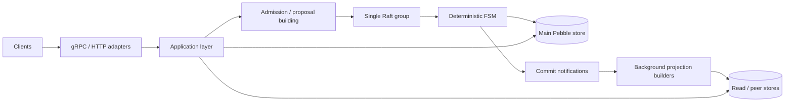

# Ledger v3 Architecture Overview

Ledger v3 is a distributed financial ledger built around a single Raft group, a deterministic finite state machine, embedded Pebble storage, and asynchronously maintained read-side projections.

This page is the **canonical high-level architecture overview**. It intentionally stays at subsystem level. Detailed behavior and invariants belong in the matching subsystem documentation under [`subsystems/`](subsystems/).

## System shape

The major boundaries are:

| Area | Primary code | Responsibility |
|---|---|---|
| API | `internal/adapter/grpc`, `internal/adapter/http`, `internal/adapter/auth` | Transport, authentication, serialization, protocol compatibility. |
| Admission | `internal/application/admission` | Validate write requests, resolve dependencies, build proposal coverage, and submit work to consensus. |
| Consensus | `internal/infra/node`, `internal/infra/transport`, `internal/application/membership`, `internal/infra/membership` | Raft lifecycle, replication, membership orchestration and Raft configuration changes, WAL/snapshot coordination. |
| FSM | `internal/infra/state`, `internal/infra/plan`, `internal/infra/preload`, `internal/domain/processing` | Deterministic application of accepted orders and mutation of authoritative replicated state. |
| Main storage | `internal/storage/dal`, `internal/storage/wal`, `internal/storage/spool` | Pebble-backed state, Raft WAL, snapshot/replay support. |
| Read path | `internal/application/ctrl`, `internal/query`, `internal/storage/readstore` | Consistency-aware reads, query planning, inverted-index lookup, result materialization. |
| Projection builders | `internal/application/indexbuilder`, `internal/application/usagebuilder` | Rebuildable peer-side projections derived from committed/audited state. |
| Integrity checker | `internal/application/check`, `internal/domain/replay` | Verify the audit chain and persisted primary-store projections. |

See [`README.md`](README.md) for the complete subsystem map.

## Write path

A mutation enters through the API adapters. If a follower receives a write request, it forwards the request over gRPC to the current Raft leader before the write reaches admission; only the leader admits and proposes mutations. Admission performs request validation and resolves all state the FSM will need before proposal. The resulting proposal is replicated through the single Raft group and applied identically on every node.

The apply path is deliberately capability constrained:

- FSM behavior must be deterministic;
- cache-keyed reads require proposal-declared coverage/preload;
- the FSM hot path must not acquire arbitrary Pebble read capability;
- accepted business-order payloads remain immutable until audit capture;
- impossible-by-contract states fail loudly rather than becoming silent no-ops.

The detailed contract lives in [`subsystems/fsm/`](subsystems/fsm/) and [`subsystems/admission/`](subsystems/admission/). Agents changing `internal/domain/processing/**` must treat it as part of this FSM execution boundary.

## Persistence and source of truth

The audit chain is the authoritative persisted business history. Other persisted datasets are projections, operational state, or peer-side rebuildable state depending on their role.

Do not infer integrity requirements from storage location alone. Before adding or changing persisted state, classify it using [`audit-vs-technical-state.md`](audit-vs-technical-state.md) and read the checker documentation in [`subsystems/checker/`](subsystems/checker/).

For primary-store projections, the default requirement is checker verification unless a documented exemption applies.

## Read path

Read consistency depends on the request mode. Consistent reads establish the appropriate Raft read barrier and wait for local application to catch up before querying a stable local view. Requests using `x-consistency: stale` may read local state without that ReadIndex barrier and therefore may observe state behind the leader.

Query execution combines the selected view of the main store with the read-side indexes maintained in the peer read store. The read store is derived state, not an independent source of business truth. Index lifecycle, schema rewrites, checkpoints, and query semantics are documented in:

- [`subsystems/read-path/`](subsystems/read-path/)
- [`subsystems/indexer/`](subsystems/indexer/)

## Caches and preload

The in-memory attribute cache is part of the deterministic proposal/apply contract, not just a performance optimization. Admission declares the cache-key horizon a proposal is allowed to read, and the FSM consumes that state through gated APIs.

Cache generation rotation, bloom filters, preload resolution, stale-proposal handling, and coverage semantics are documented in:

- [`subsystems/attributes/`](subsystems/attributes/)
- [`subsystems/fsm/`](subsystems/fsm/)

## Background and lifecycle subsystems

Several important mechanisms operate outside the core request path while remaining coupled to audited/replicated state:

- chapter archival, backup and restore — [`subsystems/chapters/`](subsystems/chapters/)
- event sinks and mirror ingest — [`subsystems/events-mirror/`](subsystems/events-mirror/)
- indexing and read projections — [`subsystems/indexer/`](subsystems/indexer/)
- usage counters and usage-store projections — [`subsystems/usage/`](subsystems/usage/)
- integrity verification — [`subsystems/checker/`](subsystems/checker/)
- cluster membership and consensus lifecycle — [`subsystems/consensus/`](subsystems/consensus/)
- reusable Numscript programs — [`subsystems/scripting/`](subsystems/scripting/)

Operational behavior belongs in [`../../ops/`](../../ops/), not in this architecture overview.

## Documentation boundaries

Use this page to understand the overall shape of Ledger v3, then move to the relevant subsystem documentation. Do not expand this overview into a second copy of subsystem internals.

For cross-subsystem sequences, read [`data-flows.md`](data-flows.md). For the core domain shape, read [`data-model.md`](data-model.md). For architectural decisions and rejected alternatives, read [`../adr/`](../adr/).

The old `docs/technical/architecture-overview.md` path is a compatibility redirect only and must not contain an independent architecture description.
