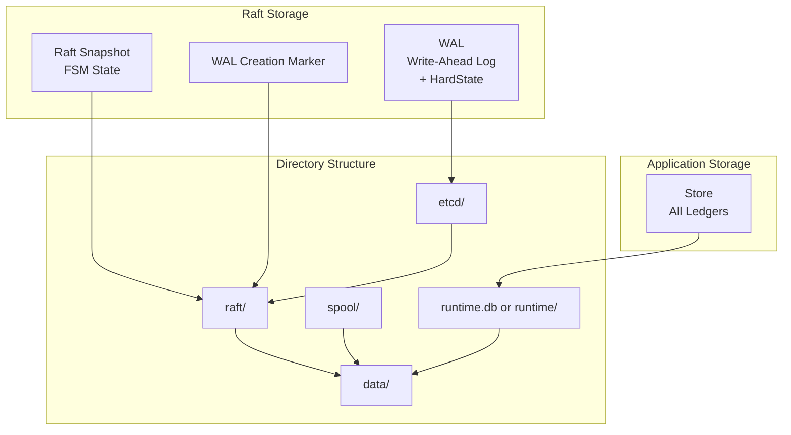

# Storage and Persistence

## Overview

The Ledger v3 POC system uses multiple storage layers to ensure data durability and recovery:

1. **WAL (Write-Ahead Log)**: Raft log for consensus
2. **Snapshots**: Periodic restoration points
3. **Store**: Logs + runtime state (balances, account metadata, idempotency)

All ledgers share a **single storage layer**, with data organized by ledger name prefixes.

For detailed information on the Pebble storage backend, see [Storage Drivers](./storage-drivers.md).

## Storage Architecture



## WAL (Write-Ahead Log)

### Concept

The WAL is the main log used by Raft to guarantee entry durability. It uses the `etcd/server/v3/storage/wal` library which provides:

- **Durability**: All writes are synchronized on disk
- **Performance**: Sequential writes optimized
- **Recovery**: Automatic replay at startup

### WAL Structure

```
data/
├── raft/
│   ├── etcd/                                         # etcd WAL directory
│   │   ├── 0000000000000000-0000000000000000.wal
│   │   ├── 0000000000000001-0000000000000001.wal
│   │   └── ...
│   ├── raft-state.pb                                 # Snapshot state (protobuf)
│   └── WAL_CREATION_COMPLETED                        # WAL creation marker
└── runtime/ (Pebble)
```

**Note**: The HardState is persisted inside the etcd WAL itself, not in a separate file.

> **⚡ Performance Recommendation**: The WAL directory (`data/raft/`) should be placed on a fast disk (SSD/NVMe) for optimal performance. WAL writes are synchronous and on the critical path of every write operation. Using a slow disk (HDD) will significantly impact write latency and throughput. In production environments, consider using a dedicated fast disk for the WAL directory separate from the data directory.

### WAL Operations

#### Write

When a new entry is proposed:

1. The entry is added to memory cache (`entries`)
2. The entry is written in the WAL
3. The WAL is synchronized on disk (fsync)
4. The entry is available for replication

#### Read

At startup, the WAL is replayed to rebuild the memory cache:

1. The last snapshot is loaded
2. WAL entries after the snapshot are replayed
3. The memory cache is rebuilt
4. The FSM state is restored

### WAL Management

The WAL grows indefinitely until a snapshot is created. After a snapshot:

- Entries before the snapshot index can be compacted
- The WAL is segmented to facilitate management
- Old segments can be deleted

### WAL Consistency Guarantees

The WAL implementation ensures that the storage is always in a consistent state, even in the presence of crashes. This is achieved through two key mechanisms:

#### 1. WAL Creation Completion Marker

When a new WAL is created, the system uses a marker file (`WAL_CREATION_COMPLETED`) to track whether the WAL was successfully initialized:

**Initialization Flow**:

1. Check if `WAL_CREATION_COMPLETED` marker exists
2. **If marker exists**: Open the existing WAL normally
3. **If marker does not exist**:
   - Delete any existing WAL directory (incomplete previous creation)
   - Create a new WAL using `wal.Create()`
   - Close and reopen the WAL (required by etcd/server WAL)
   - Create the marker file
   - Sync and close the marker file
   - Open the WAL for use

This mechanism ensures that if the process crashes during WAL creation, the incomplete WAL will be detected and recreated on the next startup, preventing corruption.

#### 2. Atomic Snapshot File Writes

The snapshot state file is written atomically using the "write-to-temp-then-rename" pattern:

```go
// 1. Write to temporary file
stateFile, err := os.Create(s.stateFile + ".tmp")
stateFile.Write(fileData)

// 2. Sync to ensure data is on disk
stateFile.Sync()

// 3. Close the file
stateFile.Close()

// 4. Atomic rename (atomic on POSIX systems)
os.Rename(s.stateFile+".tmp", s.stateFile)
```

**Recovery scenarios**:

| Crash Point | State After Restart |
|-------------|---------------------|
| Before `Sync()` | `.tmp` file may be incomplete, original file intact |
| After `Sync()`, before `Rename()` | `.tmp` file complete but unused, original file intact |
| After `Rename()` | New file is the current state |

In all cases, the system starts with a valid state file.

#### Snapshot State File Format

The snapshot state file uses a length-prefixed binary format:

```
[snapshotLength (8 bytes, big-endian)][snapshotData (protobuf)]
```

## HardState

### Concept

The HardState contains the critical state of the Raft cluster:

- **Term**: Current term of the cluster
- **Vote**: Node ID for which this node voted
- **Commit**: Index of the last committed entry

### Persistence

The HardState is persisted inside the etcd WAL itself using `wal.Save()`. This ensures that:

- HardState updates are atomic with log entry writes
- The state is recovered automatically during WAL replay at startup
- No separate file synchronization is required

### Update

The HardState is updated when:
- A new election occurs (term and vote change)
- An entry is committed (commit changes)

The WAL's `Append()` method checks if synchronization is needed using `raft.MustSync()` and persists both the HardState and entries atomically.

## Snapshots

### Concept

Snapshots are restoration points that contain:
- The complete FSM state at a given index
- Necessary metadata to restore the state

### Snapshot Creation

Snapshots are created automatically by a periodic background maintenance timer (`--maintenance-interval`, default 30s). On each tick, if `lastPersistedIndex` has advanced since the last snapshot, a new snapshot is created. The maintenance cycle also compacts the WAL and creates Pebble checkpoints.

### Snapshot Contents

The snapshot captures the complete in-memory FSM cache state:
- Dual-generation attribute cache (gen0 + gen1) with all:
  - Input/output volumes per account/asset
  - Account and ledger metadata
  - Ledger info entries
  - Ledger boundaries (next log ID, next transaction ID, and per-ledger counters)
  - Transaction references and transaction state
- Per-ledger reversion bitsets (persisted separately in Pebble zone `0x03`, reconstructed on restore)
- Global state (applied index, timestamp, sequence IDs) persisted in Pebble zone `0x06`

### Snapshot Mechanism

The FSM cache is persisted via `CacheSnapshotter` to Pebble zone `0x02`. There is no single `MemorySnapshot` protobuf message -- instead, the cache is serialized per generation using the `GenerationSnapshot` proto:

```protobuf
message GenerationSnapshot {
  fixed64 base_index = 1;
  repeated VolumeAttributeSnapshotEntry volumes = 2;
  repeated MetadataAttributeEntry metadata = 3;       // Account metadata
  repeated MetadataAttributeEntry ledger_metadata = 4; // Ledger metadata
  repeated LedgerAttributeEntry ledgers = 5;
  repeated BoundaryAttributeEntry boundaries = 6;
  repeated TransactionReferenceAttributeEntry references = 7;
  repeated TransactionStateAttributeEntry transactions = 8;
  reserved 9; // was: idempotency_keys (moved to dedicated prefix 0x03)
}
```

Reversions are **not** included in `GenerationSnapshot`. They are stored per-word in Pebble zone `0x03` (`ZonePerLedger` + `SubPLReversions`) and reconstructed from Pebble via `ReadReversions` on startup or snapshot restore.

The snapshot contains the full attribute cache state (volumes, metadata, ledger info, boundaries, references, transaction state) serialized per generation, allowing fast in-memory restoration.

### Restoration from Snapshot

When a node starts or recovers:

1. The most recent snapshot is loaded
2. The FSM state is restored from the snapshot
3. For each ledger with missing logs, logs are streamed from the leader using gRPC
4. Commands buffered during synchronization are replayed from the spool
5. The final state is reached

## Spool: Command Buffer During Synchronization

When a node is synchronizing from a snapshot (e.g., after joining the cluster or recovering from a failure), it enters a "syncing" mode. During this mode:

- **Committed entries are not applied directly to the FSM**: Instead, they are written to a spool file
- **Spool purpose**: Buffers commands that arrive during synchronization, preventing them from being lost
- **After synchronization**: Commands from the spool are replayed sequentially to catch up

**File**: `internal/storage/spool/spool.go`

**Spool Operations**:

```go
// Append committed Raft entries to the spool during synchronization
func (s *spool) AppendCommittedEntries(ctx context.Context, entries ...raftpb.Entry) error

// End returns the current end position of the spool
func (s *spool) End() (*Position, error)

// ReplayUntil replays spool entries up to the given position, skipping entries
// already applied (index <= lastApplied), calling applyFn for each new entry
func (s *spool) ReplayUntil(ctx context.Context, end Position, lastApplied uint64, applyFn func(raftpb.Entry) error) error

// Prune removes spool segments where all entries have been applied
func (s *spool) Prune(lastApplied uint64) error

// Close releases spool resources
func (s *spool) Close() error
```

**Spool File Format**:
- Each record contains a magic number (`0x53504F4C` = "SPOL")
- Record header: magic (4 bytes) + payload length (4 bytes) + CRC32 (4 bytes) + reserved (4 bytes)
- Record payload: Binary-encoded Command (protobuf)

**Spool Location**: `{dataDir}/spool`

### Synchronization Manager

The Node manages the synchronization process between the Raft log and the FSM directly (integrated within `internal/infra/node/node.go` and `internal/infra/state/machine.go`).

**Responsibilities**:
- Manages the "syncing" state flag (`statusNormal` / `statusSyncing`)
- Buffers commands to the spool during synchronization
- Replays spool commands after snapshot restoration
- Provides snapshot creation and restoration

**Synchronization Flow**:

1. **Snapshot received**: FSM's `InstallSnapshot()` is called to restore in-memory state
2. **Syncing mode activated**: `status = statusSyncing` - incoming entries are spooled
3. **Store synchronization**: FSM's `SynchronizeWithLeader()` handles:
   - **Ledger reconciliation**: Delete stale ledgers, register new ones
   - **Log streaming**: For each ledger, missing logs are streamed from the leader via gRPC
   - **Store update**: Logs are applied to bring balances and metadata up to date
4. **Spool replay**: Commands from the spool are replayed via `finalizeSynchronization()`
5. **Syncing mode deactivated**: `status = statusNormal` after replay completes
6. **Spool pruned**: Old spool entries are cleaned up

**Key Methods**:
- `FSM.InstallSnapshot()`: Fast in-memory state restoration from snapshot data
- `FSM.SynchronizeWithLeader()`: Brings store up to date with leader's data
- `FSM.IsStoreUpToDate()`: Checks if store needs synchronization

## Store

### Concept

The Store is responsible for persistent storage of transaction logs and derived attributes (volumes, metadata, idempotency keys, etc.). **All ledgers share the same Store instance**, with attribute data keyed by numeric ledger ID via U128 hash keys.

For detailed information on available storage backends and their configuration, see [Storage Drivers](./storage-drivers.md).

### What the Store Persists

All Pebble keys start with a zone byte that groups data by access pattern:

| Zone | Byte | Purpose | Lifecycle |
|------|------|---------|-----------|
| **Attributes** | `0x01` | Volumes, metadata, boundaries, tx state, references, sink configs, numscript | Hot storage, hashed during seal |
| **Cache** | `0x02` | Generation-based 0xFF cache for fast restart | Rotated per generation |
| **Per-Ledger** | `0x03` | Reversions, pending cleanups, mirror state | Per-ledger lifecycle |
| **Cold** | `0x04` | Logs + audit entries | Archived to cold storage then purged per chapter |
| **Idempotency** | `0x05` | Deduplication keys + time index | TTL-based eviction |
| **Global** | `0x06` | Applied index/timestamp, ledger info, signing, chapters, cluster config, bloom | Lives forever |

See [Storage Drivers](./storage-drivers.md) for the complete key schema.

### Attribute Loading Coordination

**File**: `internal/infra/preload/loader.go`

The `AttributeLoader` coordinates concurrent attribute loading to prevent duplicate store reads:

- **Purpose**: Prevents redundant store reads when multiple concurrent requests need the same attribute
- **Mechanism**: Uses per-key channels to coordinate loading - first goroutine loads, others wait
- **Caching**: Loaded values are cached with their boundary until the command is applied
- **Cleanup**: Values are removed from the loader after the FSM cache is updated

**Attribute types coordinated**:
- **Input volumes**: Balance inputs per account/asset
- **Output volumes**: Balance outputs per account/asset
- **Idempotency keys**: Idempotency key values

> **Note:** Reversions do not use an `AttributeLoader` — they are stored as an in-memory bitset that is always authoritative. No preloading from Pebble is needed.

For detailed documentation on the `AttributeLoader` design, see [Deterministic FSM - Concurrent Load Coordination](../core/deterministic-fsm.md#76-concurrent-load-coordination-attributeloader).

## Directory Structure

```
data/
├── raft/                          # Raft data
│   ├── etcd/                      # etcd WAL directory
│   │   └── *.wal                  # WAL segments (include HardState)
│   ├── raft-state.pb              # Snapshot state (protobuf)
│   └── WAL_CREATION_COMPLETED     # WAL creation marker
├── spool                          # Spool file for sync
├── seal/                          # Temporary seal checkpoint (chapter closing)
└── runtime/                       # All ledgers data (Pebble)
    ├── live/                      # Active database
    ├── checkpoints/               # Checkpoint directories for snapshots
    └── CURRENT_CHECKPOINT         # Current checkpoint ID file
```

The `seal/` directory contains a temporary Pebble checkpoint created when a chapter is being closed. It is used by the background Sealer to compute the sealing hash and is removed after the hash is computed. See [Chapters](../data-model/chapters.md) for details on the sealing process.

## Durability and Guarantees

### Write Durability

1. **WAL**: Synchronized on disk before commit
2. **Store**: Durable writes with Pebble
3. **Snapshots**: Created periodically for recovery

### Recovery after Failure

The system can recover completely from:

1. **Snapshot + WAL**: Rapid restoration from the last snapshot
2. **Complete WAL**: If no snapshot, complete replay of the WAL
3. **Store**: Reconstruction of balances from the logs

### ACID Guarantees

- **Atomicity**: Complete transactions or nothing
- **Consistency**: Consistent state guaranteed by Raft
- **Isolation**: Locks per account for balances
- **Durability**: Writes synchronized on disk

## Performance and Optimizations

### Memory Cache

- **Raft Entries**: Cache in memory for fast access
- **FSM State**: All ledger states kept in memory
- **Balances**: Read from database (no cache, consistent reads)

### Compaction

#### WAL Compaction

The WAL is compacted after snapshots to prevent unbounded growth:

1. When a snapshot is created at index `N`, entries before `N - CompactionMargin` are deleted
2. The `CompactionMargin` keeps a buffer for slow followers to catch up
3. Old WAL segment files are removed from disk

For detailed explanation, see [WAL Compaction in Data Flows](../data-model/data-flows.md#wal-compaction).

#### Spool Compaction

The Spool (committed entry buffer) prunes old segments:

- Segments where `MaxIndex <= lastApplied` are deleted
- The trailer metadata allows fast segment skipping during replay

See [Spool Technical Documentation](./spool.md#pruning) for details.

#### Store Compaction (Pebble)

Pebble performs automatic LSM-tree compaction:

- **L0 → L1 compaction**: Triggered when L0 files exceed threshold
- **Background compaction**: Runs concurrently with writes
- **Write stalls**: May occur if compaction falls behind (see [Metrics](../../../ops/monitoring.md#write-stall-metrics))

### Indexing

- **Idempotency keys**: Index for fast verifications
- **Sequences**: Primary index for ordering
- **Log IDs**: Index for fast lookups

## Next Steps

To deepen your understanding:

1. [Storage Drivers](./storage-drivers.md) - Detailed documentation on the Pebble storage driver
2. [Consensus Raft](../core/raft-consensus.md) - How Raft uses storage
3. [Buckets and Ledgers](../data-model/buckets-ledgers.md) - Data organization
4. [Deployment](../../../ops/deployment.md) - Storage configuration in production
