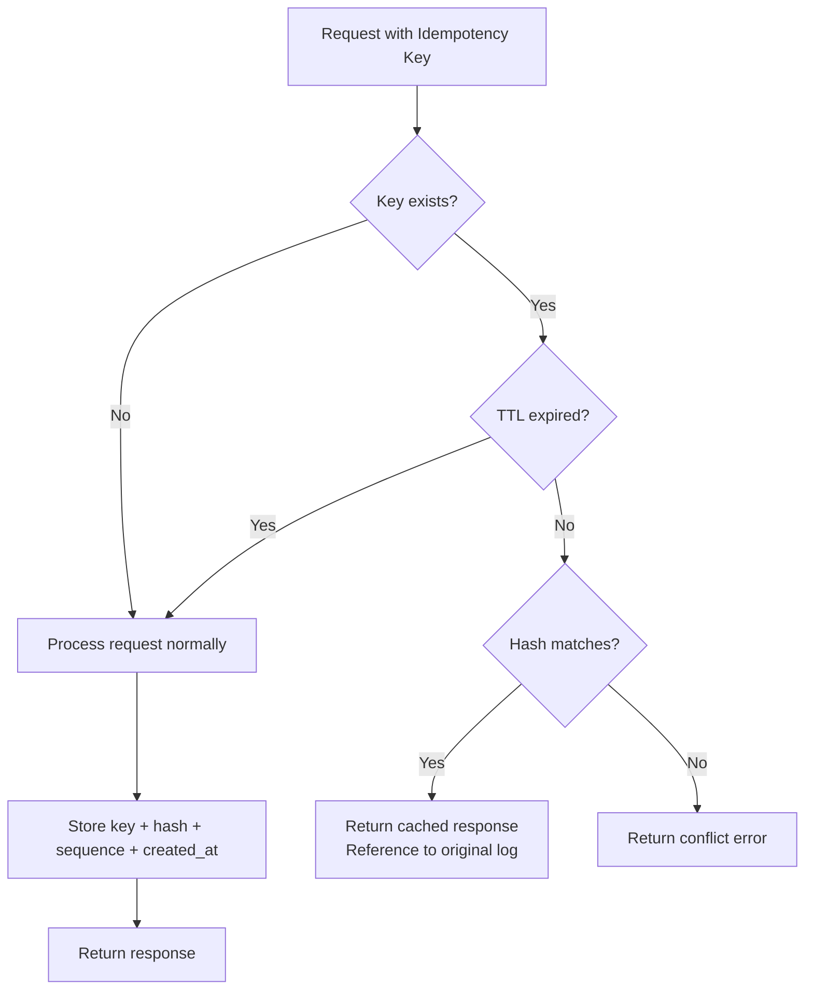
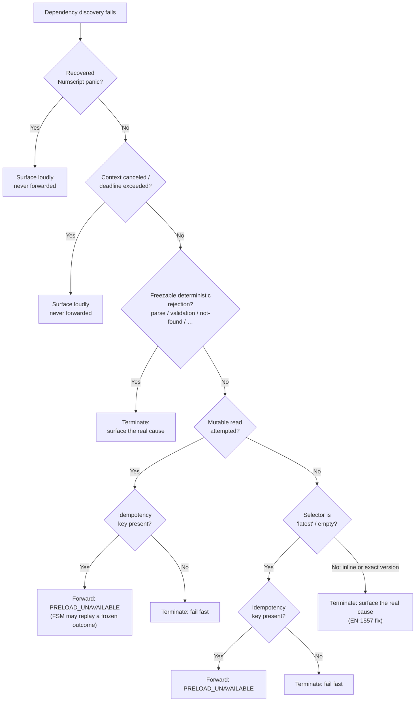

# Idempotency Keys

## Overview

Idempotency keys provide a mechanism to safely retry requests without risking duplicate operations. When a client includes an idempotency key with a request, the system guarantees that the operation will only be executed once, even if the request is sent multiple times.

Idempotency keys are stored under the dedicated `ZoneIdempotency` zone (`0x05`) with an in-memory bridge map for inter-proposal visibility. They are not part of the shared attribute/cache system.

## Key Characteristics

| Characteristic | Description |
|----------------|-------------|
| **Scope** | System-level (not per-ledger) |
| **Uniqueness** | Keys must be globally unique across all ledgers |
| **Hash verification** | Content is hashed (BLAKE3) to detect conflicts |
| **Persistence** | Stored under `{0x05, 0x01}` (`ZoneIdempotency` + `SubIdempKeys`) with a time index at `{0x05, 0x02}` (`ZoneIdempotency` + `SubIdempTimeIdx`) |
| **TTL** | Configurable time-to-live (default: 24h, 0 = no expiration) |
| **Eviction** | Deterministic cleanup via Raft `IdempotencyEviction` commands |

## How It Works

### Request Flow



### Hash Computation

When processing a request with an idempotency key:

1. **Hash computation**: The request content (excluding the idempotency key itself) is hashed using BLAKE3
2. **Storage**: The idempotency key maps to:
   - `LogSequence`: The global log sequence number of the original response
   - `Hash`: BLAKE3 hash of the request content
   - `CreatedAt`: HLC microsecond timestamp from the Raft entry

```go
type IdempotencyKeyValue struct {
    LogSequence uint64  // Global sequence number of the original log
    Hash        []byte  // BLAKE3 hash of the request content
    CreatedAt   uint64  // HLC microseconds (from Raft entry timestamp)
}
```

### Behavior Matrix

| Scenario | Result |
|----------|--------|
| New idempotency key | Process normally, store key |
| Same key + same content (within TTL) | Return reference to original log |
| Same key + different content (within TTL) | Return `idempotency key conflict` error |
| Same key (after TTL expiration) | Process normally (key treated as new) |
| No idempotency key | Process normally, no idempotency tracking |

## Numscript Dependency-Resolution Failures

Idempotency keys also govern a narrower, forward-vs-terminate decision admission has to make while *preparing* a `CreateTransaction` order that references a Numscript script. Before a script's order can be proposed, admission statically discovers the accounts, assets, and metadata it depends on (`DiscoverNumscriptDependencies`, `internal/domain/processing/numscript/discover.go` — see [Numscript Library](../scripting/numscript-library.md)) so the FSM never has to touch Pebble to resolve them. When that discovery fails, admission must decide whether the failure is **deterministic** — the script could never have succeeded, no matter how many times it is retried — or **state-dependent** — current state caused it, and a different (or later) state might not. `Admission.classifyResolutionFailure` (`internal/application/admission/admission.go`) makes this call from two signals Ledger already owns; it never inspects error strings or Numscript internals. A dedicated public Numscript resolver-error taxonomy (EN-1563) was evaluated for this purpose and cancelled as unnecessary.

### The two signals

1. **Selector mutability.** Under the numscript-library versioning model (see [Version Resolution](../scripting/numscript-library.md#version-resolution)), a script reference is either an exact immutable semver, the literal `latest`/empty, or an inline script body. A `latest` reference can resolve to a *different, previously-saved* version on a later attempt, so a `latest` failure stays forwardable under an idempotency key even when the currently-selected version failed before reading any state. An inline script or an exact pinned version is deterministic: the same input always produces the same failure.
2. **Read-attempt provenance.** `RecordingStore.MutableReadAttempted()` (`internal/domain/processing/numscript/store.go`) reports whether resolution delegated any balance/metadata lookup to the inner store before failing — **including a lookup that itself returned an error**. This is carried out of `DiscoverNumscriptDependencies` through the typed `DependencyResolutionError` (`internal/domain/processing/numscript/resolution_error.go`). The pre-existing `RecordingStore.ReadNothing()` is insufficient for this purpose: it reflects only *successfully recorded* values, so it cannot distinguish "no read was attempted" from "a read was attempted and failed" — exactly the case that matters here.

### Decision flow



A recovered Numscript panic and context cancellation/deadline are surfaced loudly and never softened to `PRELOAD_UNAVAILABLE` — they are "should not happen" or host-level conditions (invariant #7), not business outcomes with a frozen replay to preserve. A freezable deterministic rejection (parse error, validation failure, not-found, already-exists, …) is likewise terminal: there is nothing a retry could change.

Asset scaling (`… with scaling through …`) is a special member of that freezable class worth calling out: resolution rejects it unconditionally, independent of any balance/metadata, so it is deterministic — yet a `balance()`/`meta()` var origin bound *before* the scaling statement is walked will already have set the read-attempt flag. `convertNumscriptError` therefore maps the one publicly-exposed deterministic sentinel (`numscriptlib.ErrScalingNotSupported`) to the freezable `ErrNumscriptScalingUnsupported` (`KindValidation`), so the freezable guard above terminates it *before* the provenance signals below are consulted. Without this, a read-then-scaling script under an idempotency key would be forwarded as `PRELOAD_UNAVAILABLE` and retried forever (EN-1557). The remaining deterministic post-read failures the library exposes only as internal types stay conservatively forwarded — splitting them would need the upstream taxonomy (EN-1563).

Past those guards, the provenance signals decide. A mutable read attempted before failing — even one that itself errored — means the failure is state-dependent: with an idempotency key, the order is stamped `PreloadUnavailable` on its `OrderTechnical` (the one field invariant #10 permits mutating post-acceptance) and forwarded, so the FSM can replay a frozen outcome if the batch is a retry, or reject with the retryable, non-frozen `ERROR_REASON_PRELOAD_UNAVAILABLE` if it isn't. Without a key there is no frozen outcome to preserve, so admission fails fast instead.

When no mutable read was attempted, only a `latest`/empty selector keeps the same forwarding behavior, because a later attempt could still resolve to a different saved version. An inline script or an exact immutable version with no attempted read is fully deterministic — this is the case the EN-1557 fix changed: it previously forwarded as a retryable `PRELOAD_UNAVAILABLE` with no frozen outcome to ever converge on, producing an unbounded retry loop. It now terminates immediately, surfacing the real Numscript cause.

## TTL and Eviction

### Configuration

| Flag | Default | Description |
|------|---------|-------------|
| `--idempotency-ttl` | `24h` | Time-to-live for idempotency keys (0 = no expiration) |
| `--idempotency-eviction-interval` | `60s` | How often the leader proposes eviction |

The TTL is persisted in `PersistedConfig` to ensure all Raft nodes use identical TTL values (FSM determinism requirement). Changing the TTL after first boot requires `--unsafe-skip-config-validation`.

### Eviction Mechanism

Expired idempotency keys are cleaned up via a dedicated Raft command (`IdempotencyEviction`):

1. The leader periodically computes `cutoff = now - TTL` and proposes an eviction
2. All nodes apply the eviction deterministically: scan in-memory map + Pebble, delete entries with `created_at <= cutoff`
3. The cutoff is embedded in the Raft proposal, so all nodes agree on exactly what to evict
4. No race conditions: eviction is serialized with business proposals in the FSM

### Memory Bounds

The in-memory map grows between eviction commands and shrinks on each eviction:
- With interval=60s and 1000 IK/s: ~60K entries x ~80B = ~5MB
- With interval=60s and 10K IK/s: ~600K entries x ~80B = ~48MB

## Storage Architecture

### Pebble Layout

```
[0x05][0x01][key_hash 16 bytes]                -> IdempotencyKeyValue protobuf
[0x05][0x02][created_at BE 8 bytes][key_hash 16 bytes]  -> empty (time index for eviction scan)
```

The key hash is a 16-byte BLAKE3 truncation of the idempotency key string.

### In-Memory Bridge

An in-memory map (`IdempotencyStore`) bridges state between consecutive proposals. A key written by proposal N must be visible to proposal N+1 even if N+1's preload ran before N was applied to Pebble.

```
Admission (preload) ─── direct Pebble Get ──> ExecutionPlan
                                                  │
FSM (apply) ─── in-memory map (bridge) ──────────>│
                │                                  │
                └── DerivedIdempotencyStore ───> Merge ──> Pebble [0x05][0x01]
```

### Preloading

During admission, idempotency keys are loaded directly from Pebble (no bloom filter, no dual-generation cache). The preload logic is in `internal/infra/preload/preloader.go` and emits a `ReloadIdempotencyKey` on a dedicated channel of `ExecutionPlan` (separate from the `AttributeCoverage` channel that drives the coverage gate):

```go
value, err := state.LoadIdempotencyKey(reader, ik.Key)
if err != nil {
    results[i].err = err
    return
}

if value != nil {
    keys = append(keys, &raftcmdpb.ReloadIdempotencyKey{
        Key:   ik.Key,
        Value: value,
    })
}
// ...
ps.IdempotencyKeys = keys
```

## API Usage

### HTTP API

Include the idempotency key in the `Idempotency-Key` HTTP header:

```bash
curl -X POST http://localhost:9000/my-ledger/transactions \
  -H "Content-Type: application/json" \
  -H "Idempotency-Key: unique-request-id-123" \
  -d '{
    "postings": [
      {"source": "world", "destination": "bank", "amount": 100, "asset": "USD"}
    ]
  }'
```

### gRPC API

Include the idempotency key in the `idempotency_key` field of the request.

## Supported Operations

All write operations support idempotency keys:

| Operation | Endpoint | Idempotency Support |
|-----------|----------|---------------------|
| Create transaction | `POST /{ledger}/transactions` | Yes |
| Revert transaction | `POST /{ledger}/transactions/{id}/revert` | Yes |
| Save account metadata | `POST /{ledger}/accounts/{addr}/metadata` | Yes |
| Delete account metadata | `DELETE /{ledger}/accounts/{addr}/metadata/{key}` | Yes |
| Save transaction metadata | `POST /{ledger}/transactions/{id}/metadata` | Yes |
| Delete transaction metadata | `DELETE /{ledger}/transactions/{id}/metadata/{key}` | Yes |
| Create ledger | `POST /{ledger}` | Yes |
| Delete ledger | `DELETE /{ledger}` | Yes |
| Bulk operations | `POST /{ledger}/bulk` | Yes (per action) |

## Key Validation

| Rule | Limit | Error |
|------|-------|-------|
| Maximum length | 256 characters | `VALIDATION` (HTTP 400 / gRPC `INVALID_ARGUMENT`) |

## Error Handling

### Conflict Error

When a conflict is detected (same key, different content, within TTL):

**HTTP Response:**
```json
{
  "errorCode": "CONFLICT",
  "errorMessage": "idempotency key conflict: same key used with different request content"
}
```

**Status Code:** `409 Conflict`

### Best Practices

1. **Use unique keys**: UUIDs or composite keys (e.g., `{client-id}-{request-id}`)
2. **Be aware of TTL**: Keys expire after the configured TTL (default 24h)
3. **Don't reuse keys**: Even for "similar" operations
4. **Handle conflicts**: Implement retry logic with new keys on conflict

## Related Documentation

- [Numscript Library](../scripting/numscript-library.md) — the versioning model behind selector mutability, and dependency discovery / resolution.
- [Admission Pipeline](pipeline.md) — where numscript resolution and Needs enrichment sit in the overall admission flow.
