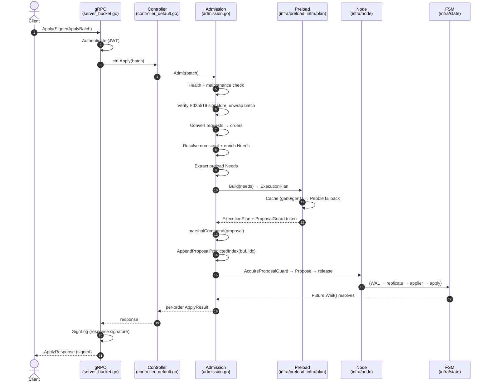

# Admission Pipeline

## Overview

The admission pipeline (`internal/application/admission`) is what every write request goes through between the gRPC server and the Raft proposer. Its job is to convert a client batch into an in-memory `Proposal` that the FSM can apply deterministically on every replica.

In one sentence: **admission turns external requests into preloaded, structurally-validated, signed Raft proposals — and rejects everything that can be rejected before consensus**.

## Entry points and forwarding

| Layer | Location | Role |
|-------|----------|------|
| gRPC | `BucketServiceServerImpl.Apply` — `internal/adapter/grpc/server_bucket.go` | Authenticate the caller (JWT), short-circuit cross-node forwarding, do a cheap `PeekBatch` for metrics, then delegate. |
| Controller | `DefaultController.Apply` — `internal/application/ctrl/controller_default.go` | Forwarding layer. Peeks the batch for metrics and traces, delegates to `Admission.Admit`, records duration. No mutation. |
| Admission | `Admission.Admit` — `internal/application/admission/admission.go` | The real pipeline. |

The gRPC and controller layers exist so the same admission logic can sit behind multiple transports (HTTP REST is a thin wrapper over the same controller) and so cross-cutting concerns (auth, telemetry, peek-then-delegate) stay outside the pipeline body.

## The Admit pipeline

`Admit` is structured as a sequence of stages, each of which can short-circuit the whole batch:

### 1. Write gate

`writeGate.CheckWritesAllowed()` rejects the batch if the node is in a state that forbids writes — disk-full predicate, paused leader, etc. This is the cheapest possible reject and runs before any signature crypto.

### 2. Maintenance mode

If the cluster is in maintenance mode, only `SetMaintenanceMode` requests are allowed through (`allRequestsAreMaintenanceMode()`). Any other request type in the batch fails the whole batch atomically — there is no partial admission.

### 3. Signature verification

`resolveBatch()` looks up the signing key by ID, calls `signing.Verify(pubkey, payload, sig)` (`internal/domain/crypto/signing/signing.go`), and unwraps the opaque payload into an `ApplyBatch`. The verifier is fed the **exact bytes the client signed** — the server never re-serializes the batch before verification, which is what makes cross-language clients work. See [signing.md](signing.md) for the full signing model.

If `RequireSignatures()` is true cluster-wide, an unsigned batch is rejected here. If signing is not required, an unsigned batch follows `authorizeUnsignedBatch()` and continues.

### 4. Order conversion

`requestsToOrders()` walks every `Request` in the batch and dispatches to a per-type converter (`CreateLedger`, `Apply`, `RegisterSigningKey`, …) producing an internal `Order`. Orders are the FSM's input language; requests are the wire language. The conversion is structural — it does not consult Pebble.

### 5. Numscript resolution + Needs enrichment

For every `CreateTransaction` order backed by a script, `resolveScriptsAndEnrichNeeds()` resolves the `NumscriptReference` against an intra-batch overlay (programs being created in the same batch) and falls back to the persisted numscript library. Each resolved program is parsed for its account / metadata / volume dependencies; those become additional `preload.Needs` for the order.

This stage is the reason numscript is admission-time work, not FSM work: the FSM's apply path is forbidden from reading Pebble (see [FSM cache layers](../fsm/cache-layers.md)), so the program's dependencies must be turned into declared `Needs` before consensus.

### 6. Preload Needs extraction

`extractPreloadNeeds()` aggregates the per-order `Needs` declared by each order's converter. **Each component owns its own `Needs`** (per [`feedback_component_owns_its_preload`](../../../../../AGENTS.md)): there is no central helper that introspects orders to compute their `Needs` — the order's producer declares them upfront. Idempotency-eviction, indexer mirror, admission orders, etc. each declare their own.

### 7. Build the execution plan

`builder.Build(operations)` (`internal/infra/plan/builder.go`) reads each `Needs` entry, hits the gen0/gen1 attribute cache first, and falls back to Pebble for misses. The result is an `ExecutionPlan` — the read-only view the FSM apply path will see when it runs.

The build also returns a `ProposalGuard` token that holds the loaders in scope and enforces the cache-generation boundary check at propose time.

### 8. Marshal + predicted-index trick

The proposal is serialized with `vtprotobuf.MarshalCopy(cmd)` (`internal/pkg/vtmarshal`) **before** the proposal guard is acquired, so the heavy CPU work happens outside the critical section. Then, once the guard is acquired (next step) and the predicted Raft index is known under the lock, `AppendProposalPredictedIndex(buf, idx)` (`internal/infra/plan/predicted_index.go`) appends the index as raw wire bytes for proto field 7 (a `fixed64`) onto the already-marshalled buffer — no re-marshalling of the whole proposal just to stamp a single field. The trick is what keeps the critical section short while still letting the predicted index live inside the signed proposal payload.

### 9. Acquire guard → propose → release

Under the proposal guard lock:

1. Re-check the cache generation hasn't rotated since the preload (`build.nextIndexGen == nextIndexGenAfter`). On a rare miss, rebuild the preload still under the lock.
2. Call `proposer.Propose(ctx, proposal)` (`internal/infra/node`). Raft assigns the proposal a real index, increments the tracker.
3. Release the guard. The future returned by `Propose` is what admission waits on.

The guard's job is to make sure the cache state observed during preload is the same cache state the FSM will see on apply. Releasing loaders "after apply" is a **performance optimisation**, not correctness — the cache FSM is protected by `putAttributeIfAbsent` (see [`project_loaders_release_is_optimization`](../../../../../AGENTS.md)).

### 10. Wait for commit

`proposal.Wait(ctx)` blocks until the FSM has applied the proposal and the committer has resolved the future. The result is the per-order `ApplyResult` — either a successful log range or a `Failure` with the reason. Admission then assembles the per-request response and returns up the stack.

A response signature (`SignedLog`) is attached at the gRPC layer on the way out — see [signing.md](signing.md).

## Idempotency

Two-stage check:

- **Admission**: the idempotency key's *shape* is validated (UTF-8, length ≤ 256). The key becomes part of the proposal's `Needs` so the FSM can look it up.
- **FSM**: `processProposal` consults the replay cache (`SubIdempKeys` in Pebble). A hit returns the stored outcome reference (sequence + outcome) without re-executing the orders. A miss falls through to normal processing, and the outcome gets recorded under the same key on the way out.

This split exists because the *uniqueness* check requires committed state — admission can only validate that the key is well-formed.

## Validation: structural vs behavioural

Admission validates **structural correctness** (UX-fast feedback before Raft): account address shape, asset code shape, metadata key shape, idempotency-key length, etc.

The FSM validates **behavioural invariants** (audit-bound): balance sufficiency, account-type constraints, overflow, already-reverted transactions, etc.

Both layers share the same domain sentinels (`domain.BusinessError`, `domain.ErrXxx`) so that an end-state caught at both layers reports the same error. See [validation.md](validation.md) for the per-rule split and the rationale.

## Mockability

`Admission` is an interface (`internal/application/ctrl/controller_default.go` — `//go:generate mockgen`), so `DefaultController` tests can stub it. The mock is the standard `MockAdmission` generated by `go generate ./...`. Hand-rolled fakes are forbidden by [`feedback_use_mockgen`](../../../../../AGENTS.md).

## Failure semantics

| Where rejected | What happens | Visible to | Audit entry produced? |
|----------------|-------------|------------|------------------------|
| Write gate / maintenance / signature / structural validation | gRPC returns error, no Raft proposal | Client only | **No** — admission did not propose. |
| FSM apply (validation, overflow, balance, etc.) | Proposal returned with `Failure` outcome | Client + Raft log | **Yes** — `AuditEntry` with `outcome = Failure`, bound by the hash chain. |

This distinction matters: anything that lands in the audit chain is replayable and verifiable by the checker. Anything rejected at admission is invisible to history — which is correct, because there is nothing to replay (the order never reached the cluster).
