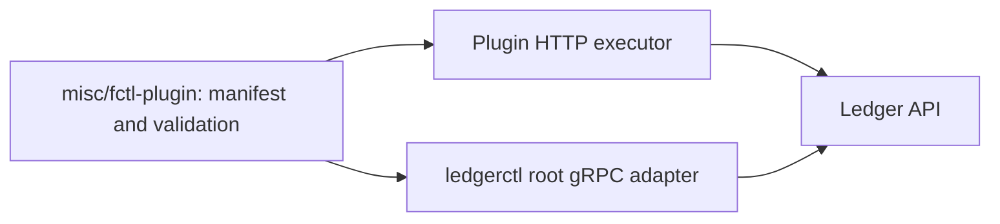

# Product-owned fctl plugin

Ledger owns its shared business command contract and HTTP executor in the
separate `misc/fctl-plugin/` Go module,
named `github.com/formancehq/ledger/misc/fctl-plugin`.
Its sole direct dependency is the public fctl plugin SDK. It imports neither
Ledger service internals nor the fctl core, UI, profiles, or authentication.
The plugin module declares Go 1.26; the Ledger root module declares Go 1.27.

The package implements the SDK's `GetManifest` and `Execute` contract. The
manifest declares command arguments, flags, confirmations, and forms. The same
package can run embedded or through the standalone `fctl-plugin-ledger`
executable. The external entry point calls `transport.Serve` with the factory
that accepts the host-provided HTTP client.

## Shared commands and native adapters

`ledgerctl` uses all 31 runnable operations from this manifest by default.
`cmd/ledgerctl/cli.NewCommand` assembles the production tree and
`attachSharedCommands` binds them to the native command tree, then executes
them through `NewWithExecutor` and the root module's
`cmd/ledgerctl/shared` gRPC adapter. Ordinary builds include the integration;
there is no opt-in flag or research patch to apply.



The manifest owns the common arguments, flags and JSON payload shape.
Each host owns input acquisition, credentials and rendering. `ledgerctl`
preserves native spellings, flags, builders and output: for example, `get`
binds to `show`, and `indexes drop` binds to `indexes delete`. Its operational
commands, including cluster, store, audit and restore, remain native.

The gRPC adapter converts the acquired JSON body to Ledger protobuf requests
and retains native typed results for the existing renderers. Connection setup,
request signing and response verification stay in the root host. No server
imports or gRPC business types enter the plugin module. Both executors preserve
numeric precision and expose partial bulk results alongside errors. Native
creation with initial indexes remains one atomic Apply proposal.

## Validation

Run the root and nested module checks from the repository root:

```sh
bash scripts/agent-check
AI_REVIEW_BASE_SHA=BASE_COMMIT_SHA bash scripts/agent-check-pr
nix develop --command go test -race ./cmd/ledgerctl/shared ./cmd/ledgerctl/cli ./cmd/ledgerctl
nix develop --command just test-fctl-plugin
```

Replace `BASE_COMMIT_SHA` with the exact review base. The root suites exercise
the gRPC adapter and default CLI bindings; the nested suite exercises the
standalone product contract and HTTP executor. Real-server command readback
and terminal checks are additional validation; these recipes alone do not
establish end-to-end coverage.

## External transport and publication

In external mode, the SDK broker returns each HTTP request to the fctl host.
The host applies its authentication, endpoint restrictions, transport, and
diagnostics. Exact JSON bytes and partial bulk responses stay on the public
SDK boundary. The executable has no Ledger service gRPC contract dependency;
the plugin SDK protocol version is distinct from `pkg/grpcprotocol.Version`.

Each plugin release names an exact Ledger service version and a positive
plugin revision. A CLI-only fix increments the revision for that service
version. It does not change the service version in the SDK manifest. The
host's catalogue maps this identity and platform to a digest-addressed native
executable. The host validates the running manifest against the locked one.

GoReleaser builds the six supported native platforms in the Ledger release
pipeline. The publisher reads the resulting GoReleaser artifact list and the
SDK manifest exported by the native executable. It validates each binary's Go
entry point, target platform, and injected service version and plugin revision,
computes its SHA-256 checksum, and uploads
one raw executable layer per OCI artifact through the Nix-pinned ORAS tool.
Paths from the artifact list are opened through `os.Root`; traversal and
symlink escapes cannot select a file outside the build root.

Publication builds retain Go linker metadata. They do not use `-trimpath`,
which removes the recorded `-ldflags` needed to verify foreign-platform
version and revision without executing the binary. The publisher checks every
platform before calling ORAS. A stale manifest or a mixed set of product
versions fails preflight and produces neither an upload nor a catalogue.

The publisher creates private staging files before uploading. It emits a
catalogue only after all six uploads succeed. If an upload fails, earlier
artifacts can remain in the registry, but no complete catalogue is emitted.
The canonical Just recipe replaces the prepared catalogue only on success.
The local layout recipe exercises the same ORAS serialization without any
registry upload. See the [build and publication guide](../../../../../misc/fctl-plugin/README.md).

### Local integration checks (2026-10-09)

A normal `go build ./cmd/ledgerctl` binary was tested against a fresh single-node
Ledger built from this branch, advertising version `3.0.0-beta.10`. The node
used loopback HTTP and gRPC endpoints, isolated data and WAL directories, and
no authentication or TLS. These checks do not establish a deployed release or
coverage of Cloud authentication.

The command matrix exercised all 31 shared operations in 38 cases: ledger,
account and transaction reads, metadata writes and deletes, index operations,
bulk, revert, logs, cursor pagination and the `after` compatibility alias.
It verified atomic initial indexes, rejection of conflicting inputs and exact
readback of the integer `9007199254740993`. The fctl consumer used the published
`misc/fctl-plugin` module against the same node's HTTP API.

PTY checks verified a ledger creation form after 12 seconds of user input,
SIGTERM cancellation during ledger and transaction forms, and restoration of
terminal attributes. Human output retained ANSI colours; JSON stdout remained
parseable. The automated regression suites cover partial streams, response
validation, request signing boundaries and cancellable input separately.


The `LedgerctlTypedMetadata` cluster E2E scenarios passed with the production
command assembly. The complete business E2E suite also passed. The full
cluster suite reached its 20-minute timeout while starting the third Raft node
in `raft_test.go:121`, before any CLI invocation; its multi-node bootstrap was
blocked for 18 minutes. This broader gate remains unresolved and the PR stays
in draft pending the cluster/CI results.
