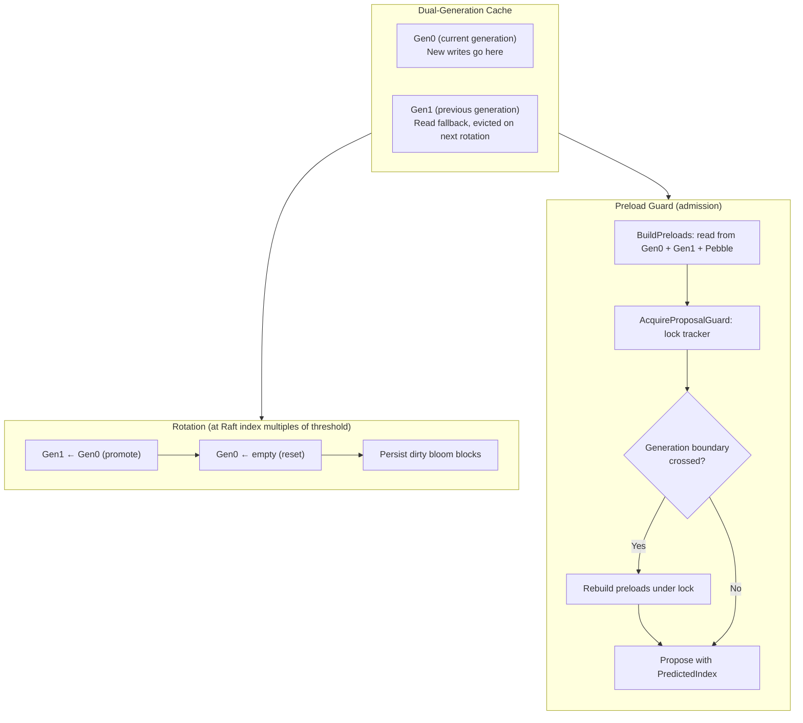

# System Attributes

## Overview

Attributes are key-value pairs that track the state of the ledger system. All attributes use a unified storage and caching model based on **generation-based caching** and **preloading** to ensure deterministic FSM execution across all Raft nodes.

All attributes share:
- **U128 hash-based keys** for efficient storage and lookup
- **Tag-based collision detection** (64-bit secondary hash)
- **Generation cache** (gen0/gen1) for fast access
- **AttributeLoader** for coordinated concurrent loads
- **Single-value storage** — each canonical key has at most one Pebble entry, overwritten in place

**Exception:** Reversions use a dedicated in-memory bitset instead of the attribute system. See [Reversions](#reversions) below.

See [Deterministic FSM](../fsm/deterministic-fsm.md) for details on the caching and preloading mechanisms.

## Attribute Types

| Attribute | Key | Value | Scope | Behavior |
|-----------|-----|-------|-------|----------|
| **Volumes** | ledgerID/account/asset | `VolumePair` (Input + Output) | Per-ledger | Last-write-wins (absolute values) |
| **Account Metadata** | ledgerID/account/key | `MetadataValue` | Per-ledger | Last-write-wins |
| **Ledger Metadata** | ledgerID/key | `MetadataValue` | Per-ledger | Last-write-wins |
| **Reversions** | ledgerID + txID | `bit` | Per-ledger | In-memory bitset, persisted per-word in Pebble zone `0x03` |
| **Transaction References** | ledgerID/reference | `uint64` (txID) | Per-ledger | Immutable once set |
| **Ledgers** | ledger name | `LedgerInfo` | System-wide | Last-write-wins |
| **Boundaries** | ledger name | `LedgerBoundaries` | Per-ledger | Last-write-wins |

## Volumes (Input/Output)

Track funds flow for each account and asset combination. Volumes are always preloaded with absolute Known values (both sources and destinations) before processing.

| Property | Description |
|----------|-------------|
| **Key** | `VolumeKey` = ledger ID (uint32) + account address + asset |
| **Value** | `VolumePair` (Input + Output as Uint256) |
| **Computation** | Last-write-wins (latest absolute value) |
| **Balance** | `Input - Output` |

**Example:**
```
Key: ledger="main", account="users:alice", asset="USD/2"
Input: 150000 (funds received)
Output: 50000 (funds sent)
Balance: 100000 ($1000.00 with 2 decimals)
```

**Usage:**
- Balance verification before transactions
- Account balance queries
- Insufficient funds detection

## Account Metadata

Key-value metadata attached to accounts.

| Property | Description |
|----------|-------------|
| **Key** | `MetadataKey` = ledger ID (uint32) + account address + metadata key |
| **Value** | `MetadataValue` (string) |
| **Computation** | Last-write-wins |

**Example:**
```
Key: ledger="main", account="users:alice", key="kyc_status"
Value: "verified"
```

**Usage:**
- Store arbitrary data on accounts
- Numscript can read account metadata via `meta()`
- Queryable via API

## Ledger Metadata

Key-value metadata attached to ledgers.

| Property | Description |
|----------|-------------|
| **Key** | `LedgerMetadataKey` = ledger ID (uint32) + metadata key |
| **Value** | `MetadataValue` (string) |
| **Computation** | Last-write-wins |

**Example:**
```
Key: ledger="main", key="environment"
Value: "production"
```

**Usage:**
- Store ledger-level configuration
- Set at ledger creation or via metadata API

## Reversions

Track whether a transaction has been reverted using an **in-memory bitset** (`ReversionBitset`).

Unlike other attributes, reversions are **not** stored as Pebble attributes under zone `0x01`. Instead, each ledger maintains a `[]uint64` bitset where bit N indicates whether transaction N has been reverted. Reversion words are persisted to Pebble under zone `0x03` (Per-Ledger) with key format `[0x03][0x01][ledgerName padded 64B][wordIndex BE 8 bytes]` via the `SaveReversionWord` function in `internal/infra/state/batch.go`.

| Property | Description |
|----------|-------------|
| **In-memory** | `map[string]*bitset.Bitset` -- one bitset per ledger, keyed by ledger name (from `internal/pkg/bitset/bitset.go`) |
| **Pebble persistence** | Per-word in zone `0x03` (`ZonePerLedger` + `SubPLReversions`), key: `[0x03][0x01][ledgerName padded 64B][wordIndex BE 8]`, value: `[uint64 LE 8]` |
| **Lookup** | O(1) -- `words[txID/64] & (1 << (txID%64))` |
| **Memory** | 1 bit per transaction (vs ~82 bytes per entry with the old KeyStore approach) |
| **Restore** | Reconstructed from Pebble via `ReadReversions` (`internal/query/reversions.go`) on startup or snapshot restore |
| **Monotone** | Reversions only go `false -> true`, never back |

**Example:**
```
Ledger "main", txID=42:
  words[0] = 0x0000040000000000  // bit 42 is set → transaction 42 is reverted
```

**Why a bitset?**
- Reversions are **binary** (reverted or not), **monotone** (never unreverted), and **dense** (transaction IDs are sequential per ledger)
- These three properties make a bitset the ideal data structure
- Eliminates hashing, preloading, and generation caching for reversions
- Excellent cache locality for sequential transaction checks

**Usage:**
- Prevent double reversions (O(1) check in the FSM)
- No admission-layer preloading needed -- the bitset is always authoritative in memory

## Transaction References

Map unique references to transaction IDs within a ledger.

| Property | Description |
|----------|-------------|
| **Key** | `TransactionReferenceKey` = ledger ID + reference string |
| **Value** | `uint64` (transaction ID) |
| **Computation** | Immutable (first value wins) |
| **Scope** | Per-ledger |

**Usage:**
- Enforce unique transaction references within a ledger
- Look up transactions by reference

## Ledgers

Track ledger existence and info in the attribute cache.

| Property | Description |
|----------|-------------|
| **Key** | `LedgerKey` = ledger name string |
| **Value** | `LedgerInfo` protobuf |
| **Computation** | Last-write-wins |
| **Scope** | System-wide |

**Usage:**
- Fast ledger existence checks during admission
- Cache ledger info without store reads

## Boundaries

Track per-ledger boundaries (next log ID, next transaction ID).

| Property | Description |
|----------|-------------|
| **Key** | `LedgerKey` (string-based ledger name) |
| **Value** | `LedgerBoundaries` (next log ID, next transaction ID, and per-ledger counters) |
| **Computation** | Last-write-wins |
| **Scope** | Per-ledger |

**Usage:**
- Assign monotonically increasing log IDs and transaction IDs within a ledger
- Part of the deterministic FSM state

## Storage Format

### Key Structure

All attributes use a unified key format in PebbleDB:

```
[ZoneAttributes][attrType][canonical key bytes]
```

| Component | Size | Description |
|-----------|------|-------------|
| `ZoneAttributes` | 1 byte | Zone prefix (`0x01`) for all attributes |
| `attrType` | 1 byte | Identifies attribute type (see table below) |
| `canonical key bytes` | variable | Domain-specific key (e.g., ledger + account + asset for volumes) |

Each canonical key has exactly one Pebble entry, overwritten in place via `Set`. This enables simple point lookups via `Get` and prefix scans via `List`.

### Attribute Sub-Prefixes

All attributes are stored under the `ZoneAttributes` (`0x01`) zone. Each attribute type uses a sequential sub-prefix byte:

| Attribute | Sub-Prefix | Hex |
|-----------|------------|-----|
| Volumes | `SubAttrVolume` | `0x01` |
| Account Metadata | `SubAttrMetadata` | `0x02` |
| Transactions | `SubAttrTransaction` | `0x03` |
| Ledgers | `SubAttrLedger` | `0x04` |
| Boundaries | `SubAttrBoundary` | `0x05` |
| Transaction References | `SubAttrReference` | `0x06` |
| Ledger Metadata | `SubAttrLedgerMetadata` | `0x07` |
| Sink Configs | `SubAttrSinkConfig` | `0x08` |
| Numscript Versions | `SubAttrNumscriptVersion` | `0x09` |
| Numscript Contents | `SubAttrNumscriptContent` | `0x0A` |
| Prepared Queries | `SubAttrPreparedQuery` | `0x0B` |

> **Note:** Reversions are stored in-memory as a `bitset.Bitset` and are **not** stored as Pebble attributes in zone `0x01`. They are persisted per-word in zone `0x03` (`ZonePerLedger` + `SubPLReversions`) and reconstructed from Pebble on startup via `ReadReversions`. Idempotency keys have their own dedicated zone (`0x05`), not stored as attributes.

### Value Reads

Each canonical key has at most one Pebble entry. Reading a value is a simple point lookup via `Get(reader, canonicalKey)`. Writes overwrite the previous value in place.

## Listing Attribute Keys

The `List` method iterates over actual attribute entries in PebbleDB (prefix scan) and extracts unique canonical keys by stripping the 2-byte prefix (`[ZoneAttributes][attrType]`) from each Pebble key.

This enables:
- Listing all accounts with volumes
- Listing all metadata keys
- Iterating over all transaction references

## Cache Architecture

```
┌─────────────────────────────────────────────────────────┐
│                    AttributeLoader                       │
│         (Coordinates concurrent loads from store)        │
│                                                          │
│   loading: map[U128]chan    loaded: map[U128]entry      │
└─────────────────────────────────────────────────────────┘
                           │
                           ▼
┌─────────────────────────────────────────────────────────┐
│                  Generation Cache                        │
│                                                          │
│   ┌─────────────┐    ┌─────────────┐                    │
│   │    Gen0     │    │    Gen1     │                    │
│   │  (current)  │    │  (previous) │                    │
│   │             │    │             │                    │
│   │  U128 →     │    │  U128 →     │                    │
│   │  Entry[T]   │    │  Entry[T]   │                    │
│   └─────────────┘    └─────────────┘                    │
│                                                          │
│   One cache per attribute type:                         │
│   - Volumes, AccountMetadata, LedgerMetadata,           │
│     References, Ledgers, Boundaries, SinkConfigs, ...   │
└─────────────────────────────────────────────────────────┘
                           │
                           ▼
┌─────────────────────────────────────────────────────────┐
│                      Pebble Store                        │
│              (Persisted absolute values)                 │
└─────────────────────────────────────────────────────────┘
```

### Dual-Generation Rotation



The generation threshold is configurable via `--cache-rotation-threshold` (default 1000). The current generation is determined by `Gen(index) = (index - 1) / threshold`, where `index` is the Raft applied index. Rotation is triggered during FSM apply when the generation number changes -- Gen0 is promoted to Gen1, Gen0 is reset to empty, and any dirty bloom filter blocks are persisted.

## Related Documentation

- [Deterministic FSM](../fsm/deterministic-fsm.md) - Generation-based caching and preloading
- [Idempotency](../admission/idempotency.md) - Idempotency keys in detail
- [Storage](../storage/storage.md) - Pebble storage architecture
